# Procedura zamawiania i pobierania licencji OSD

## 1. Informacje wstępne

Składając zamówienie na licencję typu Download, konieczne jest podanie poprawnego adresu e-mail, do którego końcowy użytkownik licencji ma ciągły dostęp (adres e-mail właściciela licencji). Na adres ten przychodzą wszystkie wiadomości informujące o zamówieniu oraz odnośniki pomocne w zarządzaniu kontem użytkownika (np. reset hasła).

Zamówienie licencji typu Download wiąże się z pobraniem oprogramowania, certyfikatu
oraz klucza licencyjnego za pośrednictwem platformy Online Software Delivery. Dostęp do platformy możliwy jest na dwa sposoby:

a) Poprzez narzędzia Automation License Manager (ALM) lub TIA Administrator

Narzędzia te instalowane są domyślnie wraz ze środowiskiem TIA Portal. W przypadku braku środowiska Totally Integrated Automation, możliwa jest również instalacja niezależnych wersji dostępnych do pobrania ze strony internetowej [SiePortal](https://support.industry.siemens.com/cs/pl/en/view/114358)

> [!NOTE]
> Logując się do platformy OSD za pośrednictwem Automation License Manager lub TIA Administrator możliwe jest pobranie oprogramowania i certyfikatu licencji w formacie PDF, a także transfer klucza licencyjnego na dysk twardy komputera.
> Z tego względu zalecane jest logowanie poprzez wspomniane narzędzia a nie przez przeglądarkę.

b) Poprzez stronę internetową

Przy logownaiu do platformy OSD za pośrednictwem strony internetowej https://www.automation.siemens.com/swdl/Login możliwe jest pobranie wyłącznie oprogramowania oraz certyfikatu licencji w formacie PDF – nie jest możliwy transfer klucza licencyjnego.

Pobranie klucza licencyjnego (realizowane jest jednorazowo - nie ma możliwości powtórnego pobrania) lub certyfikatu (certyfikat może być pobrany ponownie) powoduje zaksięgowanie zamówienia i brak możliwości jego modyfikacji bądź anulowania. Pliki instalacyjne mogą być pobierane wielokrotnie i bez ograniczeń. Zalecane jest pobieranie klucza licencyjnego na docelowej stacji roboczej, jeśli jednak nie jest to możliwe, może być on pobrany na innym komputerze i przetransferowany na stację docelową przy pomocy nośnika USB lub procedury Offline transfer. Szczegółowe informacje dotyczące przenoszenia kluczy licencyjnych dostępne są w manualu do narzędzia Automation License Manager dostępnym pod adresem: https://support.industry.siemens.com/cs/pl/en/view/102770153.

## 2.Logowanie do platformy OSD i pobieranie zamówionych produktów

Po złożeniu zamówienia na podany adres e-mail przychodzą informacje ze szczegółami dostawy oraz informacją o loginie (adresie e-mail) przypisanym do zamówienia.

Ze względu na możliwość transferu klucza licencyjnego na dysk, zalecane jest logowanie za pomocą narzędzia Automation License Manager lub TIA Administrator. W celu zalogowania do systemu nie jest konieczna rejestracja ani posiadanie konta w Industry Mall. Klienci indywidualni mogą zalogować się korzystając z konta WebSSO tworzonego automatycznie przy pierwszym zamówieniu przypisanym dla danego adresu e-mail. Podczas pierwszego logowania konieczne jest wygenerowanie hasła do konta.

> [!NOTE]
> Jeśli logujesz się do systemu OSD po raz kolejny i posiadasz już hasło przypisane do swojego adresu e-mail, możesz zalogować się przy jego pomocy bez konieczności generowania nowego hasła. Wszystkie zamówienia przypisane do jednego adresu e-mail będą widoczne po zalogowaniu.

Do 12.10.2020 możliwe było również logowanie przy pomocy numeru dostawy zaczynającego się od liter „SIRS…” oraz hasła tymczasowego otrzymanego w mailu. Obecnie metoda ta nie jest już wspierana – konieczna jest migracja pobranych w ten sposób zamówień do konta WebSSO zgodnie z procedurą opisaną w [paragrafie 3](#3-migracja-zamówień-do-konta-websso).

### 2.1. Automation License Manager

1. Uruchom klienta ALM (Automation License Manager) oraz wybierz pozycję Online Software Delivery z drzewa po lewej stronie okna [1].

2. Poczekaj na wczytanie strony internetowej OSD. W celu zalogowania do systemu kliknij w czerwony przycisk Login widoczny na stronie głównej [2] - zostaniesz przekierowany/-a na stronę logowania.

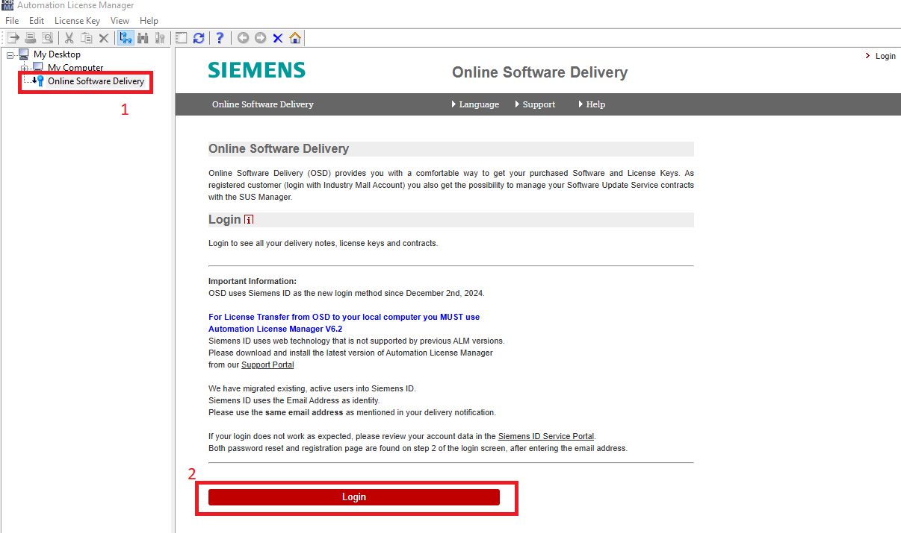

**Jeśli logujesz się po raz kolejny i posiadasz już hasło przypisane do adresu e-mail, przejdź bezpośrednio do punktu 4**.

3. Przy pierwszym logowaniu do systemu konieczne jest wygenerowanie hasła. W tym celu podaj swój adres e-mail [1] kliknij na odnośnik Kontynuuj [2].

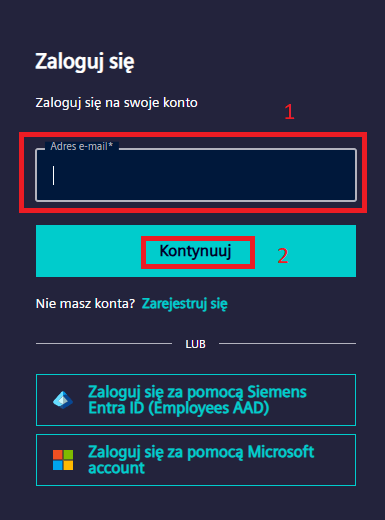

Kliknij na odnośnik Nie pamiętasz hasła? [3].

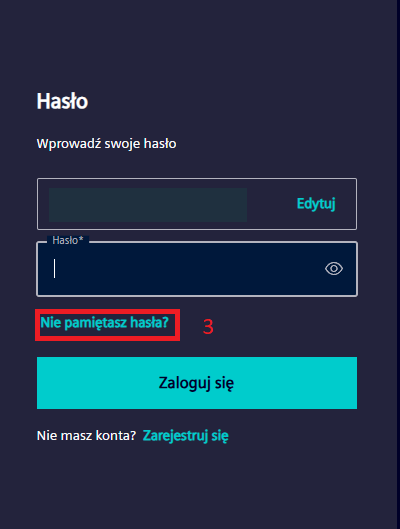

W polu [1] wpisz swój adres e-mail, następnie kliknij Kontynuuj [2].

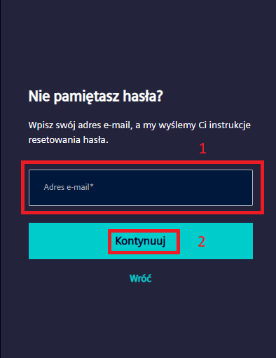

**Na Twój adres e-mail zostanie wysłany link umożliwiający podanie nowego hasła do logowania. Link jest aktywny przez 48 godzin – jeśli w tym czasie nie aktywujesz nowego hasła, konieczne będzie powtórzenie powyższej procedury.**

Po kliknięciu w odnośnik, w Twojej przeglądarce zostanie otwarta strona OSD z oknem umożliwiającym wpisanie nowego hasła. Wypełnij pola (weź pod uwagę wymagania dotyczące hasła) i zatwierdź zmiany przyciskiem `Continue`.

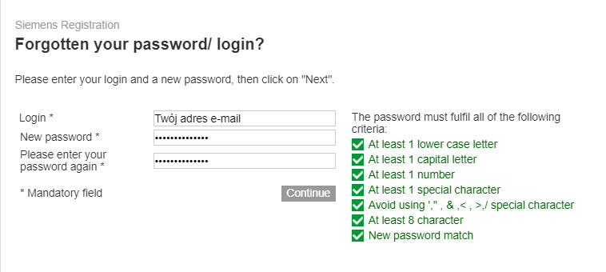

4. Wróć do okna logowania otwartego w punkcie 2. Podaj swój adres e-mail przypisany do zamówienia oraz hasło wpisane w poprzednim kroku, po czym kliknij przycisk Login.

> [!NOTE]
> Czynności opisane w punktach 5 – 7 dotyczą wyłącznie pierwszego logowania do systemu. Każde kolejne logowanie przekieruje Cię bezpośrednio do widoku zamówionych produktów.

5. Przy pierwszym logowaniu do platformy OSD może pojawić się okno z prośbą o weryfikację adresu e-mail przypisanego do zamówienia. **Weryfikacja jest jednoznaczna
z przypisaniem konkretnego (zalogowanego) konta WebSSO do wszystkich zamówień realizowanych na podany adres e-mail**. W tym celu niezbędne jest wygenerowanie kodu autoryzacyjnego za pomocą przycisku

Send verification code to E-mail address [1].

Kod zostanie wysłany na adres e-mail przypisany do zamówienia. Po naciśnięciu przycisku zmieni się on w pole tekstowe, w które należy wkleić otrzymany kod i potwierdzić przyciskiem `Verify`. Po pozytywnej weryfikacji naciśnij przycisk `Continue` [2].

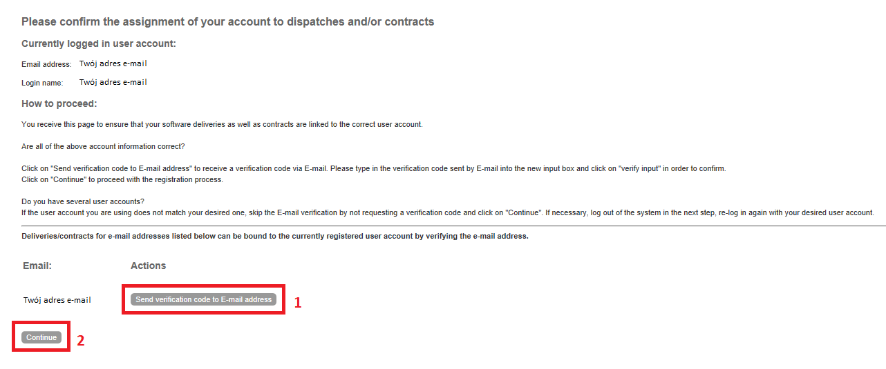

6. W kolejnym kroku zweryfikuj swoje dane i uzupełnij brakujące pola, jeśli jest to konieczne (wszystkie pola oznaczone gwiazdką muszą być wypełnione).

Potwierdź formularz przyciskiem `Continue`.

7. Zapoznaj się z polityką prywatności i zasadami korzystania z platformy OSD wyświetlonymi w kolejnym kroku. Zaznacz pole I confirm that I have read these data privacy notes… [1] i przejdź dalej za pomocą przycisku Continue [2].

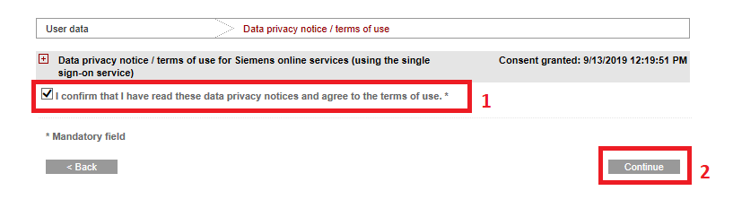

8. Przeczytaj i potwierdź informacje związane z kontrolą eksportu znajdujące się na ekranie.

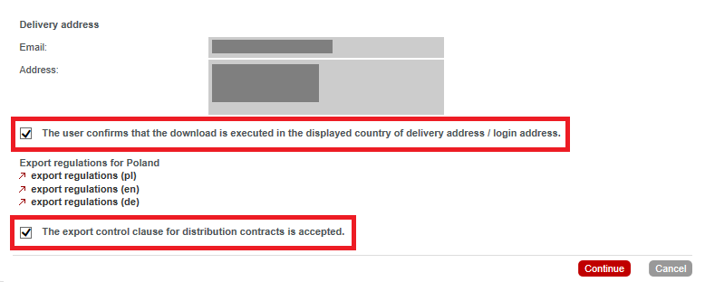

9. Na tym etapie wyświetlony zostanie monit z możliwością wyboru bieżącej roli użytkownika. **Aby pobrać produkty konieczny jest wybór opcji Consignee [1]**. Jeśli osoba składająca zamówienie jest jednocześnie użytkownikiem licencji, do wyboru pojawią się dwie opcje – Consignee oraz Purchaser. Rola Purchaser pozwoli jedynie podejrzeć zamówienie, ale bez możliwości pobrania produktów.

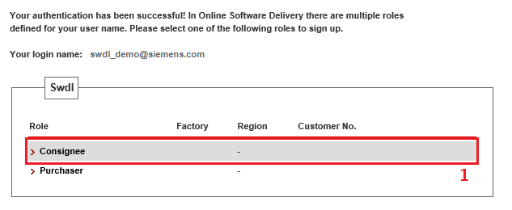

10. Po wyborze właściwej opcji, w oknie ALM wyświetlona zostanie tabela z zamówionym produktem/-ami. W tabeli znajdują się dwa przyciski służące do pobrania: certyfikatu licencyjnego w formacie PDF oraz instalatora oprogramowania w formacie wybranym przez użytkownika [1]. Możliwe jest pobieranie pojedynczych plików bezpośrednio
z serwera Siemensa lub wykorzystanie menadżera pobierania AKAMAI.

W celu przetransferowania klucza licencyjnego z platformy OSD na dysk twardy wystarczy przeciągnąć ikonę Transfer license(s) na odpowiedni dysk wyświetlony w drzewie z lewej strony okna ALM [2] oraz potwierdzić wyświetlony monit.

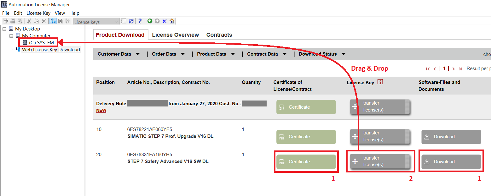

### 2.2. TIA Administrator

1. Uruchom program TIA Administrator (narzędzie uruchamiane jest w przeglądarce internetowej) oraz **zaloguj się przy pomocy danych użytkownika Windows** aby uzyskać dostęp do panelu administracyjnego.

2. Po zalogowaniu do panelu, kliknij na kafelek `Download software` lub wybierz opcję `Download software and license keys` >>  `Download` z rozwijanego menu po lewej stronie.

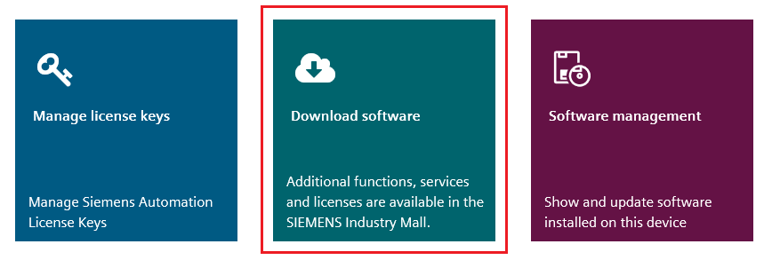

3. Kliknij na przycisk `Log in` i poczekaj na otwarcie nowego okna.

4. Proces logowania jest analogiczny do opisanego w paragrafie: [2.1. Automation License Manager, punkty 3 – 9](#21-automation-license-manager).

5. Po wyborze właściwej opcji, w oknie TIA Administrator wyświetlona zostanie tabela z zamówionym produktem. W tabeli znajdują się trzy przyciski służące do pobrania: certyfikatu licencyjnego w formacie PDF, klucza licencyjnego oraz instalatora oprogramowania w formacie wybranym przez użytkownika. Możliwe jest pobieranie pojedynczych plików bezpośrednio z serwera Siemens lub wykorzystanie menadżera pobierania AKAMAI.

W celu przetransferowania klucza licencyjnego z platformy OSD na dysk twardy wystarczy kliknąć na przycisk `Transfer license(s)`. Po kliknięciu otwarte zostanie okno wyboru lokalizacji, w której zapisany zostanie klucz licencyjny. Należy wybrać odpowiedni katalog z listy a następnie kliknąć przycisk `Download`.

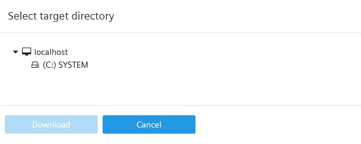

6. Po prawidłowym pobraniu klucza licencyjnego w oknie pojawi się komunikat Download of the license key was succesfully completed.

### 2.3. Resetowanie hasła

Istnieje kilka sytuacji, w których niezbędne jest wygenerowanie nowego hasła do konta na platformie OSD.

- Przy pierwszym logowaniu do konta WebSSO.

- W sytuacji gdy użytkownik zapomni zdefiniowane przez siebie hasło.

- W sytuacji, gdy nastąpi kilka nieudanych prób logowania i dotychczasowe hasło zostanie zablokowane.

Aby wygenerować nowe hasło tymczasowe należy otworzyć stronę OSD poprzez przeglądarkę internetową, w narzędziu Automation License Manager lub TIA Administrator.

> [!NOTE]
> Procedura resetowania hasła do konta na platformie OSD jest analogiczna do generowania nowego hasła przy pierwszym logowaniu i została szczegółowo opisana w paragrafie: [2.1. Automation License Manager, punkt 3](#21-automation-license-manager).

### 2.4. Odzyskiwanie loginu do konta WebSSO

Jeśli do jednego adresu e-mail przypisane są różne konta w obrębie ekosystemu Siemens (np. WebSSO, SiePortal itp.), po zalogowaniu za pomocą adresu e-mail w systemie OSD może pojawić się komunikat:

> **Your login was successful but you don’t have permissions in OSD. […]**

Wówczas należy zweryfikować, jaki login przypisany jest do konta WebSSO i przy jego pomocy zalogować się do systemu. Aby odzyskać login powiązany z adresem e-mail, należy otworzyć stronę OSD poprzez przeglądarkę internetową, w narzędziu Automation License Manager lub TIA Administrator.

1. Przejdź do logowania klikając w przycisk `Login` >> `Forgotten your password/login?` Zgodnie z punktami 2-3, [paragraf 2.1](#21-automation-license-manager).

2. W polu `Forgotten your login?`  >> E-mail wpisz swój adres e-mail, następnie kliknij `Request login`.

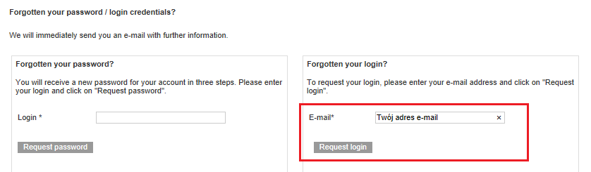

Na Twój adres e-mail zostanie wysłany login przypisany do adresu mailowego oraz zamówienia.

> Dotyczy zamówień ZŁOŻONYCH PRZED 12.10.2020
> ## 3. Migracja zamówień do konta WebSSO

Aktualnie nie ma możliwości logowania do systemu OSD przy pomocy numeru dostawy „SIRS…” oraz hasła tymczasowego wysyłanego w e-mailu z informacja o dostawie. Starsze zamówienia mogą być jednak przypisane (zmigrowane) do aktualnego konta WebSSO zgodnie z poniższą procedurą.

1. Uruchom klienta ALM (Automation License Manager) oraz wybierz pozycję Online Software Delivery z drzewa po lewej stronie okna. Migracja możliwa jest również z poziomu narzędzia TIA Administrator oraz strony internetowej OSD otwieranej w przeglądarce.

2. Poczekaj na wczytanie strony internetowej OSD. Aby rozpocząć procedurę migracji kliknij
w odnośnik `Start the migration` widoczny w sekcji `Migrate your delivery note login`.

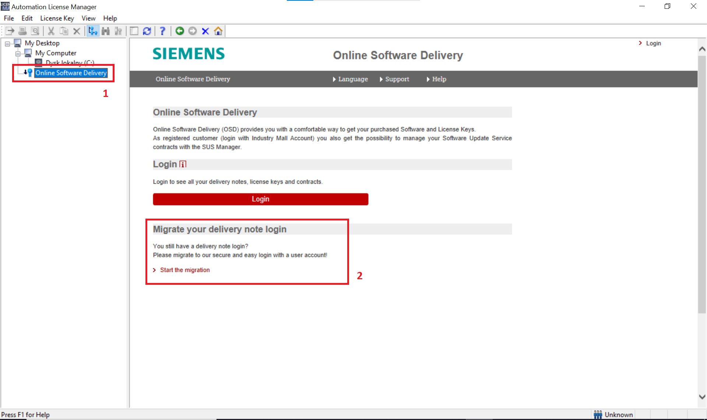

3. Po złożeniu zamówienia na podany adres e-mail otrzymałeś/-aś szczegóły zamówienia oraz hasło tymczasowe. Jeśli wiadomość nie zawiera hasła, również możliwe jest zalogowanie poprzez numer dostawy – konieczne jest jednak wygenerowanie nowego hasła zgodnie z instrukcją w [paragrafie 3.1](#31--resetowanie-hasła). **Hasło tymczasowe ważne jest przez 28 dni** – w tym czasie należy zalogować się do systemu OSD i zdefiniować nowe hasło, wybrane przez użytkownika. W przeciwnym wypadku, konieczne będzie wygenerowanie nowego hasła tymczasowego.

W celu zalogowania do systemu należy korzystać z sekcji Login with Delivery Note. Po wpisaniu poprawnych danych (numer dostawy SIRS i hasło tymczasowe) oraz kliknięciu przycisku Login with Delivery Note niezbędne będzie podanie nowego, docelowego hasła. Hasło to należy potwierdzić za pomocą hiperłącza wysłanego na podany w zamówieniu adres e-mail.

4. W następnym kroku wyświetlony zostanie monit z prośbą o zalogowanie przy pomocy konta WebSSO. Procedura logowania jest taka sama jak opisana w [paragrafie 2](#2logowanie-do-platformy-osd-ipobieranie-zamówionych-produktów). Po poprawnym zalogowaniu do systemu, wszystkie zamówienia zrealizowane na wskazany adres e-mail zostaną automatycznie przypisane do konta WebSSO – od tego momentu możliwe jest wyłącznie logowanie ta metodą.

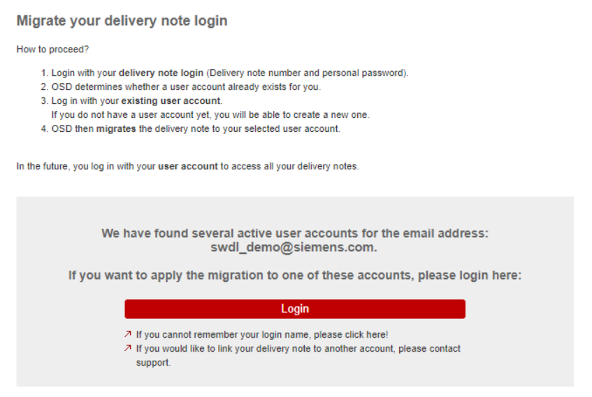

### 3.1.  Resetowanie hasła

Istnieje kilka sytuacji, w których niezbędne jest wygenerowanie nowego hasła tymczasowego do logowania na platformę OSD.

- W przypadku gdy od momentu zamówienia minie 28 dni i hasło tymczasowe wysyłane wraz ze szczegółami zamówienia straci ważność.

- W sytuacji gdy użytkownik zapomni zdefiniowane przez siebie hasło.

- W sytuacji gdy nastąpi kilka nieudanych prób logowania i dotychczasowe hasło zostanie zablokowane.

Aby wygenerować nowe hasło tymczasowe należy otworzyć stronę OSD poprzez przeglądarkę internetową, w narzędziu Automation License Manager lub TIA Administrator.

1. W polu Login with Delivery Note należy kliknąć na odnośnik `Click here to reset password`.

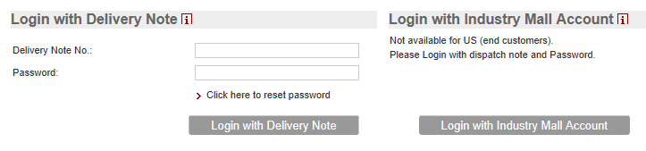

2. W nowo otwartym okienku należy wprowadzić numer dostawy (Delivery Note – numer zaczynający się od liter „SIRS…”) po czym kliknąć na przycisk Continue.

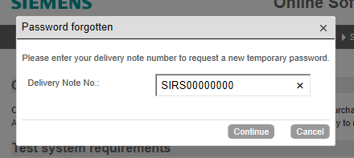

Na adres e-mail podany przy zamówieniu zostanie wysłane nowe hasło tymczasowe. Przy pierwszym logowaniu przy pomocy otrzymanego hasła, niezbędne będzie podanie nowego hasła docelowego. Hasło to należy potwierdzić za pomocą hiperłącza wysłanego na adres e-mail.

> Najczęściej zadawane pytania
> ## 4. FAQ

### 4.1. Czy mogę zmienić adres e-mail przypisany do zamówienia?

Składając zamówienie na licencję typu Download, konieczne jest podanie poprawnego adresu e-mail, do którego końcowy użytkownik licencji ma ciągły dostęp (adres e-mail właściciela licencji). Na adres ten przychodzą wszystkie wiadomości niezbędne do pobrania licencji, hasła oraz ewentualne przypomnienia o pobraniu. W pewnych przypadkach możliwa jest jednak zmiana adresu e-mail przypisanego do zamówienia.

**Adres e-mail może być zmieniony w sytuacjach:**

- gdy składając zamówienie podano nieprawidłowy adres e-mail (np. z błędem),

- gdy właściciel/-ka licencji chciałby/-aby zgromadzić wszystkie swoje zamówienia w jednym miejscu (przypisać je do jednego konta WebSSO identyfikowanego adresem e-mail)*,

- gdy konieczne jest przepisanie zamówienia (licencji) na inną osobę w tej samej firmie*,

- gdy konieczne jest przepisanie zamówienia (licencji) na tę samą osobę w innej firmie, ale wyłącznie gdy jest to firma macierzysta po re-brandingu*,

- transfer licencji do podmiotu trzeciego* (UWAGA: Transfer licencji musi być wykonany offline).

*Z wyjątkiem transferu do podmiotów w krajach objętych ograniczeniem eksportu. Każdorazowo, zmiana adresu e-mail poprzedzona jest weryfikacją DAMEX-E.

**Nie jest możliwe przepisanie licencji:**

- na tę sama osobę, ale pracującą w innej firmie (np. po zmianie miejsca zatrudnienia).

W takich sytuacjach konieczne jest zamówienie nowej licencji i zdefiniowanie nowego użytkownika końcowego.

> [!NOTE] Każdy przypadek analizowany jest indywidualnie! W celu zmiany adresu e-mail/przepisania licencji należy skontaktować się z pracownikiem logistyki realizującym zamówienie.

W przypadku subskrypcji usługi SUS (Software Update Service), w której wybrano dostawy
w systemie OSD, możliwa jest zmiana adresu e-mail w dowolnym momencie trwania kontraktu – zmiana ta jednak dotyczy wyłącznie przyszłych dostaw realizowanych w ramach kontraktu. Szczegółowe informacje dostępne są na stronie internetowej [SiePortal](https://support.industry.siemens.com/cs/ww/en/view/109760477).

### 4.2. Co zrobić gdy po złożeniu zamówienia nie dotarła wiadomość e-mail ze szczegółami?

Przede wszystkim należy upewnić się, że w zamówieniu podano poprawny adres e-mail (szczegóły dotyczące postępowania w przypadku błędnego adresu opisano w [punkcie 3.1](#31--resetowanie-hasła)). Często zdarza się również, że wiadomość trafia do folderu SPAM – warto również sprawdzić ten katalog w skrzynce mailowej.

Może się jednak zdarzyć, że w sytuacji problemów z serwerem pocztowym, bądź gdy skrzynka jest przepełniona, wiadomość nie jest dostarczana do adresata. W takiej sytuacji warto sprawdzić ustawienia serwera pocztowego i zezwolić na otrzymywanie korespondencji od adresu [noreply.softwaredelivery.industry@siemens.com](noreply.softwaredelivery.industry@siemens.com).

Wiadomość wysyłana po zamówieniu nie zawiera jednak informacji kluczowych do pobrania zamówionych produktów, stąd jej ponowna wysyłka nie jest niezbędna - wystarczy postępować zgodnie z instrukcją opisaną w [paragrafie 2](#2logowanie-do-platformy-osd-ipobieranie-zamówionych-produktów). Jeśli problemy z serwerem pocztowym nie występują, kolejne wiadomości e-mail (np. z linkiem do resetowania hasła) powinny docierać bez problemów.

### 4.3. Czy muszę pobrać certyfikat licencji?

Tak - certyfikat licencji dostępny do pobrania w formacie PDF jest jedynym dokumentem poświadczającym prawo do użytkowania licencji. Dodatkowo, w przypadku utraty klucza licencyjnego (na przykład wskutek uszkodzenia dysku twardego), odzyskanie klucza możliwe jest wyłącznie na podstawie certyfikatu. Procedura odzyskania utraconej autoryzacji opisana jest szczegółowo w [FAQ](https://www.siemens.pl/utracona-licencja-faq)

### 4.4. Skąd mogę pobrać najnowsze wersje oprogramowania Automation License Manager oraz TIA Administrator?

Oprogramowanie do zarządzania kluczami licencyjnymi instalowane jest razem z dowolnym składnikiem środowiska TIA Portal. W przypadku gdy na komputerze nie znajduje się żadna wersja TIA, możliwe jest pobranie plików instalacyjnych Automation License Manager oraz TIA Administrator ze strony https://support.industry.siemens.com/cs/pl/en/view/114358. Do pobrania plików instalacyjnych wymagane jest posiadanie konta w serwisie SiePortal.

### 4.5. Jakie są minimalne wymagania systemowe dla poprawnego działania systemu OSD?

- Zalecane oprogramowanie Automation License Manager w najnowszej wersji lub TIA Administrator instalowany automatyczne razem z TIA Portalem od wersji V15.

- Wspierane przeglądarki internetowe: Internet Explorer, Microsoft Edge, Google Chrome i Mozilla Firefox (w najnowszych wersjach).

- W ustawieniach przeglądarki należy włączyć opcje: Allow session cookies oraz Allow JavaScript.

- Należy upewnić się, że zewnętrzne programy nie blokują dostępu do Internetu dla oprogramowania ALM lub TIA Administrator (np. zapory sieciowe, programy antywirusowe).

- Więcej informacji: https://support.industry.siemens.com/cs/ww/en/view/109476109

### 4.6. Co zrobić w sytuacji, gdy po zalogowaniu pojawia się informacja: Your login was successful but you don’t have permissions in OSD […]?

Taki komunikat może pojawić się, jeśli do jednego adresu e-mail przypisane są różne konta w obrębie ekosystemu Siemens (np. WebSSO, SiePortal itp.). Wówczas należy zweryfikować, jaki login przypisany jest do konta WebSSO i przy jego pomocy zalogować się do systemu. Informacje na ten temat zawarte są w [paragrafie 2.4](#24-odzyskiwanie-loginu-do-konta-websso).

Taka sytuacja może wystąpić także wtedy, gdy system OSD nie zostanie powiązany z żadnym kontem WebSSO. Takie powiązanie realizowane jest poprzez weryfikację adresu e-mail przy pierwszym logowaniu do systemu. Jeśli nie zostanie ona wykonana, a użytkownik przejdzie do następnego kroku, klikając od razu po zalogowaniu przycisk `Continue`, wówczas pojawi się informacja o braku uprawnień do systemu OSD.  Proces opisany jest w punkcie 5, [paragraf 2.1](#21-automation-license-manager).

### 4.7. Co zrobić w sytuacji gdy strona OSD nie otwiera się i pojawia się komunikat: This page can’t be displayed. Turn on TLS1.0, TLS1.1 and TLS1.2 […]?

Taki komunikat może pojawić się wtedy, gdy w ustawieniach internetowych w systemie operacyjnym (lub w ustawieniach konkretnej przeglądarki) nie jest włączona obsługa certyfikatów TLS. Aby ją włączyć należy uruchomić Panel sterowania >> Opcje internetowe >> Zaawansowane i na liście dostępnych opcji zaznaczyć obsługę wszystkich wersji protokołu TLS.

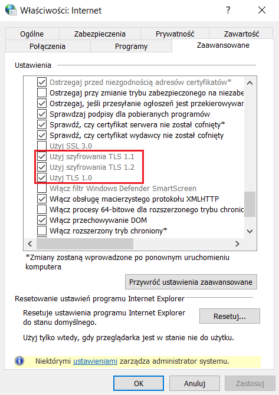

### 4.8. Dlaczego nie mogę przeciągnąć klucza licencyjnego na dysk twardy pomimo tego, że przycisk Transfer license(s) jest aktywny i jestem zalogowany/-a do systemu OSD w Automation License Manager?

Taki problem może wystąpić gdy komputer, na którym wykonywany jest transfer należy do sieci domenowej. Rozwiązaniem jest pobranie klucza na dysk twardy na innym komputerze, poza domeną, a następnie manualny transfer za pomocą nośnika USB na komputer docelowy.

### 4.9. Gdzie znajdę więcej informacji na temat obsługi platformy OSD?

Dodatkowe informacje i instrukcje (w języku angielskim) dostępne są na stronach wsparcia technicznego: https://support.industry.siemens.com/cs/ww/en/view/109759444

Słowniczek skrótów

- OSD		Online Software Delivery – platforma/strona WWW służąca do przeglądania, pobierania i zarządzania licencjami zamówionymi w formie download. Strona OSD może być otwarta bezpośrednio w przeglądarce (brak możliwości pobrania kluczy licencyjnych) oraz w narzędziach Automation License Manager i TIA Administrator (możliwość pobrania wszystkich składników zamówienia).

- WebSSO		Web Single Sign-On – konto przypisane do adresu e-mail, na który zostało złożone zamówienie. Umożliwia logowanie do systemu OSD.

- ALM		Automation License Manager – oprogramowanie do zarządzania kluczami licencyjnymi wymaganymi dla oprogramowania Simatic. Instalowane razem z dowolnym składnikiem oprogramowania, może być również zainstalowane samodzielnie.

- SUS		Software Update Service – usługa abonamentowa oferowana przez Siemens, gdzie w ramach stałej, rocznej opłaty dostarczane są wszystkie aktualizacje dla danego oprogramowania, w tym aktualizacje do wyższych wersji.

- SiePortal	Siemens Industry Online Support / Siemens Portal – witryna międzynarodowego wsparcia technicznego. Zawiera materiały i oprogramowanie do pobrania, przykłady aplikacji i noty produktowe.

- TLS		Transport Layer Security – rozwinięcie protokołu SSL (Secure Socket Layer), zapewniające poufność i integralność danych oraz uwierzytelnianie serwera. Bazuje na asymetrycznym szyfrowaniu danych oraz certyfikatach X.509.