# Jak odzyskać utraconą autoryzację / licencję?

Zarządzaniem i odtwarzaniem kluczy licencyjnymi zajmuje się centrum autoryzacji
w Norymberdze. Każdy przypadek utraty autoryzacji powinien być zgłoszony
i odzyskany według poniższej procedury postępowania. 

W celu odzyskania autoryzacji, należy zgłosić zaistniały problem drogą mailową do wsparcia technicznego w Niemczech przez wypełnienie odpowiedniego wniosku – wymagana znajomość języka angielskiego lub niemieckiego w stopniu podstawowym. Niezbędne jest posiadanie konta użytkownika w serwisie SiePortal – rejestracja jest szybka i bezpłatna. 

## Krok 1

1. Wejdź na stronę internetową: https://support.industry.siemens.com, zaloguj się, następnie wybierz opcję `Support Request` → `Create support request`.

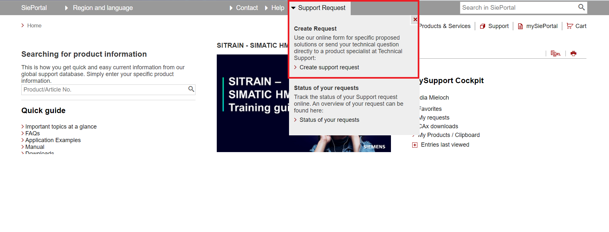

2. W wyświetlonym oknie wypełnij odpowiednio wszystkie pozycje: 

- Zaznacz pole Licensing/Authorization.

- W polu Product search wpisz ogólną nazwę produktu, a następnie wciśnij Find.

- Wybierz dany produkt znajdujący się w grupie Authorization.

- Przejdź do następnego kroku wciskając przycisk Next.

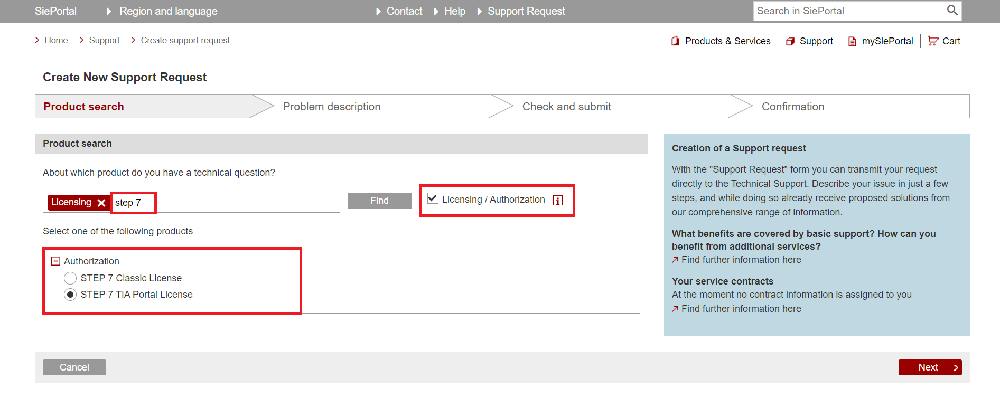

## Krok 2

1. W sekcji `Description` w polu tekstowym `Add relevant keywords to describe your request` wpisz temat zaistniałego problemu – np. „Authorization lost” (utracony klucz licencyjny na dysku komputera). Pozostałe pola w tej sekcji zaznacz zgodnie ze stanem faktycznym.

2. W polu `Detailed description of your request` należy zamieścić komentarz do zaistniałego problemu z autoryzacją. Jako przyczynę zalecamy wpisać awarię dysku twardego, ponieważ znacznie przyspiesza to proces autoryzacji. Przykładowa treść komentarza została umieszczona poniżej (jeśli zapytanie dotyczy wyłącznie uzyskania nowego klucza z powodu awarii dysku twardego w komputerze to wystarczy skopiować i wkleić poniższy tekst): 

> **Dear Sir or Madam, I have lost my license key/s due to system disc crash. You can find the certificate/s of license in the attachment.**

3. Jako załącznik zamieść zdjęcie/skan certyfikatu dołączonego do oprogramowania. Licencja może być odzyskana *tylko na podstawie certyfikatu* (faktury, rachunki itd.
nie upoważniają do odzyskania klucza).

4. Można to zrobić przeciągając pliki na wyznaczone pole lub wybierając je z dysku po kliknięciu tego pola.

5. Jeśli dodajemy więcej niż jeden plik jako załącznik, pliki powinny być spakowane
w formacie ZIP o maksymalnej wielkości 10 MB. W przypadku konieczności załączenia większych plików, skorzystaj z opcji `Fileshare Service`.

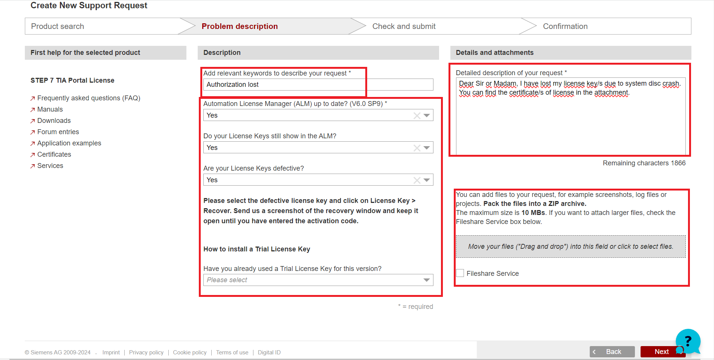

6. W przypadku pomyłki lub konieczności poprawy wprowadzonych danych, powróć do poprzedniego kroku wciskając przycisk Back.

7. Przejdź do następnego kroku wciskając przycisk `Next`.

## Krok 3

1. Jeśli jesteś zarejestrowanym użytkownikiem, formularz z danymi osobowymi `Contact data` powinien automatycznie wypełnić się informacjami podanymi w procesie rejestracji. 

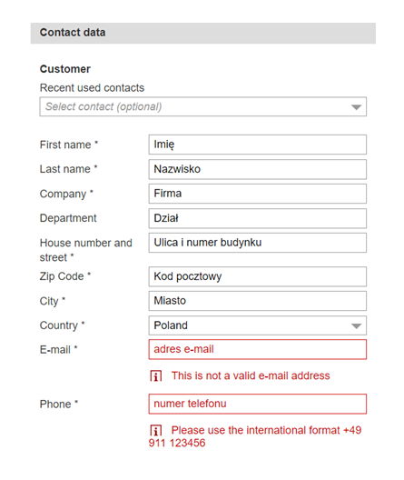

2. Określ preferowaną formę kontaktu. W polu `Other remarks on availability` można określić ramy czasowe w jakich klient jest osiągalny:

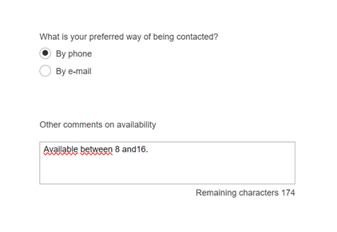

3. Z prawej strony widoczne będzie podsumowanie zgłoszenia.

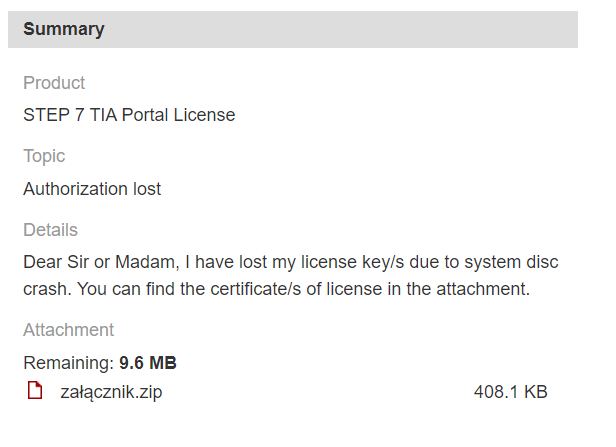

4. Jeśli wyświetlone dane są poprawne, wciśnij przycisk `Send` w celu wysłania zgłoszenia.

5. Aby poprawić dane, powróć do poprzedniego kroku wciskając przycisk `Back`.

> **Po wysłaniu wniosku, zwykle w przeciągu kilku godzin, na podany adres e-mail otrzymają Państwo wiadomość z plikiem autoryzacyjnym.**

> Dotyczy licencji typu Package (DLA LICENCJI OSD PRZEJDŹ DO [KROKU 7](#krok-7))
> ## Krok 4

1. Otrzymany plik należy zapisać na dysku, a następnie otworzyć za pomocą programu Automation License Manager, wybierając opcję Offline Transfer. (Automation License Manager  License Key  Offline Transfer)

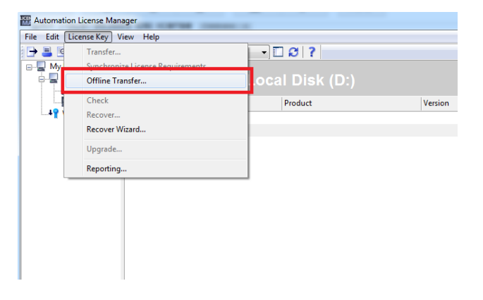

2. W otwartym oknie należy wybrać opcję Generate request code.

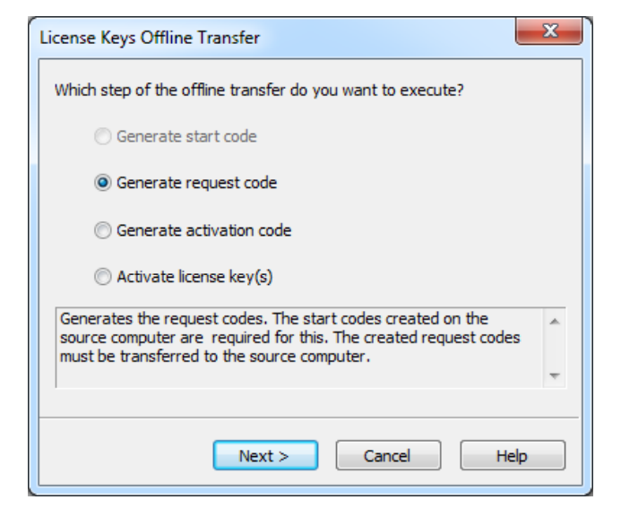

3. Po wybraniu powyższej opcji, program poprosi o wskazanie lokalizacji wcześniej pobranego pliku. Wskazujemy ją, klikając przycisk Load w prawym dolnym rogu okienka. W efekcie wczytania pliku, w otwartym oknie wyświetlone zostaną utracone licencje. Następnie należy przejść do kolejnego etapu klikając przycisk Next.

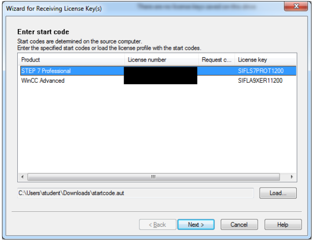

> Dotyczy licencji typu Package
> ## Krok 5

1. W nowo otwartym oknie zaznaczamy *wszystkie* utracone licencje (można to zrobić przytrzymując klawisz `Ctrl`). Następnie wybieramy partycje, na której licencje mają zostać zainstalowane (Domyślną lokalizacją jest partycja (C:) ). Następnie klikamy przycisk `Next`.

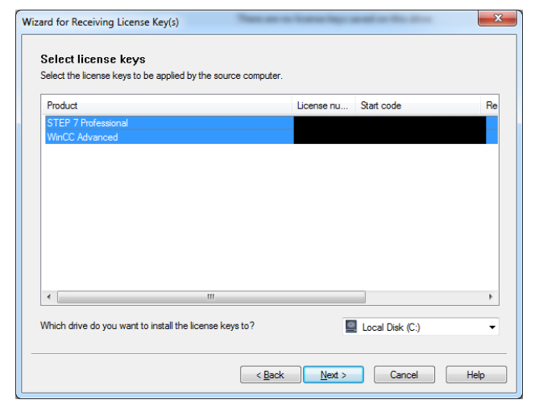

2. W następnym kroku, *ponownie zaznaczając wszystkie utracone licencje*, klikamy przycisk `Save`. Ta operacja wygeneruje plik, który należy odesłać do wsparcia technicznego, odpowiadając na wiadomość z otrzymanym plikiem autoryzacyjnym.

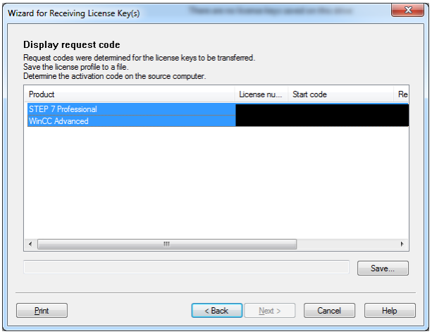

> Dotyczy licencji typu Package
> ## Krok 6

1. Ostatnim etapem odzyskiwania licencji jest otworzenie w programie Automation License Manager pliku aktywacyjnego, otrzymanego w odpowiedzi na wiadomość z kroku 5, wybierając opcję `Activate license key(s)`. (Automation License Manager >> License Key >> Offline Transfer >> Activate license key(s)).

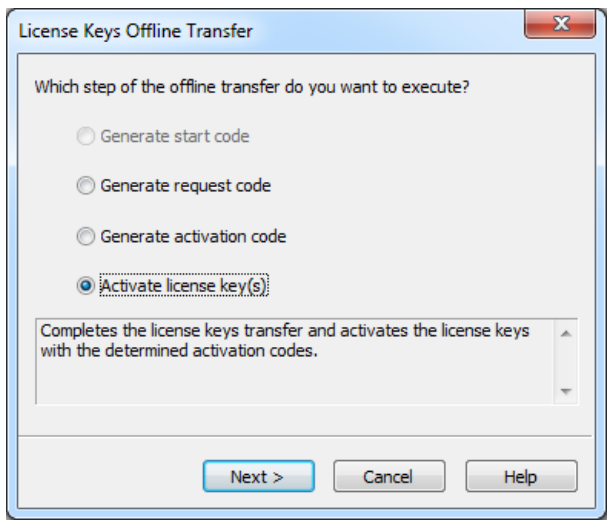

2. Po wybraniu powyższej opcji program poprosi o wskazanie lokalizacji pliku aktywacyjnego. Wskazujemy ją, klikając przycisk Load w prawym dolnym rogu okienka. W efekcie wczytania pliku wyświetlone zostaną licencje, które zostaną aktywowane.

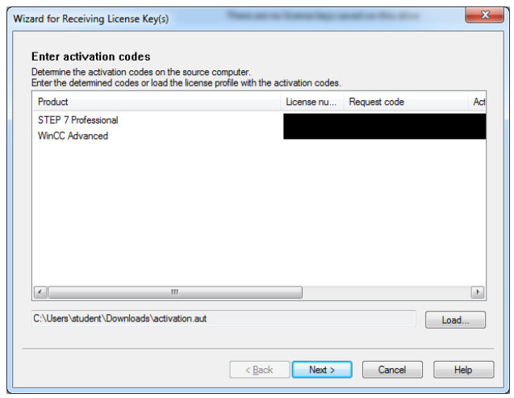

3. Po poprawnej aktywacji licencji wyświetlone zostanie okienko potwierdzające aktywację.

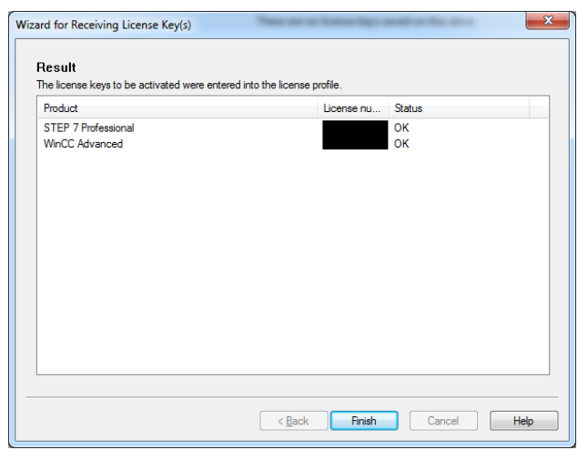

> dotyczy licencji typu download
> ## Krok 7

Klucze odzyskane dla licencji typu Download umieszczane są w systemie OSD (Online Software Delivery) skąd można je pobrać. Szczegółowa instrukcja dotycząca obsługi systemu OSD dostępna jest na stronie: https://www.siemens.pl/osd-faq 

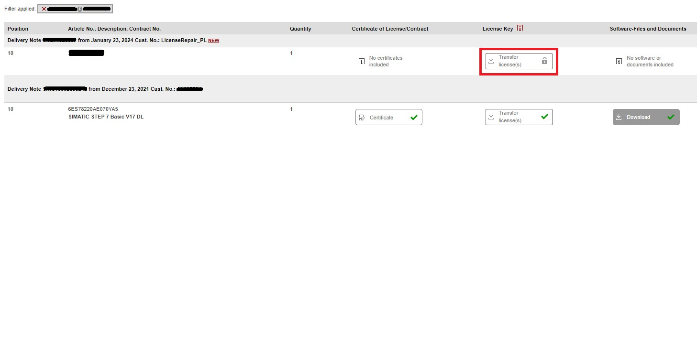