#  S7-1500(T) + SINAMICS S210
##  S7-1500(T) + SINAMICS S210

Ostatnia sekcja tego rozdziału zawiera ćwiczenia nakierowane głównie na programowe rozwiązanie zagadnień technologii _Motion Control._ Technologia ta kryje się pod literką „T” zaawansowanego kontrolera ruchu S7-1500T. W sterowniku tej klasy zaimplementowane zostały zaawansowane funkcje sterowania ruchem – podczas rozwiązywania ćwiczeń dowiesz się, które konkretnie zarezerwowane są dla jednostek technologicznych.

W pierwszym ćwiczeniu wykonamy zestawienie komunikacji w trybie czasu rzeczywistego – na tym zakończymy eksperymenty związane z różnymi technikami komunikacji. Wszystkie kolejne zadania będą opierać się o ten typ wymiany danych – powinien on być stosowany zawsze jeśli jest to możliwe.

Dla urozmaicenia konfiguracji sprzętowej, w dalszych ćwiczeniach zamiast napędu SINAMICS V90 zastosujemy nowszą rodzinę - S210.

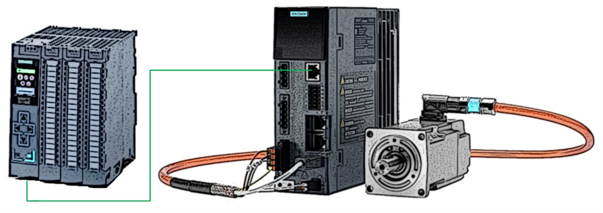

Z punktu widzenia sterowania przez obiekt technologiczny _Motion Control,_ wybór napędu nie ma znaczenia – parametryzacja funkcji programowych odnosi się jedynie do poziomu osi technologicznej – zwłaszcza, iż obie jednostki napędowe komunikują się domyślnie przez SIEMENS Telegram 105.

> [!NOTE]
> Bardzo dużym udogodnieniem w zastosowaniu obiektów technologicznych jest możliwość ich wirtualizacji przez standardowy symulator _PLCSim_. Dlatego większość zadań z poniższej sekcji możesz skonfigurować oraz w pełni przetestować posiadając jedynie TIA Portal Step 7 Professional.

## 1.  Pozycjonowanie – SIEMENS Telegram 105 (IRT)

W układach sterowanych w sposób zcentralizowany, czyli tam gdzie sterownik nadrzędny przejmuje nie tylko obsługę standardowych sygnałów ale również zarządzanie osiami napędowymi, docelową oraz zalecaną jest komunikacja w izochronicznym trybie czasu rzeczywistego `(IRT)`.

Zastosowanie urządzeń zgodnych z tą techniką wymiany danych, pozwala na uzyskanie najwyższej jakości sterowania ruchem - zarówno w układach jedno- jak i wieloosiowych (synchronicznych). Jeśli mamy więc możliwość – w aplikacjach `Motion Control` - stosujmy urządzenia obsługujące komunikację izochroniczną.

Kolejne ćwiczenie, które dla Ciebie przygotowałem sprowadza się do utworzenia podstawowej konfiguracji osi pozycjonującej pracującej w trybie czasu rzeczywistego. Ramkę komunikacyjną określa w tym wypadku dedykowany dla takiej wymiany danych `SIEMENS Telegram 105`, który jest również domyślnym telegramem dla serwonapędów klasy `V90` lub `S210`. Więcej informacji uzyskasz wracając do pierwszego rozdziału z opisem komunikacji `PROFIdrive`.

Konfiguracja układu w trybie IRT wymaga kilku dodatkowych zabiegów. Zadanie wykonaj zgodnie z poniższymi wskazówkami.

A.  **Uruchomienie SINAMICS S210.**

W pierwszym kroku, jak w przypadku każdego napędu, zaczynamy od wykonania połączeń elektrycznych oraz uruchomienia. W przypadku falownika serii S210 parametryzację osi oraz optymalizację regulatora prędkości można wykonać przez wbudowany serwer WWW…

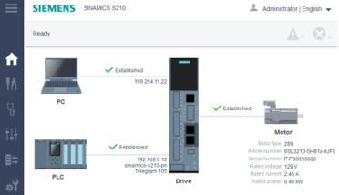

…lub przez konfigurację w TIA Portal - `StartDrive`.

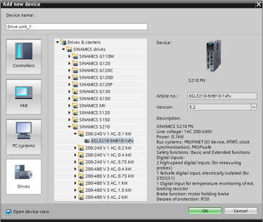

Procedura uruchomienia osi jest bardzo łatwa, rzec by można - minimalistyczna. Jestem pewien, iż korzystając z doświadczeń z poprzednich ćwiczeń lub z informacji z rozdziału teoretycznego, z łatwością wykonasz poprawną parametryzację. Jeśli potrzebujesz wskazówek lub usystematyzowania informacji – polecam Ci poniższy wideo-instruktaż:

[Tutorial how to connect servo drive system SINAMICS S210 and SIMOTICS 1FK2](https://youtu.be/9pGNbVkplHs)

> [!NOTE]
> Zauważ, że napęd S210 może funkcjonować tylko w połączeniu z nadrzędnym sterownikiem – nie ma wbudowanego pozycjonera wewnętrznego (EPOS).

B.  **StartDrive.**

Napęd może zostać wstawiony do projektu na dwa sposoby: przez plik GSDML (konfiguracja napędu przez WebServer) lub przez zintegrowane w TIA Portal narzędzie do konfiguracji napędów SINAMICS – _StartDrive_. W tym drugim przypadku pełną konfigurację wykonasz w środowisku inżynierskim.

W konfiguracji przestrzeni adresowej napędu możesz zauważyć, że istnieje możliwość rozszerzenia (standardowo przypisanego) telegramu SIEMENS 105 m.in. o telegram `PROFIsafe`.

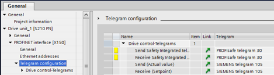

Napędy z rodziny S210 obsługują komunikację `fail-safe`, dzięki temu – jak pewnie pamiętasz z części teoretycznej - funkcje bezpieczeństwa mogą zostać zrealizowane przez sieć `PROFINET IO`. W tym celu zastosowany sterownik nadrzędny również musi być w wydaniu `F-PLC`.

C.  **Topologia sieci.**

Tryb izochroniczny wymaga zdefiniowania topologii sieci `PROFINET IO IRT`, czyli struktury fizycznych połączeń. Należy wykonać te połączenia z dokładnością do portu komunikacyjnego (również w przypadku switch-a).

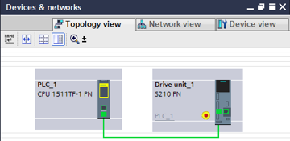

System na konkretnym porcie sieciowym rezerwuje zasoby komunikacyjne na potrzeby cyklicznej wymiany danych IRT. Połącz urządzenia zgodnie z fizycznymi połączeniami.

> [!NOTE]
> Brak lub błędnie wykonane połączenie w widoku topologii uniemożliwi uruchomienie komunikacji w trybie izochronicznym.

D.  **Oś pozycjonująca.**

Podobnie jak w poprzednich ćwiczeniach dodaj do projektu oś pozycjonującą, podłącz do niej napęd ewentualnie dostosuj parametry zgodnie z charakterystyką Twojego układu mechanicznego.

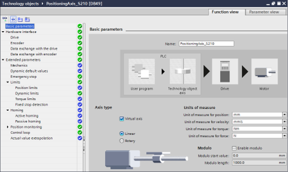

> [!Note]
> W zakładce `Basic parameters` możesz zaznaczyć haczyk mówiący o tym, że konfigurowana oś będzie wirtualna (`Virtual axis`). Jeśli nie posiadasz fizycznego napędu – opcja ta pozwoli Ci w szerokim zakresie przetestować działanie funkcji pozycjonowania oraz dalszych (związanych z ruchem).

E.  **Program PLC.**

Po wykonaniu powyższych czynności pozostaje Ci krok najprzyjemniejszy, a tym samym najłatwiejszy, czyli napisanie programu do obsługi skonfigurowanej osi napędowej. Ponownie wykorzystamy w tym celu zunifikowane funkcje `Motion Control`.

Moim zdaniem, podstawową zasadą podczas pisania programu jest jego uporządkowanie, standaryzacja oraz opatrzenie możliwie dokładnymi komentarzami. Przejrzystość programu ułatwi Ci jego analizę oraz diagnostykę - pewnie doskonale wiesz, że wracając do własnego programu po miesiącu czy dwóch trudno się odnaleźć, nie wspomnę już o osobach trzecich. Aby wszystkim było łatwiej, warto zadbać o porządek w projekcie.

W związku z powyższym proponuję Ci przygotowanie uniwersalnej funkcji do obsługi podstawowych mechanizmów osi pozycjonującej, np. z interfejsem jak poniżej.

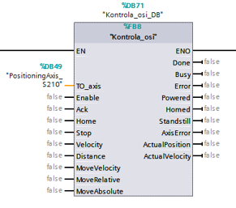

Solidnie przygotowany blok funkcyjny posłuży Ci przypuszczalnie w niejednej aplikacji, a z pewnością zaoszczędzisz dzięki niemu sporo czasu oraz problemów. Poniżej kilka podpowiedzi do stworzenia tego bloku.

Interfejs wejściowy - funkcje:

- _TO_axis –_ parametr typu _TO_PositioningAxis_; definiowanie tego parametru wymaga ręcznego wprowadzenia typu danych, jest to nieco zagadkowe ale system nie pozwala wybrać tej struktury z listy,
- _Enable_ – aktywacja osi przez funkcję _MC_Power_,
- _Ack_ – kwitowanie błędów (_MC_Reset_),
- _Home_ – bazowanie układu (_MC_Home_),
- _Velocity_ – prędkość zadana (ruch prędkościowy/pozycjonowanie),
- _Distance –_ odległość przejazdu (pozycjonowanie),
- _MoveVelocity_ – aktywacja ruchu prędkościowego (_Velocity_),
- _MoveRelative –_ pozycjonowanie relatywne (_Velocity/Distance_),
- _MoveAbsolute –_ pozycjonowanie absolutne (_Velocity/Distance_)

Interfejs wyjściowy - statusy:

- _Done –_ funkcja zakończona; możesz wykorzystać statusy funkcji systemowych,
- _Busy –_ zadanie w toku,
- _Error –_ błąd funkcji _Motion Control,_
- _Powered –_ oś załączona, status możesz pobrać z funkcji _MC_Power,_
- _Homed –_ oś wybazowana; flagę znajdziesz w słowie statusowym (_StatusWord –_ BIT5) struktury danych osi,
- _Standstill –_ oś w bezruchu (_StatusWord –_ BIT7),
- _AxisError –_ błąd osi (_StatusWord –_ BIT1)
- _ActualPosition_ \- aktualna pozycja – parametr osi technologicznej,
- _ActualVelocity –_ prędkość aktualna.

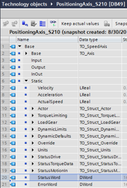

F.  **Analiza ruchu**

Niezależnie od tego czy dysponujesz fizycznym napędem czy też pracujesz na symulacji sterownika – możesz zaobserwować ruch osi generowany przez Twój program. Jedną z opcji jest dodanie do projektu stacji wizualizacyjnej WinCC i zbudowanie na ekranie procesowym wizualizacji wartości aktualnych osi napędowej. Jest to jednak rozwiązanie czasochłonne oraz mało dokładne, chociaż na dłuższą metę bardzo ułatwiające testowanie projektu.

Zintegrowanym mechanizmem środowiska inżynierskiego Step 7 jest tzw. _trace_. Można powiedzieć, że jest to forma oscyloskopu, który pozwala na bardzo precyzyjne rejestrowanie oraz prezentowanie przebiegów wartości zmiennych w czasie. Jako, że nasze parametry ruchu są de facto zmiennymi w bloku danych – każdy z nich możemy w łatwy sposób podłączyć do takiego miernika programowego.

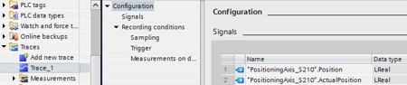

Obsługa tego narzędzia jest bardzo intuicyjna – wystarczy wskazać zmienne, określić cykl próbkowania, a na koniec wgrać konfigurację do PLC i uruchomić rejestrator. Myślę, że dasz sobie radę bez trudu, jeśli interesuje Cię bardziej szczegółowa obsługa _trace_\-a, polecam Ci wgląd do Internetu lub w pliki pomocy TIA Portal kryjące się pod hasłem: `Using the trace and logic analyzer function`.

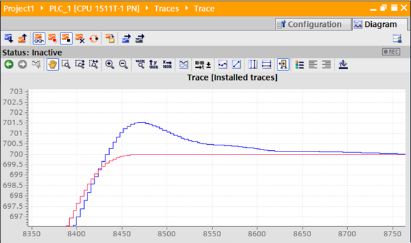

Jeśli ćwiczysz z symulacją - wizualizacja lub `trace` pozwoli Ci zarejestrować wszystkie parametry w formie wartości zadanych (`setpoint`), co pozwoli zaobserwować działanie programu oraz przewidzieć zachowanie układu mechanicznego.

> [!NOTE]
> Jeśli dysponujesz fizycznym napędem, możesz dodatkowo obserwować sprzężenie zwrotne układu, czyli np. prędkość lub pozycję aktualną (mierzoną) w stosunku do wartości zadanych wysyłanych przez sterownik. Daje to bardzo szerokie możliwości zgłębienia wpływu parametrów regulatora prędkości (napęd) oraz pozycjonera (PLC) na rzeczywisty układ mechaniczny.

Postaraj się uzupełnić ćwiczenie o obserwacje związane ze zmianami współczynników regulatora prędkości oraz pętli regulacji pozycji w obiekcie technologicznym (`Control loop`).

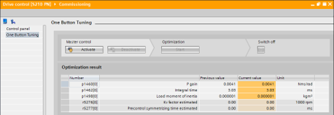

Szczegółowa konfiguracja osi technologicznej w połączeniu z napędem SINAMICS S210 została przygotowana w formie gotowego dokumentu „krok po kroku”, znajdziesz go w poniższej lokalizacji sieciowej:

[Configuring Technology Objects with SIMATIC S7 1500 and SINAMICS S210](https://support.industry.siemens.com/cs/ww/en/view/109749795)

Cechy osi pozycjonującej w trybie IRT:

- gwarantowana komunikacja w czasie rzeczywistym,
- precyzyjne ruchy przy skrajnej dynamice,
- wysoka powtarzalność pozycjonowania,
- płynność oraz kultura pracy układu napędowego,
- odporność na błędy transferu danych.

## 2.  Synchronizm liniowy.

Kolejnym bardzo powszechnym zagadnieniem w automatyce przemysłowej jest sprzężenie osi. Podstawową odmianą tego mechanizmu jest synchronizacja liniowa, czyli taka gdzie zależność pozycji osi nadążnej względem pozycji osi wiodącej jest liniowa. Określamy więc stałą przekładnię elektroniczną (np. 1:1) dla układu wieloosiowego master-slave.

Typowe aplikacje wymagające sprzężenia osi w relacji linowej, to takie gdzie zadanie ruchu osi nadążnej musi odbywać się „w locie” czyli bez zatrzymywania osi master, np. cięcie, odbieranie, obracanie detali, etc. Aby lepiej zrozumieć istotę tego zagadnienia polecam Ci zacząć od obejrzenia krótkich publikacji wideo:

https://youtu.be/K2I3nb9-okg

https://youtu.be/m23LD0dZiiU

W celu realizacji takiego zadania potrzebny będzie nam nowy typ obiektu technologicznego - oś synchroniczna (nadążna). Jest to w gruncie rzeczy oś pozycjonująca, poszerzona o możliwość zdefiniowania mastera (osi wiodącej), za którym może podążać synchronicznie. Systemowy mechanizm sprzężenia osi pozwala na synchronizację liniową (`gearing`) oraz nieliniową (`camming`) – co będzie tematem kolejnego ćwiczenia.

Zgodnie z systemową ideą, którą staramy się aplikować w naszych zadaniach praktycznych – następnym krokiem będzie skonfigurowanie drugiej osi pracującej w domenie izochronicznej. Tym razem będzie to oś synchroniczna, która zostanie sprzężona liniowo z osią pozycjonującą (skonfigurowaną w poprzednim ćwiczeniu). Konfiguracja osi synchronicznej jest w zasadzie analogiczna - odróżnia ją jeden parametr.

A.  **Napęd.**

Jeśli dysponujesz drugą osią fizyczną – dodaj do projektu konfigurację napędu. Po raz kolejny – w zależności od tego jaki to napęd, jakie posiadasz narzędzie inżynierskie, a także jakie są Twoje preferencje możesz uczynić to przez plik GSDML/HSP lub _StartDrive_. Pamiętaj o przypisaniu odpowiedniego adresu IP, nazwy urządzenia w sieci PROFINET IO oraz określeniu odpowiedniej przestrzeni adresowej _PROFIdrive_ (np. SIEMENS Telegram 105). Pamiętaj o zdefiniowaniu topologii sieci.

B.  **Oś synchroniczna.**

Wstaw do projektu nowy obiekt technologiczny `Motion Control – TO_SynchronousAxis`. Jeśli w punkcie A skonfigurowałeś fizyczny przekształtnik – podłącz go do interfejsu osi, w przeciwnym razie możesz pracować w trybie symulacji – oznacz oś jako wirtualną. Podobnie jak poprzednio - nie będzie to ograniczeniem w praktycznej realizacji ćwiczenia.

Parametrem odróżniającym oś synchroniczną od pozycjonującej jest możliwość wskazania potencjalnego wzorca pozycji (`Leading value interconnections`). W tym polu wybierz oś master, a także określ czy synchronizm będzie realizowany do wartości zadanej czy też aktualnej.

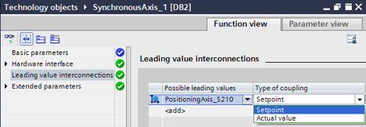

Jeśli pamiętasz nasze rozważania teoretyczne z pierwszego rozdziału, to zapewne wiesz, że synchronizacja do wartości zadanej (_Setpoint_) odnosi się do podążania osi nadążnej za wartością pozycji generowaną przez interpolator w PLC, natomiast sprzężenie do wartości aktualnej (_Actual value_) sprzęga oś do pozycji zmierzonej przez układ pomiarowy (enkoder). W zależności od wymagań aplikacji wybrać należy odpowiedni scenariusz – w zdecydowanej większości przypadków synchronizujemy się do rzeczywistej pozycji osi wiodącej.

> [!NOTE]
> Synchronizacja do wartości aktualnej może zostać zrealizowana jedynie przez sterownik klasy S7-1500T.

C.  **Program PLC.**

Powyższa parametryzacja osi nie oznacza jeszcze aktywacji sprzężenia. Ostatnim krokiem jest wywołanie odpowiednio skonfigurowanej (dla potrzeb Twojej aplikacji) funkcji aktywującej _gearing_.

Podczas aktywacji sprzężenia osi bardzo istotną kwestią jest określenie w jaki sposób oś nadążna ma zrealizować profil dosprzęglania. Pytanie brzmi czy istotna jest z punktu widzenia aplikacji pozycja synchroniczna osi – czyli ta, od której osie mają rozpocząć ruch synchroniczny. Poza tym pojawia się kwestia czy synchronizacja ma odbyć się na postoju czy w ruchu, jeśli w ruchu to czy wykorzystując maksymalną dynamikę osi nadążnej czy też na określonym odcinku ruchu osi wiodącej.

Możemy zaproponować następujący podział:

- Sprzężenie relatywne – jest zależnością, którą można nazwać prędkościową. Celem osi nadążnej jest odzwierciedlanie ruchu osi wiodącej. Opcjonalnie można zdefiniować liniowe przełożenie pomiędzy osiami. Nie ma tutaj jednak możliwości wskazania pozycji, przy której zasprzęglenie ma nastąpić.

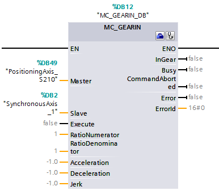

Może ono zostać zrealizowane na postoju lub w ruchu (na podstawie określonej dynamiki), funkcja aktywująca sprzężenie to _MC_GearIn_. Parametry, które będą Cię interesować to:

- -  _Master_/_Slave_ – oś wiodąca/nadążna,
- - _Execute_ – aktywacja sprzężenia (zbocze),
- - _RatioNumerator/Denominator_ – przekładnia elektroniczna.

- Sprzężenie absolutne (kątowe) – działanie docelowe jest analogiczne jak powyżej, natomiast samo dosprzęglanie osi nadążnej może odbywać się w ściśle określony sposób – ze wskazaniem pozycji synchronicznej obu osi.

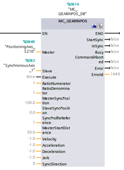

Synchronizacja „w locie” wymaga ruchu osi wiodącej, aktywacja odbywa się przez funkcję _MC_GearInPos_. Poniżej parametry, które należy ustawić aby zrealizować sprzężenie:

    - _Master_/_Slave_ – oś wiodąca/nadążna,
    - _Execute_ – aktywacja sprzężenia (zbocze),
    - _MasterSyncPosition –_ pozycja synchroniczna osi wiodącej,
    - _SlaveSyncPosition –_ pozycja synchroniczna osi nadążnej,
    - _SyncProfileReference –_ profil dosprzęglania_,_
    - _MasterStartDistance –_ droga na sprzężenie,
    - _SyncDirection –_ kierunek ruchu osi nadążnej.

Przeanalizuj działanie powyższych parametrów w odniesieniu do _SyncProfileReference_ (0/1). Rozróżniamy tutaj dojście do zasprzęglenia przez parametry dynamiczne lub na zdefiniowanej drodze.

> [!NOTE]
> Funkcja dostępna jest jedynie dla sterowników S7-1500T.

W tym ćwiczeniu dodaj do projektu obie funkcje i przetestuj ich działanie wybierając różne warianty sprzężenia w oparciu o uprzednio skonfigurowane osie. Pamiętaj, że przede wszystkim należy skonfigurować oraz poprawnie uruchomić/aktywować oba obiekty technologiczne.

Nie sądzę aby pierwsza funkcja przysporzyła Ci jakichkolwiek trudności, jeśli napotkasz je przy sprzężeniu kątowym, sugeruję Ci skonfigurować _trace_, na którym zaobserwujesz parametry niezbędne do poprawnej synchronizacji – pozycja aktualna osi wiodącej oraz nadążnej, status funkcji sprzęgającej czy moment wystąpienia błędu oraz jego kod.

Cechy osi synchronicznej:

- gwarantowana synchronizacja w czasie rzeczywistym,
- synchronizacja do wartości zadanej lub aktualnej,
- wiele osi wiodących,
- możliwość zdefiniowania mechaniki oraz przełożenia względem osi wiodącej,
- ustandaryzowane funkcje do obsługi sprzężenia.

Jeśli spotkasz się na swojej drodze z koniecznością realizacji aplikacji synchronicznej – z mojego punktu widzenia - do wyboru są dwie drogi: napisać cały algorytm samodzielnie (jeśli masz czas, zdecydowanie polecam tę opcję) lub skorzystać z biblioteki przygotowanej przez producenta. W tym drugim przypadku polecam Ci przydatne linki, gdzie znajdziesz opis oraz projekt przykładowej aplikacji latającej piły oraz noża obrotowego.

[SIMATIC S7-1500T Flying Saw](https://support.industry.siemens.com/cs/ww/en/view/109744840)

[SIMATIC S7-1500T Rotary Knife](https://support.industry.siemens.com/cs/ww/en/view/109757260)

## 3.  Sprzężenie krzywkowe

Nieco bardziej zaawansowanym typem synchronizacji osi jest sprzężenie krzywkowe czyli nieliniowa zależność pozycji osi nadążnej względem wiodącej. Porównując to zadanie z poprzednim – jest to dokładnie ten sam mechanizm, z tym że będziemy definiować swobodnie funkcję zależności pomiędzy osiami.

Sprzężenie krzywkowe kojarzone jest zazwyczaj z działaniem prasy. Ja również taką aplikację proponuję Ci zaobserwować przed przystąpieniem do dalszych działań. Myślę, że instruktarz przygotowany przez Kolegę z SIEMENS AG jest dosyć czytelny i stanowi dobrą podstawę do zrozumienia potrzeby stosowania sprzężeń nieliniowych:

https://youtu.be/CsMDvpBfttc

Jako bazę możesz w całości wykorzystać projekt z poprzedniego ćwiczenia. Konfiguracja sprzętowa nie zmienia się, w projekcie zrealizujemy jedynie programową część związaną z konfiguracją obiektu technologicznego `TO_Cam`.

A.  **Konfiguracja krzywki.**

Dodaj do projektu nowy obiekt technologiczny typu _Motion Control -> TO_Cam._ Konfigurator, który zobaczysz służy do zdefiniowania funkcji pozycji osi slave (f(x)) względem osi master (x).

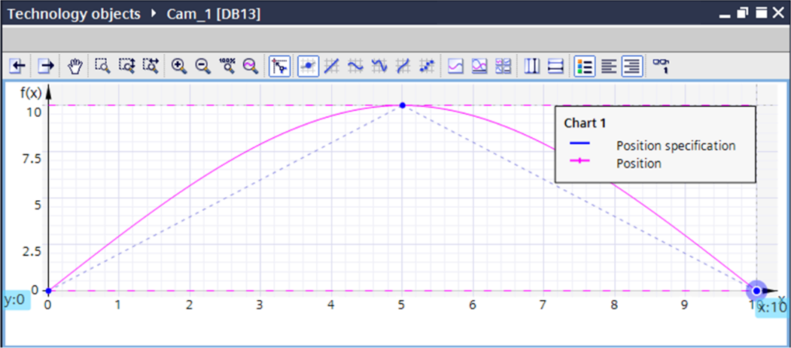

Spróbuj zdefiniować profil sprzężenia zgodnie z powyższym zrzutem ekranu. W tym celu musisz przeskalować osie (x:0…10, f(x):0…10), a następnie wstawić w obszarze rysowania trzy punkty o koordynatach (0;0), (5;10), (10;0).

Punkty możesz wstawić ręcznie, a następnie dostosować ich współrzędne w tabeli poniżej wykresu. Tam również możesz zaaplikować interpolację trajektorii powstałych odcinków (_Transition_). Jest to systemowy mechanizm optymalizacji przebiegu pozycji osi nadążnej. W naszym przypadku nastąpi wygładzenie pozycji na początku oraz końcu funkcji, co pozwoli uzyskać gładką charakterystykę ruchu przy cyklicznym wywołaniu profilu w trybie pracy układu.

Edytor krzywek zintegrowany w TIA Portal jest potężnym narzędziem, które pozwala skonfigurować, zoptymalizować, a także przeanalizować bardzo zaawansowane parametry ruchu osi nadążnej sprzężenia krzywkowego. Jeśli ciekawią Cię te zagadnienia lub spotkasz się z aplikacją bardziej wymagającą niż nasze ćwiczenie – polecam Ci poniższy dokument, który kompleksowo obejmuje możliwości obiektu technologicznego _TO_Cam:_

[SIMATIC S7-1500T: Working with the cam editor](https://support.industry.siemens.com/cs/ww/en/view/109749820)

B.  **Program PLC.**

W programie należy wywołać dwie funkcje: interpolującą krzywkę oraz aktywującą sprzężenie. Pomimo faktu, iż wykonaliśmy już optymalizację profilu krzywkowego podczas konfiguracji obiektu technologicznego – wymagane jest ponowienie tego zadania przed pierwszym wywołaniem sprzężenia w programie. Wynika to z faktu, iż sterownik musi sprawdzić spójność profilu – może on być zmodyfikowany z punktu widzenia programu użytkownika, dlatego dobrą praktyką jest wykonanie interpolacji zawsze przed wywołaniem sprzężenia (jeśli czas cyklu programu na to pozwoli).

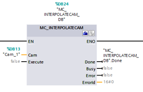

Aktywacja interpolacji odbywa się przez funkcję _MC_InterpolateCam_ (_Execute_). Zwróć uwagę, iż natychmiast po zakończeniu interpolacji możesz aktywować sprzężenie – w tym celu warto skorzystać w wyjścia funkcji (_Done_) sygnalizującego zakończenie jej działania.

Drugą funkcją jest blok _MC_CamIn_ sprzęgający osie zdefiniowaną uprzednio funkcją krzywki.

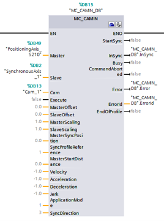

Już na pierwszy rzut oka widać sporo podobieństw do funkcji z poprzedniego ćwiczenia (_MC_GearInPos_). W istocie – samo sprzężenie realizowane jest identycznie, dodatkowo blok wzbogacony został o interfejs pozwalający wykonać przesunięcie lub skalowanie profilu krzywkowego. Następujące wejścia bloku będą wymagały Twojej uwagi:

- _Master/Slave_ – oś wiodąca/nadążna,
- _Cam_ – krzywka,
- _Execute_ – aktywacja sprzężenia (zbocze),
- _MasterSyncPosition_ – pozycja synchroniczna osi wiodącej,
- _SlaveSyncPosition_ – pozycja synchroniczna osi nadążnej,
- _MasterStartDistance_ – droga na dosprzęglenie,
- _SyncProfileReference_ – profil dosprzęglania,
- _ApplicationMode_ – tryb pracy sprzężenia.

Zwróć szczególną uwagę na dwa ostatnie parametry. Sprzężenie krzywkowe ma dodatkowy tryb dojścia do zasprzęglenia (na postoju). Tryb aplikacji definiuje charakterystykę cyklicznej realizacji profilu – w ten sposób najczęściej realizowane są tego typu sprzężenia.

> [!NOTE]
> Wszystkie elementy związane z konfiguracją oraz uruchomieniem sprzężenia krzywkowego osi, dostępne są jedynie dla sterowników klasy T-CPU.

Cechy sprzężenia krzywkowego:

- gwarantowana synchronizacja w czasie rzeczywistym,
- synchronizacja do wartości zadanej lub aktualnej,
- wiele osi nadążnych względem jednego mastera,
- skalowanie profilu w trybie pracy,
- możliwość zdefiniowania lub modyfikacji krzywki z poziomu programu użytkownika,
- zasprzęglenie na postoju,
- ustandaryzowane funkcje do obsługi sprzężenia.

Myślę, że powyższe ćwiczenie daje dobrą podstawę do dalszych rozważań lub realizacji w praktyce zagadnienia synchronizacji przez profil krzywkowy. Nie taki diabeł straszny, jak go malują, prawda? Jeśli jednak czujesz niedosyt wiedzy lub zastanawiasz się nad innymi zastosowaniami tego mechanizmu – mam dla Ciebie jeszcze kilka ciekawych źródeł, które uważam za wartościowe - mi osobiście nie raz się przydały w pracy.

Przykład zastosowania krzywek do realizacji ruchu po okręgu w dwuwymiarowym układzie kartezjańskim:

[S7-1500T: Circular Motion on the Basis of Cam Disks - MoveCircle2D](https://support.industry.siemens.com/cs/ww/en/view/109742306)

Generowanie oraz podmiana profilu sprzężenia podczas pracy sterownika:

[Switchover and generation of cams with SIMATIC S7-1500T](https://support.industry.siemens.com/cs/ww/en/view/109749460)

Porównanie omówionych trybów synchronizacji:

[SIMATIC S7-1500(T): Comparison of the synchronization modes](https://support.industry.siemens.com/cs/ww/en/view/109764888)

## 4.  Układ kinematyczny

Przejdźmy teraz do najbardziej zaawansowanego mechanizmu synchronizacji osi w sterownikach SIMATIC czyli do ich zespolenia w układ kinematyczny. Najczęściej spotykaną zrobotyzowaną strukturą mechaniczną jest portal kartezjański. Zanim przejdziesz do ćwiczenia, sugeruję Ci obejrzenie krótkiego filmiku obrazującego działanie takiego układu.

_Układy kinematyczne 4D jako standardowa funkcja sterownika technologicznego SIMATIC_

https://youtu.be/RRimaL1h9Qw

W środowisku programistycznym TIA Portal w wersji V15 (S7-1500T V2.5) wprowadzony został nowy typ obiektu technologicznego _Motion Control_ – _TO_Kinematics_. Układ kinematyczny stanowi systemowe sprzężenie wielu osi serwo w jeden predefiniowany układ mechaniczny. Zaletą zastosowania gotowego wzorca układu jest łatwość jego zaprogramowania, obsługi oraz diagnostyki.

W układzie kinematycznym (sprzęgającym od dwóch do pięciu osi) nie będziemy już tworzyć zależności pomiędzy pozycjami poszczególnych napędów. W przypadku tego obiektu kinematycznego, interesować nas będzie jedynie pozycja oraz dynamika końcówki roboczej.

Celem ćwiczenia jest wprowadzanie do projektu nowego obiektu technologicznego oraz wykonanie prostego programu pozwalającego na przemieszczenie obiektu ruchem liniowym oraz po okręgu w przestrzeni roboczej 3-osiowego układu kartezjańskiego.

A.  **Trzecia oś.**

Twój projekt z poprzednich ćwiczeń zawiera dwie osie – pozycjonującą oraz synchroniczną. Do realizacji kolejnego zadania, potrzebna będzie Ci jeszcze jedna oś, w celu zbudowania 3-osiowego układu kartezjańskiego. Dodaj oś pozycjonującą lub synchroniczną i skonfigurują ją (np. jako wirtualną).

B.  **Konfiguracja układu kinematycznego.**

Wstaw do projektu obiekt technologiczny _TO_Kinematics_.

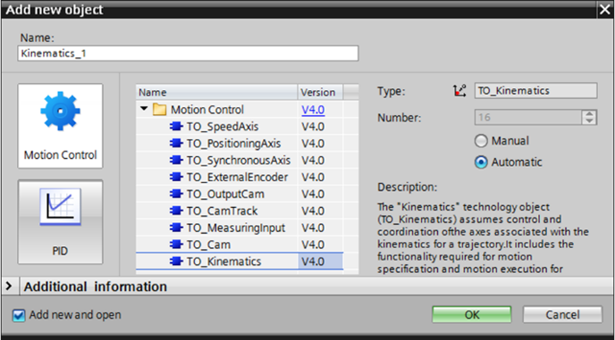

W głównej zakładce wyboru typu układu mechanicznego wybierz portal kartezjański 3D bez orientacji.

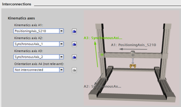

W zakładce _Interconnections_ podłącz skonfigurowane wcześniej osie - będą stanowić kierunki w przestrzeni układu kartezjańskiego XYZ. Te ustawienia będą wystarczające dla przykładowego projektu, przejrzyj jednak pozostałe parametry dostępne w panelu konfiguracyjnym.

C.  **Program PLC.**

Wśród ustandaryzowanych funkcji do obsługi podstawowych ruchów układów kinematycznych mamy do dyspozycji polecenie przemieszczenia liniowego oraz po okręgu.

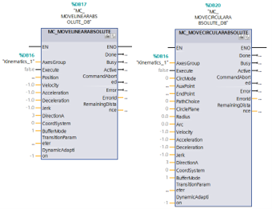

Spróbuj wykorzystać w projekcie funkcje do przemieszczenia absolutnego lub relatywnego. Parametry, które będą przede wszystkim istotne to:

- _AxesGroup_ – układ kinematyczny,
- _Execute –_ aktywacja funkcji,
- _Position –_ pozycja docelowa (ruch liniowy),
- _CircMode –_ tryb generowania ruchu po okręgu,
- _AuxPiont –_ punkt pomocniczy (dla _CircMode =_ 0).
- _EndPoint –_ punkt docelowy (ruch po okręgu).

> [!NOTE]
> Koordynaty punktów docelowych oraz pomocniczego są tablicami 4-elementowymi (x, y, z, a-obrót narzędzia), wartości punktów możesz wprowadzić w bloku danych, który został wygenerowany przez system dla bloków funkcyjnych.

Funkcje generują przemieszczenie narzędzia układu kinematycznego na wskazaną pozycję po najkrótszej ścieżce lub po okręgu. Jako ćwiczenie dodatkowe spróbuj wykonać interpolację ścieżki pomiędzy dwoma poleceniami ruchu – w tym celu należy aktywować odpowiedni tryb buforowania poleceń (parametr _BufferMode_).

Pamiętaj, że w celu uruchomieniu układu kinematycznego w trybie pozycjonowania absolutnego – wszystkie osie składowe musza być załączone, bez błędów oraz wybazowane.

D.  **Kinematics trace.**

Bardzo przydatną cechą środowiska inżynierskiego jest możliwość wizualizacji skonfigurowanego układu kinematycznego. W tym celu wykorzystamy _trace_ układu kinematycznego – znajdziesz go w drzewie projektu obiektu technologicznego.

> [!NOTE]
> W ustawieniach układu kinematycznego należy wyznaczyć zakres skalowania osi (pole _Display in kinematic trace)_ – odpowiednia konfiguracja pozwoli Ci zaobserwować pracę układu w trybie symulacji.

Uruchom _Kinematics trace._ W ustawieniach należy określić próbkowanie pomiarów (_Sampling_). Uruchom rejestrator i przeprowadź testowy ruch układu przez wykonanie pozycjonowania końcówki roboczej z poziomu Twojego programu PLC.

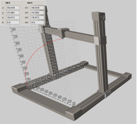

Cechy układu kinematycznego:

- gwarantowana synchronizacja w czasie rzeczywistym,
- wiele predefiniowanych układów mechanicznych,
- sprzężenie trzech osi oraz obrotu narzędzia,
- od TIA V16 dostępna również funkcja śledzenia transportera,
- możliwość symulacji układu na standardowym _PLCSim_,
- kolejkowanie poleceń _Motion Control_ – interpolacja ruchu,
- gotowe biblioteki dla aplikacji _fail-safe,_
- ustandaryzowane funkcje do obsługi ruchów elementu wykonawczego.

Jak widzisz uruchomienie zaawansowanego układu zrobotyzowanego przez sterownik PLC nie jest ani skomplikowane ani czasochłonne, a z pewnością pozwala na swobodny dobór układu mechanicznego, napędowego oraz sterowania i HMI. Finalnie – zadanie, które niegdyś mógł okiełznać jedynie dedykowany robot, można wielokrotnie taniej zrealizować budując własną maszynę od podstaw – i mieć nad nią pełną kontrolę!

Poza standardowymi funkcjami, które mam nadzieje udało Ci się bez problemów zaimplementować, producent przygotował sporo bibliotek oraz przykładów aplikacji dla zadań związanych z tzw. _handling_\-iem. Poniżej znajdziesz zbiór przydatnych informacji dotyczących tego bardzo rozwojowego trendu w przemysłowych układach sterowania ruchem.

[Handling with SIMATIC S7-1500 T-CPU](https://support.industry.siemens.com/cs/ww/en/view/109757198)

## 5.  Enkoder zewnętrzny

Jak już doskonale wiesz - nieodzowną częścią serwomechanizmu jest układ pomiarowy. W wielu aplikacjach spotkamy także niezależne systemy mierzące prędkość lub pokonaną drogę. Pomiar taki może zostać wykorzystany np. jako wartość wzorcowa dla synchronicznej osi nadążnej. W takim przypadku pojawia się pytanie – jak wykonany pomiar zintegrować w projekcie sterowania _Motion Control_ w sposób ustandaryzowany i dający możliwość oprogramowania w PLC.

Odpowiedzią na to pytanie jest obiekt technologiczny enkodera zewnętrznego _TO_ExternalEncoder_. Zanim przejdziemy do ćwiczenia, które Ci chcę zaproponować, warto zastanowić się nad kwestią ramki komunikacyjnej _PROFIdrive_, która dostarcza status oraz pomiary enkodera. Jak pewnie pamiętasz z pierwszego rozdziału mamy do tego zadania przewidziany telegram komunikacyjny (np. Standard telegram 83). Sprawa jest ogólnie prosta - w tej przestrzeni adresowej enkoder lokuje dane pomiarowe. Jednak w zależności od tego jakiego typu jest to enkoder (inkrementalny/absolutny), po jakim protokole się komunikuje, a także jakie ma parametry (dokładność pomiaru, rozdzielczość, ilość obrotów, etc.) - kwestia wprowadzenia odpowiednich parametrów do obiektu technologicznego nie jest już taka oczywista.

Poniżej znajdziesz bardzo przydatny dokument, w którym opisano (na przykładzie osi pozycjonującej) jakie informacje umieszczane są w ramce komunikacyjnej pomiaru pozycji w zależności od parametrów zastosowanego enkodera, a także w jaki sposób mapować te parametry na konfigurację obiektu technologicznego. Opis jest adekwatny także dla obiektu typu _TO_ExternalEncoder_.

[How can you realize the encoder configuration for the “positioning axis” technology object?](https://support.industry.siemens.com/cs/ww/en/view/109486133)

A.  **Konfiguracja enkodera zewnętrznego.**

Jeśli posiadasz fizyczne urządzenie – w pierwszym kroku należy dodać do projektu jego konfigurację. W zależności od tego w jaki sposób enkoder będzie się komunikował – trzeba będzie wykonać jego integrację przez:

- plik GSDML – jeśli wymiana danych odbywa się przez PROFINET IO,
- enkoderowy moduł technologiczny (_TM_Count/TM_PosInput_) – jeśli posiada zgodny interfejs elektryczny,
- przestrzeń adresową – jeśli podłączony jest bezpośrednio do falownika.

Następnie dodaj do projektu obiekt technologiczny _TO_ExternalEncoder_ i podłącz skonfigurowany sprzęt. Wykonaj parametryzację zgodnie z informacjami z powyższego dokumentu.

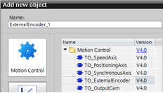

Pamiętaj, że obiekty technologiczne współpracują ze sprzętem w standardzie _PROFIdrive_. Jeśli Twoje urządzenie nie obsługuje takiej komunikacji – trzeba będzie zbudować ramkę telegramu. Opis tego zagadnienia znajdziesz w poniższym przykładzie:

[Using the MC-PreServo and MC-PostServo organization blocks](https://support.industry.siemens.com/cs/ge/en/view/109741575)

Zwróć uwagę, iż pomiar pozycji został włączony do osi pozycjonującej przez blok danych, w którym utworzona została uprzednio struktura standardowego telegramu _PROFIdrive_ 81.

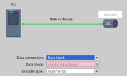

Dzięki temu możesz podłączyć do obiektu technologicznego nie tylko urządzenia wspierające komunikację w tym standardzie.

B.  **Program PLC.**

Po wykonaniu podłączenia enkodera do obiektu technologicznego, możesz sprawdzić jego działanie w panelu diagnostycznym osi. Aby zaobserwować wpływ parametrów układu pomiarowego na pracę innych komponentów _Motion Control –_ proponuję Ci proste ćwiczenie: wykonaj synchronizację liniową (_MC_GearIn_) gdzie osią wiodącą będzie enkoder zewnętrzny, natomiast nadążną- oś synchroniczna (może być wirtualna).

>[!NOTE]
> Synchronizacja osi nadążnej do enkodera zewnętrznego możliwa jest jedynie przy wykorzystaniu sterowników klasy S7-1500T.

C.  **Symulacja enkodera.**

Jeśli nie posiadasz fizycznych urządzeń (enkodera i napędu) – możesz zrealizować to zadanie korzystając jedynie z symulatora PLC.

Jeśli chodzi o oś nadążną to już wiesz, że może ona być osią wirtualną. Z kolei enkoder zewnętrzny możesz zasymulować. Proponuję Ci następujące ćwiczenie: dodaj do projektu obiekt technologiczny enkodera, jako źródło danych wybierz blok danych. W bloku tym utwórz strukturę telegramu _PROFIdrive_ (PD_TEL83).

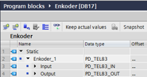

Podłącz tę zmienną do osi _TO_ExternalEncoder_. Aby zasymulować zmianę pozycji enkodera – wystarczy, że będziesz modyfikować wartość parametru XIST1, który w telegramie odpowiada za wartość inkrementalną sygnału z enkodera. Możesz wykonać tę zmianę w bloku danych, przez program PLC lub przez wizualizację.

Cechy enkodera zewnętrznego:

- systemowy mechanizm do podłączenia układu pomiarowego,
- powiązanie z urządzeniami _PROFIdrive_ lub innymi przez blok danych,
- możliwość zdefiniowania jako oś wiodąca,
- swobodna konfiguracja mechaniki,
- uniwersalna interpretacja danych pomiarowych,
- filtrowanie, wygładzanie sygnału mierzonego.

## 6.  Wejście pomiarowe

Kolejne ćwiczenie ma na celu przetestowanie funkcji tzw. wejścia pomiarowego. Mechanizm ten pozwala na bardzo precyzyjne odczytanie pozycji osi w momencie wystąpienia zdarzenia binarnego.

Funkcjonalność taka wymagana jest w aplikacjach o skrajnej dynamice, a równocześnie o wysokich wymaganiach dokładności (np. pakowanie w locie). Sygnał cyfrowy z czujnika próbkowany może być z dokładnością do mikrosekund. Aby uzyskać taką dokładność należy zastosować wejście pomiarowe napędu lub modułu technologicznego PLC. My koncentrujemy się na rozwiązaniach od strony sterownika, także interesować będzie nas realizacja tego zadania przez moduł technologiczny _TM_Timer_ dedykowany dla systemu S7-1500 lub ET200SP.

Więcej informacji na temat idei tego zagadnienia znajdziesz w poniższym przykładzie aplikacji.

[Measuring input with Time-based IO](https://support.industry.siemens.com/cs/ww/en/view/109480157)

Nie uwzględnia ona jednak zastosowania obiektu technologicznego, który jest rozwiązaniem nowszym i łatwiejszym w implementacji. Postaram się nakreślić dla Ciebie procedurę konfiguracji.

A.  **Konfiguracja sprzętowa.**

Przede wszystkim należy zastosować odpowiedni sprzęt aby uzyskać najwyższą dokładność wejścia pomiarowego. Kluczowy w tym zadaniu jest moduł wejść cyfrowych, który będzie w stanie zarejestrować zmianę sygnału z wysoką częstotliwością próbkowania. Służy do tego moduł technologiczny _TM_Timer,_ który posiada swój własny procesor, skanujący kanały wejściowe z dokładnością do 1µs. Moduł rejestruje stempel czasowy wystąpienia zdarzenia na wejściu, a następnie przesyła go CPU, gdzie konwertowany on jest na dokładną pozycję osi, do której wejście pomiarowe zostało przypisane.

Dodaj do konfiguracji moduł technologiczny i aktywuj wybrane wejście cyfrowe w trybie _Timer DI._

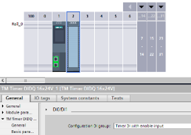

Pamiętaj aby moduł wpiąć do domeny synchronizacyjnej IRT.

> [!NOTE]
> Moduł podłączony do centralnej magistrali procesora może pracować w trybie izochronicznym dopiero od firmware v2.6. Wcześniejsze wersje na to nie pozwalały – należało stosować rozproszoną strukturę sterowania przez PROFINET IO IRT (np. ET200SP).

B.  **Wejście pomiarowe.**

Dodaj do projektu obiekt technologiczny typu _TO_MeasuringInput_. Należy go na stałe przypisać do jednej z uprzednio skonfigurowanych osi.

W konfiguracji sprzętowej wybierz źródło sygnału – w naszym przykładzie jest to aktywowany w poprzednim kroku kanał wejściowy modułu _TM_Timer_.

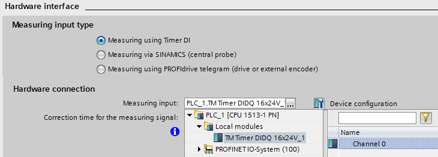

Przejrzyj pozostałe parametry tego obiektu technologicznego, przeanalizuj tryby pracy tego mechanizmu i zastanów się nad ich zastosowaniem.

C.  **Program PLC.**

W programie pozostaje wstawić funkcję do obsługi wejścia pomiarowego. Blok może pracować w kilku trybach, w zależności od tego jakie zdarzenie cyfrowe chcemy wykrywać.

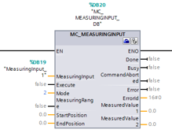

Parametry, które powinny zostać przez Ciebie ustawione to:

- _MeasuringInput –_ obiekt technologiczny wejścia pomiarowego,
- _Execute –_ zbocze aktywujące oczekiwanie na pomiar,
- _Mode –_ tryb pracy (2 = pomiar dwóch kolejnych zmian sygnału),
- _MeasuredValue1 –_ pomiar na zboczu narastającym,
- _MeasuredValue2 –_ pomiar na zboczu opadającym.

Po wykonaniu pomiarów, ponownie należy podać zbocze narastające na wejście aktywujące funkcję.

D.  **Symulacja.**

Dosyć ważną kwestią jest możliwość wykonania układu testowego. Jeśli posiadasz sprzęt to nie ma problemu - wystarczy, że wykonasz ćwiczenie i aktywujesz fizyczne wejście. Jeśli jednak nie posiadasz urządzeń – możesz wykonać symulację przez _PLCSim_. Musisz jednak pamiętać, że parametrem wejściowym obiektu technologicznego jest fizyczne wejście, dlatego taki sygnał należy symulować – możesz wykonać to przez rozszerzony panel konfiguracyjny _PLCSim._

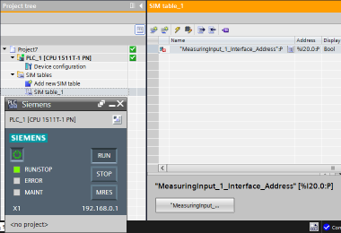

>[!NOTE]
>Nie ma możliwości symulacji ćwiczenia przez sprzętowy sterownik PLC bez podłączonego modułu wejść cyfrowych.

Cechy wejścia pomiarowego:

- zdarzeniowa akwizycja stempla czasu (pozycji) z dokładnością do 1µs,
- obsługa wejścia cyfrowego w trybie IRT,
- sygnał może pochodzić z napędu lub z modułu technologicznego,
- obsługa przez ustandaryzowane funkcje programowe _PLCOpen_.

Wejście pomiarowe znajduje wiele zastosowań, najczęstszym jest jednak korekcja pozycji wykonywania zadania ruchu w aplikacjach szybkich i wymagających pod kątem dokładności. Pod hasłem _Print mark correction_ znajdziesz wiele przykładów ciekawych zastosowań wejścia pomiarowego – np. aplikacje cięcia materiału, gdzie może nastąpić jego przesunięcie (uślizg na rolce), rozciągnięcie lub skurczenie (np. pod wpływem temperatury) czy też odchylenie pozycji wynikające ze zużycia układu transportującego.

Wśród bibliotek przygotowanych przez firmę SIEMENS znajdziesz ciekawy materiał, który możesz zastosować w realizowanych przez Ciebie projektach.

[SIMATIC Library LPrintMark - Print Mark Acquisition with TO Measuring Input](https://support.industry.siemens.com/cs/ww/en/view/109475573)

## 7.  Wyjście krzywkowe

Zagadnieniem odwrotnym do wejścia pomiarowego jest bardzo precyzyjne wystawianie sygnału cyfrowego, które kryje się pod pojęciem wyjścia krzywkowego. Zamiast precyzyjnego odczytu pozycji wystąpienia zdarzenia wejścia binarnego, tym razem możemy bardzo dokładnie powiązać aktywację wyjścia cyfrowego z pozycją osi.

Przykładem może być nakładanie kleju na szybko poruszający się materiał, który przedstawiony został w rozdziale pierwszym. Przykład taki możesz również przeanalizować na podstawie opisu aplikacji przygotowanego przez producenta.

[SIMATIC S7-1500: Cam Control Unit with time-based IO](https://support.industry.siemens.com/cs/ww/en/view/109476953)

Podobnie jak w poprzednim przypadku idea jest opisana w przejrzysty sposób, natomiast realizacja zadania może zostać wykonana o wiele łatwiej przez obiekt technologiczny. Spróbuj wykonać to zadanie podążając za poniższymi wskazówkami.

A.  **Konfiguracja sprzętowa.**

W zakresie wymaganych urządzeń nie ma zmian w stosunku do poprzedniego ćwiczenia – również należy zastosować moduł technologiczny _TM_Timer_. W przypadku wyjścia krzywkowego można wykorzystać także standardowy moduł wyjść cyfrowych.

Stosując moduł technologiczny szybkich wejść/wyjść czasowych należy aktywować odpowiedni tryb pracy modułu (I/O) oraz ustawić kanał wyjściowy w trybie _Timer DQ._

B.  **Wyjście krzywkowe.**

Dodaj do projektu obiekt technologiczny _TO_OutputCam_ oraz przypisz go do wybranej osi pozycjonującej lub synchronicznej.

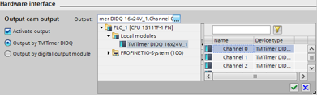

Zwróć uwagę na tryby pracy wyjścia krzywkowego – sterownik może załączać/wyłączać wyjście przy wskazanych wartościach pozycji osi lub na określony czas począwszy od punktu startowego.

C.  **Program PLC.**

W programie pozostaje Ci wywołać funkcję do obsługi mechanizmu wyjścia krzywkowego.

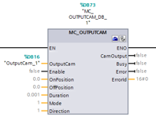

Ustaw odpowiednie wartości parametrów funkcji _MC_OutputCam_:

- _OutputCam –_ obiekt technologiczny wyjścia krzywkowego,
- _Enable –_ aktywacja bloku (wartość TRUE na stałe),
- _OnPosition –_ pozycja załączeni wyjścia,
- _OffPosition –_ pozycja wyłączenia wyjścia,
- _Duration –_ czas załączenia wyjścia,
- _Mode –_ tryb pracy wyjścia,
- _Direction –_ kierunek osi aktywujący wyjście,
- _CamOutput –_ status wyjścia krzywkowego.

Wśród obiektów technologicznych znajdziesz również TO_CamTrack, który pozwala na zdefiniowanie tablicy załączeń/wyłączeń wyjścia krzywkowego.

D.  **Testowanie.**

Jeśli wykonujesz ćwiczenie w oparciu o fizyczne urządzenia – wygeneruj _trace_, na którym można zaobserwować z wysoką dokładnością, że wyjście cyfrowe ustawiane jest niezależnie od cyklu pracy aplikacji (IRT). Dzieje się tak dzięki niezależnemu procesorowi modułu _TM_Timer_, który po otrzymaniu zadania do wykonania, zrealizuje je autonomicznie w odpowiednim momencie.

Symulacja sterownika nie pozwala na zaobserwowanie tego zjawiska.

Cechy wyjścia krzywkowego:

- sterowanie wyjściem w odniesieniu do pozycji z dokładnością do 1µs,
- praca w trybie czasowym lub zakresu pozycji,
- przetwarzanie danych w trybie IRT,
- realizacja zadania przez moduł technologiczny lub standardowe wyjście,
- obsługa przez ustandaryzowane funkcje programowe _PLCOpen_.

## 8.  Komunikacja acykliczna

Jak być może pamiętasz ze wstępu teoretycznego – poza komunikacją cykliczną przez telegramy _PROFIdrive_, możemy także zestawić acykliczną wymianę danych pomiędzy sterownikiem a napędem. Taka zdarzeniowa wymiana informacji może posłużyć do odczytu parametrów napędu, których nie ma w standardowym telegramie lub po prostu nie muszą być odczytywane z cyklem pracy aplikacji (np. odczyt wartości aktualnej momentu obrotowego tylko podczas procedury bazowania osi). Można także modyfikować parametry napędu np. w celu jego rekonfiguracji.

Do sterowania falownikiem SIEMENS wykorzystywaliśmy już biblioteki _SINA_SPEED_ oraz _SINA_POS_. W tej grupie znajdziemy również blok _SINA_PARA_, który służy do obsługi komunikacji acyklicznej pomiędzy sterownikiem a napędem SINAMICS. Funkcja ta pozwala na odczyt/zapis parametrów o wskazanym numerze.

A.  **Konfiguracja sprzętowa.**

Funkcja _SINA_PARA_ umożliwia komunikację z dowolnym napędem SINAMICS, który posiada interfejs komunikacyjny PROFINET. Aby wykonać to ćwiczenie musisz posiadać zarówno sterownik (S7-1200/1500) jak i falownik.

Po stronie układu napędowego należy wykonać dwie czynności – odszukać numer parametru, który nas interesuje oraz upewnić się, że można go odczytywać lub zapisywać.

Przykładowo dla napędów SINAMICS S210 możesz odczytać wartość aktualną momentu obrotowego przez parametr o numerze 31.

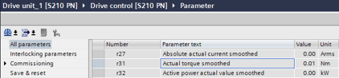

B.  **Program PLC.**

W bibliotece funkcji opcjonalnych (_Libraries -> 03_SINAMICS_) znajdziesz blok _SINA_PARA_. Aby był tam widoczny należy zainstalować narzędzie _StartDrive_ lub pobrać bibliotekę _DriveLib_ ze stron wsparcia technicznego firmy SIEMENS. Wstaw blok funkcyjny do projektu.

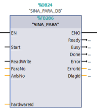

Parametry wymagające konfiguracji:

- _Start_ – aktywacja zapisu/odczytu (zbocze),
- _ReadWrite_ - tryb pracy (0 = odczyt, 1 = zapis),
- _ParaNo_ - ilość odczytywanych parametrów,
- _AxisNo_ – numer osi napędu,
- _HW_ID_ – identyfikator sprzętowy napędu (_Module Access Point_).

Numer parametru (_siParaNo_) należy wprowadzić w DB utworzonym przez system dla wstawionej instancji funkcji _SINA_PARA_.

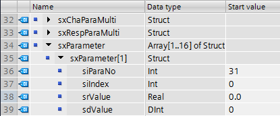

Również w tym interfejsie bloku należy sprawdzić poprawność odczytu parametru (_srValue_).

Interfejs jest przyjazny, a więc zadanie nie powinno sprawić Ci trudności. Jeśli interesuje Cię bardziej szczegółowy opis tego zagadnienia, zajrzyj do przykładowego projektu przygotowanego przez producenta dla napędu SINAMICS V90.

[Acyclic communication between SIMATIC S7-1500 and SINAMICS V90 via PROFINET](https://support.industry.siemens.com/cs/ww/en/view/109743977)

## 9.  Ograniczenie siły

Jeśli zdarzyło Ci się uczestniczyć w jakiejkolwiek prezentacji prowadzonej przez obywatela Niemiec w języku angielskim to na koniec musiały paść słowa _Last but not least…_. Koledzy z zza zachodniej granicy lubują się w tym zwrocie. W naszym zbiorze ćwiczeń znajduje on bardzo adekwatne zastosowanie, otóż przechodzimy do zadania ostatniego - aczkolwiek bardzo ważnego i przydatnego. Związane jest ono z uruchomieniem funkcji ograniczenia siły lub momentu obrotowego.

Sposobność ta przydatna jest w zasadzie od etapu uruchomienia maszyny, przez algorytm aplikacji, a kończąc na diagnostyce. Ograniczenie siły generowanej przez oś napędową pozwala zabezpieczyć przed uszkodzeniem samą maszynę, przetwarzany materiał, obrabiany detal czy operatorów.

A.  **Konfiguracja sprzętowa.**

Ograniczenie momentu przez obiekt technologiczny możliwe jest tylko przy zastosowaniu telegramów komunikacyjnych _PROFIdrive_ SIEMENS. Jak zapewne pamiętasz są to telegramy o numerach 10x, np. 105, który wykorzystywaliśmy w naszych ćwiczeniach.

Przede wszystkim należy zgłębić czy wybrany przez nas napęd obsługuje telegramy SIEMENS – nie musi to dotyczyć jedynie produktów SINAMICS, gdyż inni producenci, wychodząc naprzeciw programistom, także taką kompatybilność posiadają.

Jeśli napęd nie obsługuje telegramu SIEMENS, konfiguracja opisana poniżej nie będzie możliwa – w takim przypadku trzeba zastanowić się nad inną drogą realizacji tego zadania, np. przez acykliczną wymianę danych lub ograniczenie podawane wartością sygnału analogowego.

B.  **Program PLC.**

Wśród funkcji technologicznych _PLCOpen_ znajdziesz blok _MC_TorqueLimiting_, który służy do aktywacji ograniczenia momentu obrotowego obiektu technologicznego.

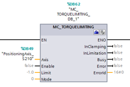

Już na pierwszy rzut oka widać, że konfiguracja nie jest skomplikowana i wymaga podania jedynie kilku parametrów:

- _Axis_ – obiekt technologiczny osi,
- _Enable_ – aktywacja ograniczenia (wartość TRUE na stałe),
- _Limit_ – wartość ograniczenia siły lub momentu obrotowego w zależności od typu osi (liniowa/obrotowa),
- _Mode_ – tryb pracy funkcji,
- _InLimitation_ – status wystawiany przez blok w momencie osiągnięcia zadanego limitu.

>[!NOTE]
>Zwróć uwagę, że ograniczenie działa całkowicie niezależnie od wszelkich innych zadań _Motion Control,_ które aktualnie realizuje oś technologiczna.

Funkcja znajduje zastosowanie we wszelkich aplikacjach gdzie wymagana jest kontrola siły, np. podczas nawijania/przewijania, dokręcania, dociskania czy prasowania. Firma SIEMENS przygotowała gotową funkcję do obsługi aplikacji nawijarek z kontrolą naprężenia. Wśród przykładów aplikacji producenta znajdziemy również wartą uwagi bibliotekę realizującą ograniczenie siły w układach kinematycznych, czy też zadanie najazdu na twardy zderzak_._

Odnośniki do tych materiałów znajdziesz poniżej.

[SIMATIC Winder and Tension Control](https://support.industry.siemens.com/cs/ww/en/view/58565043)

[SIMATIC S7-1500T Kinematics Computed Torque Control](https://support.industry.siemens.com/cs/ww/en/view/109755899)

[SINAMICS V90 PN: How to realize “travel to fixed stop” application](https://support.industry.siemens.com/cs/ww/en/view/109747886)