# Simatic S7-1500 + Sinamics V90 PN

## Simatic S7-1500 + Sinamics V90 PN

W tej sekcji znajdziesz zestaw ćwiczeń prowadzących do implementacji mechanizmów kontroli napędu przez sieć PROFINE IO za pomocą sterownika SIMATIC S7-1500. Zaczniemy od zadawania prędkości, przez pozycjonowanie w różnych wariantach, a skończymy na sterowaniu wewnętrznym pozycjonerem napędu.

Elementem wykonawczym w tej serii zadań będzie napęd serwo SINAMICS V90, aczkolwiek mógłby być to dowolny inny napęd z obsługą telegramów `PROFIdrive`.

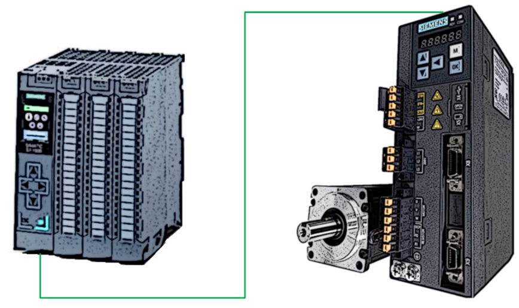

Każde ćwiczenie będzie opisane sekwencją wskazówek, które należy wykonać w celu poprawnej jego realizacji. Większość z nich opatrzę zrzutem ekranu ze środowiska inżynierskiego aby ułatwić Ci pracę, część jednak będzie wymagało od Ciebie zaangażowania oraz odnalezienia poprawnego kierunku dalszych działań.

## 1.  Sterowanie prędkością - Telegram 1

W części teoretycznej zacząłem omawianie funkcji _Motion Control_ od sterowania prędkością. Spróbuj więc i Ty zacząć swoje zmagania od realizacji tego podstawowego zadania.

Przypomnę Ci jedynie, iż sterowanie prędkością może odbywać się przez telegram _PROFIdrive,_ który w słowie sterującym zawiera prędkość zadaną. Dedykowanym do tego zadania jest Telegram 1.

### 1.1.  Funkcje użytkownika.

Jedną z metod wykonania takiego sterowania jest ingerencja bezpośrednio w przestrzeń adresową napędu (urządzenia klasy _IO device_) czyli w obszar telegramu _PROFIdrive_. Jak wiemy z rozważań teoretycznych możemy przygotować w tym celu własny program, który w określonej sekwencji wysyłać będzie parametry sterujące do odpowiednich komórek w pamięci napędu.

A.  **Konfiguracja PLC.**

Dodaj do projektu sterownik.

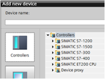

B.  **Napęd.**

Wstaw także jednostkę napędową. Można wykonać tę operację na dwa sposoby – przez plik konfiguracyjny SINAMICS V90 (widoczny w drzewie urządzeń na poniższym zrzucie ekranu) lub przez plik GSDML.

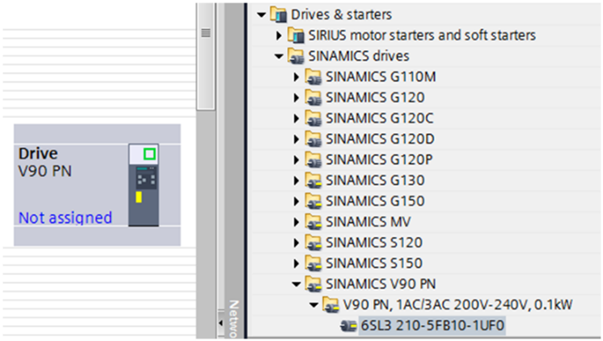

Plik konfiguracyjny może być zastosowany tylko dla sterowników S7-1500 i w takiej konfiguracji jest zalecany gdyż daje możliwość pełnej konfiguracji oraz uruchomienia napędu z poziomu TIA Portal.

W parametrach jednostki napędowej wybierz typ silnika, przypisz także nazwę urządzenia klasy `IO device (Assign device name)` oraz, jeśli to konieczne – ustaw adres IP.

C.  **Sieć.**

Połącz urządzenia w widoku sieci.

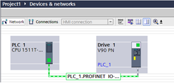

Klikając link na pliku konfiguracyjnym napędu możesz przypisać temu urządzeniu _Controller_ sieci PROFINET IO.

D.  **Komunikacja.**

Zdefiniuj domenę synchronizacji RT.

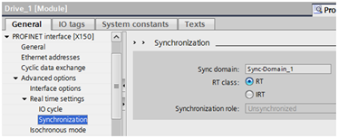

Połączenie S7-1500 z plikiem konfiguracyjnym SINAMICS V90 domyślnie wiąże się z przypisaniem telegramu komunikacyjnego 105 (SIEMENS Telegram), który wymaga pracy w trybie IRT, a co za tym idzie należy skonfigurować topologię urządzeń w sieci PROFINET IO.

Na tym etapie będziemy korzystać z telegramu standardowego 1, który nie wspiera trybu IRT, należy więc go wyłączyć (aktywować tryb synchronizacji RT) zgodnie z powyższym zrzutem ekranu.

E.  **Regulator prędkości.**

Następnie przechodzimy do panel uruchomienia napędu `(Commissioning)`.

W zakładce `Control panel` po przejściu w tryb _online_ oraz przejęciu kontroli nad napędem `(Master control)` możesz załączyć napęd i spróbować zadać mu parametry ruchu (prędkość) w celu sprawdzenia poprawności połączeń elektrycznych.

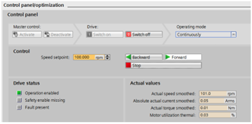

W panelu `Optimization` mamy możliwość wykonania automatycznego strojenia regulatora prędkości napędu.

Przekształtnik wykonuje szereg testów obciążeniowych (bada reakcję na zmiany dynamiki, sprawdza zachowanie osi w zależności od podanego prądu, etc.), które kończą się obliczeniem optymalnych wartości parametrów pętli regulatora prądu/prędkości. Po wykonaniu optymalizacji należy pamiętać o zapisaniu parametrów regulatora w pamięci trwałej falownika.

F.  **Telegram _PROFIdrive_.**

Kolejnym krokiem jest określenie przestrzeni adresowej wykorzystywanej do wymiany danych pomiędzy napędem a sterownikiem nadrzędnym. Przestrzeń ta zdefiniowana jest przez telegram komunikacyjny.

W tym ćwiczeniu wykorzystywać będziemy podstawowy telegram do pracy prędkościowej czyli Standardowy telegram 1.

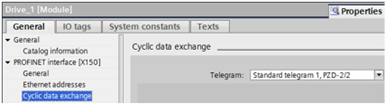

Po zmianie telegramu wgraj konfigurację sprzętową do napędu `(Download)`.

Zwróć uwagę na adresację przestrzeni I/O – w narzędziu V-Assistant możesz podejrzeć strukturę danych wybranego telegramu.

G.  **Program PLC.**

Bazową metodą komunikacji z napędem w sieci `PROFIdrive` jest zmiana jego parametrów przez słowo sterujące.

Analizując pierwsze słowo sterujące telegramu(`STW1`), aby uzyskać status gotowości do pracy z nadrzędnym sterownikiem PLC - należy ustawić bity 1, 2, 3, 4, 5, 6 oraz 10. Jest to równoznaczne z przepisanie szesnastkowej wartości `16#47E` na pierwsze słowo wejściowe napędu (co widać na powyższej grafice – `Network 1`)

Załączenie zasilania to dodatkowo załączenie bitu 0, czyli w drugim kroku przepisujemy wartość `16#47F` do pierwszego słowa sterującego (`Network 2`).

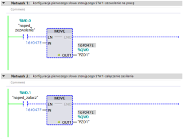

Wysłanie prędkości zadanej, wymaga ustawienia jej wartości w drugim słowie sterującym napędu.

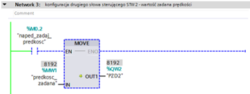

> [!NOTE]
> Wartość ta skalowana jest od 0 do 100% wartością szesnastkową (HEX) 16#0...16#4000 (czyli dziesiętnie: 0...16384). Wartość do skalowania zapisana jest w parametrze p2000 napędu (prędkość referencyjna). Zatem jeśli jego wartość domyślnie wynosi 3000, natomiast ustawimy wartość w STW2 na 8192 (50%) to prędkość powinna zostać ustawiona na 1500 obr/min.

### 1.2.  Biblioteka `SINA_SPEED`.

Te same operacje na przestrzeni adresowej napędu pracującego w trybie prędkościowym można zrealizować przez przygotowaną przez firmę SIEMENS bibliotekę _SINA_SPEED_, która znacznie ułatwia oraz standaryzuje nasz program. Spróbuj wstawić do projektu tę funkcję i wykonać jej parametryzację na podstawie konfiguracji projektu wykonanej w poprzednim ćwiczeniu. W razie trudności możesz się wesprzeć poniższą dokumentacją:

[Speed Control of SINAMICS V90 with SIMATIC S7-1500 via PROFINET](https://support.industry.siemens.com/cs/us/en/view/109739216)

### 1.3.  Obiekt technologiczny `SpeedAxis`.

Rozwiązaniem docelowym jest zastosowanie obiektu technologicznego, który został opisany w części pierwszej publikacji.

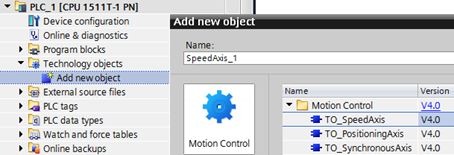

Wykonaj parametryzację obiektu _TO_SpeedAxis_, a następnie wykorzystaj systemowe funkcje _PLCOpen_ w celu wydawania poleceń osi napędowej za pośrednictwem osi prędkościowej.

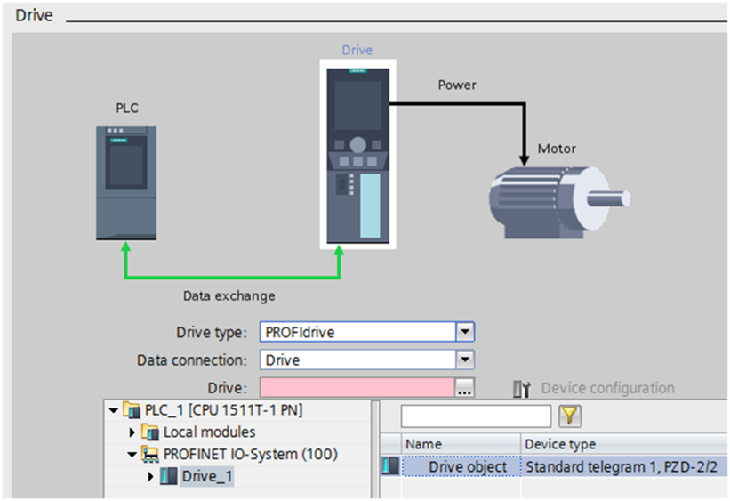

Konfiguracja urządzeń z poprzedniego ćwiczenia jest gotową bazą, jeśli jednak natkniesz się na przeszkody skorzystaj z dokumentacji z linku wskazanego powyżej.

Cechy osi prędkościowej:

- konfiguracja mechaniki (przeliczanie jednostek),
- zadawanie dynamiki przejazdu przez interfejs funkcji systemowych,
- ustandaryzowane funkcje _PLCOpen_ do obsługi zadań _Motion Control_,
- diagnostyka w osi technologicznej,
- zmienne systemowe w bloku DB-instance,
- brak konieczności znajomości struktury telegramu komunikacyjnego,
- centralne zarządzenie osią technologiczną,
- wirtualizacja oraz symulacja osi.

> [!Note]
> Wirtualizacja osi pozwala na pełne przetestowanie działania mechanizmów _Motion Control_ przy wykorzystaniu jedynie standardowego symulatora sterownika _PLCSim_. W związku z powyższym, ćwiczenia oparte o osie technologiczne możesz przetestować posiadając jedynie środowisko inżynierskie TIA Step 7 Professional. Wszelkie atrybuty ruchu odnajdziesz wśród parametrów aktualnych obiektu technologicznego.

## 2.  Pozycjonowanie - Telegram 3

Podstawowym zadaniem układu pracującego w zamkniętej pętli (serwo) jest pozycjonowanie, czyli kontrolowanie pozycji osi napędowej. Zadanie to może zostać zrealizowane na podstawie wielu telegramów _PROFIdrive,_ elementarnym jednak jest Standard Telegram 3. Wymiana danych z wykorzystaniem tej przestrzeni adresowej może być zrealizowana zarówno w trybie IRT jak i RT.

A.  **Oś pozycjonująca.**

Konfiguracja sprowadza się do dodania do projektu osi pozycjonującej oraz jej parametryzacji.

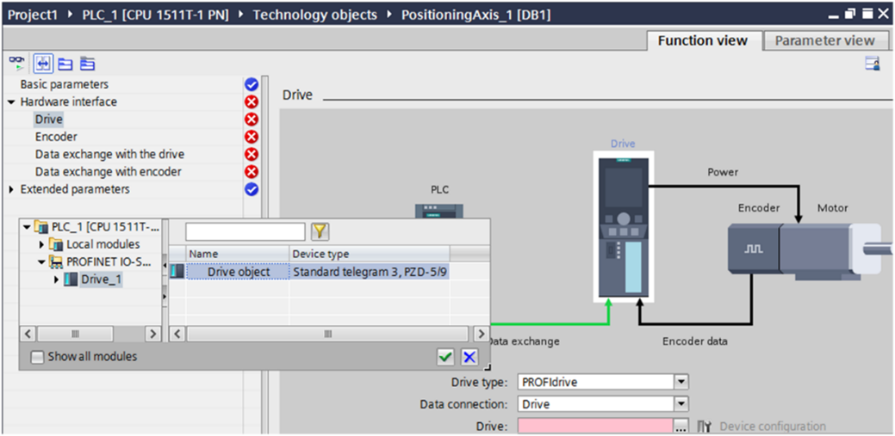

B.  **Program PLC.**

W programie należy zrealizować następujące funkcje:

- załączenie (`MC_Power`), potwierdzenie błędów (`MC_Reset`), zatrzymanie (`MC_Halt`),

- bazowanie (`MC_Home`) – jest funkcją charakterystyczną dla pozycjonującej osi napędowej ze sprzężeniem zwrotnym z enkodera; bazowanie układu jest procedurą, która ma na celu ustawienie statusu napędu w sterowniku, który będzie oznaczał, iż oś znajduje się w znanej, określonej pozycji; podczas pozycjonowania relatywnego, gdzie przesunięcie odbywa się o zdefiniowany dystans nie ma to znaczenia; jeśli jednak chcemy wydać osi polecenie przejazdu na konkretną pozycję (pozycjonowanie absolutne) to w pierwszej kolejności napęd (sterownik) musi wiedzieć gdzie się aktualnie znajduje; bazowanie układu w zależności od fizycznych możliwości oraz wymagań aplikacji może odbywać się w kilku trybach; podział bardzo ogólny mówi o bazowaniu aktywnych (wywołującym ruch osi) oraz pasywnym (nie generującym przemieszczenia osi);

- pozycjonowanie relatywne (`MC_MoveRelative`) oraz absolutne (`MC_MoveAbsolute`); przypomnę Ci, iż ruch relatywny to przemieszczenie osi o zdefiniowany dystans, natomiast absolutny to wysłanie osi na określoną pozycję.

Spróbuj wykonać to ćwiczenie samodzielnie. Jeśli Ci się nie uda, skorzystaj z opisu w poniższej dokumentacji przygotowanej przez producenta:

[Position Control of SINAMICS V90 with SIMATIC S7-1500 via IRT PROFINET](https://support.industry.siemens.com/cs/cn/en/view/109739053)

Cechy osi pozycjonującej – wszystkie z osi prędkościowej oraz:

- różne tryby bazowania osi,
- pozycja aktualna transferowana przez telegram bezpośrednio do osi technologicznej,
- możliwość przesyłania wartości momentu (SIEMENS telegram 10x),
- konfiguracja _Dynamic Servo Control_ (obliczenia pozycjonera przeniesione do napędu),
- ekstrapolacja wartości aktualnej (filtrowanie sygnału mierzonego),
- strojenie pętli regulacji pozycji w PLC,
- konfiguracja krańcówek sprzętowych oraz programowych,
- możliwość podłączenia do 4 enkoderów (S7-1500T).

## 3.  Pozycjoner napędu (`EPOS`) - Telegram 111

Podążając za wstępem teoretycznym, wiemy już, że pętla regulacji pozycji może zostać zamknięta przez sterownik PLC lub może być kontrolowana całkowicie przez pozycjoner w napędzie (EPOS). W przypadku falowników posiadających wewnętrzny pozycjoner (np. SINAMICS V90) wydawanie poleceń ruchu może odbywać się przez nadrzędny sterownik PLC.

Innymi słowy - będziemy acyklicznie wysyłać parametry pozycjonowania do napędu - regulator pozycji oraz prędkości są zlokalizowane w napędzie. W poprzednich ćwiczeniach interpolator (generator wartości zadanych pozycji) umieszczony był w sterowniku nadrzędnym.

Ćwiczenie należy wykonać w kilku krokach, które znajdziesz poniżej. Mechanizmu tego nie da się zasymulować w środowisku inżynierskim.

A.  **Sterowanie napędem.**

W pierwszym kroku należy zmienić tryb pracy napędu z prędkościowego (`S`) na wewnętrzny pozycjoner (`EPOS`).

Pamiętaj także o wyborze odpowiedniego telegramu komunikacyjnego (`SIEMENS Telegram 111`). Po tych czynnościach kopiujemy pamięć RAM do ROM oraz restartujemy napęd.

B.  **Mechanika.**

 Pamiętajmy o ustawieniu ilości jednostek odległości napędu (LU) na obrót.
Na bazie tego parametru (bez przeliczeń po stronie PLC, gdyż pozycjonowanie odbywa się po stronie napędu) polecenia będzie wydawał sterownik PLC.

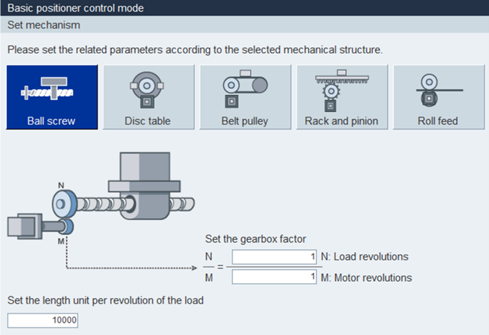

C.  **Konfiguracja PLC oraz sieci.**

Ze względu na sporą ilość parametrów, które można ustawić w napędzie w trybie `EPOS`, musimy konfigurować go za pomocą narzędzia `V-Assistant`. W związku z powyższym nie możemy użyć pliku konfiguracyjnego `HSP` - musimy skorzystać z `GSDML`. Plik `HSP` napędu `SINAMICS V90` nie wspiera telegramu `SIEMENS 111`, który jest dedykowany dla `EPOS`.

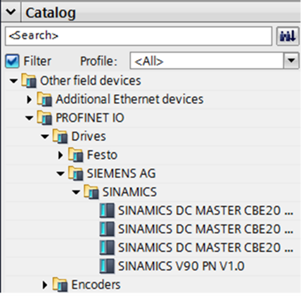

Łączymy urządzenia w sieć. Domena synchronizacji podobnie jak w poprzednich ćwiczeniach powinna pracować w trybie `RT`.

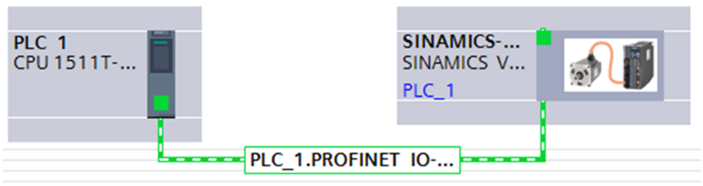

D.  **Telegram `PROFIdrive`.**

W pliku `GSDML` konfigurujemy strukturę wymiany danych z napędem – telegram `PROFIdrive`. Bardzo ważne jest wykonanie identycznej konfiguracji telegramu jak po stronie napędu (`V-Assistant`).

W przypadku SINAMICS V90 nie ma tutaj wątpliwości, natomiast dla innych urządzeń konfiguracja telegramu może być o wiele bardziej rozbudowana, warto więc o tym pamiętać.

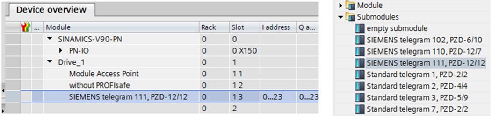

E.  **Program PLC.**

Wstaw do programu funkcję `SINA_POS` z biblioteki globalnej `TIA PORTAL`. Wykonaj parametryzację zgodnie ze zrzutem ekranu. Możesz wykorzystać zmienne z bloku instance DB funkcji. Poniżej znajdziesz skrócony opis interfejsu funkcji:

- `ModePos` - tryb pracy (= 1 pozycjonowanie relatywne),
- `EnableAxis` - załączenie osi (= 1 na stałe),
- `AckError` - potwierdzenie błędów (aktywacja zboczem narastającym),
- `ExecuteMode` - wykonaj komendę (zbocze),
- `Position` - odległość przejazdu relatywnego – np. 10 000 [LU] (jeden obrót osi),
- `Velocity` - prędkość przejazdu – np. 10000 [1000 LU/min],

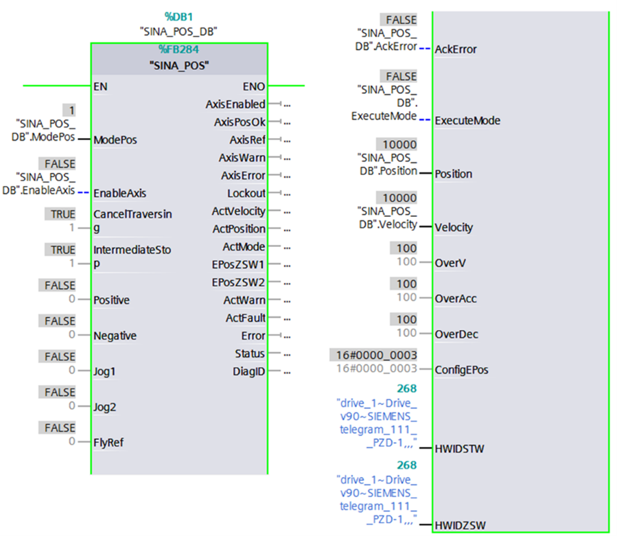

- `HW_IDSTW/HWIDZSW` – identyfikator sprzętowy `telegramu 111`.

> [!NOTE]
> Identyfikator sprzętowy telegramu komunikacyjnego jest automatycznie przypisany przez środowisko inżynierskie w konfiguracji sprzętowej (`System constants`­). Należy odczytać go we właściwościach pliku GSDML i wprowadzić jako parametr wejściowy funkcji SINA_POS.

Jestem pewien, że ćwiczenie nie przysporzyło Ci trudności. Jeśli jednak potrzebujesz bardziej szczegółowy opis parametrów funkcji SINA_POS czy też instrukcję krok po kroku, znajdziesz je w poniższej dokumentacji przygotowanej przez producenta:

 [SINAMICS V90 PN: Basic Positioner (EPos)](https://support.industry.siemens.com/cs/cn/en/view/109747750)

Cechy funkcji SINA_POS:

- pozycjonowanie w napędzie – wysoka dokładność bez trybu izochronicznego; idealne rozwiązanie dla sterowników S7-1200,
- brak ograniczeń co do ilości osi technologicznych (zasoby _Motion Control_ w S7-1500 lub 8 osi w S7-1200),
- jedna funkcja do parametryzowania lub wybierania przejazdów zdefiniowanych w napędzie, inne tryby: bazowanie, jog, MDI (_Manual Data Input_),etc.
- krańcówki sprzętowe muszą być podłączone pod wejścia cyfrowe napędu.