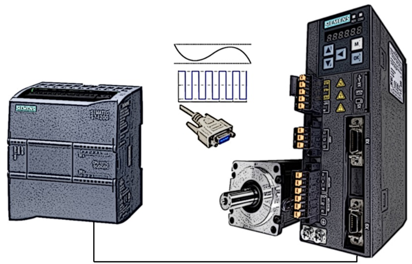
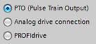

# Simatic S7-1200 + Sinamics V90 PTI

1.  SIMATIC S7-1200 + SINAMICS V90 PTI.

Sterownik klasy S7-1200 w obszarze sterowania ruchem pozwala na realizację raczej podstawowych funkcji, pomimo tego bardzo dobrze sprawuje się w połączeniu z napędem sterowanym impulsowo. Wynika to z faktu, iż posiada on zintegrowane szybkie wejścia (można podłączyć enkoder) oraz wyjścia impulsowe (PTO).

W związku z powyższym – w aplikacjach budżetowych - można systemowo zaimplementować kilka trybów sterowania napędem bez interfejsu PROFINET.

W kolejnych sekcjach znajdziesz ćwiczenia zbudowane na przykładzie napędu SINAMICS V90 w wersji PTI.

- 1.  Sterowanie impulsowe

Wiele nisko kosztowych układów napędowych daje możliwość sterowania serią impulsów. Zasada jest prosta – podobnie jak w silnikach krokowych impuls odpowiada za przesunięcie o zdefiniowany kąt. Wysyłając więc odpowiednią ilość sygnałów z odpowiednią częstotliwością – uzyskamy ruch, który po stronie falownika weryfikowany jest w pętli zamkniętej.

Jeśli jesteś w posiadaniu napędu z interfejsem PTI, możesz wykonać ćwiczenie w połączeniu z dowolną jednostką centralną S7-1200. Bez urządzeń w tym przypadku nie da się wykonać symulacji.

- - 1.  Konfiguracja napędu.

Od strony przekształtnika częstotliwości należy wykonać kilka ustawień, które będą odpowiadały przyjętym założeniom sterowania.

1.  **Wybór trybu pracy.**

Podłączamy się do napędu przez oprogramowanie V-Assistant i wybieramy odpowiedni tryb pracy napędu (_Control Mode)_.

**UWAGA**! Po zmianie trybu pracy należy ponownie uruchomić napęd lub wykonać restart programowy.

1.  **Sygnał sterujący.**

Ustawienia wykonane po stronie sprzętowej PLC muszą zostać dostosowane do trybu pracy napędu. Z poziomu V-Assistant wybierz tryb puls/kierunek oraz poziom sygnału kierunkowego.

W przypadku sterownika S7-1200 wyjścia pracują w standardzie 24V. W związku z powyższym należy również wskazać ten standard po stronie przekształtnika częstotliwości.

1.  **Załączanie napędu.**

W zakładce przypisania wejść/wyjść należy powiązać odpowiednie funkcje z sygnałami wejściowymi napędu.

Sygnał _SON_ (_Servo ON_), który odpowiada za zasilnie napędu podłączamy do DI1 (wejście cyfrowe 1), opcjonalnie sygnał _RESET_ (kwitowanie błędów) do DI2.

- - 1.  Mechanika.

Pozostaje dopełnić konfigurację napędu w zakresie mechaniki uruchamianego układu.

W pierwszej kolejności w napędzie (V-Assistant) trzeba zdefiniować jak mają być interpretowane przychodzące na wejście PTI impulsy. Najłatwiej jest wybrać konkretną ilość impulsów, które mają odpowiadać jednemu obrotowi (np. 1000 zgodnie z przedstawionym zrzutem ekranu) lub wybrać opcję z zastosowanym typem mechaniki.

W przypadku zastosowania obiektu technologicznego sterownika SIMIATIC, łatwiej jest wykonać konfigurację układu mechanicznego w centralnym punkcie systemu, czyli właśnie po stronie PLC.

W tym wypadku jeśli w obiekcie technologicznym wybierzemy jednostkę odległości impulsową (_pulses_) – podanie dystansu 1000 w funkcji pozycjonowania (np. _MC_MoveRelative_) spowoduje wykonanie dokładnie jednego obrotu wału silnika.

Idąc jednak dalej, zazwyczaj wygodniej będzie pozycjonować w milimetrach, czyli przykładowo przesunięcie 10mm ma odpowiadać jednemu obrotowi wałka silnika. Wybierając więc jednostkę metryczną należy skonfigurować dodatkowo parametry mechaniczne.

- - 1.  Konfiguracja PLC.

W sterowniku należy wskazać parametry, które będą adekwatne dla konfiguracji wykonanej po stronie falownika.

1.  **Aktywacja wyjścia impulsowego.**

W TIA Portal wstawiamy do projektu sterownik S7-1200 i aktywujemy wyjście impulsowe - domyślnie nie jest ono aktywne.

**UWAGA!** Ze względu na ograniczenia sprzętowe nie ma możliwość wykorzystania wyjść przekaźnikowych do pracy w trybie PTO. Funkcjonalność ta może być zrealizowana jedynie na zintegrowanych w CPU wyjściach tranzystorowych – trzeba mieć to na uwadze podczas doboru jednostki centralnej do projektu.

1.  **Sygnał sterujący.**

Wybieramy tryb pracy wyjścia impulsowego np. puls/kierunek. W tym trybie jedno wyjście PLC będzie generowało impulsowo wartość zadaną prędkości, drugie zaś będzie określać kierunek pracy osi.

W celu zwiększenia częstotliwości w przypadku sterowania impulsowego możemy zastosować oba wyjścia jako impulsowe, wtedy jednak nie będzie możliwość zmiany kierunku pracy osi.

1.  **Wyjścia cyfrowe.**

W konfiguracji sprzętowej wyjścia impulsowego (np. PTO1) wskazujemy wyjścia sprzętowe jednostki centralnej odpowiedzialne za generowanie sygnału sterującego oraz kierunkowego.

1.  **Oś pozycjonująca**

W przypadku sterownika S7-1200 mamy do wyboru oś pozycjonującą oraz tabelę przejazdów, która jest formą predefiniowanej listy poleceń ruchu bazującej na pozycjonowaniu relatywnym, absolutnym oraz trybie prędkościowym.

W ustawieniach ogólnych osi pozycjonującej wybierz typ komunikacji PTO z przekształtnikiem częstotliwości.

W ustawieniach napędu wskazujemy sygnał impulsowy odpowiedzialny za sterowanie osią technologiczną.

W dolnej części okna konfiguracyjnego podłączamy również sygnał załączający napęd. Zostanie on później powiązany elektrycznie z sygnałem SON w SINAMICS V90. Wskazując sygnał w obiekcie technologicznym, będziemy mieli możliwość załączenia napędu przez dedykowaną funkcję systemową. Opcjonalnie możemy aktywować napęd przez „ręczne” wysterowanie wyjścia cyfrowego w programie użytkownika.

Możemy także w osi odczytać status napędu przez sygnał gotowości napędu _(Ready input)._

1.  **Program PLC.**

Jeśli w poprzednim kroku wskazaliśmy wyjście aktywujące napęd, możemy dodać do projektu funkcję _MC_Power_, która pozwoli na załączenie napędu przez podanie wartości _TRUE_ na nóżkę _Enable_.

Dodatkowo możemy skonfigurować wyjście sterownika, które pozwoli na kwitowanie błędów napędu z poziomu programu użytkownika.

Wykonanie odpowiedniej parametryzacji osi pozycjonującej pozwoli teraz w programie użytkownika zadawać parametry przejazdu w rzeczywistej jednostce, która będzie łatwa w interpretacji dla programisty oraz konstruktora.

Podążając zatem za naszą przykładową konfiguracją – wstaw do projektu funkcję pozycjonowania względnego (_MC_MoveRelative_), a następnie zadaj dystans przejazdu 10mm – w efekcie powinno nastąpić przemieszczenie osi napędowej dokładnie o jeden obrót.

Domyślna oraz graniczna dynamika przejazdu ustawiana jest w obiekcie technologicznym. Limity prędkości można także zmieniać w napędzie – przez kombinację wejść cyfrowych lub przez sygnał analogowy.

- - 1.  Okablowanie.

Jeśli przyjdzie Ci zmierzyć się również z wykonaniem połączeń elektrycznych takiego zestawu – może przydać Ci się poniższy schemat.

|     |     |     |
| --- | --- | --- |
| NAPĘD (PIN/SYGNAŁ) |     | PLC |
| 36  | 24V pulse train input A | Q0.0 |
| 37  | 24V pulse train input A, ground | M   |
| 38  | 24V pulse train input B/D | Q0.1 |
| 39  | 24V pulse train input B/D, ground | M   |
| 3/4 | Common ground (DI/DO) | M   |
| 5   | Digital input 1 (SON) | Q0.2 |
| 6   | Digital input 2 (RESET) | Q0.3 |

Przykładowy projekt aplikacji sterowania impulsowego przygotowany przez SIEMENS można pobrać ze stron wsparcia technicznego.

_Controlled Positioning of a V90 with S7‑1200 via the Pulse/Direction Interface_

https://support.industry.siemens.com/cs/gb/en/view/77467940

- 1.  Sterowanie sygnałem analogowym

W zakresie sterowania analogowego możemy pracować w trybie prędkościowym lub momentowym. Podstawowym parametrem w takim trybie sterowania napędu będzie wartość prędkości lub momentu obrotowego zadawana przez sygnał analogowy.

Konfiguracja wygląda bardzo podobnie - spróbuj wykonać parametryzację napędu w trybie prędkościowym (S).

- - 1.  Konfiguracja napędu.

1.  **Wybór trybu sterowania.**

Sterowanie prędkościowe może odbywać się w dwóch wariantach:

- przez sygnał analogowy AI1 – w tym wypadku określamy wartość maksymalną oraz minimalną prędkości, która będzie aktywowane przez sygnał analogowy (-10V…10V),
- przez odpowiednią konfigurację sygnałów cyfrowych (SPD1/2/3) – wybór predefiniowanej prędkości zadanej.

1.  **Zezwolenie na pracę.**

Kluczowe jest załączenie napędu (SON) oraz zezwolenie na ruch w wybranym kierunku (CWE/CCWE).

Charakterystyczne dla trybu prędkościowego będą również sygnały aktywujące predefiniowaną wartość prędkości zadanej (SPD1/2/3).

- - 1.  Konfiguracja PLC.

Sterowanie sygnałem analogowym z punktu widzenia PLC może odbywać się bezpośrednio z poziomu programu użytkownika lub przez obiekt technologiczny – oś pozycjonująca.

W tym drugim przypadku wymagana jest jednak odpowiednia konfiguracja sprzętowa – wariant gdzie enkoder jest podłączony bezpośrednio do przekształtnika częstotliwości nie pozwala na transfer pozycji do osi, a tym samym na uruchomienie obiektu technologicznego. Aby wykonać konfigurację przez obiekt technologiczny – enkoder należałoby podłączyć pod szybkie wejścia jednostki centralnej lub przez PROFINET IO.

1.  **Program PLC.**

W związku z powyższym pozostaje aktywować w programie sygnały zezwalające na pracę napędu w trybie prędkościowym oraz zadać odpowiednia wartość napięcia na wyjście analogowe sterownika.

**Przykład.** Wartość wygenerowana w przykładowym programie na wyjście analogowe (11849) stanowi ok 43% wartości maksymalnej (27648). W związku z powyższym na wyjściu fizycznym generowane jest napięcie ok 4.3V, co z kolei przy naszej konfiguracji będzie oznaczało 43% wartości maksymalnej(znamionowej) prędkości zdefiniowanej w kroku poprzednim.

- - 1.  Okablowanie.

Przykładowy schemat połączeń elektrycznych znajdziesz poniżej.

|     |     |     |
| --- | --- | --- |
| NAPĘD (PIN/SYGNAŁ) |     | PLC |
| 5   | Digital input 1 (SON) | Q0.2 |
| 6   | Digital input 2 (RESET) | Q0.3 |
| 3/4 | Common ground (DI/DO) | M   |
| 19/20 | Analog input 1 (+/-10V) | AQ1 |

- 1.  Pozycjoner napędu (IPOS)

Ostatni tryb pracy napędu SINAMICS w wersji PTI to wewnętrzny pozycjoner IPOS (_Internal Positioning_). Tryb pozycjonera różni się od przedstawionego wcześniej sterowania impulsowego bądź analogowego – w tym wypadku napęd nie otrzymuje wartości zadanej (pozycji, prędkości czy momentu obrotowego) przez zewnętrzny sygnał impulsowy bądź analogowy lecz wykonuje pozycjonowanie przez mechanizm wewnętrzny.

Innymi słowy - definiujemy w napędzie tabelę przejazdów (zadana dynamika oraz parametry pozycjonowania), z której przez kombinację sygnałów cyfrowych wybieramy przejazd lub podajemy jego parametry przez magistralę komunikacyjną (Modbus RTU).

- - 1.  Konfiguracja napędu.

1.  **Wybór trybu sterowania.**

Aktywujemy pozycjoner napędu (_IPos_).

1.  **Tabela przejazdów.**

W kroku kolejnym definiujemy listę predefiniowanych zadań pozycjonowania. Maksymalnie możemy skonfigurować 8 zadań gdyż mamy 3 wejścia cyfrowe, których kombinacja pozwoli na wybór jednej z pozycji.

1.  **Bazowanie układu.**

Bezwzględnym wymogiem dla każdego z zadań pozycjonera wewnętrznego IPOS jest wykonanie bazowania układu.

Niezależnie od tego czy wykonujemy pozycjonowanie relatywne czy absolutne – przekształtnik częstotliwości musi wiedzieć gdzie się znajduje, czyli bezwarunkowo należy wykonać procedurę tzw. _homingu_.

Procedura ta służy do powiązania pozycji aktualnej napędu z punktem odniesienia układu mechanicznego. Można wykonać ją względem wybranego sygnału referencyjnego:

- znacznik zerowy enkodera,
- czujnik zewnętrzny (np. krańcówka CWL/CCWL),
- sygnał cyfrowy DI (REF),
- lub kombinacja powyższych opcji.

1.  **Wejścia cyfrowe.**

W trybie pozycjonowania wewnętrznego IPOS najważniejszymi sygnałami, które będziemy musieli powiązać z wejściami cyfrowymi napędu będą:

- załączenie napędu (SON),
- wybór zadania pozycjonowania – POS1/2/3,
- aktywacja wybranego zadania – zbocze narastające na parametr **P_TRG**.

- - 1.  Mechanika.

Pozycjonowanie odbywa się po stronie napędu, także również tutaj należy opisać charakterystykę układu mechanicznego. Po pierwsze ustawiamy ilość jednostek odległości napędu (LU) na jeden obrót (np. 1000), oraz ewentualnie przekładnię elektroniczną.

Wprowadzenie powyżej wartości 1000 oznacza, iż w dalszej konfiguracji jeden obrót osi oznaczać będzie podanie odległości przejazdu = 1000LU. Wybór tej wartości, do której będziemy się później odnosić w poleceniach pozycjonowania, determinuje dokładność pozycjonowania oraz ewentualnie ułatwia dostosowanie tej wartości do mechaniki w celu ustandaryzowania jednostek odległości.

- - 1.  Okablowanie.

Podsumowując wcześniejsze ustawienia, przykładowe okablowanie układu napędowego w powiązaniu z nadrzędnym sterownikiem SIMATIC S7-1200 może wyglądać zgodnie z poniższym schematem.

|     |     |     |
| --- | --- | --- |
| NAPĘD (PIN/SYGNAŁ) |     | PLC |
| 5   | Digital input 1 (SON) | Q0.2 |
| 6   | Digital input 2 (CWE) | Q0.3 |
| 7   | Digital input 3 (POS1) | Q0.4 |
| 8   | Digital input 4 (POS2) | Q0.5 |
| 9   | Digital input 5 (POS3) | Q0.6 |
| 10  | Digital input 6 (P_TRIG) | Q0.7 |
| 3/4 | Common ground (DI/DO) | M   |
| 19/20 | Analog input 1 (+/-10V) | AQ1 |
| 21/22 | Analog input 2 (+/-10V) | AQ2 |
