# WinCC Professional - Audytowanie akcji operatora przez system komunikatów alarmowych


Nadzór nad akcjami jakie wykonywane są na systemie wizualizacyjnym ma bardzo duże znaczenie w przypadku wielu aplikacji. Często informacja kto gdzie i kiedy wykonał poszczególne funkcje dostępne w trybie Runtime projektu `SCADA` pozwala nie tylko sprawnie nadzorować poprawność produkcji ale również w szybki sposób ustalić które z wywołanych funkcji mogły wpłynąć na aktualny stan urządzeń oraz zakładu produkcyjnego.


 W przypadku wielu aplikacji funkcja audytowania musi być rozwiązaniem systemowym i posiadać odpowiednie certyfikacje. Najczęściej wymogi takie postawione są w branży farmaceutycznej bądź spożywczej gdzie zgodność z odpowiednimi normami `FDA` jest nieodzowną częścią projektu wizualizacji oraz całego systemu automatyki. W takim wypadku musi zostać zaaplikowany pakiet `WinCC/Audit`, który spełnia w/w normy, przechowuje informacje w zabezpieczonej bazie danych z odpowiednim formatem oraz dokładnością. Zastosowanie tego pakietu opcjonalnego wymusza również użycie odpowiedniej wersji systemu SCADA, a mianowicie klasycznej wersji `WinCC v7.x`. W chwili obecnej wersja TIA Portal WinCC Professional nie posiada w grupie opcji pakietu Audit.


Zagadnienie jakie jest rozpatrywane w niniejszym dokumencie dotyczy bardzo prostego rejestrowania akcji jakie wykonuje operator podczas pracy z systemem WinCC w trybie Runtime. Rozwiązanie wykonane jest częściowo przez mechanizmy systemowe oraz po części przez prosty `skrypt VB` i nie spełnia jakichkolwiek norm bądź standardów, jest to jedynie propozycja rozwiązania zagadnienia związanego z audytowaniem pewnych informacji systemowych. Zdecydowaną zaletą proponowanego rozwiązania jest fakt, iż wszelkie informacje zbierane przez funkcje, które będziemy definiować zapisywane będą w systemowej bazie danych komunikatów alarmowych. Co za tym idzie staną się one systemową częścią projektu, baza danych zarządzana jest w takim wypadku przez `WinCC` (co daje gwarancję poprawności obsługi archiwum), natomiast informacje w niej zawarte mogą być prezentowane poprzez systemową kontrolkę ActiveX. Rozwiązanie więc jest w pełni wspierane przez firmę Siemens i nie wykracza poza standardową konfigurację projektu, co może mieć duże znaczenie np. przy zabezpieczeniu danych w systemach redundantnych. 


Idea przykładu dąży do tego by stworzyć mechanizm, który będzie rejestrował akcje wykonywane przez operatora (zmiany wartości zmiennych czy wywoływanie zdarzeń) w systemowej bazie danych komunikatów alarmowych. Zadanie takie możemy podzielić na dwie części. Pierwsza z nich będzie skupiała się na rejestrowaniu zmian wartości zmiennych przypisanych do niektórych obiektów ekranu procesowego. W tym przypadku będziemy w stanie skorzystać z systemowego mechanizmu, który wykona wpis w rejestrze komunikatów automatycznie. Druga część z kolei będzie przeznaczona do rejestracji innych dowolnych zdarzeń, które wykona użytkownik systemy. Dla przykładu rozpatrzymy najbardziej popularne zdarzenie kliknięcia przycisku. Będziemy chcieli stworzyć uniwersalny skrypt, który będzie generował komunikat z informacjami na temat zdarzenia. Zakładamy, że skrypt będzie mógł zostać przypisany do wielu obiektów bez jakiekolwiek konieczności ingerencji w jego zawartość.

## Rejestrowanie zmian wartości zmiennych procesowych

Niektóre z obiektów funkcyjnych `WinCC` posiadają systemowy mechanizm rejestrowania zmian wartości przypisanych do nich zmiennych procesowych w postaci komunikatu alarmowego. Do tych obiektów zaliczają się:

* pole I/O (I/O field)
* suwak (scroll bar)
* pole wyboru (check box)
* pole opcji (option buttons)
* lista rozwijana (combo box)
* lista symboliczna (symbolic I/O field)
* lista tekstowa (list box)

Aby aktywować tą właściwość obiektu należy w zakładce Security ustawień obiektu zaznaczyć opcję `Logging -> Operator input log`.

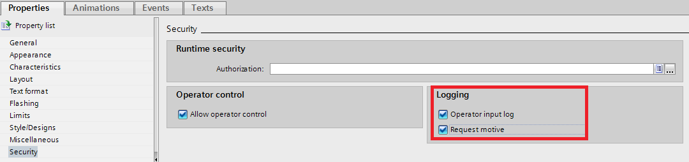

Niektóre z w/w obiektów posiadają również dodatkowy parametr (Request motive), który (poza możliwością automatycznej rejestracji zmian wartości powiązanej z nim zmiennej procesowej) pozwala również wprowadzić operatorowi dodatkowy komentarz, który może zawierać dla przykładu tekstowy opis powodu lub celu zmiany wartości danego parametru. 
Po zmodyfikowaniu wartości zmiennej przez obiekt z aktywnymi powyższymi parametrami, w pierwszym kroku system odpyta nas o przyczynę zmiany w formie okna informacyjnego:

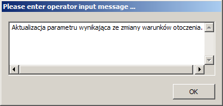

Po wprowadzeniu tekstu i zatwierdzeniu - w systemie alarmów WinCC zostanie wygenerowany komunikat widoczny na poniższym zrzucie ekranu. Klikając w znacznik "X" znajdujący się w kolumnie komentarza możemy podejrzeć bardziej szczegółowe informacje na temat zdarzenia - z uwzględnieniem wpisanej wcześniej uwagi przez operatora systemu. Komentarz taki może zostać zmodyfikowany lub dodany już po wystąpieniu danego zdarzenia. Jeśli dodatkowy znacznik Request motive nie zostanie aktywowany - powyższe okno nie ukaże się, a co za tym idzie nie zostanie udostępniona opcja wprowadzania komentarza w momencie wykonania zmiany wartości parametru przez dany obiekt. 

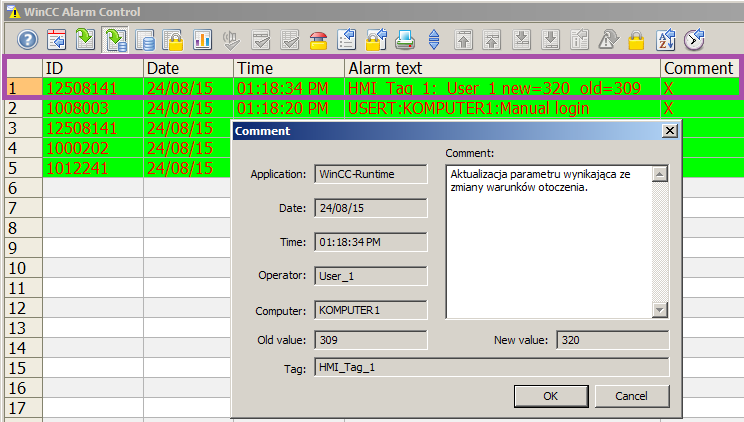

Konstrukcję samego komunikatu - treść oraz wartości parametrów możemy zaobserwować przez wzór dostępny na liście komunikatów alarmowych zdefiniowanych w środowisku inżynierskim (HMI alarms -> System events) zgodnie z poniższym zrzutem ekranu:

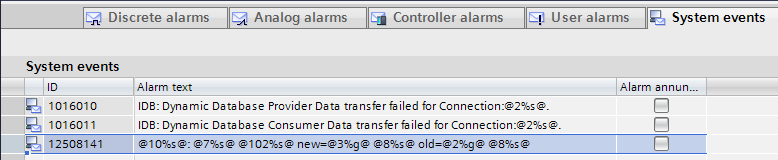

Jak można zaobserwować w pierwszym wierszu tabeli alarmów - wygenerowany systemowo komunikat składa się z nazwy zmiennej, która została zmodyfikowana **(HMI_Tag_1)**, nazwy użytkownika **(User_1)**, który w momencie zmiany był w systemie zalogowany, a także z wartości zmiennej po oraz przed zmianą (new/old). Systemowy wzorzec widoczny w definicji komunikatu 12508141 (jest stałe ID dla wszystkich zdarzeń opisywanych w tej sekcji - jest to istotne np. w sytuacji gdy potrzebne będzie stworzenie filtra pokazującego zdarzenia związane tylko ze zmianami parametrów przez opisywany mechanizm) składa się z wewnętrznych odnośników do parametrów jakie powinny się w jego treści znaleźć oraz z opisów tekstowych, które pozwalają identyfikować poszczególne bloki komunikatu. Jeśli chodzi o odniesienia do przestrzeni zmiennych WinCC - nie powinny one być modyfikowane, aczkolwiek treść tego komunikatu wygenerowanego systemowo może być zmieniona, np. jeśli chcielibyśmy zawrzeć bardziej szczegółowy opis tekstowy zdarzenia lub przetłumaczyć komunikat również na inne języki trybu Runtime.  
Zdarzenia systemowe, do których zalicza się nasz komunikat o zmianie wartości parametru podłączonego do wspomnianych wcześniej obiektów sterujących, przypisane są systemowo do klasy alarmów System i nie mogą być podłączone do żadnej innej klasy. W związku z powyższym wszelkie parametry komunikatu (np. ustawienia graficzne) powinny być określone właśnie w ustawieniach tej klasy komunikatów. 

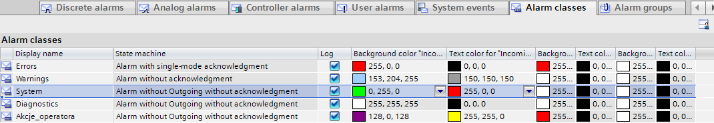

Klasa ta systemowo nie wymaga potwierdzenia, a także nie wymaga zmiany stanu na "nieaktywny" w celu usunięcia z listy aktywnych alarmów. W związku z powyższym alarmy z klasy systemowej nigdy nie będą widoczne na liście aktualnie aktywnych alarmów oraz nie będą wymagały akcji operatora - trafiają one bezpośrednio do archiwum i mogą zostać obejrzane tylko na liście widoku archiwalnego zdarzeń. Ułatwia to również zarządzanie tymi zdarzeniami w opisywanym zastosowaniu - brak konieczności wykonywania dodatkowych akcji przez operatora oraz możliwość wielokrotnego aktywowania tego samego zdarzenia bez potwierdzenia komunikatu. 

## Rejestrowanie akcji operatora

Powyższa część konfiguracji sprowadziła się do aktywacji systemowego mechanizmu pozwalającego na automatyczne rejestrowanie zmian wartości parametrów dla obiektów sterujących trybu Runtime. Drugim etapem jest dodanie funkcjonalności, która w podobnej formie, czyli w postaci komunikatu alarmowego zarejestruje również inne poczynania operatora, niekoniecznie związanie z modyfikacją parametrów systemu. Dla przykładu możemy rozpatrzyć możliwości rejestrowania akcji kliknięcia obiektu (np. przycisku), który informacje na temat wywoływanej funkcji będzie przechowywał w swoich parametrach (np. jego nazwa czy też opis tekstowy).
Funkcjonalność taką możemy uzyskać przez połączenie funkcji komunikatów alarmowych z prostym skryptem, który postaramy się stworzyć w taki sposób, aby był on uniwersalny dla wielu obiektów, do których może zostać przypisany.
W pierwszej jednak kolejności musimy utworzyć komunikat alarmowy, który będziemy dynamicznie parametryzować oraz generować. Aby to uczynić nawigujemy do edytora HMI alarms, wcześniej jednak będziemy potrzebować zmienne wewnętrzne, które będą zabezpieczać przestrzeń w komunikacie alarmowym przewidzianą na dynamiczne wstawienie odpowiednich wartości (fizycznie zmienne nie będą wykorzystywane, natomiast aby mechanizm funkcjonował poprawnie musimy je w treść wstawić, dlaczego - wyjaśnione zostanie w dalszej części instrukcji).
W naszym przykładzie chcielibyśmy, aby w treści podana została informacja na temat kliknięcia przycisku - nazwa klikniętego obiektu, jego opis, a także nazwa zalogowanego użytkownika oraz stempel czasowy. Ten ostatni zostanie dodany przez system automatycznie do zdarzenia, natomiast o pozostałe parametry będziemy musieli już zadbać sami. Nazwa aktualnie zalogowanego użytkownika przechowywana jest w zmiennej systemowej WinCC (@CurrentUser) więc tutaj skorzystamy również z gotowego rozwiązania. Zdefiniujmy więc pozostałe dwie zmienne, które będą przechowywać nazwę oraz opis obiektu, który będziemy analizować:

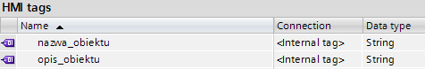

W tekście alarmu wprowadźmy interesującą nas formę komunikatu, np.:

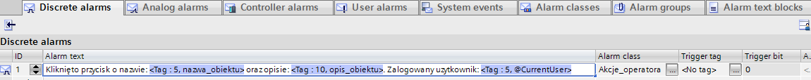

Aby dodać dynamiczne parametry do treści alarmu, musimy skorzystać ze wspomnianych zmiennych powiązanych (zdefiniowanych wcześniej), które wstawimy w treści tekstu informacyjnego. Aby to uczynić, a tym samym uzyskać efekt jak na powyższym zrzucie ekranu klikamy prawym przyciskiem w pole treści komunikatu (w trybie edycji), a następnie z menu podręcznego wybieramy opcję jak poniżej:

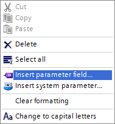

W oknie konfiguracji wybieramy oraz parametryzujemy zmienne. Wykonując ten zabieg trzykrotnie wstawimy nasze parametry, które będą dynamicznie wprowadzane do treści alarmu w momencie jego generowania. 
Aby kompilacja projektu przebiegła poprawnie oraz aby istniała możliwość wprowadzenia dynamicznie wartości zmiennych do treści komunikatu - musimy wykonać powyższe czynności. Pozostałe parametry komunikatu nie są wymagane - np. zmienna wyzwalająca (trigger tag) nie jest konieczna gdyż będziemy wyzwalać alarm programowo przez skrypt. Wystarczy więc w zasadzie przypisać utworzony komunikat do odpowiedniej klasy alarmów aby uzyskać odpowiednią metodę potwierdzenia oraz ewentualną wymaganą kolorystykę. Przykładowo:

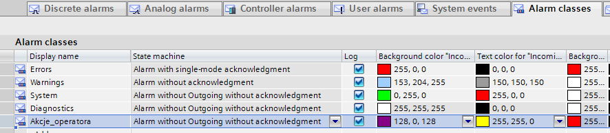

Ostatnim krokiem jest wygenerowanie oraz parametryzacja komunikatu alarmowego w momencie kliknięcia rozważanego przycisku. Zakładając, że nasz obiekt posiada jakąś znaczącą nazwę oraz opis (dla przykładu jak poniżej)

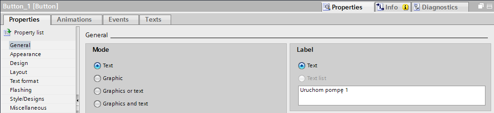

będziemy chcieli odczytać te właściwości (a także nazwę aktualnie zalogowanego użytkownika) i przepisać je jako parametry naszego alarmu zawarte w treści komunikatu (*Alarm text*). 
Zadanie to wykonuje następujący skrypt:

```vb

'deklaracja obiektów oraz parametrów                         
Dim objAlarm
Dim nazwa_uzytkownika

'odczyt nazwy aktualnie zalogowanego użytkownika ze zmiennej systemowej WinCC
nazwa_uzytkownika = SmartTags("@CurrentUser")

'deklaracja obiektu typu Alarm i przypisanie mu ID = 1 (za definicją w HMI alarms)
Set objAlarm = HMIRuntime.Alarms(1)

'ustawienie statusu komunikatu alarmowego na 1 - aktywny oraz przypisanie
'aktualnych wartości parametrów zawartych w jego treści
objAlarm.State = 1 '2 - nieaktywny; 5 - aktywny + komentarz
objAlarm.ProcessValues(1) = item.ObjectName 'nazwa obiektu
objAlarm.ProcessValues(2) = item.TextOff 'opis tekstowy przycisku
objAlarm.ProcessValues(3) = nazwa_uzytkownika 'nazwa zalogowanego użytkownika

'wygenerowanie sparametryzowanego powyżej zdarzenia
objAlarm.Create

```

Aby skonfigurować komunikat alarmowy z uwzględnieniem komentarza (analogicznie jak w pierwszej części dokumentu), który może być wprowadzony do skryptu np. przez zmienną lub systemowy input box (VBS) trzeba zadeklarować status tworzonego komunikatu na wartość 5 oraz dopisać parametr zdarzenia w formie `objAlarm.Comment = "<komentarz>"`.

Efektem wywołania powyższego skryptu po powiązaniu do ze zdarzeniem kliknięcia przycisku będzie zarejestrowanie następującego komunikatu alarmowego w systemowej bazie danych:

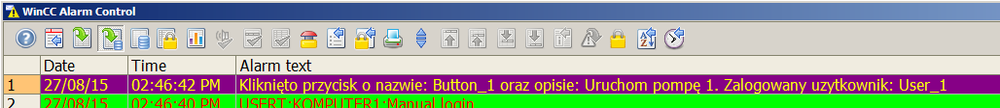

W podobny sposób możemy działać również dla każdego innego obiektu graficznego, ewentualnie trzeba będzie dostosować nazwy parametrów w skrypcie, które będziemy chcieli włączyć w treść komunikatu. Można by zastanowić się jeszcze nad dodaniem kolejnych właściwości, np. ekranu procesowego, na którym dany obiekt się znajduje lub obszaru jakiego dotyczy dana funkcja. Podobnie jak w poprzedniej części możemy wykonać filtrowanie, które wyświetli listę wymaganych komunikatów z danego obszaru lub z całej klasy akcji operatorów.

Przykład przygotowany został pod Windows 7x64 oraz WinCC Professional V13 SP1. Może być również swobodnie zaadoptowany w klasycznej wersji systemu SCADA – WinCC v7.x oraz innych wersji systemów operacyjnych.
	
Więcej informacji na temat konfiguracji systemu WinCC można uzyskać w regionalnych biurach sprzedaży Siemens lub  kontaktując się bezpośrednio z działem wsparcia technicznego Simatic.