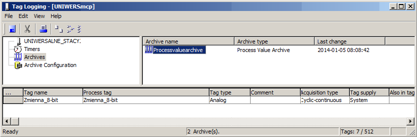
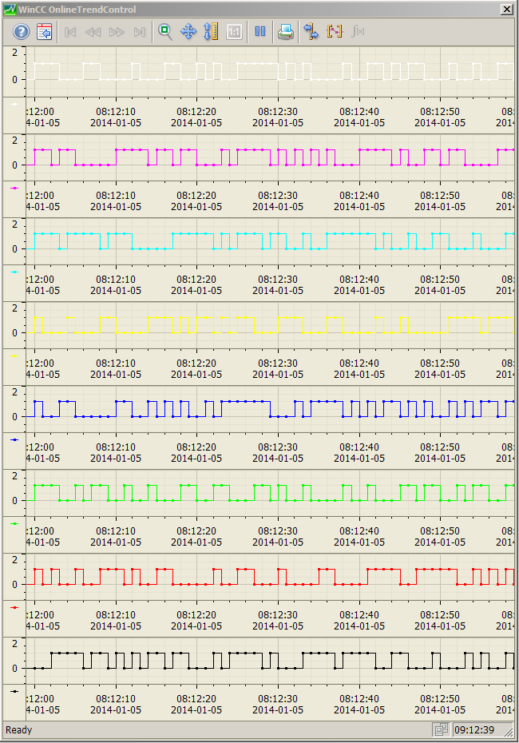

# Binarna prezentacja graficzna zmiennych archiwalnych WinCC V7.x

System `SCADA WinCC` posiada szerokie możliwości archiwizacji zmiennych procesowych. Korzystając z rozwiązań systemowych możemy symultanicznie gromadzić w bazie danych informacje pochodzące nawet ze 120 000 zmiennych. W zależności od wymagań projektowych możemy przeprowadzić archiwizację w rozmaitych formatach oraz zapisywać praktycznie niegraniczone pod względem formatu informacje. Część rozwiązań poza-systemowych w tym zakresie można odszukać w poniższych dokumentach opisujących przykładowe aplikacje:

- mFAQ.10.10.WinCC V7 Archiwizacja danych w plikach TXT oraz XLS
- mFAQ.10.11.WinCC V7 Wymiana informacji z bazą danych MS SQL Server
- mFAQ.10.19.WinCC Professional - Skryptowe audytowanie akcji operatora
- mFAQ.10.21.WinCC Professional - Dane użytkownika na systemowej kontrolce trendu

Rozwiązanie systemowe ma jednak niewątpliwie wiele zalet. Jest ono co prawda dodatkowo licencjonowane (jeśli ilość archiwizowanych zmiennych liczbowych przekroczy liczbę 512) aczkolwiek jest to mechanizm przygotowany do gwarantowanej współpracy bazy danych `MS SQL Server` z systemem wizualizacyjnym WinCC co zapewnia, iż archiwa będą bezpieczne, a także nie wystąpią żadne komplikacje, np. podczas migracji systemu do nowszej wersji bądź rozbudowy aplikacji. 

Podstawowy mechanizm archiwizacyjny pozwala na archiwizację wielu zmiennych procesowych, natomiast pewne funkcje zaawansowane dostępne są bądź przez pakiety opcjonalne, bądź przez zastosowanie rozwiązań użytkownika – np. w formie skryptów. Jedno z tych rozwiązań wymagane jest np. w przypadku konieczności archiwizowania zmiennej typu tekstowego `(string)` lub w przypadku, gdy chcielibyśmy wyświetlić w formie trendu przebieg poszczególnych bitów archiwizowanej zmiennej `(np. typu byte)`. Jeśli chodzi o zagadnienie pierwsze to można skorzystać z pakietu opcjonalnego `WinCC/UserArchive` bądź z wymienionych powyżej instrukcji FAQ. 

Drugi z wymienionych powyżej problemów, czyli kwestia prezentacji graficznej przebiegu składowych zmiennej archiwalnej może być również rozwiązany systemowo bądź przez funkcje użytkownika. Opcjonalne rozwiązanie systemowe zazwyczaj ma to do siebie, że wymaga zakupu dodatkowej licencji, tutaj nie jest tak do końca, gdyż `WinCC w pakiecie podstawowym RT zawiera pakiet na 512` zmiennych archiwalnych, więc ta ilość może być w zupełności wystarczająca. Problem jest tutaj jednak tego typu, iż chcąc wyświetlać na systemowej kontrolce trendu przebiegi poszczególnych bitów (np. zmiennej statusowej) musimy każdą zmienną potraktować, jako osobą pozycję w archiwum. W celu odczytania zmiennej nie będzie nam przyrastać ilość tagów gdyż w łatwy sposób możemy sobie rozbić długą zmienną na bity i przepisywać ich wartości do nielicencjonowanych zmiennych wewnętrznych. Już po stronie archiwum jednak nie ma takiego mechanizmu, więc w celu finalnej prezentacji graficznej musimy archiwizować każdą zmienną bitową niezależnie. Prowadzi to naturalnie do znacznego przyrostu ilości zmiennych archiwalnych, co w ostateczności może prowadzić do konieczności zakupu dodatkowych licencji na dane historyczne. W przypadku zaprezentowanego rozwiązania - dla klasycznej wersji systemu wizualizacji WinCC v7.x - potrzebna jest jedynie licencja na stosunkowo niedrogi pakiet dostępu do systemowej bazy danych – WinCC/ConnectivityPack. W przypadku platformy `TIA portal` – dla systemu `SCADA` licencja ta nie jest już wymagana gdyż zawiera się ona w podstawowym pakiecie Runtime.

W niniejszym dokumencie postaramy się więc zaprezentować w jaki sposób archiwizować zmienną dłuższą niż bit (np. typu byte), natomiast na systemowej kontrolce trendu wyświetlać przebieg w czasie każdego z bitów archiwizowanego parametru. 

## Konfiguracja

Przygotowanie takiego rozwiązania sprowadza się do wykonania kilku  kroków za pośrednictwem zintegrowanych edytorów `skryptów C lub VB.` W przypadku zadań jakie będą wymagane zdecydowanie wygodniej będzie tutaj skorzystać z kompilatora VBS:

- Odczyt odpowiedniego zakresu danych archiwalnych z systemowej bazy danych archiwalnych.
- Maskowanie archiwalnych wartości zmiennej historycznej w celu odczytu wartości poszczególnych bitów w jednostce czasu.
- Wpisane odczytanych informacji do systemowej kontrolki trendów WinCC OnlineTrendControl oraz odpowiednia jej konfiguracja.

W dalszej części dokumentu znajduje się opis oraz przykład konfiguracji poszczególnych kroków. W pierwszej kolejności przygotujmy jednak projekt w taki sposób, aby spełniał podstawowe wymagania naszego zagadnienia.

Zacznijmy od założenia projektu, utworzenia zmiennej procesowej np. 8-bitowej bez znaku oraz dodania jej do archiwum. Dodatkowo możemy określić interesujące nas parametry archiwizacji (np. cykl archiwizacji co 1 sekundę). Efektem powinno być archiwum procesowe w następującej formie:



Od strony trybu RT dodajmy sobie ekran procesowy a na nim wstawmy przycisk, który wywoła naszą funkcję docelową oraz kontrolkę trendu WinCC OnlineTrendControl, na której będziemy chcieli zaprezentować nasze przebiegi binarne. 

## Odczyt wartości zmiennej archiwalnej z systemowej bazy danych

W pierwszym kroku musimy skonfigurować skrypt, który połączy WinCC bezpośrednio z bazą danych `SQL Server` – konkretnie z systemowymi tabelami archiwizacji parametrów procesowych. Jest do tego przewidziany w systemie zakres funkcji skryptowych, który znacznie upraszcza odczyt danych z tego źródła. W przypadku klasycznego `WinCC v7.x` wymagany jest tutaj pakiet WinCC/ConnectivityPack do komunikacji poprzez interfejs programistyczny firmy Microsoft - `OLE DB`, natomiast w przypadku platformy `TIA portal` funkcje te zawarte są w podstawowym pakiecie konfiguracyjnym.
Jedynymi parametrami, jakie więc musimy wstępnie ustalić to przedział czasu, z jakiego chcemy odczytać wartości archiwizowanej zmiennej oraz oczywiście nazwę tegoż taga archiwalnego. Pierwsza część naszego skryptu może więc wyglądać następująco:

```vb

'deklaracja obiektów, zmiennych oraz stałych
Dim sCon, sSql, conn, oRs, oCom

'utworzenie stringa połączeniowego do bazy danych, zawiera nazwę providera, 
'oznaczenie bazy danych (można sprawdzić w MS SQL Server Management Studio) 
'oraz nazwę bazy źródłowej WinCC: <nazwa komputera>\WinCC
sCon = "Provider=WinCCOLEDBProvider.1;" + "Catalog=CC_UNIWERSA_14_01_03_08_56_21R;" + "Data Source=Komputer1\WinCC"

'zapytanie do bazy danych o zmienną archiwalną oraz przedział czasu (UTC!)
sSql = "TAG:R,'ProcessValueArchive\Zmienna_8-bit','2014-01-05 07:12:00.000','2014-01-05 07:13:00.00'"

'stworzenie obiektu interfejsu ADODB*
Set conn = CreateObject("ADODB.Connection")

'otwórz połączenie używając powyższych parametrów
conn.ConnectionString = sCon
conn.CursorLocation = 3
conn.Open

'stworzenie obiektu typu Recordset - wykorzystywanego do operowania danymi
'w bazie danych na poziomie rekordów.
Set oRs = CreateObject("ADODB.Recordset")
Set oCom = CreateObject("ADODB.Command")
oCom.CommandType = 1

'aktywuj zainicjalizowane wcześniej połączenie
Set oCom.ActiveConnection = conn

'przypisz tekst zapytania do bazy danych SQL Server
oCom.CommandText = sSql

'wyślij zapytanie do bazy danych, odbierz informacje
Set oRs = oCom.Execute

'sprawdź ilość odczytanych rekordów
Dim rec_nr
rec_nr = oRs.RecordCount

```
*ADOdb (Active Data Objects DataBase - Obiektowa Baza Danych) to interfejs pozwalający na komunikację z bazą danych. Pozwala on na komunikację pomiędzy skryptem (np. Visual Basic) a praktycznie dowolną z popularnych baz danych: MySQL, PostgreSQL, Oracle, Interbase, Microsoft SQL Server, Access, FoxPro, Sybase, ODBC i ADO.
Program nie łączy się bezpośrednio z bazą danych, lecz właśnie z ADODB, a interfejs komunikuje się z bazą danych we właściwy dla niej sposób. Dzięki temu oprogramowanie można przenosić na różne serwery baz danych bez zmian w kodzie.  

## Konfiguracja kontrolki trendów

Aby czytelnie przedstawić informacje odczytane z bazy danych dostosujmy systemową kontrolkę trendu w taki sposób, aby prezentowała ona przebiegi binarne w możliwie przejrzysty sposób. Zakładając, iż na jednej kontrolce trendu będziemy chcieli przedstawić wszystkie 8 przebiegów naszych binarnych składowych zmiennej analogowej – dodajmy do kontrolki 8 trendów (Trend 1, Trend 2, …), każdemu przyporządkujmy osobne okno trendu oraz dedykowaną oś czasu oraz oś wartości. Oś czasu będzie dynamicznie dostosowywana z poziomu skryptu w zależności od ilość odczytanych próbek archiwalnych. Osi wartości z kolei ustawmy statycznie na zakres (-1; 2), dzięki temu przebiegi będą w pełni widoczne i łatwiejsze w interpretacji dla operatora. Konfigurację kontrolki możemy również wykonać automatycznie bezpośrednio z poziomu skryptu, w przykładzie wykonamy ją jednak ręcznie przez parametryzację na poziomie edytora Graphics Designer. Wygląd końcowy kontrolki można zaobserwować na ostatnim zrzucie ekranu zamieszczonym w niniejszym dokumencie.

## Przetworzenie danych archiwalnych oraz ich prezentacja graficzna 

Etapem końcowym naszego projektu jest odpowiednie przetworzenie odczytanych danych historycznych oraz ich wyświetlenie na systemowej kontrolce trendu. Dalsza część naszego skryptu pełni więc następujące funkcje – wczytanie kontrolki jako obiekt `skryptu VB`, maskowanie zmiennej archiwalnej „Zmienna_8-bit” w celu odczytania historycznych wartości poszczególnych bitów składowych, a finalnie wpisanie ich przebiegów jako tablice próbek (data set) do systemowej kontrolki trendów `WinCC OnlineTrendControl`. Osi wartości zawierać będą stany poszczególnych bitów, natomiast na osi X będziemy prezentować czas zgodnie z początkiem wskazanego przedziału czasu oraz wybranym cyklem archiwizacji. Informacje te w naszym przykładzie podawane są statycznie, jako parametry natomiast takie dane również możemy odczytać automatycznie z konfiguracyjnej bazy danych WinCC.
Poniższy skrypt wykonuje wymienioną funkcjonalność: 

```vb
'deklaracja obiektów – kontrolki oraz poszczególnych trendów
Dim objTrendControl
Dim objTrend_1, objTrend_2, objTrend_3, objTrend_4, objTrend_5, objTrend_6, objTrend_7, objTrend_8

'deklaracja stałych – aktualny czas oraz indeks pętli
Dim dtCurrent, lIndex

'deklaracja tablic, do których zapisywane będą dane
Dim vValues_1(), vValues_2(), vValues_3(), vValues_4(), vValues_5(), vValues_6(), vValues_7(), vValues_8(), vTimeStamps()

'redefinicja tablic - wymagana w celu dynamicznej alokacji rozmiaru tablicy
'zgodnie z ilością próbek odczytanych z archiwum
Redim vValues_1(rec_nr), vValues_2(rec_nr), vValues_3(rec_nr), vValues_4(rec_nr), vValues_5(rec_nr), vValues_6(rec_nr), vValues_7(rec_nr), vValues_8(rec_nr), vTimeStamps(rec_nr)

'utworzenie obiektu kontrolki systemowej trendu – WinCCOnlineTrendControl
Set objTrendControl = ScreenItems("Control2")

'odczytanie, jako obiekt poszczególnych trendów skonfigurowanych dla kontrolki
Set objTrend_1 = objTrendControl.GetTrendCollection.Item("Trend 1")
Set objTrend_2 = objTrendControl.GetTrendCollection.Item("Trend 2")
Set objTrend_3 = objTrendControl.GetTrendCollection.Item("Trend 3")
Set objTrend_4 = objTrendControl.GetTrendCollection.Item("Trend 4")
Set objTrend_5 = objTrendControl.GetTrendCollection.Item("Trend 5")
Set objTrend_6 = objTrendControl.GetTrendCollection.Item("Trend 6")
Set objTrend_7 = objTrendControl.GetTrendCollection.Item("Trend 7")
Set objTrend_8 = objTrendControl.GetTrendCollection.Item("Trend 8")

'czas początkowy – w przykładzie podawany statycznie (powinien być zgodny z
'początkiem czasu zakresu odczytywanego z archiwum systemowego WinCC)
dtCurrent = CDate("2014-01-05 8:12:00")
'osi czasu dostosowane do ilości próbek - dla cyklu logowania 1s (60 pomiarów)
objTrendControl.TimeAxisName = "Time axis 1"
objTrendControl.TimeAxisTimeRangeFactor = rec_nr
objTrendControl.TimeAxisName = "Time axis 2"
objTrendControl.TimeAxisTimeRangeFactor = rec_nr
objTrendControl.TimeAxisName = "Time axis 3"
objTrendControl.TimeAxisTimeRangeFactor = rec_nr
objTrendControl.TimeAxisName = "Time axis 4"
objTrendControl.TimeAxisTimeRangeFactor = rec_nr
objTrendControl.TimeAxisName = "Time axis 5"
objTrendControl.TimeAxisTimeRangeFactor = rec_nr
objTrendControl.TimeAxisName = "Time axis 6"
objTrendControl.TimeAxisTimeRangeFactor = rec_nr
objTrendControl.TimeAxisName = "Time axis 7"
objTrendControl.TimeAxisTimeRangeFactor = rec_nr
objTrendControl.TimeAxisName = "Time axis 8"
objTrendControl.TimeAxisTimeRangeFactor = rec_nr

'deklaracja oraz wyzerowanie indeksu kolejnych próbek
Dim index
index = 0

'wpisanie - do przygotowanych tablic - wartości historycznych poszczególnych bitów
'zmiennej archiwalnej „Zmienna_8-bit” – maskowanie przez funkcję logiczną AND
While Not oRs.EOF

vValues_1(index) = Abs(CBool(oRs.Fields(2)And 2^0))
vValues_2(index) = Abs(CBool(oRs.Fields(2)And 2^1))
vValues_3(index) = Abs(CBool(oRs.Fields(2)And 2^2))
vValues_4(index) = Abs(CBool(oRs.Fields(2)And 2^3))
vValues_5(index) = Abs(CBool(oRs.Fields(2)And 2^4))
vValues_6(index) = Abs(CBool(oRs.Fields(2)And 2^5))
vValues_7(index) = Abs(CBool(oRs.Fields(2)And 2^6))
vValues_8(index) = Abs(CBool(oRs.Fields(2)And 2^7))

'stempel czasowy inkrementowany o 1 sekundę zgodnie z cyklem archiwizacji
vTimeStamps(index) = dtCurrent
dtCurrent = dtCurrent + CDate ("00:00:01")

'przejdź do następnego rekordu danych, zwiększ indeks tablic
oRs.MoveNext
index = index + 1
Wend

'zamknij połączenie z bazą danych
conn.Close

'wpisz dane z wypełnionych informacjami tabel do poszczególnych trendów
'przed wpisaniem wyczyść aktualną zawartość trendu
objTrend_1.RemoveData
objTrend_1.InsertData vValues_1, vTimeStamps
objTrend_2.RemoveData
objTrend_2.InsertData vValues_2, vTimeStamps
objTrend_3.RemoveData
objTrend_3.InsertData vValues_3, vTimeStamps
objTrend_4.RemoveData
objTrend_4.InsertData vValues_4, vTimeStamps
objTrend_5.RemoveData
objTrend_5.InsertData vValues_5, vTimeStamps
objTrend_6.RemoveData
objTrend_6.InsertData vValues_6, vTimeStamps
objTrend_7.RemoveData
objTrend_7.InsertData vValues_7, vTimeStamps
objTrend_8.RemoveData
objTrend_8.InsertData vValues_8, vTimeStamps

```

Powyższy skrypt VB w połączeniu z jego pierwszą częścią (opisaną wcześniej) może zostać przypisany np. do zdarzenia kliknięcia przycisku lub jakiejkolwiek innej akcji operatora w trybie Runtime. 

## Rezultat
Efektem końcowym konfiguracji naszej kontrolki oraz wywołania skryptu, z uwzględnieniem podstawowej konfiguracji struktury zmiennych oraz archiwum procesowego może wyglądać w następujący sposób:



Rozwiązanie takie bardzo przydatne może się okazać np. w przypadku zmiennych statusowych. Pozwala ono na znaczne zmniejszenie ilości archiwizowanych zmiennych licencyjnych, a co za tym idzie obniżyć koszt instalacji.

Przykład przygotowany został pod `Windows 7x64 oraz WinCC v7.2`. Może być również swobodnie zaadoptowany w przypadku platformy `TIA Portal` – WinCC Professional oraz dla innych systemów operacyjnych. W przypadku WinCC Professional nie jest wymagany pakiet dostępu do systemowej bazy danych WinCC/ConnectivityPack – w tym wypadku jest on integralną częścią pakietu RT.