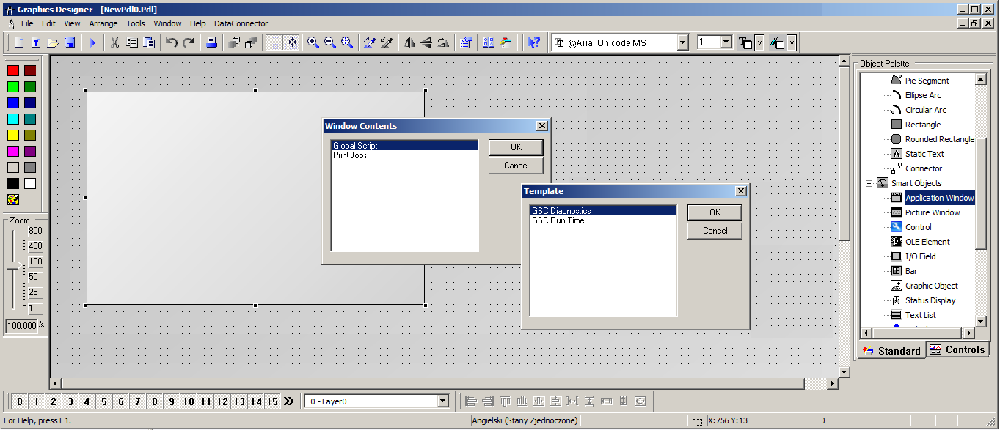
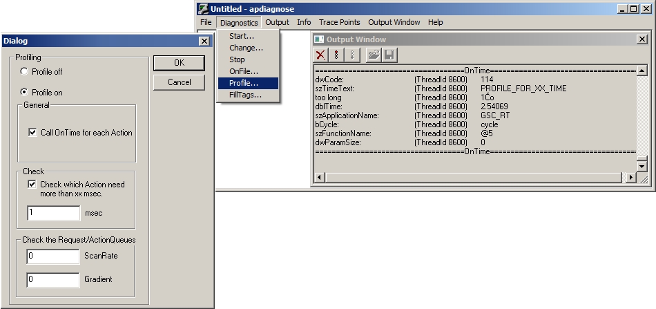
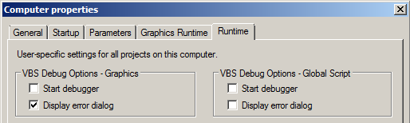
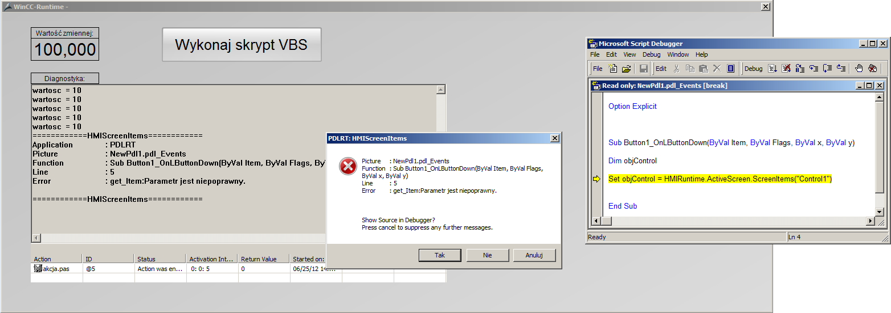

# WinCC v7.0 - Diagnostyka skryptów użytkownika 

System SCADA WinCC v7.0 w standardowym pakiecie zawiera pełne narzędzia programistyczne języków `ANSI C` oraz `VBS`. Wykorzystanie tych narzędzi w projektach wizualizacyjnych daje praktycznie nieograniczone możliwości wzbogacenia systemu w niezbędne użytkownikowi funkcje. 
Zastosowanie edytorów skryptów wiąże się jednak ze zwiększeniem prawdopodobieństwa wystąpienia błędów programowych w systemie `SCADA`, jako że użytkownik wprowadza funkcjonalność, która może w dużym stopniu odbiegać od standardowych elementów programowych aplikacji. W związku z tym bardzo ważne jest, aby programista przemyślał rozwiązania zastosowane w części skryptowej projektu, a także, aby zapewnił odpowiednią obsługę błędów, które mogą wystąpić.
Niezależnie jednak od tego, w jaki sposób skrypt został napisany – wystąpić mogą różnorodne problemy. Warto więc wiedzieć jak zdiagnozować błędy związane ze skryptami aby w jak najszybszy sposób wyeliminować źródło problemu.

System WinCC umożliwia tworzenie zarówno skryptów lokalnych (wywoływanych zdarzeniowo) jak i globalnych (wykonywanych cyklicznie). Najwięcej problemów przysparzają zazwyczaj skrypty globalne ze względu na cykliczne nawarstwianie błędów. Częstym rezultatem błędów wewnątrz skryptów globalnych jest spowolniona praca systemu bądź całkowite zawieszanie pracy aplikacji. Wynika to z faktu, iż przyczyna błędu w skrypcie zazwyczaj nie znika samoistnie, bądź znika po dłuższym okresie czasu – może to być np.:
* zbyt krótki czas cyklu wykonywania skryptu
* problem komunikacyjny
* niedostępność wartości zmiennej
* zmiana nazwy elementów graficznych czytanych przez skrypt

Skrypt, który nie zdąży się wykonać przed jego kolejnym wywołaniem zostaje zapisany w buforze skryptów niewykonanych, w momencie zapełnienia bufora system generuje błąd, co pociąga za sobą problemy wydajnościowe aplikacji bądź jej zatrzymanie. Typowy opis takiego problemu można znaleźć [tutaj](http://support.automation.siemens.com/WW/view/en/27061414)

Podobnie wygląda sytuacja z błędami w skryptach globalnych, dlatego ważne jest żeby operator już w momencie pierwszego wystąpienia błędu został poinformowany przez system o zaistnieniu takiego wyjątku.
Dalszy opis niniejszej instrukcji zostanie skoncentrowany na sposobach detekcji oraz diagnostyki problemów skryptów globalnych użytkownika w systemie WinCC.

## 1. Global Scripts Diagnostics – Application Window

Pierwszym krokiem, jaki użytkownik może wykonać w momencie problemów wydajnościowych z aplikacją jest sprawdzenie czy źródłem problemów rzeczywiście są skrypty użytkownika czy też przyczyny szukać gdzie indziej. 
W tym celu można bez ingerencji w projekt odłączyć moduł odpowiedzialny za obsługę skryptów globalnych, czyli Global Script Runtime. Wykonujemy ten zabieg otwierając projektowe ustawienia komputera z poziomu WinCC Explorer, a następnie odznaczając odpowiednią opcję w zakładce Startup.
Jeżeli aplikacja zacznie działać poprawnie (oczywiście z wyłączeniem zadań skryptowych) to już wiemy, że przyczyną problemów mogą być zadania zaprogramowane w skryptach.
Pomimo stwierdzenia tego podstawowego faktu, nadal nie posiadamy informacji na temat konkretnych przyczyn problemu. Jednym z podstawowych narzędzi WinCC umożliwiających wyświetlanie błędów generowanych przez kompilator skryptów w trybie Runtime jest kontrolka Application Window GSC Diagnostics. Element ten umożliwia nie tylko bezpośredni podgląd komunikatów systemowych generowanych w skryptach, ale również wyświetlanie tekstów oraz aktualnych wartości zmiennych skryptowych, np. przez funkcję `printf()`.
Aby wstawić okno diagnostyczne na synoptykę naszego projektu wizualizacji przechodzimy w przybornik obiektów graficznych Smart Objects → Application Window i wybieramy tryb prezentacji informacji diagnostycznych jak pokazano poniżej. 

Wybierając opcję GSC Run Time możemy wyświetlić również listę wykonywanych aktualnie skryptów globalnych wraz z ich statusami oraz parametrami. Kontrolka umożliwia również zatrzymanie oraz uruchomienie dowolnego skryptu bezpośrednio w trybie pracy systemu RT. 

## 2. µTool - APDiag

Rozszerzeniem funkcjonalności opisanej w punkcie pierwszym jest zewnętrzne narzędzie pakietu *WinCC – APDiag*. Aplikacja ta jest bogatszą wersją `Application Window GSC Diagnostic`. Daje ona nieco większe możliwości podglądu parametrów wykonywanych skryptów globalnych. 
Główną zaletą tego narzędzia jest możliwość sprawdzenia czasu wykonywania poszczególnych skryptów *VBS* oraz *ANSI C* (nie tylko globalnych) oraz monitoring przekroczenia dopuszczalnych progów czasowych. Ponadto program umożliwia sprawdzenie parametrów pracy skryptów, takich jak liczba wykonanych skryptów danym cyklu czy ilość zmiennych WinCC odpytywanych w skryptach.
Wszelkie informacje diagnostyczne mogą zostać automatycznie zapisane do pliku tekstowego.

Aby uruchomić aplikację należy odszukać plik wykonawczy na dysku twardym komputera. Domyślnie znajduje on się w folderze: 
`C:\Program Files\Siemens\WinCC\uTools`

W celu uruchomiania funkcjonalności narzędzia diagnostycznego w pierwszym kroku należy otworzyć okno prezentacji danych Output Window → Open. Następnie aktywować trzeba system analizy skryptów przez opcję Diagnostics → Profile…→ Profile on. Dodatkowo można skonfigurować narzędzie w sposób umożliwiający uzyskanie bezpośredniej informacji o przekroczeniu założonego czasu trwania danego skryptu.

Po tym zabiegu - zarówno w oknie Output Window narzędzia `APDiag` jak i w Application Window bezpośrednio na ekranie procesowym w trybie RT – po każdym wykonaniu dowolnego skryptu C lub VBS wyświetlone zostaną informacje na temat czasu trwania skryptu, jego rozmiaru czy też nazwy. Używając menu Info można uzyskać dodatkowe informacje na temat skryptów pracujących w tle aplikacji wizualizacyjnej.

Więcej informacji na temat możliwości diagnostyki skryptów poprzez aplikację `APDiag` - a także uzyskania informacji statusowych poprzez odpowiednią parametryzację funkcji `printf()` - znaleźć można na następującej stronie internetowej [wsparcia technicznego](http://support.automation.siemens.com/WW/view/en/22196775)

## 3. Microsoft Script Debugger - VBS

Kolejnym narzędziem diagnostycznym skryptów, które można wykorzystać w WinCC jest uproszczony kompilator MS Script Debugger. Jest to proste oprogramowanie służące do diagnostyki skryptów VBS. Aplikacja ta jest zawarta m.in. w pakiecie Internet Explorer lub MS Office, jednakże można ją również pobrać bezpłatnie ze stron internetowych [wsparcia technicznego](
http://www.microsoft.com/en-us/download/confirmation.aspx?id=22185)
 
Po zainstalowaniu dodatku należy skonfigurować odpowiednio jego obsługę przez system WinCC. Sprowadza się to w zasadzie do aktywacji powiązań pomiędzy kompilatorem a aplikacją, na której diagnostyka ma być dostępna. Aby to wykonać otwieramy okno właściwości stacji operatorskiej z poziomu WinCC Explorer i przechodzimy w zakładkę Runtime. 

W górnej części okna ustawień znajdują się elementy służące do aktywacji diagnostyki skryptów VBS poprzez narzędzie MS Script Debugger, które musi zostać uprzednio zainstalowane.
Opcję można aktywować osobno dla skryptów lokalnych zawartych bezpośrednio na ekranach procesowych (lewa część) oraz dla skryptów globalnych wykonywanych cyklicznie niezależnie od pracy systemu (część prawa). W obu przypadkach aktywacja opcji Start Debugger wynikuje startem narzędzia diagnostycznego wraz z uruchomieniem aplikacji w trybie RT. Zaznaczając natomiast jedynie opcję Display error dialog kompilator wyświetli w momencie wystąpienia wyjątku w skrypcie VBS - bezpośrednio na ekranie aktualnie przeglądanym przez użytkownika – okno dialogowe z informacją o błędzie oraz z zapytaniem czy otworzyć oprogramowanie do podglądu kodu źródłowego. Potwierdzając kompilator automatycznie otworzy skrypt, w którym miał miejsce błąd oraz wskaże linię w kodzie, na której wykonanie skryptu zostało wstrzymane. Przykładowe działanie pracy systemu widnieje na poniższym obrazie – odwołanie w skrypcie do nieistniejącego elementu graficznego.

Więcej informacji na temat wykorzystania narzędzia `MS Script Debugger` do wykrywania błędów skryptów stworzonych w systemie WinCC można znaleźć [tutaj](http://support.automation.siemens.com/WW/view/en/15294734)

Szerokie informacje na temat skryptów można odszukać w tej [instrukcji](http://support.automation.siemens.com/WW/view/en/37572697)

oraz w plikach pomocy systemu WinCC.