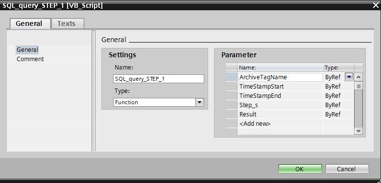
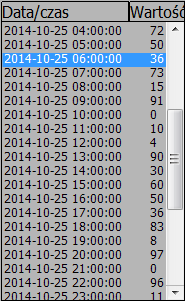
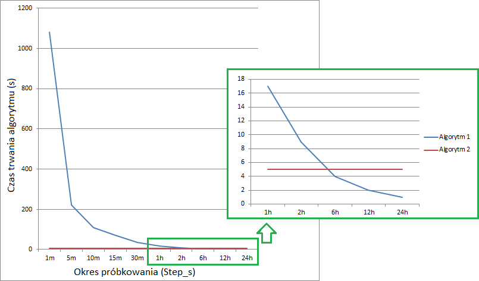

# WinCC Professional – Krokowy odczyt informacji z systemowej bazy danych SQL

Jedną z głównych funkcji systemu `SCADA` jest gromadzenie szerokorozumianych informacji oraz ich prezentacja w dogodnej dla użytkownika formie. System wizualizacji dokonuje akwizycji wybranych danych procesowych, przeprowadza ich ewentualną filtrację oraz analizę, a następnie prezentuje zgromadzone informacje na ekranie synoptycznym, np. w postaci trendu lub tabeli. Podsumowaniem pracy systemu jest okresowe generowanie raportu w formie drukowanej lub pliku o odpowiednim formacie.

Podstawowy mechanizm raportowania wizualizacji `Simatic WinCC Professional` pozwala tworzyć statyczne sprawozdania w ujęciu klasycznym, a więc obejmujące wybrane informacje w przedziale czasu od chwili jego wygenerowania do określonego okresu wstecz. `Raporty zmianowe`, dobowe czy miesięczne nie zawsze stanowią jednak najlepsze rozwiązanie zwłaszcza w przemyśle procesowym gdzie zadania są powtarzalne, a z punktu widzenia użytkownika istotne są dane związane z przebiegiem konkretnego cyklu procesu. Ramy czasowe nie zawsze są stałe oraz przewidywalne.

Wychodząc naprzeciw inżynierom oraz odbiorcom końcowym - system WinCC przewiduje pakiety opcjonalne umożliwiające praktycznie nieograniczoną personalizację raportów produkcyjnych. Użytkownicy pracujący z WinCC z pewnością dobrze znają dodatki takie jak `Data Monitor` czy `Connectivity Pack` umożliwiające odczyt informacji w różnorodnych formatach bezpośrednio z systemowej bazy danych WinCC. Funkcjonalność tych narzędzi – jest skierowana na raportowanie tradycyjne, czyli bazujące na odczycie zarchiwizowanych wartości parametrów pracy urządzeń w czasie. Rozwiązania te są bardzo funkcjonalne aczkolwiek ich zastosowanie może wiązać się z dużym nakładem pracy (np. skryptowej) lub kosztami licencji. 

W niniejszym dokumencie przedstawimy mechanizm, który pozwala odczytać informacje z archiwum procesowego, zawartego w systemowej bazie danych SQL Server. W przypadku rozwiązania klasycznego `(WinCC v7.x`) możliwość skorzystania z takiego rozwiązania wymaga dodatkowej licencji (`WinCC/Connectivity Pack`). W środowisku TIA Portal (WinCC Professional) licencja ta nie jest wymagana, a więc pakiet odpowiednich funkcji stał się w tym przypadku integralną częścią systemu wizualizacji. Konfiguracja nie jest specjalnie zaawansowana, aczkolwiek postaramy się ją możliwie w naszym przypadku uprościć i zademonstrować przykład działania. 

## Konfiguracja


Pakiet WinCC/Connectivity Pack jest biblioteką (zespołem funkcji), która pozwala na rozszerzenie możliwości komunikacyjnych aplikacji (`OPC, OLEDB`). Korzystając z interfejsu programistycznego `OLEDB` jesteśmy w stanie dostać się do danych zawartych w systemowej bazie danych archiwalnych WinCC (archiwum wartości procesowych oraz komunikatów alarmowych) z dowolnej aplikacji zewnętrznej. Bez odpowiednich funkcji nie jest to możliwe, gdyż systemowa baza danych jest zaszyfrowana i nie jest możliwy wgląd w jej zawartość przez narzędzia obsługujące bazę SQL lub bezpośrednio przez zapytanie w formie kwerendy SQL.
W naszym przykładzie potrzebne będzie wywołanie odpowiednich funkcji skryptowych i odpowiednia ich parametryzacja. Spróbujmy więc zrobić globalną funkcję w języku skryptów VB, która będzie odczytywać zakres informacji z archiwum procesowego oraz w jakiś sposób je przetwarzać, a użytkownikowi zwracać już przetworzoną wartość wyjściową. Funkcja musi przyjmować jako parametry zakres czasu, gdyż nie ma mechanizmu, który znajdzie w archiwum wartość najbliższą od wskazanego punktu w czasie. W niniejszym dokumencie będziemy chcieli wykonać odczyt informacji z systemowej bazy danych z określonym krokiem, np. pomiar co godzinę, co dzień czy co miesiąc. Jako bazową jednostkę czasu wyznaczającą odstęp naszych danych zastosujemy sekundę. Dla przykładu przedstawimy dwa alternatywne algorytmy wykonujące to samo zadanie aczkolwiek w inny sposób, co może się przydać w calach optymalizacji czasu odczytu informacji – zależnym od rozmiaru bazy danych oraz interesującego nas przedziału czasu.
Odczytane informacje będziemy chcieli przedstawić do wglądu użytkownika w trybie `Runtime` w formie tabelarycznej. Wykorzystamy w tym celu systemowy element dostępny w WinCC Professional – ListBox.

## 1. Dodanie oraz parametryzacja nowej funkcji VB

Poniżej przedstawiony zostanie opis tworzenia nowej funkcji na potrzeby naszego przykładu. Omówione zostaną również zaproponowane parametry.

### 1.1. Algorytm 1 – wielokrotne zapytanie do bazy danych SQL

W pierwszym kroku stworzymy nową funkcję, która będzie zawierała nasz program odczytu danych. Aby dodać nową funkcję nawigujemy w drzewku projektu WinCC Professional do pozycji `Scripts -> VB scripts -> Add new VB function`. Dla przykładu nazwijmy funkcję `SQL_query_STEP_1`. Następnie we właściwościach funkcji określimy jej interfejs przez zdefiniowanie parametrów:



Nasza funkcja przyjmuje następujące parametry:

**ArchiveTagName** – nazwa zmiennej archiwalnej, która uwzględnia nazwę archiwum oraz nazwę zmiennej procesowej w formacie `<nazwa archiwum>\<nazwa zmiennej>`, np. `”Data_Log_1\Zmienna_1”`. Parametr ujęty musi być w cudzysłowie gdyż przekazywany jest on w formie tekstowego ciągu znaków.

**TimeStampStart** – początek zakresu czasu, z którego dane mają być odczytane. `Format: YYYY-MM-DD HH:MM:SS`, np. `”2014-10-14 9:17:15”`. Parametr ujęty musi być w cudzysłowie gdyż przekazywany jest on w formie tekstowego ciągu znaków. Uwaga, dane w bazie SQL zapisywane są ze stemplem czasowym UTC, dlatego należy uwzględnić odpowiednie przesuniecie względem czasu lokalnego, w Polsce w zależności od tego czy będzie to czas letni czy zimowy przesunięcie będzie o dwie lub trzy godziny wstecz. 

**TimeStampEnd** – koniec zakresu czasu, z którego dane mają być odczytane. `Format: YYYY-MM-DD HH:MM:SS`, np. `”2014-10-14 9:19:15”`. Parametr ujęty musi być w cudzysłowie gdyż przekazywany jest on w formie tekstowego ciągu znaków. Uwaga, dane w bazie SQL zapisywane są ze stemplem czasowym `UTC`, dlatego należy uwzględnić odpowiednie przesuniecie względem czasu lokalnego, w Polsce w zależności od tego czy będzie to czas letni czy zimowy przesunięcie będzie o dwie lub trzy godziny wstecz. 

**Step_s** – krok z jakim chcemy próbkować naszą bazę danych. Podajemy w sekundach. Chcąc podać 1 dzień, możemy wprowadzić dla przykładu 24*3600. 

**Result** – wartości zwracana przez funkcję. W tym przypadku będzie to dwuwymiarowa tablica składająca się z dwóch kolumn uzupełnianych stemplem czasowym oraz wartością odczytywanej zmiennej. Ilość rekordów zależna będzie od przedziału czasu oraz kroku wybranych we wcześniejszych parametrach.

### 1.2. Algorytm 2 – jednokrotne przetwarzanie wyników pojedynczego zapytania do bazy danych SQL

Podobnie jak w punkcie 1.1. - stworzymy nową funkcję, która będzie zawierała nasz program odczytu danych. Aby dodać nową funkcję nawigujemy w drzewku projektu` WinCC Professional` do pozycji `Scripts -> VB scripts -> Add new VB function`. Drugą funkcję nazwijmy `SQL_query_STEP_2`. Parametry funkcji będą analogiczne jak w poprzednim przypadku.

## 2. Dodanie skryptu - logiki funkcji, opis algorytmów

Poniżej przedstawiony został opis zastosowanych algorytmów oraz skrypty VBS realizujące je w zakresie WinCC Professional.

### 2.1. Algorytm 1


Algorytm pierwszy działa na bazie wielokrotnego zapytania do bazy danych SQL. Mianowicie, odczytujemy początkowy stempel czasowy i odszukujemy pierwszą próbkę, którą napotkamy w bazie danych począwszy od wskazanego stempla czasowego. Każda następna próbka również jest pierwszym z pomiarów odszukanych w  danym zakresie czasu, aczkolwiek każdy kolejny zakres czasu, jest uszczuplony. Konkretnie data początku każdego kolejnego zapytania `SQL` jest przesunięta o wartość kroku, który podajemy przez parametr funkcji Step_s. Każde kolejne zapytanie, w zakresie naszego zakresu danych, jest więc generowane w obszarze mniejszej ilości danych. Co za tym idzie skracany będzie czas odczytu każdej kolejnej próbki. Pętla taka wykonywana jest tyle razy ile w zakresie będzie próbek, co również wynika bezpośrednio z zakresu czasu oraz kroku, który wskażemy w parametrze funkcji. Wykonujemy więc swego rodzaju skoki do danych we wskazanym zakresie.

Rozwiązanie takie ma swoje zalety, gdyż w przypadku bardzo dużej ilości danych, generowanie wielu zapytań SQL niweluje konieczność przeszukiwania całego zapytania jednokrotnie lub wiele razy – oba przypadki mogą okazać się bardzo czasochłonne. 

Bazując na nazwach parametrów, które zadeklarowaliśmy dla naszej funkcji `SQL_query_STEP_1` możemy wstawić jej zawartość aby wyglądała w zgodnie z wydrukiem znajdującym się poniżej:

``` vb
Function SQL_query_STEP_1(ByRef ArchiveTagName, ByRef TimeStampStart, ByRef TimeStampEnd, ByRef Step_s, ByRef Result)

'deklaracje zmiennych/stałych
Dim sCon
Dim sSql
Dim conn
Dim oRs
Dim oCom
Dim DBName
Dim ComputerName
Dim Samples_no
Dim i
Dim ResultsArray()

'oszacowanie maksymalnej ilości próbek zwracanych przez funkcję
Samples_no = Int(DateDiff("s", TimeStampStart, TimeStampEnd)/Step_s)

'dynamiczna deklaracja rozmiaru zwracanej tablicy
ReDim ResultsArray(2, Samples_no) 'wyniki stempel czasowy i wartosc

'odczyt nazwy bazy danych RT oraz nazwy komputera
DBName = SmartTags("@DatasourceNameRT")
ComputerName = SmartTags("@ServerName")

For i = 1 To (Samples_no)

	'wykonanie połączenia z systemową bazą danych
	sCon = "Provider=WinCCOLEDBProvider.1;" + "Catalog=" + DBName + ";" + "Data Source=" + ComputerName + "\WinCC"
	sSql = "TAG:R,'" & ArchiveTagName & "','" & TimeStampStart & ".000" & "', '" & TimeStampEnd & ".000" & "'"
		
	Set conn = CreateObject("ADODB.Connection")
	conn.ConnectionString = sCon
	conn.CursorLocation = 3
	conn.Open
			
	Set oRs = CreateObject("ADODB.Recordset")
	Set oCom = CreateObject("ADODB.Command")
	oCom.CommandType = 1
	Set oCom.ActiveConnection = conn
	oCom.CommandText = sSql

	'odczytanie informacji oraz przypisanie ich struktury do zmiennej	
	Set oRs = oCom.Execute

	'wyświetlenie wyniku w konsoli skryptów	
	HMIRuntime.Trace "Rekord_" & i & vbCrLf
	HMIRuntime.Trace "- data/czas: " & oRs.Fields(1) & vbCrLf & "- wartość: " & oRs.Fields(2) & vbCrLf
	HMIRuntime.Trace "--------------------------------------------------------" & vbCrLf
		
	'wpisanie do pierwszej kolumny zwracanej tablicy stempla czasowego (pierwszej odnalezionej próbki)
	ResultsArray(1, i) = oRs.Fields(1)
		
	'wpisanie do drugiej kolumny zwracanej tablicy wartości zmiennej (pierwszej odnalezionej próbki)
	ResultsArray(2, i) = oRs.Fields(2)
	
	'dodajemy nasz krok do daty początkowej i ponownie poszukujemy pierwszej próbki z zakresu
	TimeStampStart = DateAdd("s", Step_s, TimeStampStart)
		
Next

'przepisanie tablicy wyników do parametru zwracanego przez funkcję
Result = ResultsArray

End Function
```
### 2.2. Algorytm 2

Drugi algorytm działa nieco inaczej niż poprzednik. W tym wypadku zasada działania opiera się o wykonanie jednorazowego zapytania do systemowej bazy danych SQL, a następnie analizę tych danych zgodnie ze wskazanym w parametrze funkcji krokiem. Zakres informacji odczytywany jest jednokrotnie, a także algorytm funkcji jedynie jeden raz analizuje odczytane dane. Pętla funkcji przechodzi przez wszystkie stemple czasowe odczytanego zakresu rekordów w poszukiwaniu wpisu spełniającego warunek początkowy. Po jego odnalezieniu, rekord (stempel czasowy oraz wartość zmiennej) zostaje zapisany do wynikowej zmiennej - podobnie jak w poprzednim przypadku jest to dwuwymiarowa tablica zmiennych gdzie w dwóch kolumnach zbierane są informacje w formie stempla czasowego oraz wartości zmiennej. Po odnalezieniu próbki spełniającej kryterium daty/czasu – przesuwamy warunek o krok czasowy wskazany w parametrze funkcji `Step_`s, a następnie przeszukiwanie zakresu danych zostaje kontynuowane (nie zaczynamy od nowa, aby zoptymalizować czas wykonania `skryptu`) - zostaje poszukiwana próbka spełniająca nowy warunek. Taka pętla przetwarzana jest w zakresie wskazanego okresu czasu z uwzględnieniem odpowiedniego kroku.

Mechanizm taki zapewnia, iż niezależnie od wybranego kroku z jakim chcemy odczytać informacje ze wskazanego zakresu czasu, przetwarzanie skryptu zawsze zajmie porównywalną ilość czasu. Z drugiej zaś strony jeśli danych jest sporo, algorytm musi przejść przez wszystkie rekordy w celu sprawdzenia zgodności z podanym warunkiem. 

Bazując na nazwach parametrów, które zadeklarowaliśmy dla naszej funkcji `SQL_query_STEP_2` możemy wstawić jej zawartość aby wyglądała w zgodnie z wydrukiem znajdującym się poniżej:

``` vb

Function SQL_query_STEP_2(ByRef ArchiveTagName, ByRef TimeStampStart, ByRef TimeStampEnd, ByRef Step_s, ByRef Result)

'deklaracje zmiennych/stałych
Dim sCon
Dim sSql
Dim conn
Dim oRs
Dim oCom
Dim DBName
Dim ComputerName
Dim Samples_no
Dim i
Dim ResultsArray()
Dim TimeCondition

'oszacowanie maksymalnej ilości próbek zwracanych przez funkcję
Samples_no = Int(DateDiff("s", TimeStampStart, TimeStampEnd)/Step_s)

'dynamiczna deklaracja rozmiaru zwracanej tablicy
ReDim ResultsArray(2, Samples_no)

'odczyt nazwy bazy danych RT oraz nazwy komputera
DBName = SmartTags("@DatasourceNameRT")
ComputerName = SmartTags("@ServerName")

'wykonanie połączenia z systemową bazą danych
sCon = "Provider=WinCCOLEDBProvider.1;" + "Catalog=" + DBName + ";" + "Data Source=" + ComputerName + "\WinCC"
sSql = "TAG:R,'" & ArchiveTagName & "','" & TimeStampStart & ".000" & "', '" & TimeStampEnd & ".000" & "'"
	
Set conn = CreateObject("ADODB.Connection")
conn.ConnectionString = sCon
conn.CursorLocation = 3
conn.Open
			
Set oRs = CreateObject("ADODB.Recordset")
Set oCom = CreateObject("ADODB.Command")
oCom.CommandType = 1
Set oCom.ActiveConnection = conn
oCom.CommandText = sSql

'odczytanie informacji oraz przypisanie ich struktury do zmiennej		
Set oRs = oCom.Execute
			
'pierwszy warunek zapisu odczytanej próbki
TimeCondition = TimeStampStart
i = 1

'w pętli przeszukiwana będzie cały zakres danych odczytany z bazy SQL na podstawie wskazanych wartości parametrów
While Not oRs.EOF
	
'zapisz wynik jeśli data/czas jest większa bądź równa aktualnemu warunkowi	
If ((DateValue(oRs.Fields(1))>=DateValue(TimeCondition)) And (TimeValue(oRs.Fields(1))>=TimeValue(TimeCondition))) Then
			
	'wpisanie do pierwszej kolumny tablicy stempla czasowego (pierwszego po lub równego warunkowi)
	ResultsArray(1, i) = oRs.Fields(1)
	
	'wpisanie to drugiej kolumny wartości zmiennej zgodnej z warunkiem daty/czasu
	ResultsArray(2, i) = oRs.Fields(2)
			
	'tworzymy nowy warunek zapisania próbki			
	TimeCondition = DateAdd("s", Step_s, TimeCondition)
	i = i + 1
			
End If

'przejdź do kolejnego rekordu odczytanego zakresu	
oRs.MoveNext
		
Wend

'przepisanie tablicy wyników do parametru zwracanego przez funkcję
Result = ResultsArray

End Function
```

## 3. Wywołanie funkcji w projekcie WinCC oraz prezentacja wyników.

W kolejnym kroku przedstawimy prosty przykład wywołania naszych algorytmów w projekcie WinCC Professional na pracującym systemie (dane zgromadzone w systemowej bazie danych `SQL`). Postaramy się również wyświetlić zanalizowane informacje w sposób bardzo prostu oraz czytelny dla użytkownika. Wykorzystajmy w tym celu dwa przyciski, do wywołania funkcji oraz dwa elementy typu ListBox w celu wyświetlenia przefiltrowanych informacji

### 3.1. Algorytm 1

Do pierwszego z przycisków przypiszmy skrypt, który posłuży do wywołania pierwszej z naszych funkcji (`SQL_query_STEP_1`). Tablicę danych przez nią zwracaną wyświetlmy w obiekcie typu ListBox. Dane możemy zaprezentować na wiele innych sposobów, aczkolwiek ten jest łatwy w obsłudze, a także uwzględnia wykorzystanie systemowej kontrolki, co z pewnością gwarantuje kompatybilność wszystkich elementów i nie powinno przysporzyć problemów podczas konfiguracji oraz obsługi projektu. Przykładowy skrypt może wyglądać w następujący sposób:

``` vb
Sub OnClick(ByVal item)

'deklaracje zmiennych/stałych
Dim dane
Dim listbox_1
Dim ilosc_rekordow
Dim i

'wywołanie naszej funkcji oraz jej parametryzacja, przepisanie zwracanej tablicy do zmiennej
Call SQL_query_STEP_1("Data_Log_1\stan_licznika", "2014-10-24 14:00:00", "2014-10-26 14:00:00", 3600*24,  dane)


'wskazanie oraz przypisanie struktury obiektu ListBox do zmiennej w skrypcie
Set listbox_1 = HMIRuntime.Screens("Screen_1").ScreenItems("List box_1")

'sprawdzenie rozmiaru tablicy zwracanej przez naszą funkcję
ilosc_rekordow = UBound(dane, 2)

'deklaracja ilości widocznych wierszy obiektu ListBox
listbox_1.CountVisibleItems = ilosc_rekordow

'przepisanie zawartości tablicy zwracanej przez naszą funkcję do obiektu ListBox
For i = 1 To ilosc_rekordow
	listbox_1.Index = i
	listbox_1.Text = dane(1, i) & "       " & dane(2, i)
Next

End Sub
```

### 3.2. Algorytm 2

Do drugiego z przycisków przypiszmy skrypt, który posłuży do wywołania drugiej z naszych funkcji (`SQL_query_STEP_2`). Tablicę danych przez nią zwracaną wyświetlmy w drugim obiekcie typu `ListBox`, który uprzednio należy naturalnie umieścić na ekranie procesowym. Przykładowy skrypt może wyglądać w sposób analogiczny do poprzedniego rozwiązania:

``` vb
Sub OnClick(ByVal item)

'deklaracje zmiennych/stałych
Dim dane
Dim listbox_1
Dim ilosc_rekordow
Dim i

'wywołanie naszej funkcji oraz jej parametryzacja, przepisanie zwracanej tablicy do zmiennej
Call SQL_query_STEP_2("Data_Log_1\stan_licznika", "2014-10-24 14:00:00", "2014-10-26 14:00:00", 3600*24,  dane)


'wskazanie oraz przypisanie struktury obiektu ListBox do zmiennej w skrypcie
Set listbox_1 = HMIRuntime.Screens("Screen_1").ScreenItems("List box_2")

'sprawdzenie rozmiaru tablicy zwracanej przez naszą funkcję
ilosc_rekordow = UBound(dane, 2)

'deklaracja ilości widocznych wierszy obiektu ListBox
listbox_1.CountVisibleItems = ilosc_rekordow

'przepisanie zawartości tablicy zwracanej przez naszą funkcję do obiektu ListBox
For i = 1 To ilosc_rekordow
	listbox_1.Index = i
	listbox_1.Text = dane(1, i) & "       " & dane(2, i)
Next

End Sub
```

Informacje odczytane oraz przefiltrowane przez nasze funkcje mogą zostać zinterpretowane użytkownikowi systemu na wiele sposobów. Wynik może być bezpośrednio zapisany do zmiennej WinCC, może zostać wyświetlony w oknie typu   pop-up lub na ekranie procesowym przez odpowiednią kontrolkę, na przykład zgodnie z powyższym - `ListBox`. Funkcja - `SQL_query_STEP_1` dla przykładu - sama w sobie zyskała jeszcze dodatkowo kilka linijek kodu, które służą do wyświetlania informacji dla użytkownika w konsoli skryptów. A więc wywołanie naszej funkcji zawsze kończy się komunikatem, ewentualnie zostaniemy również przez system poinformowani o ewentualnych błędach, jakie wystąpiły. Aby wstawić do projektu konsolę skryptów, należy z przybornika obiektów przejść w grupę Controls i wstawić na ekran obiekt o nazwie `PrintJob/Script` diagnostics. Kontrolka nie wymaga parametryzacji, jedynie pozycjonowania na ekranie procesowym. Informacje wyjściowe ze skryptu zostaną w jej obszarze zaprezentowane automatycznie. Wywołując naszą funkcję system powinien wyświetlić więc zaraz po odczytaniu każdy z rekordów spełniający kryteria wyszukiwania. Format wyświetlania wygląda w następujący sposób:

```

  Rekord_1
  - data/czas: 2014-10-24 14:00:00
  - wartość: 1
  ---------------------------------
  Rekord_2
  - data/czas: 2014-10-24 15:00:00
  - wartość: 96
  ---------------------------------
  Rekord_3
  - data/czas: 2014-10-24 16:00:00
  - wartość: 11
  …

```


Dodatkowo nasze dane - zgodnie z zastosowaną metodą oraz skryptem - będą również przetransferowane do wstawionych wcześniej obiektów typu ListBox. W tym przypadku uzyskamy następujący rezultat:




Jeśli chcielibyśmy zaprezentować nasze dane wynikowe w postaci trendu, możemy w tym celu wykorzystać systemową kontrolę ActiveX – WinCCOnlineTrendControl. Jak wykonać taki zabieg opisane zostało w dokumencie: `WinCC V7 - Binarna prezentacja graficzna zmiennych archiwalnych`. Możemy również skorzystać z kontrolek `ActiveX/.NET` czy WPF dostawców trzecich, stworzyć swoją kontrolkę lub skonfigurować wyświetlanie przez inne elementy systemowe WinCC. 

## 4. Podsumowanie

Zastanówmy się jeszcze nad istotą tworzenia dwóch alternatywnych rozwiązań, wynikiem których jest ten sam zakres danych. Podstawową sprawą jest oczywiście optymalizacja czasu przetwarzania informacji. W przypadku dużej ilości danych może być on niewygodnie długi. Dlatego też zdecydowaliśmy się przygotować dwa przykładowe rozwiązania w celu oszacowania, które okaże się szybsze w konkretnej aplikacji. Otóż mogłoby się wydawać, iż algorytm drugi, który jedynie jednokrotnie przeszukuje odczytane informacje, zawsze będzie działał krócej niż algorytm pierwszy, gdzie konieczne jest wykonanie wielu zapytań do bazy danych, a zapytanie takie jest stosunkowo czasochłonne. Okazuje się jednak, iż w zależności od ilości przeszukiwanych informacji oraz od okresu próbkowania bardziej adekwatny może okazać się jeden lub drugi algorytm, a więc nie należy wykluczać na wstępnie żadnego z nich. Z pewnością spodziewamy się, iż algorytm drugi będzie miał mniej więcej stały czas wykonania, gdyż dane analizowane są zawsze w tej samej ilości. W przypadku pierwszego algorytmu można jednak spodziewać się, iż im większa ilość zapytań do bazy danych będzie generowana, tym dłużej będzie trwało przetwarzanie danych.
Wykonane testy przeprowadzone były na bazie danych składającej się z archiwum jednej zmiennej z okresu dwóch dni. Zmienna była typu Int oraz archiwizowana była cyklicznie co 500ms, daje nam to więc 345600 pomiarów do przetworzenia. Na poniższym wykresie przedstawione zostały wyniki zależności okresu próbkowania (parametr Step_s) od czasu trwania wykonania poszczególnych algorytmów.



Łatwo zauważyć, iż w naszym przypadku spełniają się przypuszczenia co do trendu czasów realizacji funkcji skryptów. Przeszukanie całego zakresu danych w przypadku algorytmu drugiego zajmuje ok. 5s, co potwierdzają testy, wynik nie jest zależny od kroku Step_s. W przypadku algorytmu pierwszego duża ilość zapytań znacznie wydłuża czas wykonania analizy. 
W związku z powyższym, dla naszego przykładu łatwo wyciągnąć wniosek, iż dla tej konkretnej bazy danych, dane przeszukiwane z krokiem powyżej 6h odczytane zostaną szybciej przy użyciu algorytmu pierwszego. Natomiast powyżej tego okresu próbkowania zdecydowanie lepiej sprawdzi się algorytm drugi. W zależności od zadania wizualizacji można więc rozważyć zastosowanie tego z algorytmów, który okaże się szybszy w konkretnym przypadku lub stworzyć funkcję, która będzie połączeniem dwóch analizowanych w niniejszym dokumencie algorytmów. W zależności od wartości parametru Step_s wywołać możemy algorytm pierwszy lub drugi. Trzeba zwrócić uwagę, iż dla każdej bazy danych granica ta może być inna. 

Z pewnością oba algorytmy nie są idealne i mogą wymagać usprawnienia oraz poprawek, są one jednak dobrą podstawą do wykonania zadań przeszukiwania systemowej bazy danych WinCC z uwzględnieniem analizy zebranych w niej danych.
Można również zastanowić się nad rozbudową naszych przykładowych funkcji w taki sposób, aby mogły odczytywać wiele zmiennych równocześnie lub aby wykonywane były jeszcze bardziej zaawansowane obliczenia, np. dodatkowe kalkulacje zakresu danych z określonym odstępem czasowym. 
Systemowa funkcja, którą wykorzystaliśmy w skrypcie w celu odczytu informacji z bazy danych, posiada znacznie więcej możliwości. Opis bardziej szczegółowych właściwości można odszukać w dokumentacji pakietu [Connectivity Pack](http://support.automation.siemens.com/WW/view/en/102768149)
Znajdą się tam również informacje na temat odczytu archiwalnych komunikatów alarmowych.

Idąc krok dalej moglibyśmy dynamicznie podawać parametry naszej funkcji, czyli nazwę zmiennej (np. wybieraną przez użytkownika z listy tekstowej), przedział czasu (np. przez kontrolkę MS wyboru daty/czasu tak jak opisane to zostało w dokumencie WinCC V7 Wymiana informacji z bazą danych `MS_SQL Server`) oraz parametr Step_s ze zmiennej `WinCC`. Taka dynamizacja pozwoli nam automatycznie pobierać odpowiednie informacje na podstawie stanu procesu/produkcji czy też innych czynników lub zmiennych.

Przykład został przygotowany w środowisku `WinCC Professional V12 SP1` pod `Windows 7x64`. Może on być jednak swobodnie zaadaptowany do klasycznej wersji `WinCC v7.x`. 

Więcej informacji na temat konfiguracji systemu` WinCC` można uzyskać w regionalnych biurach sprzedaży Siemens lub kontaktując się bezpośrednio z działem wsparcia technicznego Simatic.