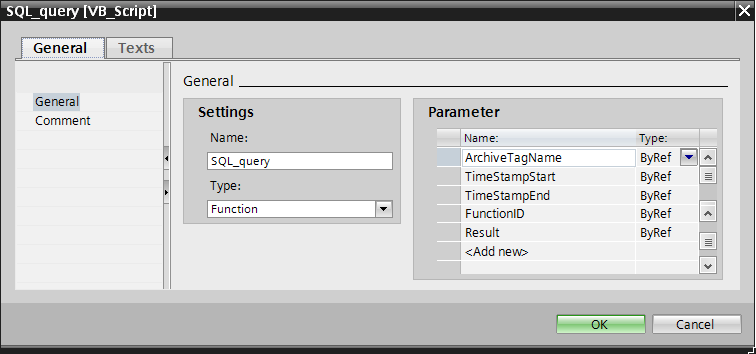
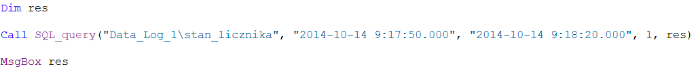

# WinCC Professional – Skryptowy odczyt informacji z systemowej bazy danych SQL

Jedną z głównych funkcji systemu `SCADA` jest gromadzenie szerokorozumianych informacji oraz ich prezentacja w dogodnej dla użytkownika formie. System wizualizacji dokonuje akwizycji wybranych danych procesowych, przeprowadza ich ewentualną filtrację oraz analizę, a następnie prezentuje zgromadzone informacje na ekranie synoptycznym, np. w postaci trendu lub tabeli. Podsumowaniem pracy systemu jest okresowe generowanie raportu w formie drukowanej lub pliku o odpowiednim formacie.

Podstawowy mechanizm raportowania wizualizacji `Simatic WinCC Professional` pozwala tworzyć statyczne sprawozdania w ujęciu klasycznym, a więc obejmujące wybrane informacje w przedziale czasu od chwili jego wygenerowania do określonego okresu wstecz. Raporty zmianowe, dobowe czy miesięczne nie zawsze stanowią jednak najlepsze rozwiązanie zwłaszcza w przemyśle procesowym gdzie zadania są powtarzalne, a z punktu widzenia użytkownika istotne są dane związane z przebiegiem konkretnego cyklu procesu. Ramy czasowe nie zawsze są stałe oraz przewidywalne.

Wychodząc naprzeciw inżynierom oraz odbiorcom końcowym - system `WinCC` przewiduje pakiety opcjonalne umożliwiające praktycznie nieograniczoną personalizację raportów produkcyjnych. Użytkownicy pracujący z `WinCC` z pewnością dobrze znają dodatki takie jak `Data Monitor` czy `Connectivity Pack` umożliwiające odczyt informacji w różnorodnych formatach bezpośrednio z systemowej bazy danych WinCC. Funkcjonalność tych narzędzi – jest skierowana na raportowanie tradycyjne, czyli bazujące na odczycie zarchiwizowanych wartości parametrów pracy urządzeń w czasie. Rozwiązania te są bardzo funkcjonalne aczkolwiek ich zastosowanie może wiązać się z dużym nakładem pracy (np. skryptowej) lub kosztami licencji. 

W niniejszym dokumencie przedstawimy mechanizm, który pozwala odczytać informacje z archiwum procesowego, zawartego w systemowej bazie danych `SQL Server`. W przypadku rozwiązania klasycznego `(WinCC v7.x)` możliwość skorzystania z takiego rozwiązania wymaga dodatkowej licencji `(WinCC/Connectivity Pack)`. W środowisku `TIA Portal (WinCC Professional)` licencja ta nie jest wymagana, a więc pakiet odpowiednich funkcji stał się w tym przypadku integralną częścią systemu wizualizacji. Konfiguracja nie jest specjalnie zaawansowana, aczkolwiek postaramy się ją możliwie w naszym przypadku uprościć i zademonstrować przykład działania. 

## Konfiguracja

Pakiet `WinCC/Connectivity Pack` jest biblioteką (zespołem funkcji), która pozwala na rozszerzenie możliwości komunikacyjnych aplikacji `(OPC, OLEDB)`. Korzystając z interfejsu programistycznego `OLEDB` jesteśmy w stanie dostać się do danych zawartych w systemowej bazie danych archiwalnych WinCC (archiwum wartości procesowych oraz komunikatów alarmowych) z dowolnej aplikacji zewnętrznej. Bez odpowiednich funkcji nie jest to możliwe, gdyż systemowa baza danych jest zaszyfrowana i nie jest możliwy wgląd w jej zawartość przez narzędzia obsługujące bazę SQL lub bezpośrednio przez zapytanie w formie kwerendy SQL.
W naszym przykładzie potrzebne będzie wywołanie odpowiednich funkcji skryptowych i odpowiednia ich parametryzacja. Spróbujmy więc zrobić globalną funkcję w języku skryptów VB, która będzie odczytywać zakres informacji z archiwum procesowego oraz w jakiś sposób je przetwarzać, a użytkownikowi zwracać już przetworzoną wartość wyjściową. Funkcja musi przyjmować jako parametry zakres czasu, gdyż nie ma mechanizmu, który znajdzie w archiwum wartość najbliższą od wskazanego punktu w czasie.

## Dodanie oraz parametryzacja nowej funkcji VB

W pierwszym kroku stworzymy nową funkcję, która będzie zawierała nasz program odczytu danych. Aby dodać nową funkcję nawigujemy w drzewku projektu `WinCC Professional dl pozycji Scripts -> VB scripts -> Add new VB function`. Dla przykładu nazwijmy funkcję `SQL_query`. Następnie we właściwościach funkcji określimy jej interfejs przez zdefiniowanie parametrów:



Nasza funkcja przyjmuje następujące parametry:

**ArchiveTagName** – nazwa zmiennej archiwalnej, która uwzględnia nazwę archiwum oraz nazwę zmiennej procesowej w formacie `<nazwa archiwum>\<nazwa zmiennej>`, np. `”Data_Log_1\Zmienna_1”`. Parametr ujęty musi być w cudzysłowie gdyż przekazywany jest on w formie tekstowego ciągu znaków.

**TimeStampStart** – początek zakresu czasu, z którego dane mają być odczytane. `Format: YYYY-MM-DD HH:MM:SS.MSMSMS`, np. `”2014-10-14 9:17:15.000”`. Parametr ujęty musi być w cudzysłowie gdyż przekazywany jest on w formie tekstowego ciągu znaków. Uwaga, dane w bazie `SQL` zapisywane są ze stemplem czasowym UTC, dlatego należy uwzględnić odpowiednie przesuniecie względem czasu lokalnego, w Polsce w zależności od tego czy będzie to czas letni czy zimowy przesunięcie będzie o dwie lub trzy godziny wstecz. 

**TimeStampEnd** – koniec zakresu czasu, z którego dane mają być odczytane. `Format: YYYY-MM-DD HH:MM:SS.MSMSMS`, np. `”2014-10-14 9:19:15.000”`. Parametr ujęty musi być w cudzysłowie gdyż przekazywany jest on w formie tekstowego ciągu znaków. Uwaga, dane w bazie SQL zapisywane są ze stemplem czasowym UTC, dlatego należy uwzględnić odpowiednie przesuniecie względem czasu lokalnego, w Polsce w zależności od tego czy będzie to czas letni czy zimowy przesunięcie będzie o dwie lub trzy godziny wstecz. 

**FunctionID** – funkcja, którą przygotujemy będzie posiadała możliwość wykonania obliczeń na odczytam zakresie rekordów danych. W zależności od wyboru wartości tego parametru wykonana zostanie jedna z operacji:

* 1 – funkcja zwróci pierwszą wartość wskazanej zmiennej z określonego zakresu czasu,
* 2 – funkcja zwróci ostatnią wartość wskazanej zmiennej z określonego zakresu czasu,
* 3 – funkcja zwróci maksymalną wartość odszukaną wśród odczytanych rekordów, 
* 4 – funkcja zwróci minimalną wartość odszukaną wśród odczytanych rekordów, 
* 5 – funkcja zwróci średnią wartość obliczoną na podstawie wszystkich odczytanych rekordów, 
* 6 – funkcja zwróci ilość rekordów odczytanych we wskazanym zakresie czasu.

**Result** – wartość liczbowa zwracana przez funkcję – w zależności od wybranej opcji parametru FunctionID (pierwsza, ostatnia, maksymalna, minimalna, średnia lub ilość).

## Dodanie skryptu - logiki funkcji

Bazując na nazwach parametrów, które zadeklarowaliśmy dla naszej funkcji SQL_query możemy wstawić jej zawartość, aby dla przykładu finalnie wyglądała w następujący sposób:

```vb

Function SQL_query(ByRef ArchiveTagName, ByRef TimeStampStart, ByRef TimeStampEnd, ByRef FunctionID, ByRef Result)

'Deklaracje zmiennych
Dim sCon
Dim sSql
Dim conn
Dim oRs
Dim oCom
Dim DBName
Dim ComputerName
Dim TempResult
Dim TempDateTime

'Odczyt nazwy komputera oraz bazy danych RT
DBName = SmartTags("@DatasourceNameRT")
ComputerName = SmartTags("@ServerName")

'Deklaracja stringa połączeniowego oraz zapytania do bazy danych przez funkcję systemową
sCon = "Provider=WinCCOLEDBProvider.1;" + "Catalog=" + DBName + ";" +"Data Source=" + ComputerName + "\WinCC"
sSql = "TAG:R,'" & ArchiveTagName & "','" & TimeStampStart & "', '" & TimeStampEnd & "'" 'Czas UTC

'Wyświetlenie ciągów połączeniowych w konsoli skryptów
HMIRuntime.Trace "Connection string: " & sCon & vbCrLf 
HMIRuntime.Trace "Kwerenda: " &sSql & vbCrLf & vbCrLf

'Stworzenie obiektu ADODB oraz wysłanie stringa połączeniowego, otwarcie połączenia 
Set conn = CreateObject("ADODB.Connection")
conn.ConnectionString = sCon
conn.CursorLocation = 3
conn.Open

'Wysłanie kwerendy do bazy danych przez funkcję systemową
Set oRs = CreateObject("ADODB.Recordset")
Set oCom = CreateObject("ADODB.Command")
oCom.CommandType = 1
Set oCom.ActiveConnection = conn
oCom.CommandText = sSql


'Odczyt rekordów z bazy danych SQL
Set oRs = oCom.Execute


'Funkcja 1 – odczyt pierwszej wartości zmiennej ze wskazanego zakresu czasu
If FunctionID = 1 Then
	
	Result = oRs.Fields(2)

    'Wyświetlenie informacji w konsoli skryptów
	HMIRuntime.Trace "Pierwszy rekord z zakresu: " & vbCrLf
	HMIRuntime.Trace "- data/czas: " & oRs.Fields(1) & vbCrLf & "- wartość: " & oRs.Fields(2) & vbCrLf
	HMIRuntime.Trace "--------------------------------------------------------" & vbCrLf


'Funkcja 2 - odczyt ostatniej wartości zmiennej ze wskazanego zakresu czasu
ElseIf FunctionID = 2 Then
	
	oRs.MoveLast
	Result = oRs.Fields(2)

    'Wyświetlenie informacji w konsoli skryptów
	HMIRuntime.Trace "Ostatni rekord z zakresu: " & vbCrLf
	HMIRuntime.Trace "- data/czas: " & oRs.Fields(1) & vbCrLf & "- wartość: " & oRs.Fields(2) & vbCrLf
	HMIRuntime.Trace "--------------------------------------------------------" & vbCrLf
	

'Funkcja 3 – wskazanie maksymalnej wartości zmiennej ze wskazanego zakresu czasu
ElseIf FunctionID = 3 Then

	TempResult = oRs.Fields(2)
	TempDateTime = oRs.Fields(1)
	
	While Not oRs.EOF
		
		If oRs.Fields(2) > TempResult Then
			TempResult = oRs.Fields(2)
			TempDateTime = oRs.Fields(1)
		End If
		
		oRs.MoveNext
		
	Wend
	
	Result = TempResult
	
'Wyświetlenie informacji w konsoli skryptów
HMIRuntime.Trace "Maksymalna wartość z zakresu: " & vbCrLf 
HMIRuntime.Trace "- data/czas (pierwszego wystąpienia): " & TempDateTime & vbCrLf & "- wartość: " & TempResult & vbCrLf
HMIRuntime.Trace "--------------------------------------------------------" & vbCrLf


'Funkcja 4 – wskazanie minimalnej wartości zmiennej ze wskazanego zakresu czasu
ElseIf FunctionID = 4 Then

	TempResult = oRs.Fields(2)
	TempDateTime = oRs.Fields(1)
	
	While Not oRs.EOF
		
		If oRs.Fields(2) < TempResult Then
			TempResult = oRs.Fields(2)
			TempDateTime = oRs.Fields(1)
		End If
		
		oRs.MoveNext
		
	Wend
	
	Result = TempResult


'Wyświetlenie informacji w konsoli skryptów
HMIRuntime.Trace "Minimalna wartość z zakresu: " & vbCrLf 
HMIRuntime.Trace "- data/czas (pierwszego wystąpienia): " & TempDateTime & vbCrLf & "- wartość: " & TempResult & vbCrLf
HMIRuntime.Trace "--------------------------------------------------------" & vbCrLf


'Funkcja 5 – obliczenie wartości średniej zmiennej ze wskazanego zakresu czasu
ElseIf FunctionID = 5 Then

	TempResult = 0
	While Not oRs.EOF
		TempResult = TempResult + oRs.Fields(2)
		oRs.MoveNext
	Wend
	
	Result = TempResult / oRs.RecordCount

    'Wyświetlenie informacji w konsoli skryptów
	HMIRuntime.Trace "Średnia wartość z zakresu: " & Result & vbCrLf
	HMIRuntime.Trace "--------------------------------------------------------" & vbCrLf
	

'Funkcja 6 – zliczenie ilości odczytanych rekordów ze wskazanego zakresu czasu
ElseIf FunctionID = 6 Then

	Result = oRs.RecordCount

    'Wyświetlenie informacji w konsoli skryptów
	HMIRuntime.Trace "Ilość rekordów w zakresie: " & Result & vbCrLf
	HMIRuntime.Trace "--------------------------------------------------------" & vbCrLf


'Niepoprawny numer funkcji	
Else 
	
    'Wyświetlenie informacji w konsoli skryptów
	HMIRuntime.Trace "Zły numer funkcji"
	
End If
	
'zamknięcie połączenia z bazą danych	
conn.Close

End Function

```

## Wywołanie funkcji w projekcie WinCC

Kolejnym krokiem jest wywołanie naszej funkcji z interesującymi nas parametrami. Funkcję możemy przypisać np. do zdarzenia kliknięcia przycisku. Wybierając zdarzenie VB wywołanie może wyglądać w następujący sposób: 



Gdzie do zmiennej **res** przypisana zostanie wartość zwracana przez naszą funkcję, a następnie zostanie ona wyświetlona w systemowym oknie pop-up (funkcja MsgBox). W naszym przykładzie archiwum procesowe nosi nazwę Data_Log_1, natomiast interesująca nas zmienna to stan_licznika, dlatego zgodnie z wcześniejszymi wytycznymi pierwszy parametr funkcji wygląda jak powyżej. Kolejne dwa to stemple czasowe początku i końca interesującego nas przedziału czasu. Przedostatni parametr to numer funkcji zgodnie z opisem.
Funkcja może zostać wywołana również jako zdarzenie systemowe z listy instrukcji, także po stworzeniu naszego kodu, nie musimy dalej korzystać ze skryptów.

## Wyświetlanie danych

Informacje odczytane oraz obliczone przez naszą funkcję mogą zostać zinterpretowane na wiele sposobów. Wynik może być bezpośrednio zapisany do zmiennej WinCC, może zostać wyświetlony w oknie typu pop-up lub na ekranie procesowym. Funkcja sama w sobie zyskała jeszcze dodatkowo kilka linijek kodu, które służą do wyświetlania informacji dla użytkownika w konsoli skryptów. A więc wywołanie naszej funkcji zawsze kończy się komunikatem, ewentualnie zostaniemy również przez system poinformowani o ewentualnych błędach, jakie wystąpiły. Aby wstawić do projektu konsolę skryptów, należy z przybornika obiektów przejść w grupę Controls i wstawić na ekran obiekt o nazwie PrintJob/Script diagnostics. Kontrolka nie wymaga parametryzacji, jedynie pozycjonowania na ekranie procesowym. Informacje wyjściowe ze skryptu zostaną w jej obszarze zaprezentowane automatycznie. Wywołując naszą funkcję system powinien wyświetlić więc nazwę stringa połączeniowego bazy danych, ciąg utworzonej kwerendy oraz wynik pracy funkcji czyli zwracaną wartość wraz z  ewentualnym stemplem czasowym próbki. Przykład wywołania poszczególnych funkcji poniżej:

```
Connection string:Provider=WinCCOLEDBProvider.1; Catalog=CC_HMI_F4G9_14_10_14_11_16_05R; Data Source=KOMPUTER1\WinCC
Kwerenda: TAG:R,'Data_Log_1\stan_licznika','2014-10-14 9:17:50.000', '2014-10-14 9:18:20.000'

Pierwszy rekord z zakresu: 
- data/czas: 2014-10-14 09:17:50
- wartość: 14
--------------------------------------------------------
Ostatni rekord z zakresu: 
- data/czas: 2014-10-14 09:18:19
- wartość: 55
--------------------------------------------------------
Maksymalna wartość z zakresu: 
- data/czas (pierwszego wystąpienia): 2014-10-14 09:18:15
- wartość: 83
--------------------------------------------------------
Minimalna wartość z zakresu: 
- data/czas (pierwszego wystąpienia): 2014-10-14 09:17:57
- wartość: 10
--------------------------------------------------------
Średnia wartość z zakresu: 49,1333333333333
--------------------------------------------------------
Ilość rekordów w zakresie: 30
--------------------------------------------------------
```

## Podsumowanie

Informacje odczytane w ten sposób możemy wyświetlić na ekranie procesowym np. przez zmienne wewnętrzne, lub w kontrolce ActiveX, informacje na ten temat można odszukać w dokumentach:
* WinCC V7 - Wymiana informacji z bazą danych MS_SQL Server
* WinCC V7 - Binarna prezentacja graficzna zmiennych archiwalnych. 
Można również zastanowić się nad rozbudową naszej przykładowej funkcji w taki sposób, aby mogła odczytywać wiele zmiennych równocześnie, aby zwracała tablicę wartości lub aby wykonywane były jeszcze bardziej zaawansowane obliczenia, np. inne kalkulacje oraz próbkowanie z określonym odstępem czasowym. Systemowa funkcja, którą wykorzystaliśmy w skrypcie w celu odczytu informacji z bazy danych, posiada znacznie więcej możliwości. Opis bardziej szczegółowych właściwości można odszukać w dokumentacji pakietu [Connectivity Pack](http://support.automation.siemens.com/WW/view/en/102768149).

Znajdą się tam również informacje na temat odczytu archiwalnych komunikatów alarmowych.

Idąc krok dalej moglibyśmy dynamicznie podawać parametry naszej funkcji, czyli nazwę zmiennej (np. wybieraną przez użytkownika z listy tekstowej), przedział czasu (np. przez kontrolkę MS wyboru daty/czasu tak jak opisane to zostało w dokumencie `WinCC V7` Wymiana informacji z bazą danych `MS_SQL Server`)` oraz numer funkcji ze zmiennej WinCC. Taka dynamizacja pozwoli nam automatycznie pobierać odpowiednie informacje na podstawie stanu procesu/produkcji czy też innych czynników lub zmiennych.

Przykład został przygotowany w środowisku` WinCC Professional V12 SP1` pod `Windows 7x64`. Może on być jednak swobodnie zaadoptowany do klasycznej wersji `WinCC v7.x`. 

Więcej informacji na temat konfiguracji systemu WinCC można uzyskać w regionalnych biurach sprzedaży Siemens lub  kontaktując się bezpośrednio z działem wsparcia technicznego Simatic.
