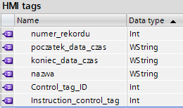
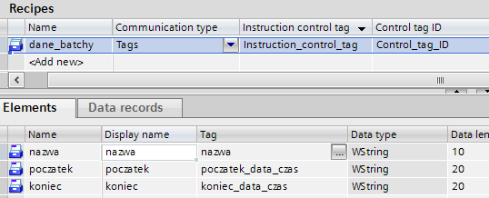
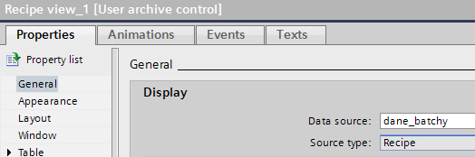
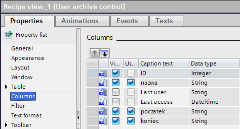
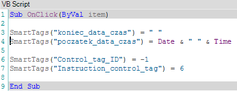
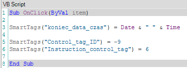
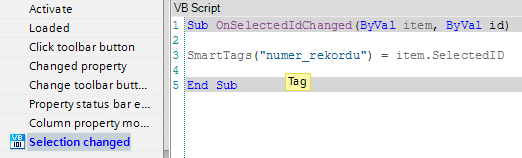
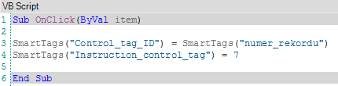
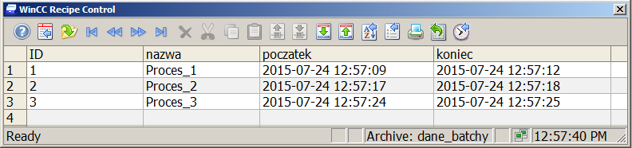

# WinCC Professional - Wykorzystanie mechanizmu receptur w celu raportowania cyklu procesowego

Niniejszy dokument jest uzupełnieniem publikacji **WinCC Professional - Raporty dynamiczne**, w którym przedstawiona została metodologia postępowania w celu stworzenia sprawozdania produkcyjnego gdzie przedział czasu raportowanego okresu podawany jest swobodnie przez operatora z poziomu trybu pracy aplikacji. 

## Zadanie

W poniższym dokumencie będziemy chcieli odnieść się do zagadnienia raportowania zadaniowego,  czyli takiego, w którym interesować nas będzie przedział czasu od momentu rozpoczęcia danego zadania produkcyjnego (czy też procesu) do jego zakończenia. Jest to mechanizm nieco odmienny od standardowego - ciągłego - archiwum i jest on dostępny w bardzo rozbudowanej formie za pomocą dodatku `PM-Quality`, o którym można przeczytać więcej w dokumencie **WinCC V7 - Konfiguracja pakietu PM-Quality**.
My będziemy chcieli przedstawić bardzo prosty mechanizm, który pozwoli przynajmniej uzyskać namiastkę raportowania batchowego - aczkolwiek w wielu przypadkach taka podstawowa funkcjonalność okazuje się być w zupełności wystarczająca. Algorytm opisany w niniejszej instrukcji przewiduje zastosowanie systemowego mechanizmu archiwizacji alarmów oraz zmiennych procesowych w `SQL Server`. Do przechowywania nadrzędnych informacji o procesie - np. nazwa, data rozpoczęcia oraz zakończenia, które posłużą do parametryzacji sprawozdania - wykorzystamy moduł receptur `(Recipes)`, pozwalający na bezpiecznie przechowywanie rekordów danych użytkownika w systemowej bazie danych. Alternatywą jest zastosowanie zewnętrznego pliku `(np. XLS/CSV)` lub własnej bazy danych. Rozwiązania takie będą jednak znacznie bardziej skomplikowane w implementacji, diagnostyce oraz obsłudze. 

## Konfiguracja

Zadanie tworzenia rekordów danych użytkownika w bazie danych receptur (zwanej również User Archive) można zrealizować na trzy sposoby:

* wywołując zapis do bazy danych ręcznie z poziomu dostępnych funkcji paska narzędziowego kontrolki `ActiveX (Recipe view)`

* wykonując odpowiednie zarządzanie funkcjami systemu przez tzw. zmienne sterujące

* wykorzystując mechanizm skryptów (zaawansowane funkcje C dedykowane do obsługi bazy danych użytkownika - `User archive`)

Rozwiązaniem optymalnym dla naszego zagadnienia (pod kątem inżynieringu oraz funkcjonalności) jest opcja druga, która pozwoli nam zarządzać z poziomu zdarzeń zewnętrznych (np. funkcji systemowych lub skryptów) bazą danych User archive bez konieczności tworzenia zaawansowanych funkcji skryptowych `ANSI C`. 

Bardziej szczegółowe informacje dotyczące możliwości bazy danych receptur można odszukać w tematach pomocy system `TIA Portal` (`Visualize process -> Working with recipes`).

Pierwszym krokiem w konfiguracji naszej funkcjonalności jest skonfigurowanie standardowego mechanizmu archiwizacji danych (alarmy/zmienne procesowe). Na tym etapie zakładamy, że dane w projekcie są archiwizowane w sposób wymagany w projekcie, ma natomiast zajmiemy się jedynie zadaniem stworzenia bazy danych stempli czasowych oraz nazw procesów, które pozwolą nam wykonać raport danego cyklu produkcyjnego przez wybranie odpowiedniej pozycji wśród rekordów danych wyświetlanych w formie tabelarycznej. 
Zaczniemy więc od utworzenia schematu bazy danych, do której w/w informacje będą trafiać. Założymy tutaj podstawowe informacje jakimi będą - nazwa procesu, data/czas jego rozpoczęcia oraz zakończenia. Jako, iż naszym interfejsem pomiędzy trybem Runtime a bazą danych będzie mechanizm receptur, będziemy również potrzebować zmiennych do wymiany danych (mogą być to zmienne wewnętrzne `WinCC`) oraz zmiennych sterujących do obsługi funkcji zapisu/odczytu danych przez zdarzenia wewnętrzne. Załóżmy sobie następujące zmienne wewnętrzne w strukturze tagów WinCC:

* **nazwa** - posłuży nam do przypisywania nazwy procesu,
* **początek_data_czas** - przechowywać będzie w formie ciągu znaków datę/czas rozpoczęcia procesu (typ DateTime nie jest dozwolony w mechanizmie receptur),
* **koniec_data_czas** - stempel czasowy zakończenia procesu,
* **Control_tag_ID** - zmienna sterująca receptur, przechowywać będzie ID rekordu, który będziemy odczytywać,
* **Instruction_control_tag** - zmienna sterująca determinująca funkcję jaką będziemy chcieli wykonać na rekordzie o określonym ID (zapis/odczyt/usunięcie).

Następnie w edytorze Recipes stworzymy strukturę tablicy danych (recepturę) oraz podłączymy nasze zmienne sterujące do obsługi funkcji bazy danych zgodnie z poniższym zrzutem ekranu:

Po zdefiniowaniu konstrukcji bazy danych możemy przejść do kolejnego kroku jakim jest wywołanie kontrolki receptur `(Recipe view)` na ekranie procesowym oraz podłączenie do niej naszej konfiguracji `(dane_batchy)`:

W ustawieniach kontrolki możemy dostosować jeszcze widok w taki sposób aby wyświetlane były tylko interesujące nas informacje (z pominięciem systemowych kolumn, które widoczne są domyślnie):

Pozostaje zatem zdefiniowanie zdarzeń, które pozwolą nam zarządzać zawartością bazy danych z poziomu trybu Runtime. W jaki sposób funkcje te będą generowane należy przemyśleć z uwzględnieniem wymogów projektu, natomiast pomijając fakt ich generowania - potrzebne nam w przykładzie będą następujące zdarzenia:

* dopisanie nowego rekordu do bazy danych (nowy proces - nazwa + stempel czasowy jego rozpoczęcia). 
W tym celu można zastosować następujący skrypt, który ustawiając wartości zmiennych sterujących utworzy kolejny rekord w bazie danych User archive  oraz przypisze do naszych parametrów aktualne wartości zmiennych jakie będą nam potrzebne:

* **linia 3** - wyzerowanie zmiennej daty/czasu końcowej, jeśli wcześniej była przypisana jakaś wartość;
* **linia 4** - wpisanie w formie ciągu znaków daty oraz czasu rozpoczęcia procesu (aktualny czas systemowy) do zmiennej wewnętrznej;
* **linia 6** - ustawienie numeru rekordu w bazie danych na wartość -1 (funkcja dodania nowego/kolejnego rekordu);
* **linia 7** - ustawienie zmiennej sterującej na wartość 6 (funkcja wpisania wartości parametrów ze zmiennych do bazy danych);

* modyfikacja istniejącego rekordu (dopisanie daty/czasu zakończenia aktualnego procesu).
W naszym przykładzie będziemy zakładać że każdy kolejny proces zaczyna się dopiero po zakończeniu poprzedniego, w związku z tym będziemy modyfikować (pod kątem daty zakończenia procesu) zawsze ostatnio dodany rekord w bazie danych. Można również naturalnie modyfikować wskazany rekord danych przez ustawienie zmiennej Control_tag_ID na odpowiednią wartość

* **linia 3** - ustawienie zmiennej tekstowej przechowującej datę/czas zakończenia procesu na aktualną wartość odczytaną z systemu operacyjnego;
* **linia 5** - ustawienie numeru rekordu w bazie danych na wartość -9 (zapis do rekordu o najwyższym ID);
* **linia 6** - ustawienie zmiennej sterującej na wartość 6 (funkcja wpisania wartości parametrów ze zmiennych do bazy danych);

* odczyt danych rekordu zaznaczonego na liście (przekazanie danych do parametryzacji raportu).
Każdy wcześniej utworzony rekord w bazie danych ma nam posłużyć jako grupa parametrów do określenia przedziału czasu, z którego generowane będzie sprawozdanie. Tabela rekordów (Recipe view) ma zostać z kolei wykorzystana jako interfejs dla użytkownika w związku z tym zaznaczenia odpowiedniej pozycji na liście wpisów powinna wynikować przepisaniem parametrów do zmiennych wewnętrznych lub odczytem samego ID rekordu, który został zaznaczony. Spróbujmy wykonać to w dwóch krokach. Pierwszy - w momencie zaznaczenia pozycji na liście `ID` aktywnego rekordu powinien zostać przepisany do zmiennej wewnętrznej (wcześniej utworzona zmienna numer_rekordu). W tym celu do zdarzenie systemowego kontrolki ActiveX Selection changed, przypiszemy następujący skrypt:

Drugi krok to odczytanie zawartości zaznaczonego rekordu, oraz przepisanie wartości parametrów do zmiennych wewnętrznych WinCC:

* **linia 3** - ustawienie analizowanego numeru rekordu w bazie danych na wartość rekordu aktywnego;
* **linia 4** - ustawienie zmiennej sterującej na wartość 7 (funkcja odczytu wartości parametrów określonego wcześniej rekordu z bazy danych do zmiennych WinCC);

Więcej informacji na temat zmiennych sterujących bazą danych receptur User archive można odszukać w plikach pomocy systemu WinCC Professional w folderze `Visualize process -> Working with recipes -> Working with recipes -> Examples -> Using control tags`.

## Rezultat

Efektem konfiguracji przykładowego projektu jest mechanizm pozwalający na automatyczne utworzenie bazy danych (rekordy zawierające parametry procesu czy cyklu produkcyjnego). Wyświetlanie bazy danych odbywa się przez systemową kontrolkę `ActiveX` mechanizmu receptur Recipe view. Przykładowa konfiguracja może wyglądać w następujący sposób:

Krokiem końcowym jest zapewnienie możliwości odczytu wybranego przez operatora rekordu danych i przepisanie do zmiennych WinCC jego parametrów. Zaznaczenie wymaganego rekordu oraz wywołanie odpowiedniej funkcji zasili zmienne wartościami daty/czasu początku oraz końca procesu (ewentualnie również innymi parametrami procesu) - zmienne te zostaną z kolei wykorzystane jako parametry sprawozdania.
Konfiguracja od strony układu raportu została opisana w dokumencie: mFAQ.10.25.WinCC Professional - Raporty dynamiczne.

Przykład przygotowany został pod Windows 7 x64 dla WinCC Professional V13 SP1. Może być on jednak swobodnie dostosowany dla klasycznej wersji systemu WinCC v7.x lub dla starszych wersji środowiska TIA Portal. 
Więcej informacji na temat konfiguracji systemu WinCC można uzyskać w regionalnych biurach sprzedaży Siemens lub  kontaktując się bezpośrednio z działem wsparcia technicznego Simatic.

