# WinCC Professional – Raporty dynamiczne 

Jedną z głównych funkcji systemu `SCADA` jest gromadzenie szerokorozumianych informacji oraz ich prezentacja w dogodnej dla użytkownika formie. System wizualizacji dokonuje akwizycji wybranych danych procesowych, przeprowadza ich ewentualną filtrację oraz analizę, a następnie prezentuje zgromadzone informacje na ekranie synoptycznym, np. w postaci trendu lub tabeli. Podsumowaniem pracy systemu jest okresowe generowanie raportu w formie drukowanej lub pliku o odpowiednim formacie.

Podstawowy mechanizm raportowania wizualizacji Simatic WinCC Professional pozwala tworzyć statyczne sprawozdania w ujęciu klasycznym, a więc obejmujące wybrane informacje w przedziale czasu od chwili jego wygenerowania do określonego okresu wstecz. Raporty zmianowe, dobowe czy miesięczne nie zawsze stanowią jednak najlepsze rozwiązanie zwłaszcza w przemyśle procesowym gdzie zadania są powtarzalne, a z punktu widzenia użytkownika istotne są dane związane z przebiegiem konkretnego cyklu procesu. Ramy czasowe nie zawsze są stałe oraz przewidywalne.

Wychodząc naprzeciw inżynierom oraz odbiorcom końcowym - system WinCC przewiduje pakiety opcjonalne umożliwiające praktycznie nieograniczoną personalizację raportów produkcyjnych. Użytkownicy pracujący z `WinCC` z pewnością dobrze znają dodatki takie jak `Data Monitor` czy `Connectivity Pack` umożliwiające odczyt informacji w różnorodnych formatach bezpośrednio z systemowej bazy danych WinCC. Funkcjonalność tych narzędzi – jest skierowana na raportowanie tradycyjne, czyli bazujące na odczycie zarchiwizowanych wartości parametrów pracy urządzeń w czasie. Rozwiązania te są bardzo funkcjonalne aczkolwiek ich zastosowanie może wiązać się z dużym nakładem pracy (np. skryptowej) lub kosztami licencji. 

W niniejszym dokumencie przedstawimy mechanizm, który jest rozwinięciem funkcjonalności podstawowej, a za razem jest integralną funkcjonalnością systemu. Wykorzystamy systemowe raporty `WinCC`, gdzie data końca oraz początku okresu raportowania będzie podawana dynamicznie przez użytkownika. Postaramy się wykonać taką funkcjonalność zarówno dla bazy danych wartości procesowych jak i komunikatów alarmowych. 

## Konfiguracja

Aby dynamicznie wskazać zakres danych w systemowym raporcie `WinCC Professional` potrzebować będziemy zmienne typu `String`, które – w przypadku trendu lub tabeli danych wskazywać będą przedział czasu, natomiast w przypadku tabeli alarmów zmienna zawierać będzie `kwerendę SQL`, która będzie wysyłana przez moduł raportujący bezpośrednio do bazy danych.

## Stworzenie zmiennych wewnętrznych WinCC

Na potrzeby dynamizacji zakresu czasu sprawozdania - w tabeli symboli dodajmy następujące tagi:
 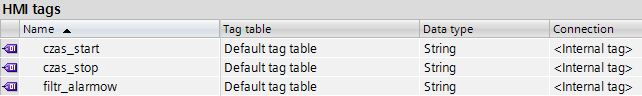

## Tworzenie układu raportu

W drzewie projektu WinCC przejdźmy do zakładki Reports i dodajmy nowy raport przez kliknięcie przycisku Add new report – w przykładzie nazwiemy nasz układ `Report_1`. W układzie raportu wstawmy trzy kontrolki prezentujące dane w formie trendu, tabeli danych oraz tabeli alarmów. 

 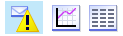

 W przypadku kontrolki trendu, obszar na układzie wydruku powinien być pokrywany przez kontrolkę w rozmiarze, jakiego będziemy oczekiwać na wydruku sprawozdania. Natomiast w przypadku kontrolek tabelarycznych wystarczy wstawić kontrolkę w postaci pojedynczego wiersza – w momencie odczytania danych z bazy SQL – zostanie ona automatycznie rozwinięta przez system na wymaganą długość. Jest to istotne ze względu na to, iż systemowy układ wydruku może zostać stworzony tylko w zakresie jednej strony roboczej. Finalny wydruk naturalnie nie ma ograniczeń aczkolwiek w przypadku bardziej rozbudowanych konfiguracji, gdzie wszystkie wymagane elementy nie zmieszą na jednym układzie – wymagane będzie tworzenie kilku wzorców, a następnie ich drukowanie symultaniczne. 

 ## Parametryzacja kontrolek układu raportu – źródło danych

 Domyślnie kontrolki, które wstawiliśmy do układu sprawozdania mogą prezentować dane z zakresu czasu od chwili wywołania zadania wydruku – do odpowiedniego ukresu wstecz, np. godzina, dzień czy miesiąc. Czyli można powiedzieć przygotowane są do prezentacji danych aktualnych. Aby zakres czasu – podawać dynamicznie, czyli teoretycznie zarówno koniec jak i początek interesującego nas zakresu znajduje się w przeszłości, musimy sparametryzować odpowiednio kontrolki, które wykorzystujemy w raporcie. 
W pierwszej kolejności należy wskazać, iż dane nie będą pochodzić z aktualnego zakresu czasu. W przypadku kontrolki trendu `(f(t) trend view)` należy więc odznaczyć domyślnie aktywny znacznik Online, w zakładce General -> Display właściwości trendu, zgodnie z poniższym zrzutem ekranu:

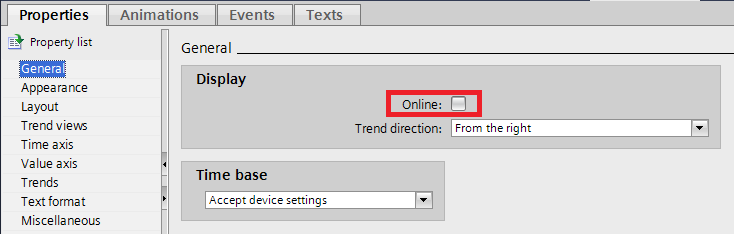

Analogiczne ustawienia powinny wstępnie zostać przygotowane dla kontrolki tabelarycznej prezentacji danych `(Table view)`:

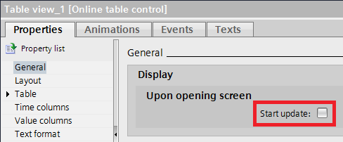

Oraz dla kontrolki alarmów (Alarm view):

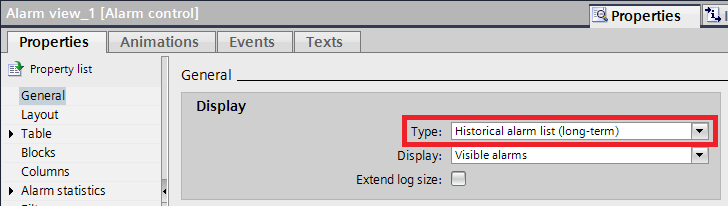

Naturalnie w przypadku kontrolki trendów oraz tabeli musimy wskazać zmienne, których wartości będziemy chcieli w ich obszarze zaprezentować. Dla kontrolki trendów jest to zakładka `Trends`, natomiast w przypadku kontrolki tabeli parametryzację wykonujemy w zakładce Value columns.

Uwaga: Nazwy zmiennych archiwalnych mogą zostać podane dynamicznie jako parametr sprawozdania (zmienne tekstowe) analogicznie do konfiguracji opisanej w kolejnych punktach niniejszego dokumentu. Także zarówno zakres czasu jak i źródło danych może zostać sparametryzowane swobodnie już w trybie pracy aplikacji `Runtime`.   

## Parametryzacja kontrolek układu sprawozdania – dynamiczny zakres danych

Następnie korzystając z wcześniej przygotowanych zmiennych tekstowych należy zdynamizować zakres czasu, który będzie wskazany już bezpośrednio do sprawozdania w momencie wywołania zadania wydruku.

Aby dotrzeć do możliwości dynamizacji tych parametrów poszczególnych kontrolek należy przejść w zaawansowany widok dostępnych właściwości (klikamy przycisk Property list widoczny na powyższym zrzucie ekranu). W przypadku kontroli trendu – w następujący sposób podajemy zmienne, które będą przekazywać datę początku i końca okresu raportowania:

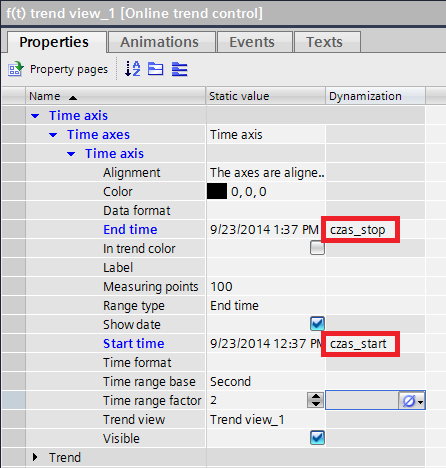

Analogicznie zmienne podłączymy w przypadku kontrolki tabelarycznej prezentacji danych, z tym, że grupa parametrów oznaczona jest Time column, a nie Time axis jak w powyższym przypadku. 

W przypadku tabeli alarmów będziemy jako parametr podawać `kwerendę SQL`, która będzie tworzona dynamicznie przed wydrukowaniem raportu. W tym przypadku nie jesteśmy w stanie podać bezpośrednio zakresu czasu, ze względu na to, iż możliwość filtrowania jest tutaj zdecydowanie więcej także system pozwala zdynamizować bezpośrednie zapytanie do bazy danych bez konieczności stosowania skryptów lub aplikacji zewnętrznych. Parametr ten wskazujemy przez zmienną zgodnie z poniższym zrzutem ekranu:

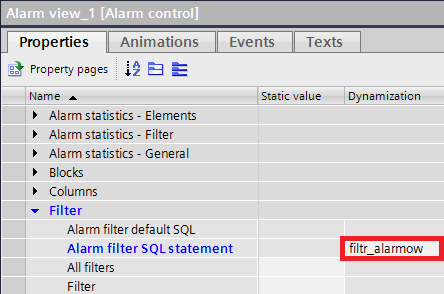

## Odczyt znaczników czasu. Stworzenie kwerendy SQL

Zasilenie zmiennych - które przewidzieliśmy do dynamicznego wskazywania parametrów okresu raportowania – może odbywać się w sposób dowolny – zarówno jeśli chodzi o mechanizm ich stworzenia jak i moment, grunt żeby odpowiednie wartości zostały przypisane w odpowiednim formacie jeszcze przed wywołaniem zadania wydruku.
W naszym przykładzie rozpoczęcie oraz zakończenie procesu będzie wiązało się z odczytem daty i czasu systemowego. Dane w bazie SQL zapisywane są ze stemplem czasowym w formacie UTC – w tym przypadku nie musimy się jednak tym kłopotać gdyż system automatycznie dostosuje czas do obowiązującej strefy czasowej na bazie ustawień systemu operacyjnego. Interesuje nas zatem czas lokalny. 
Odczyt początkowego stempla czasowego przez przepisanie jego wartości do zmiennej wewnętrznej `WinCC` może odbywać się np. przez skrypt VB:

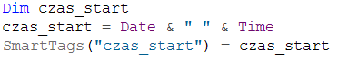

Podobnie w przypadku zakończenia procesu odczytamy czas końcowy, a także stworzymy kwerendę SQL w formie tekstu, która będzie uwzględniać zapytanie o komunikaty alarmowe z zakresu pomiędzy czasem początkowym a końcowym. Kwerendę tworzymy tylko na potrzeby filtrowania komunikatów alarmowych. Więcej informacji na temat dostępnych bloków `filtra SQL` można oszukać w systemowych plikach pomocy pod hasłem `SQL` statements for filtering messages in AlarmControl. 
W naszym przypadku może nam posłużyć ku temu następujący skrypt:

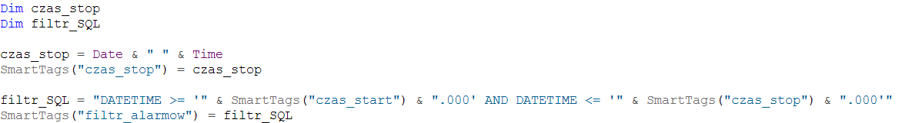

## Odczyt parametrów w trybie Runtime

Po wywołaniu powyższych skryptów oraz wyświetlając wartości naszych zmiennych wewnętrznych na ekranie procesowym powinniśmy uzyskać następujący format `kwerendy SQL` oraz daty początku/końca okresu raportowania:

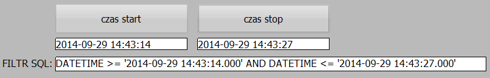

Dane w takim formacie mogą zostać przypisane, jako parametry dynamizacyjne kontrolek umieszczonych we wcześniej stworzonym układzie wydruku.

## Wygenerowanie raportu

Krokiem finalnym jest wygenerowanie sprawozdania, np. przez funkcję skryptową C:

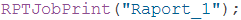

W sprawozdaniu skonfigurowanym w powyższy sposób zostaną zaprezentowane informacje z archiwum procesowego w formie trendu oraz tabeli, a także lista komunikatów alarmowych z systemowej bazy danych – ze wskazanego przedziału czasu.

## Podsumowanie

Opisany powyżej sposób pozwala na odczyt z bazy danych dowolnego zakresu, praktycznie bez wykorzystania zaawansowanego skryptu. Jest to rozwiązanie systemowe, które daje gwarancję sprawnego oraz spójnego odczytu informacji z systemowej bazy danych SQL Server. 
Jako rozwinięcie powyżej opisanej funkcjonalności możemy zastanowić się nad przedstawieniem wskazanego zakresu czasu bezpośrednio na kontrolkach ActiveX w trybie pracy aplikacji Runtime. Pozwoli to operatorowi mieć wgląd w ramy czasowe danego procesu bez konieczności zastosowanie zewnętrznych aplikacji bądź drukarki. Podstawę do parametryzacji kontrolek można odszukać w dokumencie `WinCC V7 - Skryptowa obsługa systemowych kontrolek ActiveX`. 
Zarówno w przypadku filtrowania dynamicznego w raporcie jak i bezpośrednio w trybie `Runtime`, parametrami, które nas interesują są - w konfiguracji podstawowej - w zasadzie jedynie ramy czasowe. Dodatkowo więc, można rozważyć stworzenie bazy procesów archiwalnych, gdzie rekord danych zawierać będzie np. nazwę procesu oraz datę jego rozpoczęcia i zakończenia. Baza informacji mogłaby znajdować się w tabeli SQL, w pliku tekstowym/Excel lub korzystając z rozwiązania systemowego mogłaby stanowić wpis w systemie receptur. Taki mechanizm pozwoliłby sięgnąć bezpośrednio do archiwum z uwzględnieniem odpowiednich ram czasowych bez konieczności wprowadzania ich ręcznie przez operatora. 

Powyższy przykład przygotowany został pod Windows 7x64 oraz WinCC Professional V12 SP1. Może być również swobodnie zaadoptowany w klasycznej wersji systemu SCADA – WinCC v7.x oraz innych wersji systemów operacyjnych.