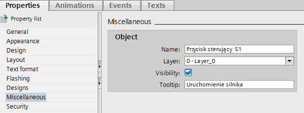
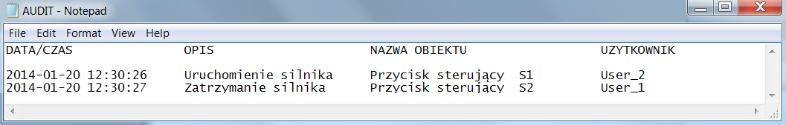
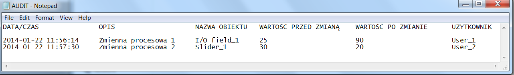

# WinCC Professional - Skryptowe audytowanie akcji operatora

Nadzór nad akcjami jakie wykonywane są na systemie wizualizacyjnym ma bardzo duże znaczenie w przypadku wielu aplikacji. Często informacja kto gdzie i kiedy wykonał poszczególne funkcje dostępne w trybie Runtime projektu `SCADA` pozwala nie tylko sprawnie nadzorować poprawność produkcji ale również w szybki sposób ustalić które z wywołanych funkcji mogły wpłynąć na aktualny stan urządzeń oraz zakładu produkcyjnego.
 W przypadku wielu aplikacji funkcja audytowania musi być rozwiązaniem systemowym i posiadać odpowiednie certyfikaty. Najczęściej wymogi takie postawione są w branży farmaceutycznej bądź spożywczej gdzie zgodność z odpowiednimi normami FDA jest nieodzowną częścią projektu wizualizacji oraz całego systemu automatyki. W takim wypadku musi zostać zaaplikowany pakiet WinCC/Audit, który spełnia w/w normy, przechowuje informacje w zabezpieczonej bazie danych z odpowiednim formatem oraz dokładnością. Zastosowanie tego pakietu opcjonalnego wymusza również użycie odpowiedniej wersji systemu SCADA, a mianowicie klasycznej wersji `WinCC v7.x`. W chwili obecnej wersja TIA Portal WinCC Professional nie posiada w grupie opcji pakietu Audit.
Zagadnienie jakie jest rozpatrywane w niniejszym dokumencie dotyczy bardzo prostego rejestrowania akcji jakie wykonuje operator podczas pracy z systemem WinCC w trybie Runtime. Rozwiązanie wykonane jest przez prosty skrypt VB i nie spełnia jakichkolwiek norm bądź standardów, jest to jedynie propozycja rozwiązania zagadnienia związanego z audytowaniem pewnych informacji systemowych. 
Idea przykładu dąży do tego by stworzyć jeden uniwersalny skrypt, który będzie mógł zostać przypisany do wielu obiektów bez jakiekolwiek konieczności ingerencji w jego zawartość. Dla przykładu możemy rozpatrzyć przycisk, który informacje na temat wywoływanej funkcji będzie przechowywał w swoich parametrach (np. `TooltipText`). Przykład skryptu zaprezentowany poniżej uwzględnia więc uniwersalną funkcjonalność, która składa się z odczytu nazwy obiektu, który został kliknięty (np. przycisk), zaczytania opisu przypisanego do tegoż elementu oraz sprawdzeniu nazwy aktualnie zalogowanego użytkownika WinCC. Nazwa każdego obiektu w WinCC jest unikatowa, także nie jest konieczna tutaj zmiana nazwy aczkolwiek w celu stworzenia bardziej szczegółowej bazy danych warto stosować nazewnictwo, które pozwoli w łatwy sposób zidentyfikować gdzie obiekt znajduje się wśród ekranów synoptycznych oraz jaką posiada funkcję. Natomiast funkcję generowaną przez dany obiekt typu Button możemy wprowadzić w postaci opisu w pole Tooltip Text zgodnie z poniższym zrzutem ekranu:



Trzymając się więc odpowiedniego nazewnictwa możemy stworzyć uniwersalny mechanizm, który będzie odczytywał odpowiednie parametry  obiektu, na którym została wykonana akcja i będzie przepisywał je na przykład do pliku tekstowego. 

Poniżej znajduje się przykładowy skrypt wywołujący właśnie taką funkcjonalność.

```vb
'systemowy nagłówek funkcji dla zdarzenia - kliknięcie obiektu Button   
Sub OnLButtonDown(Byval Item, Byval Flags, Byval x, Byval y) 

'deklaracje parametrów, obiektów oraz stałych                         
Dim fso, f, Msg 
Dim TextToWrite
Const ForReading = 1, ForWriting = 2, ForAppending = 8
Dim TooltipText, NazwaObiektu, UserName
Dim StrContent
Dim LineNum
Dim Temp
Dim FilePath

'deklaracja aktualnego okna jako obiekt
Dim objCurWindow
Set objCurWindow = HMIRuntime.ActiveScreen
 
'ścieżka zapisu pliku z informacjami
FilePath = "d:\AUDIT.txt"

'odczyt parametrów obiektu, na którym została wykonana operacja oraz użytkownika
TooltipText = objCurWindow.ActiveScreenItem.TooltipText
NazwaObiektu = objCurWindow.ActiveScreenItem.ObjectName
UserName = HMIRuntime.SmartTags("@CurrentUserName") 

'tworzenie obiektu systemu plików
Set fso = CreateObject("Scripting.FileSystemObject")

'sprawdzanie czy plik już istnieje
If fso.FileExists(FilePath) Then
'jeśli plik istnieje możemy wyświetlić komunikat informacyjny, 
Else 
'stwórz plik o określonej ścieżce, nazwie oraz rozszerzeniu
fso.CreateTextFile(FilePath) 
'otwórz plik do zapisu danych
Set f = fso.OpenTextFile(FilePath, ForWriting) 

'wpisz linię nagłówka pliku – opisy kolumn rozdzielone znakiem tabulacji
f.WriteLine("DATA/CZAS" & vbTab  & vbTab & vbTab & "OPIS AKCJI" & vbTab & "NAZWA OBIEKTU" & vbTab & "UZYTKOWNIK")

'wpisz pustą linię, aby dokument był czytelny
f.WriteLine(" ")

'zamknij plik
f.close
End If

'otwórz plik do trybu dołączania danych – zawarte wcześniej w pliku dane 
'nie zostają usunięte
Set f = fso.OpenTextFile(FilePath, ForAppending) 

'skompletuj linię danych w postaci tekstowej – zawierającą odczytane
'wartości parametrów obiektu oraz dokładny stempel czasowy 
TextToWrite = Date & " " & Time & " " & vbTab & TooltipText & vbTab &  " " & vbTab & NazwaObiektu & vbTab & vbTab & UserName 

'dopisz rekord danych do pliku – linia z powyższymi danymi
f.WriteLine(TextToWrite)

'zamknij plik
f.close
```
Efektem pracy powyższego skryptu przypisanego dla dwóch przykładowych przycisków na ekranie procesowym jest poniższy dokument tekstowy:



Podobną funkcjonalność możemy założyć dla innych obiektów graficznych na jakie wpływając użytkownik wprowadza zmiany w procesie czy aplikacji. Standardem są oczywiście również pola I/O czy też obiekty typu suwak. Możemy wyobrazić sobie sytuację gdzie dla takich elementów również będzie konieczne prowadzenie dziennika zmian. Jedynym dodatkowym parametrem jaki w tym wypadku moglibyśmy wprowadzić jest wartość zmiennej, która jest przypisana do elementu. Powiedzmy, że w tym przypadku chcemy zapisać w rejestrze danych informacje o tym, jaki obiekt został zmieniony, jaki był jego opis (ponownie można skorzystać z parametru `Tooltip Text`), jaka zmienna procesowe jest do niego podpięta, a także jaką zawierała wartość przed ingerencją użytkownika oraz jaką zmianę użytkownik wprowadził. Oczywiście ten zakres informacji wzbogacimy tradycyjnie o nazwę użytkownika, który zamiany wprowadził. 
W pierwszym kruku musimy odczytać aktualną wartość procesową podpiętą pod dany element, także do zdarzenia kliknięcia bądź aktywacji suwaka czy pola `I/O` możemy przypisać następujący skrypt, który do zmiennej pomocniczej zapisze nam wartość aktualną zmiennej przed wprowadzeniem modyfikacji, którą później porównamy z wartością wprowadzoną przez użytkownika. Uniwersalny skrypt VB może wyglądać dla przykładu następująco:

``` vb
'deklaracja aktualnego okna jako obiekt
Dim objCurWindow
Set objCurWindow = HMIRuntime.ActiveScreen

'odczytanie aktualnej wartości zmiennej przypiętej do obiektu graficznego
Dim wartosc_procesowa
wartosc_procesowa = objCurWindow.ActiveScreenItem.ProcessValue

'przepisanie aktualnej wartości do zmiennej pomocniczej
HMIRuntime.SmartTags("Zmienna_pomocnicza") = wartosc_procesowa
```
Następnym krokiem jest wywołanie wcześniej już stworzonego skryptu w celu odczytania wszystkich istotnych dla nas parametrów i zapisania ich np. do pliku tekstowego. W tym celu możemy wykorzystać poniższy skrypt, który przypisany może być do zdarzenia zmiany wartości obiektu czyli zakończenia wprowadzania wartości do pola I/O czy też obiektu typu suwak:

```vb
'deklaracje parametrów, obiektów oraz stałych                         
Dim fso, f, Msg 
Dim TextToWrite
Const ForReading = 1, ForWriting = 2, ForAppending = 8
Dim TooltipText, NazwaObiektu, Dim Zmienna_przed, Zmienna_po ,UserName
Dim StrContent
Dim LineNum
Dim Temp
Dim FilePath

'deklaracja aktualnego okna jako obiekt
Dim objCurWindow
Set objCurWindow = HMIRuntime.ActiveScreen
 
'ścieżka zapisu pliku z informacjami
FilePath = "d:\AUDIT.txt"

'odczyt parametrów obiektu, na którym została wykonana operacja oraz użytkownika
TooltipText = objCurWindow.ActiveScreenItem.TooltipText
NazwaObiektu = objCurWindow.ActiveScreenItem.ObjectName
UserName = HMIRuntime.SmartTags("@CurrentUserName") 
Zmienna_przed = HMIRuntime.SmartTags("Zmienna_pomocnicza")
Zmienna_po = objCurWindow.ActiveScreenItem.ProcessValue


'tworzenie obiektu systemu plików
Set fso = CreateObject("Scripting.FileSystemObject")

'sprawdzanie czy plik już istnieje
If fso.FileExists(FilePath) Then
'jeśli plik istnieje możemy wyświetlić komunikat informacyjny, 
Else 
'stwórz plik o określonej ścieżce, nazwie oraz rozszerzeniu
fso.CreateTextFile(FilePath) 
'otwórz plik do zapisu danych
Set f = fso.OpenTextFile(FilePath, ForWriting) 

'wpisz linię nagłówka pliku – opisy kolumn rozdzielone znakiem tabulacji
f.WriteLine("DATA/CZAS" & vbTab  & vbTab & vbTab & "OPIS AKCJI" & vbTab & "NAZWA OBIEKTU" & vbTab & "WARTOŚĆ PRZED ZMIANĄ" & vbTab & "WARTOŚĆ PO ZMIANIE"  & vbTab  & "UZYTKOWNIK")

'wpisz pustą linię, aby dokument był czytelny
f.WriteLine(" ")

'zamknij plik
f.close
End If

'otwórz plik do trybu dołączania danych – zawarte wcześniej w pliku dane 
'nie zostają usunięte
Set f = fso.OpenTextFile(FilePath, ForAppending) 

'skompletuj linię danych w postaci tekstowej – zawierającą odczytane
'wartości parametrów obiektu oraz dokładny stempel czasowy 
TextToWrite = Date & " " & Time & " " & vbTab & TooltipText & vbTab &  " " & vbTab & NazwaObiektu & vbTab & Zmienna_przed & vbTab &  Zmienna_po & vbTab & UserName 

'dopisz rekord danych do pliku – linia z powyższymi danymi
f.WriteLine(TextToWrite)

'zamknij plik
f.close
```

Rezultatem wywołania powyższych skryptów może być poniższy dokument tekstowy lub podobny w formie pliku arkusza kalkulacyjnego MS Excel:



W podobny sposób możemy działać również dla każdego innego obiektu graficznego, którego zmiana nie powinna zostać niezauważona lub dla samych zmiennych procesowych, których zmiany wartości powinno ostać zarejestrowane w sposób bardzo ogólny.

Przykład przygotowany został pod Windows 7x64 oraz WinCC Professional V12. Może być również swobodnie zaadoptowany w klasycznej wersji systemu SCADA – WinCC v7.x oraz innych wersji systemów operacyjnych.