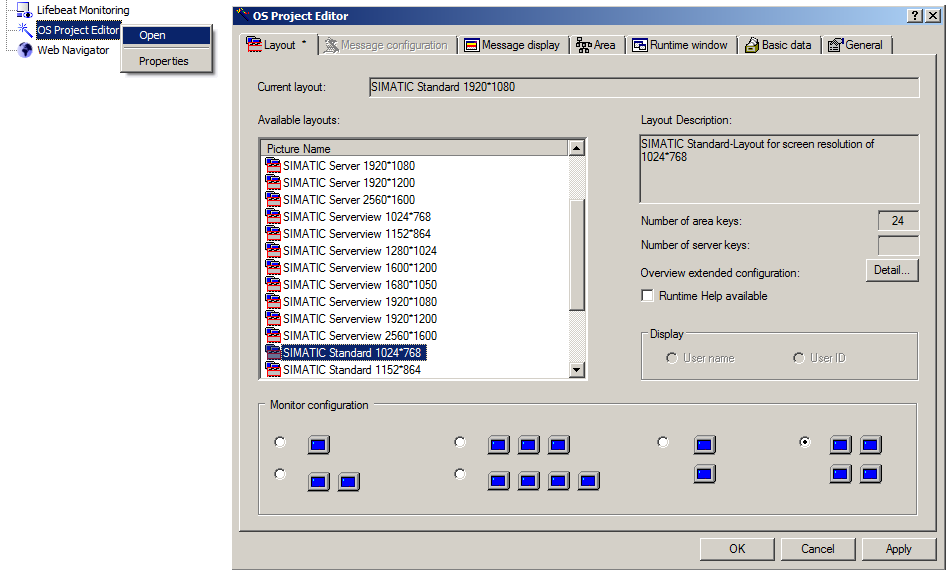
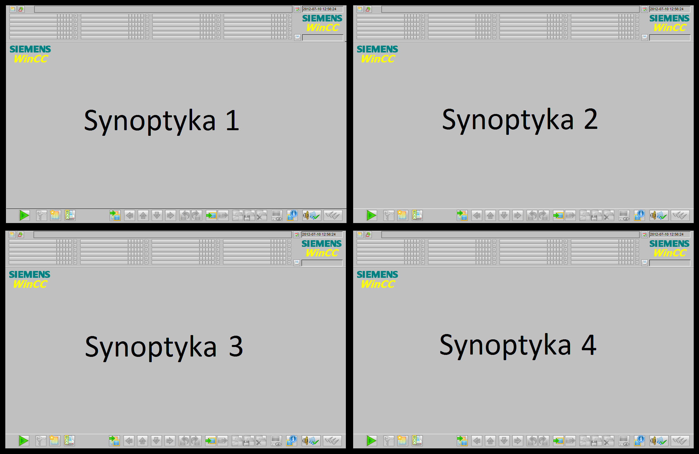
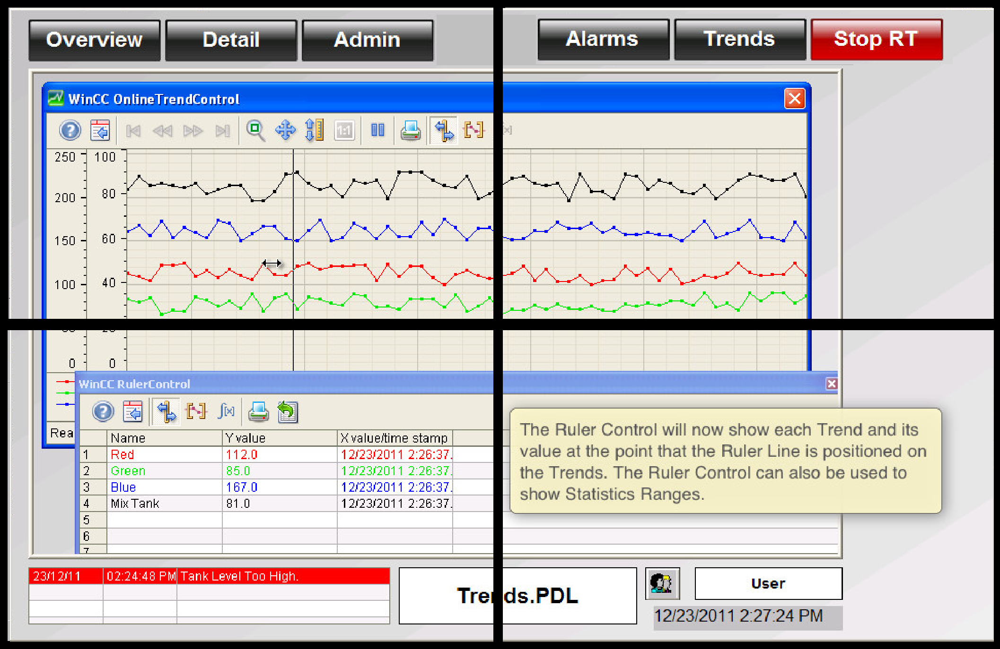
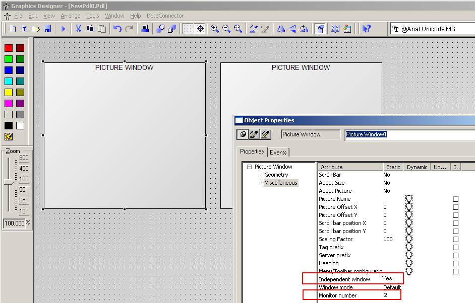

# WinCC - konfiguracja stacji wielomonitorowej
## Opis

System SCADA WinCC umożliwia użytkownikowi stworzenie szeroko pojętej wizualizacji. Funkcjonalnością dodatkowa jest sposobność konfiguracji systemu do pracy w strukturze wielomonitorowej. Oznacza to, iż zarówno stacje standalone, serwer jak i klient mogą wyświetlać synoptyki procesowe na kilku monitorach (maksymalnie 4). Układ ekranów może być dowolny, podobnie jak część wizualizacji, która będzie na nich wyświetlana. Można zastosować technikę powielania wizualizacji na niezależne monitory bądź rozciągnięcie wizualizacji na kilka wyświetlaczy. Poniżej przedstawiamy dostępne możliwości konfiguracyjne w zakresie systemu wielomonitorowego.

Podstawowe wymaganie sprzętowe do uruchomienia systemu wielomonitorowego to karta graficzna wielomonitorowa oraz monitory o takiej samej rozdzielczości. Karty graficzne zalecane przez Siemens (2- lub 4-monitorowe) można odszukać na stronach wsparcia technicznego wskazanych na końcu tego dokumentu. Na rynku jest jednak wiele kart graficznych, które bez kłopotu pozwolą uruchomić taki system, nie wszystkie jednak cieszą się wsparciem technicznym ze strony Siemens.

## OS Project Editor

Pierwszą z metod stworzenia stacji wielomonitorowej jest wykorzystanie zintegrowanego w systemie modułu OS Project Editor. Znajduje się on w drzewie projektu WinCC Explorer i służy m.in. do automatycznego generowania systemu wielomonitorowego.

## OS Project Editor - Układ generowany automatycznie

W zakładce General wystarczy wskazać rozdzielczość zastosowanych monitorów oraz ich ilość (opis pełnej konfiguracji wyświetlania znajduje się w instrukcji obsługi OS Project Editor, do której odnośnik znajduje się na końcu dokumentu).

Należy zwrócić uwagę, iż w systemie dostępna jest ograniczona ilość rozdzielczości, do jakich system potrafi dostosować generowany automatycznie układ wizualizacji. Po dokonaniu ewentualnych dodatkowych ustawień w OS Project Editor oraz zatwierdzeniu zmian - system automatycznie wygeneruje układ wizualizacji tzw. Basic Process Control oraz przystosuje projekt do pracy wielomonitorowej.

Rezultatem powyższych kroków jest układ wizualizacji zawierający paski nawigacji, pole robocze, odnośniki do alarmów, etc. Taki układ jest skopiowany na każdy wyświetlacz zadeklarowany w projekcie. Na każdym z monitorów będzie wyświetlany dokładnie taki sam układ wizualizacji, pracujący niezależnie. W rzeczywistości system wygeneruje jeden duży ekran procesowy, który będzie składał się z kilku ekranów głównych (w skonfigurowanym układzie), które przy doborze odpowiednich rozdzielczości ekranów będą się prezentowały – niezależnie – na każdym z wyświetlaczy. Poniższy przykład prezentuje wygląd systemu w konfiguracji 4-monitorowej w układzie 2x2.

Należy również pamiętać o aktywacji wyświetlania wielomonitorowego, a także ustawieniu rozdzielczości każdego z monitorów na zadeklarowaną w OS Project Editor - konfiguracja interfejsu karty graficznej.

## OS Project Editor - Układ użytkownika 

Alternatywnym podejściem do rozwiązania zagadnienia wielomonitorowości przy użyciu funkcjonalności OS Project Editor jest konfiguracja systemu z pominięciem automatycznie generowanego układu. Sprowadza się to do określenia układu monitorów oraz ich rozdzielczości – podobnie jak w powyższym punkcie. Aby wygenerować taki układ system musi automatycznie wygenerować cały układ wyglądu jak w poprzednich krokach. Natomiast po zamknięciu okna konfiguracji OS Project Editor można bez problemów usunąć wszelkie standardowe synoptyki wygenerowane automatycznie i zastąpić je swoimi, zupełnie niezwiązanymi z układem systemowym Basic Process Control. A więc po skonfigurowaniu systemu wielomonitorowego za pomocą OS Project Editor i usunięciu generowanych przez system ekranów procesowych – programista może sporządzić własne ekrany o rozdzielczości dopasowanej do wybranego układu systemu wielomonitorowego. W przypadku, gdy monitory mają rozdzielczość 1024x768, a układ został skonfigurowany jako 4-monitorowy w strukturze 2x2 – użytkownik tworzy synoptykę o rozdzielczości 2048x1536. Efektem takiej procedury jest wizualizacja, która będzie posiadała jeden ekran procesowy prezentowany na czterech monitorach jak pokazano poniżej.

## Picture Window

Inną metodą rozwiązania zagadnienia wielomonitorowości od strony systemu WinCC jest wykorzystanie możliwości elementów służących do wyświetlania ekranów procesowych – Picture Window. Element ten znajduje się w zakładce Smart Objects, dostępnej z poziomu edytora Graphics Designer. Element Picture Window posiada również parametr określający, na który monitorze – w strukturze wielomonitorowej – ma się dany ekran wyświetlić. Nadanie wartości tego parametru odbywa się przez okno właściwości elementu Picture Window. W zakładce Miscellaneous -> ostatni parametr to właśnie ten, który nas interesuje – Monitor Number. Dodatkowo, należy pamiętać, że aby element Picture Window miał możliwość pracy niezależnej – nieprzywiązanej do konkretnego ekranu procesowego należy również ustawić parametr Independent Window na wartość Yes. Przy takiej konfiguracji można na stałe określić, na którym z wyświetlaczy ma się pojawiać dany element Picture Window. Konfiguracja taka nie wymaga ustawień oraz generacji układu systemowego OS Project Editor.

Funkcjonalność taka przydatna jest zwłaszcza w strukturze, gdzie stacje klienckie serwera powinny posiadać różną ilość monitorów. Dzięki parametryzacji elementów Picture Window – łatwo można stworzyć projekty na stacje klienckie dopasowane do potrzeb użytkownika pracujące w dowolnej konfiguracji pod względem ilości monitorów. W przypadku zastosowania takiej metody użytkownik posiada również pełną dowolność w konfiguracji rozdzielczości poszczególnych monitorów.

Więcej informacji na temat konfiguracji systemu wielomonitorowego oraz wymagań sprzętowych można odszukać w poniszej lokalizacji sieciowej lub w plikach pomocy systemu WinCC:

[WinCC/Options for Process Control V8.1](https://support.industry.siemens.com/cs/pl/en/view/109989989)
