# WinCC Professional - Uniwersalne stacyjki

Stacyjka informacyjna mówiąca o parametrach obiektu znajdującego się na ekranie synoptycznym wizualizacji jest jednym z podstawowych elementów systemu SCADA. Stacyjka taka (zwana również płytą czołową, kontrolą czy faceplate) może wskazywać parametry dowolnego elementu wizualizacji, np. silnika, zaworu czy pompy. Parametry elementu to np. prędkość, stan, temperatura, moc, kierunek pracy, etc. Kwestia najbardziej istotna dotyczy oczywiście powtarzalności takiego elementu informującego o parametrach danego elementu wykonawczego. Zakładamy więc, że tworzymy stacyjkę tylko raz, natomiast wywołanie jej w projekcie może się ukazać w postaci kilku, kilkudziesięciu lub nawet kilkuset instancji. 

System WinCC daje kilka możliwości wykonania takiej funkcjonalności. Najbardziej podstawową funkcjonalność daje funkcja grupowania obiektów. W przypadki WinCC Professional możemy więc stworzyć sobie interesujący nas obiekt informacyjny składający się z takich elementów jak pole I/O, wskaźnik, opis tekstowy, itd. Zaznaczenie grupy obiektów oraz wybranie opcji grupowania stworzy w systemie jeden obiekt, który możemy przez proste przeciągnięcie umieścić w bibliotece globalnej lub w bibliotece projektu. Do takiego elementu możemy swobodnie wracać dowolną ilość razy i wywoływać go na ekranie procesowym. Podejście to jest najprostsze i nie daje byt wielu udogodnień przy pracy z wieloma instancjami. 
Nieco bardziej zaawansowaną funkcjonalność możemy uzyskać tworząc obiekty typu faceplate. Taki element graficzny może być skonfigurowany w znacznie bardziej zaawansowany sposób. Uwzględnić tu możemy przede wszystkim globalne zarządzenie wzorcem graficznym (zmiany wprowadzane są w zakresie całego projektu we wszystkich instancjach danego obiektu faceplate), możliwość definiowania zmiennych wewnętrznych oraz skryptów tylko na potrzeby stacyjki, możliwość zaawansowanej konfiguracji graficznej – z uwzględnieniem przezroczystego tła obiektu czy też bardzo przyjazne zachowanie skalowania po umiejscowieniu grafiki na ekranie. W wersji V12 SP1 WinCC Professional pojawiła się również możliwość automatycznej generacji wersji projektu stacyjki co w znaczny sposób upraszcza tworzenie zmian oraz ich kontrolę. Obiekt taki jest bardzo zaawansowany pod kątem możliwości konfiguracji natomiast nie posiada możliwości automatycznego zarządzania parametrami dynamicznymi, które są udostępnione dla konfiguracji użytkownika. Innymi słowy zmienne, które powinny zostać dołączone do poszczególnych funkcji graficznych czy funkcjonalnych elementu typu faceplate muszą zostać podpięte ręcznie do każdej instancji tegoż elementu. Co więcej wywołanie takiego elementu wymaga graficznego umieszczenia go wielokrotnie na ekranie procesowym lub na wielu ekranach. Zbyt duża ilość takich elementów nie prowadzi do niczego dobrego pod kątem wydajności pracy aplikacji. Jeśli znajdą się jeszcze w zakresie takiej stacyjki mniej lub bardziej zaawansowane funkcji skryptowe. Ich powielenie znacznie zwiększa obciążenie systemu lub przynajmniej możliwość wystąpienia błędu.
W niniejszym dokumencie postaramy się przedstawić trzecią możliwość konfiguracji stacyjek informacyjnych, która jest być może najbardziej wymagająca pod kątem konfiguracji, natomiast po jej zakończeniu daje znacznie więcej możliwości funkcyjnych oraz pozwala zaoszczędzić bardzo wiele czasu podczas konfiguracji poszczególnych instancji. Dodatkowo jedna instancja pozwoli nam wyświetlić parametry nieograniczonej ilości obiektów – co jest bardzo istotne z wydajnościowego punktu widzenia. Metoda ta opiera się na parametryzacji elementu służącego do wyświetlania ekranu w ekranie „Screen Window”. Jest to jedyny element w WinCC SCADA, który posiada możliwość wyświetlenia innego ekranu synoptycznego, a co więcej przypisania mu globalnych parametrów jak np. prefiks zmiennej czy numer ekranu , na którym ma zostać wyświetlony (w przypadku konfiguracji stacji operatorskiej jako wielomonitorowej). W przypadku klasycznej wersji WinCC v7.x element nazywa się „Picture Window”. Poniżej przedstawiony został dokładny opis zadania dla przykładowej stacyjki oraz kolejne kroki konfiguracyjne.

## Zadanie

W wielu projektach można zauważyć wielokrotne wywołanie stacyjek dla każdego z obiektów, natomiast w trybie RT zarządzanie odbywa się przez pokazywanie oraz ukrywanie poszczególnych instancji. Jest to można powiedzieć stara szkoła, która przy dzisiejszych możliwościach systemu WinCC staje się nieoptymalna pod kątem zarówno konfiguracji jak i obciążenia systemu wizualizacji. 
Celem przykładowego projektu jest stworzenie stacyjki, która będzie posiadać uniwersalność w możliwie szerokim zakresie. Mamy tutaj na myśli stworzenie struktury zmiennych z wydzielonym prefiksem oraz jednego wzorca stacyjki, który będzie wywołany tylko jednokrotnie na ekranie graficznym, natomiast przez zdarzenia systemowe oraz skrypty użytkownika będzie parametryzowany do wyświetlania informacji danego obiektu. Wszystkie zmienne będziemy podmieniać przez zmianę jedynie jednego parametru, a mianowicie prefiksu zmiennej.  Dodatkowo postaramy się wzbogacić naszą stacyjkę o dosyć ciekawą funkcjonalność, która pozwoli automatycznie dostosować również zawarte na niej trendy oraz komunikaty alarmowe w taki sposób Abu zaprezentowane zostały tylko i wyłącznie te istotne dla aktualnie przeglądanego elementu. Naszym obiektem w poniższym przykładzie będzie silnik.

## Konfiguracja
### 1. Stworzenie zmiennej strukturalnej.

Pierwszym krokiem w konfiguracji jest stworzenie tzw. zmiennej strukturalnej czyli innymi słowy typu danych użytkownika. Zawierając w nim parametry naszego silnika będziemy mogli w łatwy sposób zdefiniować je jednokrotnie oraz wywoływać je wiele razy bez konieczności ponownej deklaracji. Co więcej struktura może być w dowolnym momencie edytowana, a zmiany zostaną wprowadzone automatycznie przez system do wszystkich wywołań naszego typu danych. 
W celu stworzenia takiego elementu przechodzimy w zakładkę znajdującą się w prawej części edytora Libraries -> Project Library -> Types i wybieramy pozycję Add new type.
W oknie konfiguracji wskazujemy opcję User Data Type dla WinCC Runtime Professional zgodnie z poniższym zrzutem ekranu:

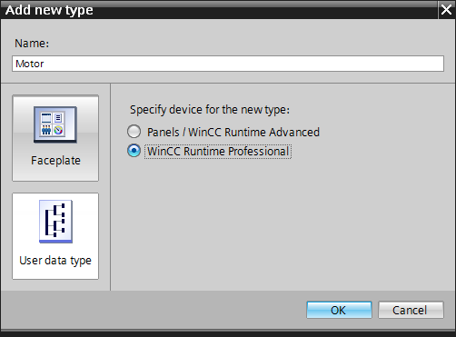

Nazwijmy sobie nasz typ danych: **Motor**.

Po zatwierdzeniu wprowadzamy parametry jakie powinny się znaleźć w naszej zmiennej strukturalnej. Składowe typu danych stanowią standardowe typu zmiennych dostępne w systemie WinCC. Skonfigurujmy parametry naszego silnika zgodnie z poniższym wykazem nazewnictwa oraz typów danych:

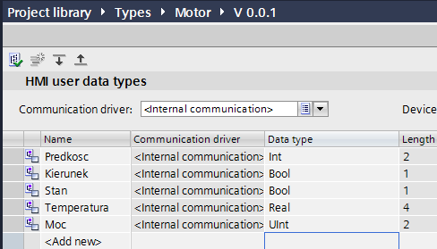

W przykładzie dla uproszczenia zastosowane zostały zmienne wewnętrzne (internal communication), natomiast oczywiście docelowo dane mogą pochodzić z dowolnego źródła, w tym oczywiście uwzględniając bezpośrednie połączenie z tagami sterownika np. **S7-1200/300/400 czy S7-1500**. Każdy z parametrów będzie stanowić doczytaną wartość właściwości danego obiektu. Tak jak zostało to już wspomniane – struktura może być w dowolnym momencie pracy z aplikacją uproszczona, rozszerzona bądź zmodyfikowana. 

### 2. Wywołanie zmiennej o typie danych użytkownika

Nasz typ danych został stworzony, możemy więc spróbować wywołać zmienną o skonfigurowanej strukturze (np. trzykrotnie). W tym celu tradycyjnie dodajemy nową zmienną w tabeli symboli (HMI Tags) i jako tym wybieramy Motor – zgodnie z poniższym zrzutem:

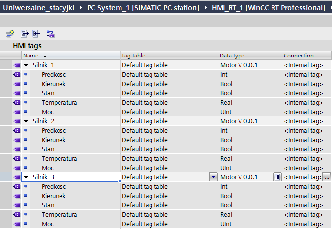

Jak widać każdorazowe wywołania zmiennej o strukturze zadeklarowanej przez użytkownika tworzy listę skonfigurowanych parametrów. Jedynym elementem różniącym nasze zmienne jest ich nazwa, a konkretnie prefiks zawarty w nazwie, czyli w przypadku powyższego zrzutu ekranu nadrzędna gałąź w drzewie zmiennej (`Silnik_1, Silnik_2, Silnik_3`). W przypadku TIA Portal prezentacja zmiennych strukturalnych odbywa się graficznie więc bezpośrednio w widoku zmiennych nie widać jak fizycznie wygląda całkowita nazwa zmiennej. Będzie to bardzo istotne w dalszej części konfiguracji, więc trzeba wiedzieć, iż separatorem oddzielającym prefiks zmiennej od nazwy parametru jest kropka. Czyli poszczególne zmienne docelowo mają nazwę ***Silnik_1.Predkość, Silnik_1.Kierunek, itd***.

### 3. Konfiguracja wzoru stacyjki

Kolejnym etapem konfiguracji jest wykonanie graficznego wzorca naszej stacyjki oraz przypisanie nazw parametrów do wybranych elementów wskazujących. W przykładzie stworzony został następujący układ graficzny o rozmiarze małego okienka (docelowo będzie to okno typu `pop-up`) mniej więcej **300x500** pikseli:

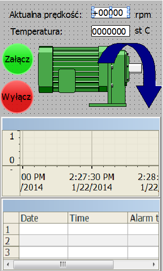

Jest to standardowy ekran procesowy o nazwie Stacyjka_silnika. W obszarze roboczym znalazły się opisy tekstowe, pola I/O, przyciski funkcyjne, symbol graficzny silnika pobrany z biblioteki elementów graficznych, wskaźnik kierunku pracy silnika oraz kontrolki trendu oraz alarmów.
Każdy z elementów graficznych służących czy to podglądowi wartości zmiennych procesowych czy też ich ustawieniu na odpowiednią wartość zostaje tutaj odpowiednio sparametryzowany. W zasadzie to chodzi o jeden element konfiguracyjny a mianowicie przyporządkowanie parametru technologicznego. Co bardzo ważne, nie przypisujemy tutaj nazwy zmiennej a jedynie nazwę parametru, czyli to co zostało skonfigurowane przy naszej zmiennej strukturalnej jako parametr – z pominięciem prefiksu (**Silnik_1.Predkość, Silnik_1.Kierunek, itd.**). Ten ostatni będzie podawany już jako parametr okna Screen Window, w którym wyświetlona zostanie nasza stacyjka. Także jako zmienną procesową zarówno w przypadku dołączania zmiennej procesowej np. do `pola I/O`:

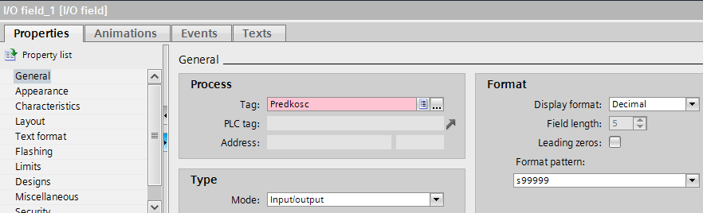

jak i w przypadku ustawiania zdarzenia systemowego dla zdarzenia kliknięcia przycisku:

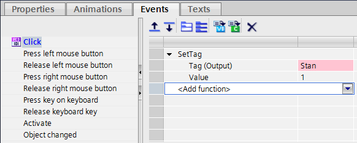

Wybieramy tylko i wyłącznie nazwę parametru. System wskaże to jako błąd, gdyż zmienna nie istnieje, a nie ma on prawa wiedzieć, że zostanie dopisany jeszcze prefiks przez element nadrzędny więc pojawia się podświetlenie na czerwono sugerujące błąd. Kompilator jednak nie zakwalifikuje tego jak błędna konfiguracja, jest to jedynie ostrzeżenie.

> [!NOTE]
>System dopisze prefiks zmiennej jedynie do systemowych parametrów (zdarzenie czy zmienne procesowe podłączone bezpośrednio), jeżeli więc zmienne skonfigurowane są w skrypcie użytkownika, zarządzanie prefiksem musi się odbyć również ręcznie na poziomie skryptu.

W kontrolkach trendu praz alarmu usunięte zostały zbędne paski menu oraz statusowe a także teksty nagłówków – będą one podawane dynamiczne poprzez skrypt. Kontrolka alarmu została skonfigurowana do wyświetlania odpowiednich bloków informacyjnych komunikatów. Natomiast w kontrolce trendu zostały dodane dwa trendy – bez żadnej konfiguracji źródła danych bądź innych parametrów. Będą one potrzebne w dalszej części konfiguracji.

### 4. Wstawienie stacyjki na ekran – element Screen Window

Po wykonaniu powyższych kroków konfiguracyjnych możemy spróbować wyświetlić naszą stacyjkę na ekranie procesowym i podpiąć już w trybie pracy aplikacji parametry poszczególnych silników.
W tym celu wstawiamy na nowy ekran procesowy element Screen Window, który pozwoli nam nie tylko wyświetlić stacyjkę ale również przypisać jej dynamicznie parametry. Rozmiar elementu powinien być mniej więcej zgodny z rozmiarem naszej stacyjki. Domyślnie możemy ustawić stacyjkę jako niewidoczną (parametr elementu **Screen Window**):

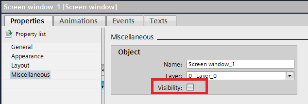

W parametrze Displayed screen wskazujemy nazwę ekranu, który jest wzorcem naszej stacyjki (Stacyjka_silnika).

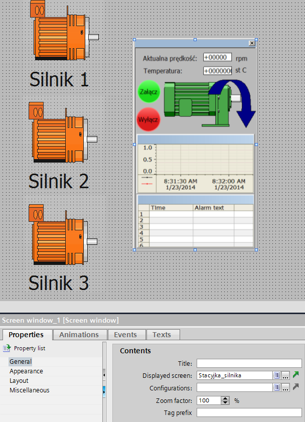

Na ekranie głównym dodane zostały również 3 symbole silników wraz z opisami. Zostały one przykryte standardowymi przyciskami, które będą służyły wywołaniu poszczególnych zdarzeń parametryzujących nasze okno stacyjki (Screen Window). Takie rozwiązanie ułatwia przypisanie zdarzenia do elementu graficznego z biblioteki, gdyż czasem są one złożone z wielu obiektów bądź powiązane wewnętrznymi skryptami, więc lepiej unikać zdarzeń przypisanych bezpośrednio do grafik z systemowej biblioteki.

### 5. Zmiana parametrów okna stacyjki

Do zdarzenia kliknięcia każdego z powyższych przycisków została przypisana lista funkcji, która automatycznie sparametryzuje nam nasze okno stacyjki, które na powyższym zrzucie widnieje w prawej części obszaru roboczego. Funkcje systemowe wraz z parametrami prezentują się następująco:

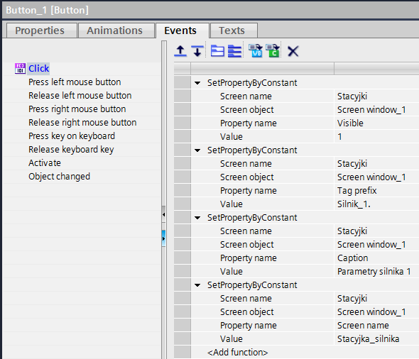

* Pierwsza funkcja sprawia, że stacyjka zostanie pokazana, jeśli wcześniej była niewidoczna (domyślnie tak właśnie jest). Jeśli zaś była widoczna, funkcja może zostać i tak wykonana - nie jest to proces ani czasochłonny ani obciążający dla systemu.
* Drugim zdarzeniem na liście jest przypisanie prefiksu zmiennej. Jest to bardzo ważny parametr gdyż mówi on o tym jaki przedrostek zostanie dopisany do wszystkich zmiennych zawartych na ekranie wyświetlanym w elemencie Screen Window. Tak jak zostało to już wspomniane prefiks zostaje przypisany tylko dla systemowych parametrów elementów graficznych. Nie zostaje w żaden sposób naruszona struktura skryptów użytkownika. Jak widać na powyższym zrzucie prefiks dla poszczególnych silników będzie zawierał również separator zmiennej strukturalnej czyli kropkę (**Silnik_1./Silnik_2./ Silnik_3.**), musi się ona tam znaleźć aby finalnie string reprezentujący nazwę zmiennej miał znaczenie dla systemu WinCC. 
* Trzecia funkcja systemowa przypisuje nagłówek okna stacyjki (musi on zostać uwidoczniony we właściwościach elementu Screen Window) aby zawsze było wiadomo, którego silnika parametry są aktualnie wyświetlane. 
* Ostatni parametr to ponowne wczytanie zawartości elementu Screen Window czyli naszego ekranu procesowego zawierającego schemat graficzny stacyjki (Stacyjka_silnika). Zabieg ten musi być wykonany gdyż inaczej nie zostanie automatycznie odświeżony prefiks zmiennych. Przypisanie prefiksu do elementu Screen Window zawsze więc wiąże się z wykonaniem ponownego przypisania nazwy ekranu wyświetlanego, czyli aktualizację parametru Screen Name (czyli Displayed Sceen). Innym sposobem jest zamknięcie i ponowne otworzenie stacyjki czyli operacja 0 -> 1 na parametrze Display aczkolwiek jest to rozwiązanie mało wygodnie lub w przypadku wywołania automatycznego zauważalne w postaci mrugnięcia okienka – nie jest więc ono optymalne. Rozwiązanie takie pozwoli zmieniać prefiks z efektem natychmiastowym bez konieczności zamykania okienka stacyjki.

Każdy z trzech przycisków powinien więc posiadać powyższą listę funkcji (może naturalnie być to wykonane również poprzez skrypt aczkolwiek rozwiązanie systemowe jest bardziej wygodne) z uwzględnieniem zmiany indeksu prefiksu oraz nagłówka okna (1, 2, 3).

Na tym etapie mamy już gotową stacyjkę, która będzie wyświetlać parametry wskazanego silnika bez konieczności wywoływania stacyjki wielokrotnie. Rozwiązanie jest bardzo wygodne ze względu na możliwość globalnej deklaracji zmiennych w strukturze użytkownika i operacji jedynie na jej prefiksie. 

Przejdźmy teraz do bardziej zaawansowanej konfiguracji a mianowicie dodania do stacyjki skryptu, który zautomatyzuje również parametryzację kontrolki alarmów oraz kontrolki trendu w taki sposób aby w danej chwili wyświetlane były przebiegi oraz komunikaty alarmowe istotne tylko i wyłączenie dla aktualnie analizowanego silnika.

** 6. Deklaracja archiwum zmiennych procesowych oraz komunikatów alarmowych

Zaawansowaną konfigurację zacznijmy od stworzenia archiwum zmiennych procesowych – dla przykładu niech będzie to temperatura oraz prędkość dla każdego z silników – zgodnie z poniższym zrzutem ekranu:

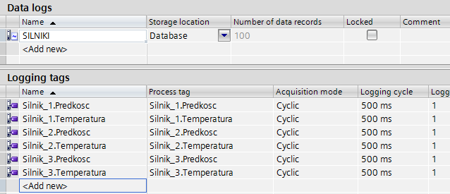

Stwórzmy również kilka komunikatów alarmowych dyskretnych, które będą przypisane do poszczególnych silników, np.:

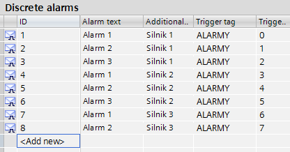


*** 7. Parametryzacja okna trendu oraz alarmów wewnątrz stacyjki

Krokiem finalnym jest skonfigurowanie zdarzenia, które w momencie otwarcia lub aktualizacji zawartości stacyjki sparametryzuje nasze kontrolki – trendów oraz alarmów w taki sposób aby:

* na trendzie wyświetlane były dwa trendy związane z danym silnikiem (prędkość/temperatura) – dwa trendy zostały dodane wcześniej w konfiguracji kontrolki. Dodatkowo chcemy ustawić nagłówek okna trendu aby informował jakie przebiegi wyświetlane są aktualnie w obszarze rysowania,

* w oknie alarmów pokazały się tylko i wyłącznie alarmy związane z danym silnikiem – wymagana będzie odpowiednia filtracja z poziomu skryptu, np. po numerze komunikatu – zgodnie z powyższy zrzutem ekranu. Nagłówek kontrolki alarmów również powinien zostać dostosowany.

Powyższe parametry ustawione zostaną w zależności od aktualnie przypisanego prefiksu do okna Screen Window. Zostanie on więc odczytany w skrypcie, a na podstawie jego wartości ustawione zostaną parametry kontrolek. Funkcja skryptowa wykonująca parametryzację zostanie przypisana do zdarzenia Loaded ekranu procesowego (dostępny po kliknięciu w obszar roboczy – tło – ekranu procesowego), który jest naszą stacyjką czyli Stacyjka_silnika. Dzięki temu skrypt zostanie wywołany zawsze w momencie otwarcia okienka stacyjki lub przy aktualizacji jego zawartości – co dzieje się zawsze przy zamieni prefiksu okna zgodnie z tym co zostało opisane wcześniej, także to zdarzenie spełni wymagania naszego projektu. 

Skrypt może wyglądać następująco:

```vb
'deklaracje zmiennych oraz obiektów
Dim objTrendControl
Dim objAlarmControl
Dim TagPrefix

'odczytanie prefiksu zmiennej przypisanego do okna Screen Window,
'w którym aktualnie wyświetlany jest ekran stacyjki – element nadrzędny
TagPrefix = Parent.TagPrefix


'deklaracja kontrolek trendów oraz alarmów jako obiekty w skrypcie
Set objTrendControl = ScreenItems.Item("Control1")
Set objAlarmControl = ScreenItems.Item("Control2")

'parametryzacja jeśli prefiks zmiennych = "Silnik_1."
If TagPrefix = "Silnik_1." Then
'ustaw nagłówek kontrolki alarmów
objAlarmControl.Caption = "ALARMY - SILNIK 1"
'ustaw nagłówek kontrolki trendów
objTrendControl.Caption = "TEMPERATURA/PRĘDKOŚĆ - SILNIK 1"
'filtruj alarmy dla Silnika 1 – numery 1, 2, 3
objAlarmControl.MsgFilterSQL = "#VisibleOnly\\MSGNR IN(1, 2, 3)"
'przypisz do trendu 1 zmienną archiwalną SILNIKI\Silnik_1.Temperatura
objTrendControl.TrendName = "Trend_1"
objTrendControl.TrendTagName = "SILNIKI\Silnik_1.Temperatura"
objTrendControl.TrendVisible = 1
'przypisz do trendu 2 zmienną archiwalną SILNIKI\Silnik_1.Predkosc
objTrendControl.TrendName = "Trend_2"
objTrendControl.TrendTagName = "SILNIKI\Silnik_1.Predkosc"
objTrendControl.TrendVisible = 1


'parametryzacja jeśli prefiks zmiennych = "Silnik_2."
ElseIf TagPrefix = "Silnik_2." Then
'filtruj alarmy dla Silnika 2 – numery 4, 5, 6
objAlarmControl.MsgFilterSQL = "#VisibleOnly\\MSGNR IN(4, 5, 6)"
'ustaw nagłówek kontrolki alarmów
objAlarmControl.Caption = "ALARMY - SILNIK 2"
'ustaw nagłówek kontrolki trendów
objTrendControl.Caption = "TEMPERATURA/PRĘDKOŚĆ - SILNIK 2"
'przypisz do trendu 1 zmienną archiwalną SILNIKI\Silnik_2.Temperatura
objTrendControl.TrendName = "Trend_1"
objTrendControl.TrendTagName = "SILNIKI\Silnik_2.Temperatura"
objTrendControl.TrendVisible = 1
'przypisz do trendu 2 zmienną archiwalną SILNIKI\Silnik_2.Predkosc
objTrendControl.TrendName = "Trend_2"
objTrendControl.TrendTagName = "SILNIKI\Silnik_2.Predkosc"
objTrendControl.TrendVisible = 1

'parametryzacja jeśli prefiks zmiennych = "Silnik_3."
ElseIf TagPrefix = "Silnik_3." Then
'filtruj alarmy dla Silnika 3 – numery 7, 8
objAlarmControl.MsgFilterSQL = "#VisibleOnly\\MSGNR IN(7, 8)"
'ustaw nagłówek kontrolki alarmów
objAlarmControl.Caption = "ALARMY - SILNIK 3"
'ustaw nagłówek kontrolki trendów
objTrendControl.Caption = "TEMPERATURA/PRĘDKOŚĆ - SILNIK 3"
'przypisz do trendu 1 zmienną archiwalną SILNIKI\Silnik_3.Temperatura
objTrendControl.TrendName = "Trend_1"
objTrendControl.TrendTagName = "SILNIKI\Silnik_3.Temperatura"
objTrendControl.TrendVisible = 1
'przypisz do trendu 2 zmienną archiwalną SILNIKI\Silnik_3.Predkosc
objTrendControl.TrendName = "Trend_2"
objTrendControl.TrendTagName = "SILNIKI\Silnik_3.Predkosc"
objTrendControl.TrendVisible = 1

End If
```
Bardziej szczegółowe informacje na temat skryptowej obsługi systemowych kontrolek można znaleźć na stronach wsparcia technicznego w dokumencie FAQ.10.13.WinCC V7 - Skryptowa obsługa systemowych kontrolek ActiveX.

## Rezultat

Efektem finalnym pracy naszej konfiguracji - uwzględniającej przypisanie parametrów do okna stacyjki oraz powyższego skryptu, który zostanie wywołany zawsze przy zmianie parametrów okna lub jego otwarciu – jest zmiana wszystkich parametrów okna, zawartych w nim elementów graficznych oraz kontrolek systemowych ActiveX. Dla poszczególnych zestawów parametrów uzyskamy następujący efekt:

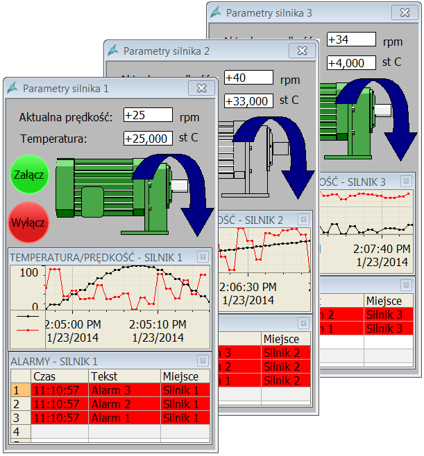

Przykład przygotowany został pod Windows 7 x64 dla WinCC Professional V12 SP1. Może być on jednak swobodnie dostosowany dla klasycznej wersji systemu WinCC v7.x lub dla starszych wersji środowiska TIA Portal. 

Więcej informacji na temat konfiguracji systemu WinCC można uzyskać w regionalnych biurach sprzedaży Siemens lub  kontaktując się bezpośrednio z działem wsparcia technicznego Simatic.