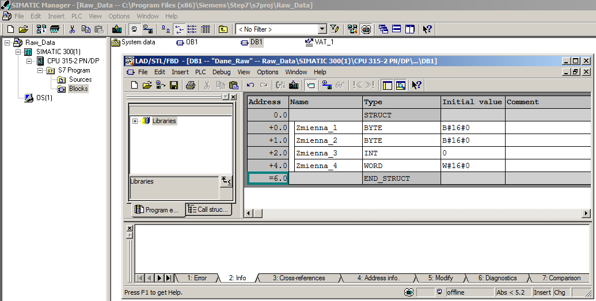
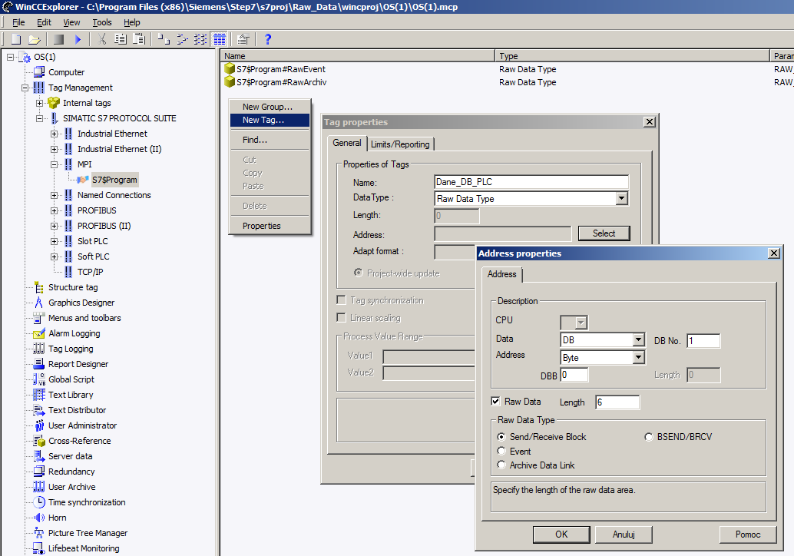
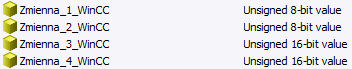
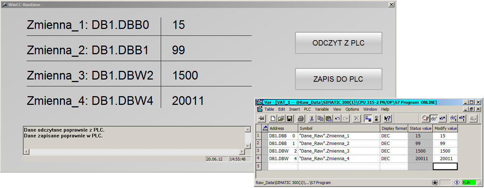

# WinCC v7.0 - Zastosowanie zmiennych Raw Data Type

Zmienne typu Raw Data są typem danych surowych – nieprzetworzonych. Ten typ danych daje użytkownikowi możliwość przesyłania do oraz z WinCC dużych ilości danych – odpowiednio `208 bajtów` dla sterowników serii `S7-300` oraz `448 bajtów` dla `S7-400` przy wykorzystaniu zaledwie jednej zmiennej typu Raw Data. Dane przesyłane są w postaci telegramu (wymiana cykliczna nie jest wskazana), natomiast sama obróbka danych musi zostać wykonana ręcznie poprzez `skrypt`.

WinCC rozróżnia dwa typy zmiennych Raw Data: do swobodnych aplikacji oraz wewnętrzne funkcje do wymiany danych `S7`. W poniższej instrukcji zajmiemy się aplikacjami użytkownika, czyli przesyłaniem bloków danych pomiędzy `WinCC` a `PLC` serii `S7`.

Danych typu Raw Data nie powinno wykorzystywać się do komunikacji z danymi sterującymi bądź wymagającymi szybkiej prezentacji lub odpowiedzi. Zastosowanie tego typu danych służyć może do:
* odczytu danych pomiarowych + archiwizacja
* przesyłania nastaw lub receptur, `User Archives`
* podglądu zbiorczego bloków danych, wejść/wyjść, markerów

Przy odpowiednim wykorzystaniu omawianego typu danych komunikacyjnych zaletami zastosowania zmiennych `Raw Data` są m.in.:
* odciążenie łącza komunikacyjnego danych wymienianych cyklicznie
* sposobność zmniejszenia ilości zmiennych licencyjnych deklarowanych w projekcie – przetwarzanie zmiennych Raw Data odbywa się na zmiennych lokalnych
* szybka wymiana pakietów danych z PLC oraz lokalna obróbka danych zbiorczych na stacji operatorskiej poprzez `skrypty`

1. W celu skonfigurowania wymiany danych Raw Data, zakładamy istnienie projektu ze skonfigurowaną stacją S7, np. `S7-300/400` lub po prostu sterownika z blokiem danych. Sterownik powinien być połączony w module NetPro z odpowiednią magistralą komunikacyjną(np.MPI).
Blok danych, z którego będziemy chcieli pobierać dane nazwijmy np. `„Dane_DB_PLC”`. W DB stwórzmy kilka zmiennych, np. typu *BYTE* lub *WORD*. 




Należy zwrócić uwagę na fakt, że dane typu Raw Data są typem nieprzetworzonym, więc niezależnie, jakiego typu zmienne będziemy posiadać w bloku danych, informacje przesyłać będziemy w postaci ciągu bajtów, słów lub podwójnych słów, co definiujemy na etapie tworzenia zmiennej typu Raw. Późniejsze odczytanie danych innego typu niż w/w należy wykonać poprzez odpowiednie funkcje skryptowe bądź wielokrotne wywołanie funkcji czytających przestrzeń bloku danych od strony `WinCC`.
Dane, jakie będziemy czytać ze sterownika nie muszą znajdować się w bloku danych – może być to również przestrzeń adresowa I/O lub M.

2. Stację operatorską możemy stworzyć sobie w projekcie Simatic Manager klikając w nazwę projektu Insert Object → OS. Otwieramy projekt WinCC klikając na stacji `OS → Open Object`.

3. W projekcie WinCC należy w pierwszym kroku stworzyć zmienną Raw Data Type, a w jej parametrach adresacji wskazać interesującą nas przestrzeń adresową naszego bloku danych. Może być to również przestrzeń adresowa wejść/wyjść lub pamięci M.
Jeśli projekt WinCC był wcześniej zintegrowany z Simatic Manager – połączenie ze sterownikiem utworzone zostanie automatycznie, jeśli projekt WinCC działa niezależnie – dodajemy odpowiedni kanał komunikacyjny, parametryzujemy jego ustawienia komunikacyjne i wstawiamy zmienną jak pokazano na poniższym obrazie.



Ponieważ odczytujemy przestrzeń bloku danych DB1 w postaci dwóch zmiennych typu `BYTE` i dwóch`WORD` począwszy od bajtu zerowego – daje nam to w sumie 6 bajtów, które musimy odczytać. W przypadku przekroczenia w momencie deklaracji przestrzeni adresowej czytanej przez Raw Data, zakresu danych zdefiniowanych w bloku danych – funkcja odczytująca wywołana w skrypcie nie będzie działać poprawnie. Należy zwrócić uwagę, iż deklarując jedynie jedną zmienną licencyjną możemy odczytać dane długości `208` lub nawet `448` bajtów – w zależności od zastosowanego sterownika S7. Dane nie są pobierane cyklicznie – odczyt lub zapis danych wykonuje się w momencie wywołania odpowiedniej funkcji w skrypcie `C` lub `VBS`.

4. Kolejny etapem konfiguracji jest deklaracja zmiennych wewnętrznych (*Internal Tags*), do których - poprzez skrypt - zostaną przepisane wyodrębnione zmienne zadeklarowane wcześniej w bloku danych `„Dane_DB_PLC”`. Zmienne wewnętrzne WinCC nie są wliczane w pulę zmiennych licencjonowanych gdyż nie są one wymieniane bezpośrednio ze sterownikiem poprzez kanał komunikacyjny.
Dla przykładu w grupie Internal Tags zadeklarowane zostały następujące zmienne:



5. Pozostaje stworzenie ekranu procesowego z przyciskami służącymi do odczytywania i zapisywania zmiennych sterownika. Dla celów testowych możemy utworzyć sobie pola typu `I/O Field`, które będą służyć wyświetlaniu wartości powyższych zmiennych wewnętrznych WinCC. 
Wykorzystując edytor skryptów zarówno lokalnych jak i globalnych warto umieścić sobie na synoptyce okno diagnostyki skryptów, które bezpośrednio w trybie Runtime poinformuje użytkownikach o wszelkich błędach, jakie zwrócił skrypt, daje również możliwość wyświetlenia komunikatów użytkownika, np. potwierdzających poprawne wykonanie skryptu lub dających informacje o wynikach obliczeń, etc. Kontrolka znajduje się w przyborniku Standard → Smart Objects → Application Window. Po stawieniu na ekran procesowy wybieramy Global Script → GSC Diagnostics.

6. Zadanie odczytywania i zapisywania zmiennych Raw Data można wykonywać cyklicznie, lecz cykl powinien być stosunkowo długi – w zależności od wielkości przesyłanych danych. Może to jednak powodować znaczne obciążenie łącza komunikacyjnego, dlatego lepiej jest wykonać zdarzeniowy transfer danych tego typu.

W przykładowym projekcie dodano dwa przyciski – wysyłanie oraz odbieranie danych, gdzie pod zdarzenie kliknięcia myszą przypisane zostały odpowiednie zdarzenia skryptowe – opisanie poniżej.

Działanie skryptu odczytywania przestrzeni adresowej bloku danych odbywa się w następujących krokach:

* deklaracja stałych oraz zmiennych
* deklaracja tablicy danych typu BYTE, do której wpisane zostaną kolejne bajty wczytane ze zmiennej Raw Data, w naszym przypadku jest to 6 bajtów
* wywołanie funkcji odczytującej wartości wcześniej utworzonej zmiennej Raw Data – „Dane_DB_PLC” i przepisującej dane do powyższej tablicy (z funkcja oczekiwania na pełny odbiór danych – „Wait”)
* przepisanie odczytanych wartości do zmiennych wewnętrznych WinCC
* w przypadku zmiennych typu WORD wykonane zostało połączenie odpowiednich par bajtów przez operacje logiczne, a następnie przepisanie ich do 16-bitowych zmiennych wewnętrznych WinCC
* wyświetlenie komunikatu potwierdzające wykonanie skryptu

```vb 
#define ILOSC_DANYCH 6 //deklaracja długości danych (tutaj w bajtach)

WORD Zmienna_3_word; //zmienne tymczasowe służące połączeniu
WORD Zmienna_4_word; //zmiennych typu BYTE w zmienne typu WORD

BYTE Dane_Raw_Byte[ILOSC_DANYCH]; //deklaracja tablica bajtów dla Raw Data

GetTagRawWait("Dane_DB_PLC",Dane_Raw_Byte, ILOSC_DANYCH); //odbiór danych Raw z PLC

SetTagByte("Zmienna_1_WinCC", Dane_Raw_Byte[0]); //przypisanie odebranych bajtów 
SetTagByte("Zmienna_2_WinCC", Dane_Raw_Byte[1]); //do zmiennych wewnętrznych WinCC

Zmienna_3_word =(Dane_Raw_Byte[2]*256) | Dane_Raw_Byte[3]; //połączenie kolejnych 
Zmienna_4_word =(Dane_Raw_Byte[4]*256) | Dane_Raw_Byte[5]; //bajtów w zmienne WORD

SetTagWord("Zmienna_3_WinCC", Zmienna_3_word); //przypisanie zmiennych WORD
SetTagWord("Zmienna_4_WinCC", Zmienna_4_word); //do zmiennych wewnętrznych WinCC

printf("Dane odczytane poprawnie z PLC.\n"); //potwierdzenie wykonania skryptu
```

Działanie skryptu zapisującego dane w DB jest analogiczne do przykładu powyższego. Różnicą jest wykonanie funkcji w odwrotnej kolejności, mianowicie:

* deklaracja stałych oraz zmiennych
* deklaracja tablicy danych typu BYTE, do której wpisane zostaną wartości zmiennych wewnętrznych WinCC, w naszym przypadku jest to w sumie 6 bajtów danych
* przepisanie wartości zmiennych wewnętrznych WinCC do zmiennych tymczasowych skryptu
* rozbicie zmiennych typu WORD na zmienne typu BYTE i przepisanie wszystkich wartości ze zmiennych tymczasowych do tablicy danych
* zmapowanie danych tablicy skryptu na zmienną Raw Data – wysłanie danych do bloku DB sterownika
* wyświetlenie komunikatu potwierdzające wykonanie skryptu

```vb

#define ILOSC_DANYCH 6 //deklaracja długości danych (tutaj w bajtach)

BYTE Zmienna_1, Zmienna_2; //zmienne tymczasowe przechowujące wartości
WORD Zmienna_3, Zmienna_4; //zmiennych wewnętrznych WinCC typu 8- oraz 16-bitowego

BYTE Dane_Raw_Byte[ILOSC_DANYCH]; //deklaracja tablica bajtów dla Raw Data

Zmienna_1 = GetTagByte("Zmienna_1_WinCC"); //przepisanie wartości zmiennych
Zmienna_2 = GetTagByte("Zmienna_2_WinCC"); //wewnętrznych WinCC do
Zmienna_3 = GetTagWord("Zmienna_3_WinCC"); //zmiennych tymczasowych
Zmienna_4 = GetTagWord("Zmienna_4_WinCC"); //wewnętrznych skryptu

Dane_Raw_Byte[0] = Zmienna_1; //wpisanie wartości zmiennych wewnętrznych WinCC
Dane_Raw_Byte[1] = Zmienna_2; //do kolejnych elementów przygotowanej tablicy bajtów

Dane_Raw_Byte[2] = Zmienna_3/256; //rozbicie zmiennych typu WORD
Dane_Raw_Byte[3] = Zmienna_3;     //na zmienne przewidziane w tablicy czyli BYTE
Dane_Raw_Byte[4] = Zmienna_4/256; //oraz przepisanie ich wartości
Dane_Raw_Byte[5] = Zmienna_4;     //do kolejnych elementów tablicy

SetTagRaw("Dane_DB_PLC",Dane_Raw_Byte, ILOSC_DANYCH); //przepisanie wartości
//umieszczonych w tablicy do bloku danych Dane_DB_PLC w PLC przez zmienną Raw Data

printf("Dane zapisane poprawnie w PLC.\n");  //potwierdzenie wykonania skryptu
```

7. Poprawne wykonanie powyższych skryptów powinno wynikować wymianą danych zawartych w zmiennych 
Umieszczenie przycisków funkcyjnych oraz odpowiednich elementów prezentacji wartości interesujących nas zmiennych potwierdza poprawność działania programu. Poniżej porównanie wartości wprowadzonych z poziomu WinCC z wartościami bloku danych sterownika.



Więcej informacji na temat zmiennych typu Raw Data można odszukać w tematach pomocy WinCC pod hasłem: „Raw Data Tag” lub na stronach internetowych wsparcia technicznego:
[Link1](http://support.automation.siemens.com/WW/view/en/37436840)
[Link2](http://support.automation.siemens.com/WW/view/en/37572697)
