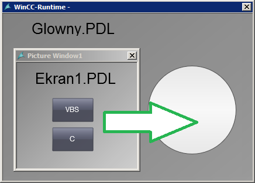
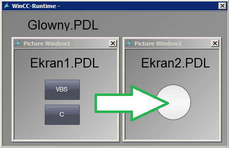
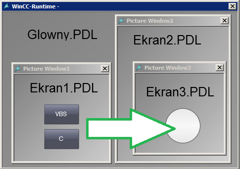

# WinCC Professional - Zmiana parametru obiektu graficznego przez skrypt 

## Zadanie

Często spotykanym zagadnieniem podczas tworzenia wizualizacji jest dynamizacja właściwości obiektów graficznych przez swobodnie konfigurowalne zdarzenia skryptowe. W przypadku projektów paneli operatorskich czy małych stacji RT Advanced problem nie jest duży gdyż funkcje skryptowe są łatwe w obsłudze, a projekty nie są skomplikowane pod kątem organizacji ekranów procesowych. W przypadku systemu SCADA WinCC sprawa się nieco komplikuje ze względu na obecność elementów typu Picture window (Screen window), służących do wyświetlania okna w oknie. Ten konkretny przypadek przeanalizujemy w niniejszym dokumencie – czyli jak zmieniać właściwości obiektów graficznych (przez skrypt C oraz VB) znajdujących się na innym ekranie procesowym, niż ten z którego zdarzenie zostanie wywołane.  

## Konfiguracja

Należy zacząć od uwagi, a zarazem podstawowej właściwości systemu – nie ma możliwości modyfikacji obiektów graficznych znajdujących się na ekranach procesowych, które nie są aktualnie wyświetlane. Innymi słowy tylko aktywne ekrany oraz ich zawartość może być zmieniana dynamicznie z poziomu zdarzeń – również skryptowych. Zmiany wprowadzane do właściwości obowiązują do momentu odświeżenia ekranu (np. zamknięcie go oraz ponowne otwarcie), jeśli wartość parametru ma zostać zachowana, trzeba powiązać je z wartościami zmiennych WinCC. 

Rozważmy kilka scenariuszy z jakimi możemy się spotkać. W każdym z przykładów będziemy chcieli zmienić promień obiektu koła („Circle1”) na wartość 10. 

1. Zdarzenie zmiany parametru graficznego wywoływane jest z dowolnego aktywnego ekranu procesowego, natomiast modyfikowany obiekt znajduje się na ekranie nadrzędnym.



1.1. Rozwiązanie przez skrypt C:

```
SetPropDouble("Glowny","Circle1","Radius",10);
```

1.2. Rozwiązanie przez skrypt VB:

```
Dim kolko
Set kolko = HMIRuntime.Screens("Glowny").ScreenItems("Circle1")
kolko.Radius = 10
```

2. Zdarzenie zmiany parametru graficznego wywoływane jest z dowolnego aktywnego ekranu procesowego, natomiast modyfikowany obiekt umieszczony jest na innym ekranie wyświetlanym przez obiekt Picture window. 



2.1. Rozwiązanie przez skrypt C:

```
SetPropDouble("Ekran_2","Circle1","Radius",10);
```

2.2. Rozwiązanie przez skrypt VB:

```
Dim kolko
Set kolko = HMIRuntime.Screens("Glowny.Picture Window2").ScreenItems("Circle1")
kolko.Radius = 10
```

3. Zdarzenie zmiany parametru graficznego wywoływane jest z dowolnego aktywnego ekranu procesowego, natomiast modyfikowany obiekt umieszczony jest na innym ekranie wyświetlanym przez obiekt Picture window, który z kolei jest wielokrotnie zagnieżdżony (okno w oknie, w oknie…). 



3.1. Rozwiązanie przez skrypt C:

```
SetPropDouble("Ekran_3","Circle1","Radius",10)
```

3.2. Rozwiązanie przez skrypt VB:

```
Dim kolko
Set kolko = HMIRuntime.Screens("Glowny.Picture Window2.Picture Window3").ScreenItems("Circle1")
kolko.Radius = 10
```


4. Dostęp do modyfikowanego obiektu przez odwołanie do obiektu nadrzędnego (VBS).

W naszych rozważaniach w skryptach VB ustawialiśmy właściwość obiektu, który był namierzany przez ścieżkę dostępu można powiedzieć „od góry”. Czyli lokalizowaliśmy obiekt przez  wskazanie jego lokalizacji z uwzględnieniem obiektów pośrednich (np. Screen window). Przy obiektowym języku programowania jakim jest VB możemy jeszcze pójść w drugą stronę czyli „od dołu”. Innymi słowy możemy wskazać właściwość obiektu, w którym (lub na którym) jest wyświetlany nasz ekran procesowy (lub inny obiekt graficzny) przez metodę Parent. Odwołanie do elementu nadrzędnego (czyli np. ekranu procesowego, na którym element jest wyświetlony lub elementu Picture Window) odbywa się jak w przykładzie poniżej (gdzie odwołujemy się do parametru TagPrefix elementu Picture Window, w którym wyświetlony jest ekran procesowy)
```
Parent.TagPrefix
```
W tym przypadku również można stosować zagnieżdżenia czyli odwołanie do elementów znajdujących się „wyżej” w hierarchii obiektowej (np. nazwa obiektu):
```
Parent.Parent.Parent.ObjectName
```
Niewielkim utrudnieniem jest brak możliwości dostępu do aktualnej listy parametrów danego obiektu bezpośrednio w edytorze skryptów. Znając jednak ich nazwę lub odszukując ją na liście właściwości, jesteśmy w stanie uzyskać dostęp do każdego z nich. 

## Podsumowanie

Dzięki powyższym przykładom będziemy w stanie ustawić właściwość każdego obiektu graficznego znajdującego się nie tylko na aktywnym ekranie ale również na pasywnym ale widocznym w obszarze pracy wizualizacji. Rozwiązanie zaprezentowane zostało dla skryptów ANSI-C oraz VB.  Warto również zwrócić uwagę na dobór odpowiedniego edytora skryptów do wykonywanego zagadnienia. Ogólnie rzecz ujmując wybór odpowiedniego rozwiązania pozwoli stworzyć skrypt optymalny pod kątem czasu wykonania oraz złożoności rozwiązania. Zdecydowanie łatwiej i szybciej jest zarządzać właściwościami obiektów graficznych czy wymaniać dane z bazą danych SQL Server w VBS. A ANSI-C szybciej wykonają się obliczenia matematyczne czy odczyt wartości do zmiennych WinCC. Poniżej znajduje się przykładowe porównanie czasów wykonania skryptów - dla tych samych zadań zrealizowanych w oparciu o skrypt VB oraz ANSI-C. Czasy podane są w ms. 


| **Zadanie** | **VBS** | **ANSI-C** |
| --- | --- | --- |
| Ustawienie koloru 1000 prostokątów | 220 | 1900|
| Ustawienie wartości 200 pól wej./wyj. | 60 | 170 |
| Otwarcie ekranu zawierającego 1000 obiektów tekstowych – odczyt nazw obiektów i przekazanie ich jako wartość zwracaną przez funkcję | 460 | 260 |
| Odczyt 1000 zmiennych lokalnych | 920 | 500|
| Zapis 1000 zmiennych lokalnych | 30 | 120 |
| Przeprowadzenie 100 000 prostych kalkulacji matematycznych | 280 | 70 |


Przykład przygotowany został pod Windows 7 x64 dla WinCC Professional V13 SP1. Może być on jednak swobodnie dostosowany dla klasycznej wersji systemu WinCC v7.x lub dla starszych wersji środowiska TIA Portal. 
Więcej informacji na temat konfiguracji systemu WinCC można uzyskać w regionalnych biurach sprzedaży Siemens lub  kontaktując się bezpośrednio z działem wsparcia technicznego Simatic.


