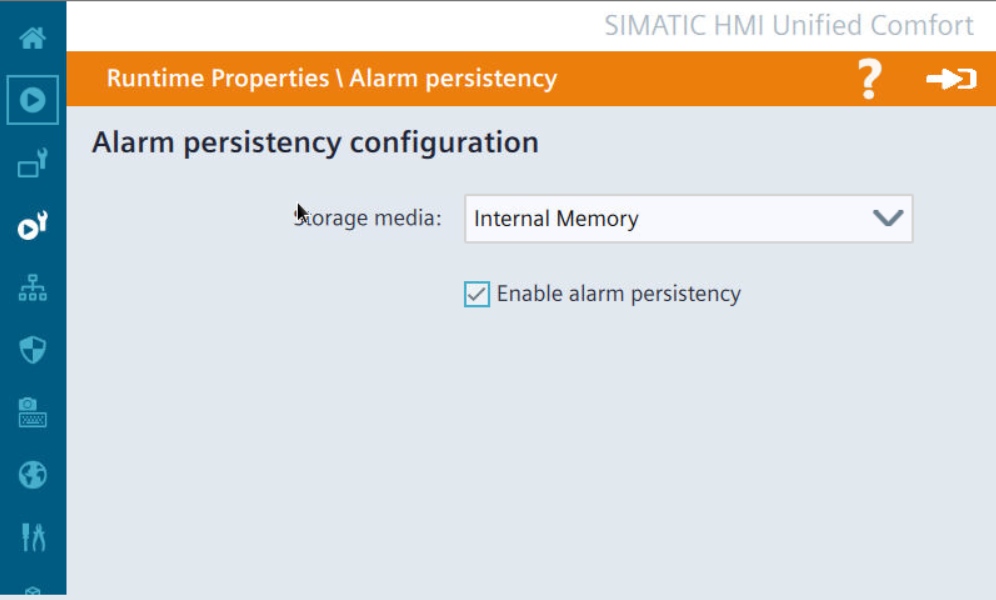

# Alarmy
## Alarmy – bufor alarmów

`bufor` `buffer` `alarm` `persistency`

Bufor alarmowy w przypadku paneli Unified działa na innych zasadach niż dla HMI starszej generacji. Służy on podtrzymywaniu informacji o stanie aktywnych alarmów (a w zasadzie o fakcie ich potwierdzenia) na wypadek zaniku zasilania / wyłączenia HMI.

Sposób działania bufora ilustruje przykład w poniższej tabeli:

| **Zdarzenie** | **Bufor nieaktywny** | **Bufor aktywny** |
| --- | --- | --- |
| Zaistnienie przyczyny alarmu | Stan „Incoming” | Stan „Incoming” |
| Potwierdzenie alarmu przez operatora | Stan „Incoming / acknowledged” | Stan „Incoming / acknowledged” |
| Restart runtime lub HMI przy aktywnej przyczynie alarmu | Stan „Incoming” | Stan „Incoming / acknowledged” |

Jeżeli istnieje potrzeba konfiguracji bufora o funkcjonalności takiej jak dla starszych paneli, to konieczne będzie uruchomienie logowania zmiennych do bazy danych SQLite.

## Alarmy – loop in alarm

`loop` `loop-in` `alarm`

W WinCC Unified nie przewidziano funkcjonalności „loop in alarm” znanej z WinCC V7/8. Nie mniej, możliwe jest wdrożenie podobnego mechanizmu w oparciu o skrypt. Sposób działania jest następujący:

- Pojawia się alarm, który jest widoczny w kontrolce;
- W Alarm Control należy wybrać wiersz tego alarmu (aby nawigować po wierszach musi być aktywny przycisk );
- Akcja przypisana do alarmu (np. zmiana ekranu, zmiana wartości zmiennej) wykonywana jest po kliknięcie przycisku );
- Informacja o skonfigurowanej akcji niesiona jest w „Info text” alarmu.

Podczas otwierania [projektu przykładowego](https://siemens.sharepoint.com/:f:/r/teams/RC-PLDIFAAPC/Shared%20Documents/Projekty/PROJEKTY/FY25/Unified%20FAQ/35?csf=1&web=1&e=1uVztc) w docelowej wersji TIA Portal, pojawi się okno migracji. Po udanym podniesieniu wersji projektu, należy podmienić wersję WinCC Unified PC za pomocą funkcji „Change device / version”.

## Alarmy – baner alarmowy

`alarm` `baner` `banner`

W WinCC Unified sugerowanym sposobem prezentacji alarmów i ostrzeżeń jest obiekt „Alarm control” wyświetlany w formie tabeli bądź pojedynczej linii, która zawiera tekst najnowszego aktywnego alarmu. Niekiedy wymagane jest rozszerzenie funkcjonalności linii alarmów, tak aby zachowywała się jak baner, który rotuje pomiędzy aktywnymi alarmami (opcjonalnie ze wskazaniem klasy alarmów). W tym przypadku trzeba zrezygnować z mechanizmów systemowych, i wdrożyć obiekt samodzielnie, stosując obiekty z przybornika i odpowiednie dynamizacje.

Szablon baneru udostępniono w formie [przykładowego projektu](https://siemens.sharepoint.com/:f:/r/teams/RC-PLDIFAAPC/Shared%20Documents/Projekty/PROJEKTY/FY25/Unified%20FAQ/36?csf=1&web=1&e=T8NAEC). Jest to wersja robocza, która wymaga dostosowania do wymagań aplikacji. Sposób działania baneru przedstawiono na [filmie demonstracyjnym](https://siemens.sharepoint.com/:f:/r/teams/RC-PLDIFAAPC/Shared%20Documents/Projekty/PROJEKTY/FY25/Unified%20FAQ/36?csf=1&web=1&e=T8NAEC). Jest to pole tekstowe
