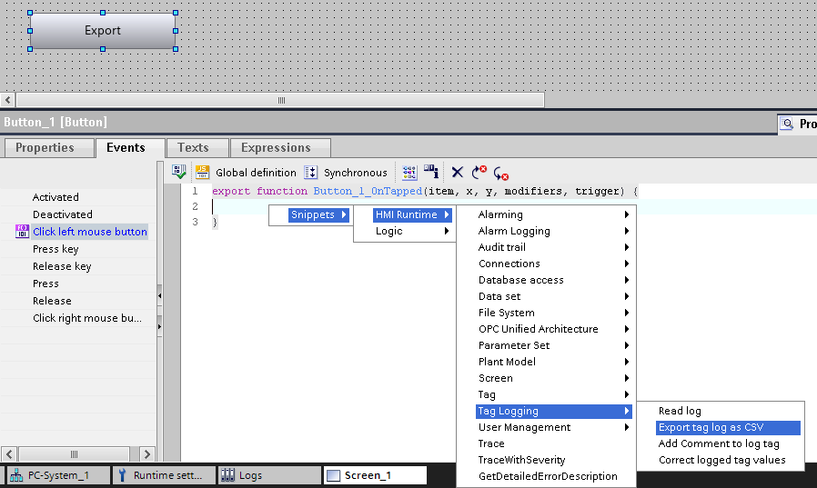
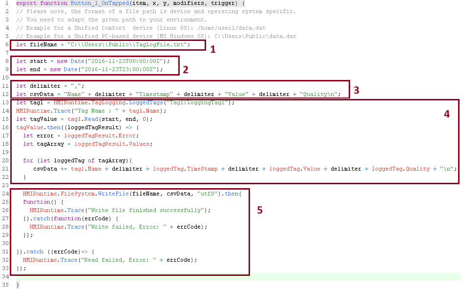
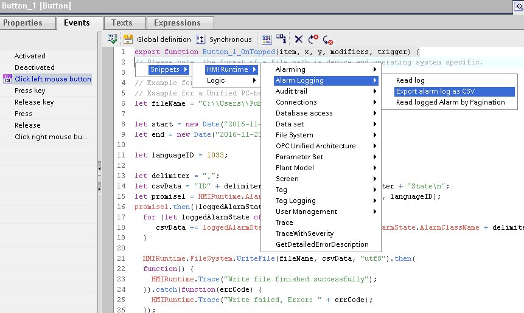
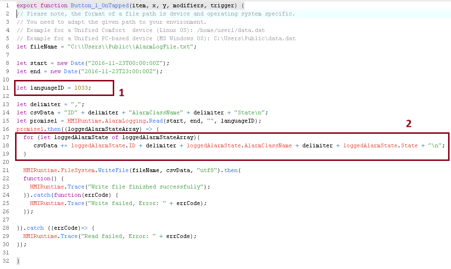
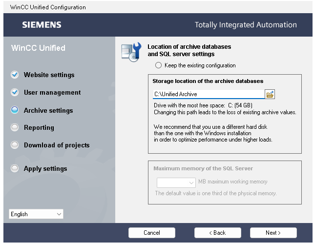
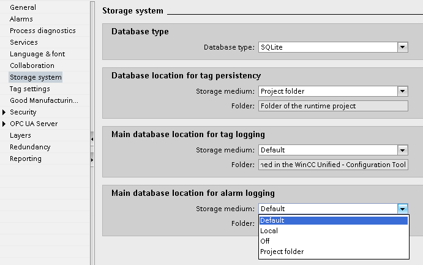
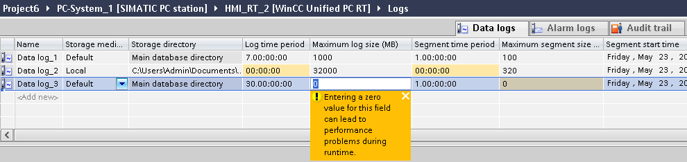

# Archiwizacja
## Archiwizacja – eksport do pliku csv

`export` `eksport` `csv` `log` `logging` `tags` `alarms` `tagi` `alarmy`

W systemie Unified archiwalne wartości zmiennych domyślnie zapisywane są w bazie danych SQLite, do plików o formacie .db3. W ramach wizualizacji odczyt informacji zawartych w plikach realizowany jest przez kontrolkę trendów. Poza WinCC Unified dostęp do danych w surowej formie jest możliwy przy użyciu specjalnych narzędzi (np. [DB Browser for SQLite](http://sqlitebrowser.org/)). Dane są przechowywane w schemacie relacyjnej bazy danych, zatem przedstawienie ich w formie czytelnej dla człowieka (na przykład w celu wykonania raportu) wymaga odpowiedniej obróbki.

Jak wiadomo, o wiele łatwiej pracuje się z danymi zapisanymi w pliku tekstowym, np .csv. Mechanizm bezpośredniego logowania wartości zmiennych do pliku .csv należy stworzyć ręcznie, za pomocą skryptu obsługującego pliki w pamięci panelu. Problematyczne staje się wtedy wyświetlenie danych na ekranie wizualizacji, ponieważ nie przetworzy ich kontrolka trendów – konieczne będzie ręczne zaimplementowanie takiej funkcjonalności (np. w postaci CWC na bazie [chart.js](https://www.chartjs.org/docs/latest/)).

Rozwiązaniem łączącym zalety obu podejść jest archiwizacja zmiennych w oparciu o mechanizmy systemowe i cykliczny bądź zdarzeniowy eksport fragmentu bazy danych do pliku w formacie .csv. Wdrożenie funkcjonalności ułatwia szablon kodu, który można znaleźć w ścieżce „Snippets > HMI Runtime > Tag Logging > Export tag log as CSV”:



Szablon trzeba, rzecz jasna, dostosować do wymagań aplikacji. Poniżej objaśnienie struktury skryptu oraz propozycje konfiguracji.



Sekcja 1 zawiera definicję ścieżki zapisu pliku, jego nazwy i formatu. Struktura tego łańcucha znaków powinna odpowiadać zastosowanej platformie sprzętowej. Niezależnie od urządzenia, należy zadbać o to, żeby była to ścieżka istniejąca, dla której użytkownik uruchamiający wizualizację ma prawa zapisu plików. Dla Unified PC może to być np. podfolder lokalizacji archiwów wskazanej w Unified Configurator.

```javascript
let fileName1 = "D:\\UnifiedArchive\\csv_logs\\log.csv";
//PC z systemem Windows
let fileName2 = "/home/industrial/logged_data.txt";
//Panel Unified, pamięć wewnętrzna
let fileName3 = "/home/industrial/export/report_" + current_date + ".csv";
//nazwa pliku tworzona dynamicznie, zmienna current_date przechowuje datę w formacie string
```

W drugim bloku skryptu należy zdefiniować zakres czasowy eksportowanych danych. Domyślnie są to wartości statyczne. Można jednak zapewnić większą elastyczność korzystając ze zmiennych (wskazanie początkowego i końcowego stempla czasowego na ekranie, przez użytkownika) bądź definiując zakres jako np. ostatnia godzina, ostatni dzień itp. Poniżej przykład definicji zakresu czasu jako „ostatnie 24 godziny”.

```javascript
let end = new Date();
let start = new Date(end.getTime() – 1000 * 60 * 60 * 24);
```

Sekcja 3 służy definicji nagłówka pliku tekstowego oraz separatora danych. W większości przypadków wystarczą wartości domyślne.

Blok 4 ma na celu realizację odczytu informacji na temat zmiennych z bazy danych i przepisanie ich do łańcucha znaków. W szablonie zaimplementowano mechanizm pobierania wartości i stempla czasowego tylko jednej zmiennej, o nazwie podanej w pierwszej linijce sekcji. Nazwę należy podać w formacie „&lt;nazwa_taga&gt;:&lt;nazwa_logging_taga&gt;” – najlepiej odczytać w edytorze HMI Tags. Struktura zmiennej przetwarzanej w pętli for powinna odpowiadać tej zadeklarowanej dla nagłówka w sekcji 3. Jeżeli raport powinien obejmować kilka zmiennych, konieczna będzie [przebudowa tego fragmentu kodu](https://youtu.be/wFXAXEadgzM?si=8HBMb1ZvIfwH2p7o).

W ostatnim, piątym akapicie skryptu wykonywana jest obsługa pliku tekstowego.

Dobierając zakres czasowy eksportu i liczbę zmiennych objętych raportem, należy mieć na uwadze fakt, że tworzenie pliku .csv wykonywane jest linijka po linijce. W związku z tym, przy archiwizacji z dużą częstotliwością, czas wykonywania skryptu może znacząco wzrastać, ostatecznie blokując wykonywanie innych akcji, a nawet prowadzić do tymczasowego zamrożenia wizualizacji.

Eksport bazy danych do pliku w formacie .csv możliwy jest również dla archiwum alarmów. Szablon kodu można znaleźć pod ścieżką „Snippets > HMI Runtime > Tag Logging > Export tag log as CSV”:



Struktura skryptu jest bardzo podobna jak dla eksportu archiwum wartości zmiennych. Dodatkowe kwestie, na które należy zwrócić uwagę, to wybór języka, w jakim będą przedstawione dane (sekcja 1) oraz interesujących nas atrybutów alarmów, czyli nagłówków kolumn (sekcja 2). W przypadku alarmów zbiór atrybutów jest szeroki. W przykładowym skrypcie każdy z nich jest podany w formie „loggadAlarmState.&lt;nazwa_atrybutu&gt;”. Lista dostępnych opcji znajduje się w [dokumentacji.](https://support.industry.siemens.com/cs/mdm/109896132?c=157611643275&lc=en-WW)



## Archiwizacja – konfiguracja bazy danych

`sqlite` `log` `archiwa` `segment`

W przypadku Unified PC Runtime, niezależnie od docelowego sposobu archiwizacji wartości zmiennych i alarmów (SQLite lub MS SQL), przy przejściu przez WinCC Unified Configuration należy wskazać domyślną lokalizację, w której będą zapisywane bazy danych. Tutaj trafiają także dane zebrane w efekcie uruchomienia symulacji.

Jeżeli na komputerze zainstalowany jest pakiet dodatkowy Unified Database Storage, w tym miejscu podać należy również rozmiar pamięci RAM przydzielonej instancji MS SQL.



Kolejne ustawienia systemu archiwizacji znajdziemy już w projekcie wizualizacji, w TIA Portal, w „Runtime settings > Storage system”. W tym miejscu zarządza się typem bazy danych oraz lokalizacją, do której trafiają zapisywane wartości zmiennych archiwalnych („tag logging”), alarmy („alarm logging”) oraz zmienne podtrzymywane („tag persistency”).

Jeżeli mamy do dyspozycji panel operatorski, dane są logowane zawsze w formacie SQLite, koniecznie na zewnętrzny nośnik pamięci (USB-X61 / X62 lub karta SD na dane).

Dla wizualizacji komputerowych, zależnie od zainstalowanego oprogramowania, można wybrać typ SQLite lub MS SQL. Dla każdego z trzech obszarów archiwum można wskazać następujące lokalizacje docelowe:

- „Default” – folder wskazany w Unified Configuration,
- „Local” – dowolna ścieżka podana ręcznie,
- „Project folder” – folder skompilowanego projektu wizualizacji, zwykle lokalizacja „C:\\ProgramData\\SCADAProjects”



Dalsza konfiguracja baz danych zachodzi z poziomu edytora „Logs”. Tutaj należy utworzyć logi, które pozwalają na logiczną organizację bazy danych – pojedynczy log może zawierać np. zmienne o tym samym cyklu akwizycji bądź powiązane z konkretnym obiektem procesu.



Każdy log składa się z konfigurowalnej liczby segmentów. Segmenty są wypełniane danymi jeden po drugim. Po osiągnięciu maksymalnego rozmiaru lub czasu archiwizacji, najstarszy segment jest usuwany. Tworzony jest wtedy nowy segment. Dla zmiennych archiwalnych domyślne ustawienia zakładają rozpiętość całej bazy danych na 7 dni (zakładając, że nie przekroczymy limitów pamięci), gdzie co dzień usuwany jest najstarszy log.

Na zakres czasowy archiwizacji, a zatem i częstotliwość usuwania segmentów, możemy wpływać na wiele sposobów, przykładowo:

- Zwiększyć liczbę segmentów logu, zwiększyć rozpiętość czasową pojedynczego segmentu i zwiększyć rozpiętość czasową całej bazy danych;
- Zwiększyć rozmiar segmentów/logu, jeżeli będzie archiwizowana duża liczba zmiennych;
- Ustawić „0” w kolumnach „Segment time period" i „Log time period", aby brane pod uwagę były tylko ograniczenia związane z rozmiarem segmentu/logu;
- Ustawić „0” w kolumnach „Maximum log size (MB)” i „Maximum log size (MB)”, aby brane pod uwagę były tylko ograniczenia związane z czasem trwania segmentu/logu.

Więcej informacji na temat systemu archiwizacji można znaleźć w [dokumentacji WinCC Unified](https://docs.tia.siemens.cloud/r/en-us/v20/logging-data-rt-unified/how-it-works-rt-unified).

## Archiwizacja – struktura bazy SQLite

`sqlite` `log` `pk` `id` `#db3`

informacje na temat nazwy taga przypisanej do danego ID znajdują się w konfiguracyjnej bazie danych. Poniżej oryginalna instrukcja:

The tag logging (the alarm logging as well) consists of two databases. One is the main database, for which you specify the location in the Runtime Settings -> Storage System, and the other one is the tag logging database itself. The main database contain all necessary configuration information that is needed to do the logging properly. The logging database then contains the logged values of the tags. The link between the tag name and the ID can be found in the main database. If you open the main database via the "DB Browser for SQLite" you find a table "LoggingTag" in there. When you open this table you have all Logging Tags listed with also their ID stated. The first Column (pk_Key) is the ID which is used in the logging database and the 7th Column (Name) specifies the tag name for that ID. So by checking the main DB you can find the link between tag and ID of the log-DB file.