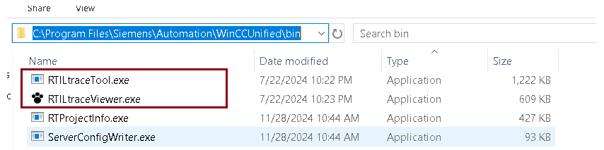
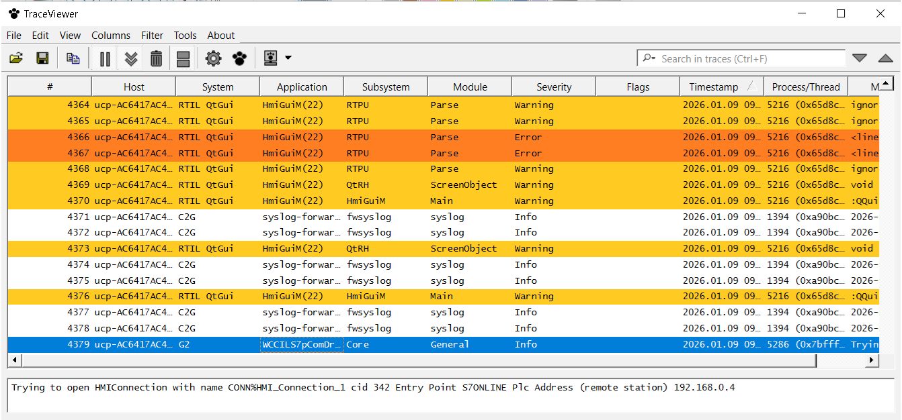
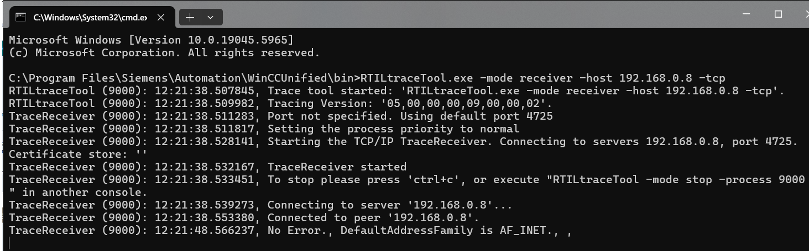
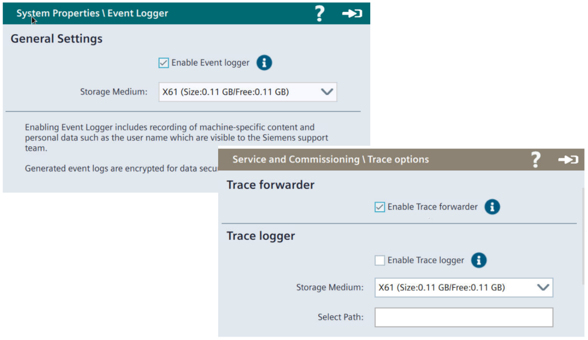

# Diagnostyka

## Diagnostyka – RTIL Trace Viewer

`diagnostyka` `logi` `trace` `rtil`

RTIL Trace Viewer to narzędzie diagnostyczne na PC (instalowane wraz z TIA Portal i Unified PC Runtime). Pozwala na obserwację logów generowanych w toku działania symulacji, wizualizacji uruchomionej lokalnie oraz wizualizacji na urządzeniach w tej samej sieci (panele, PC). Wszystkie scenariusze omówiono w [przykładzie aplikacyjnym](https://support.industry.siemens.com/cs/ww/en/view/109777593). Najczęstsze zastosowania narzędzia to:

- uproszczona analiza wykonywania skryptów bądź funkcji systemowych (prosta w obsłudze alternatywa dla debuggera Chrome dla wizualizacji lokalnych);
- odczyt informacji systemowych (syslog) związanych m.in. z systemem operacyjnym, pamięcią urządzenia, podłączanymi urządzeniami zewnętrznymi;
- weryfikacja poprawności działania usług (np. Audit, UMC, OPC Server, połączenia z PLC).

Standardowa ścieżka, pod którą można znaleźć aplikację to „C:\\Program Files\\Siemens\\Automation\\WinCCUnified\\bin”.

Program „RTILtraceViewer.exe” umożliwia przeglądanie i analizę logów. Zwykle niezbędne okazuje się nałożenie odpowiedniego filtru oraz zatrzymanie odświeżania listy. Błędy (Error) sygnalizowane są kolorem pomarańczowym, zdarzenia wymagające uwagi (Warning) zakreślone są na żółto, a wszelkie informacje (Info) wyświetlane są na białym tle.

Aplikacja „RTILtraceTool.exe” służy do nawiązywania połączenia z urządzeniem zdalnym. W tym celu na urządzeniu docelowym powinna być aktywowana opcja wysyłania danych diagnostycznych („trace forwarder”).

Istnieje również możliwość analizy w trybie offline zgromadzonych wcześniej logów („trace logging”). W przypadku wizualizacji komputerowych funkcjonalność aktywowana jest lokalnie, w oknie „RTILtraceViewer.exe”. Dla paneli operatorskich należy uruchomić opcję „Enable Trace logger” / „Enable Event logger” bezpośrednio na urządzeniu.

