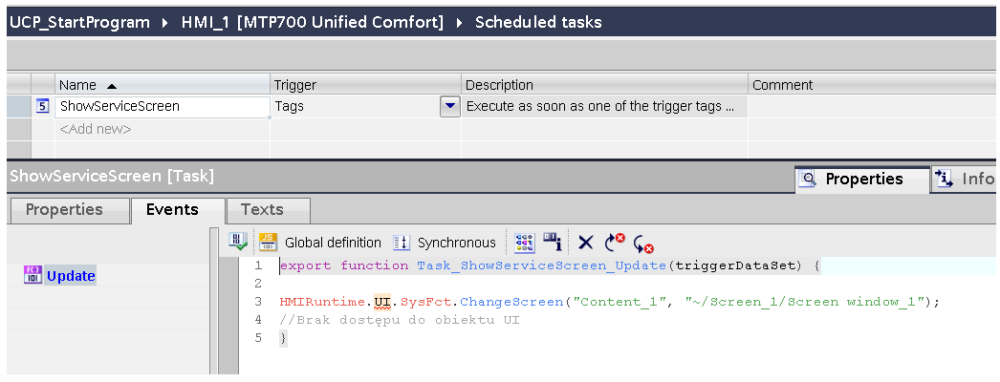
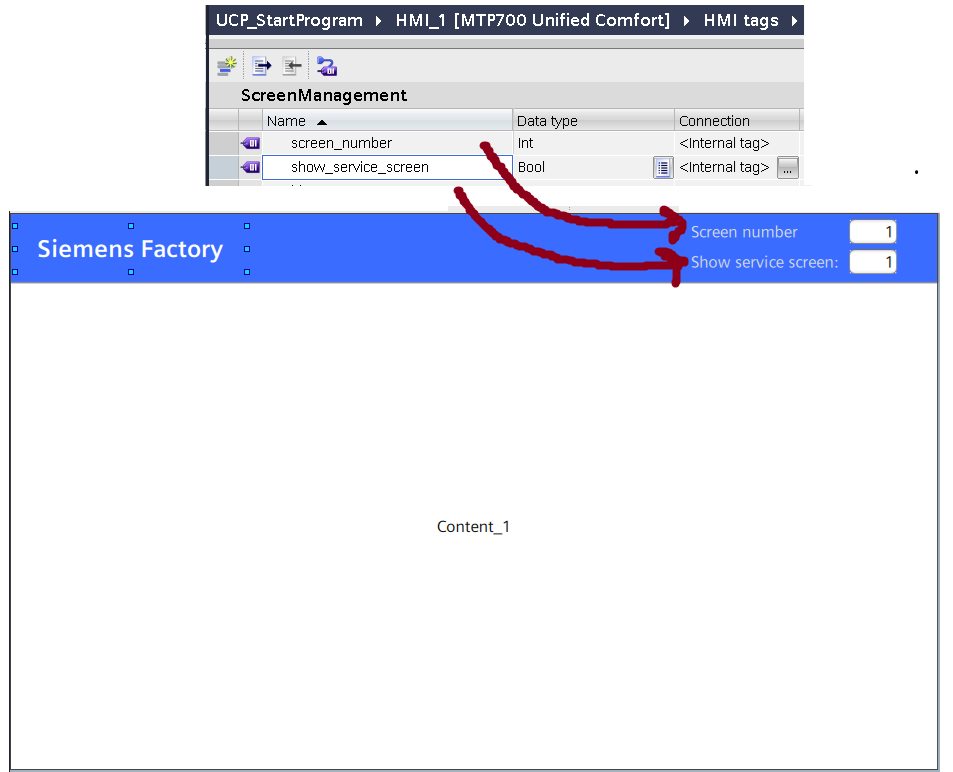
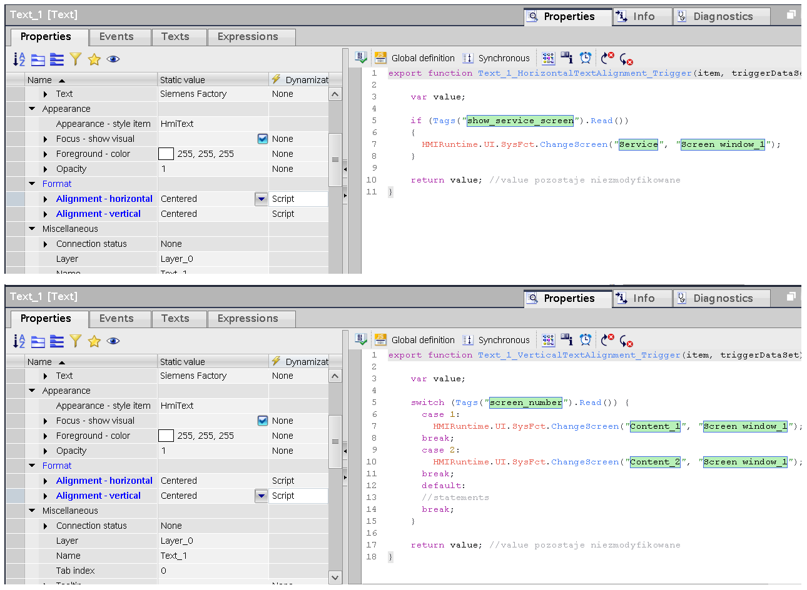
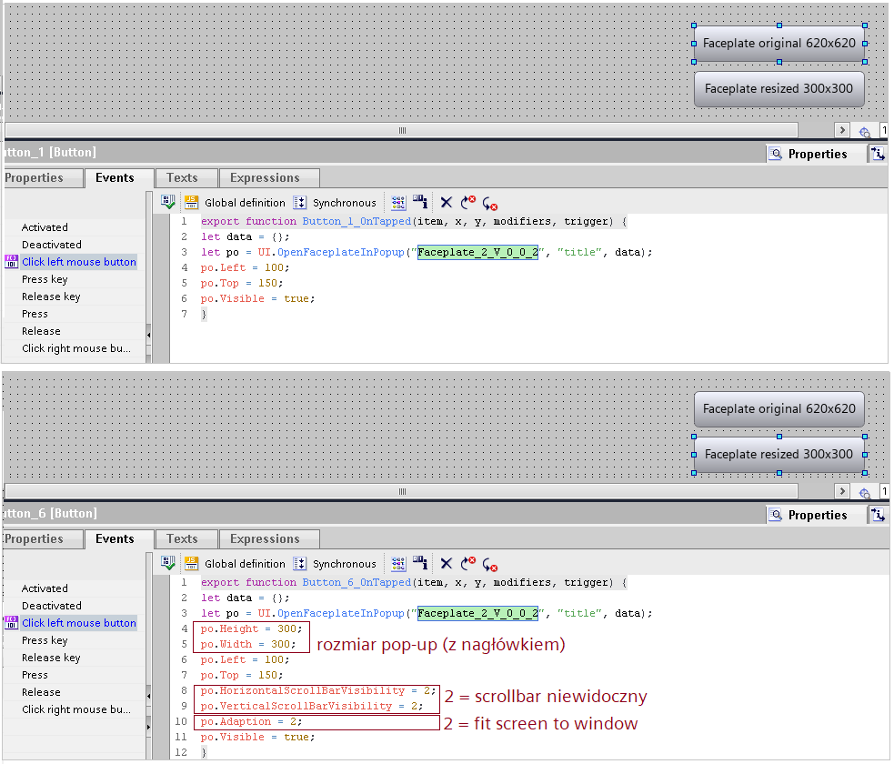
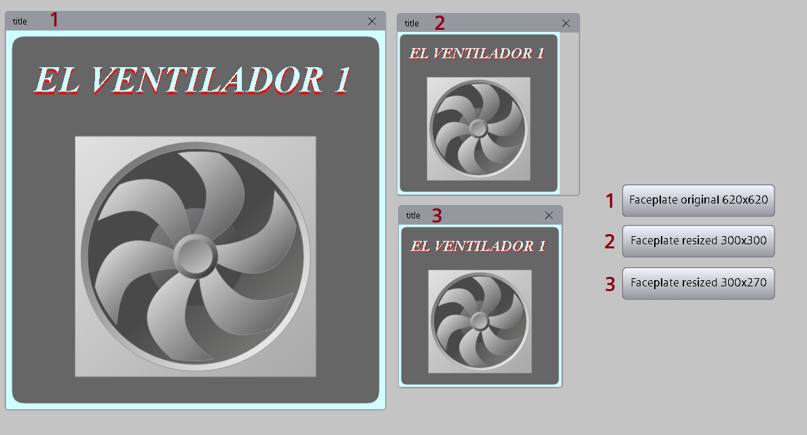
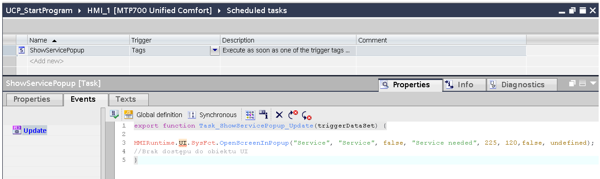
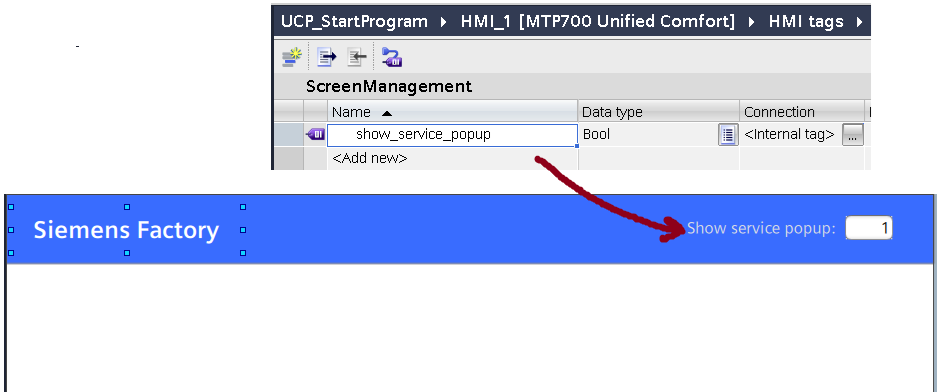
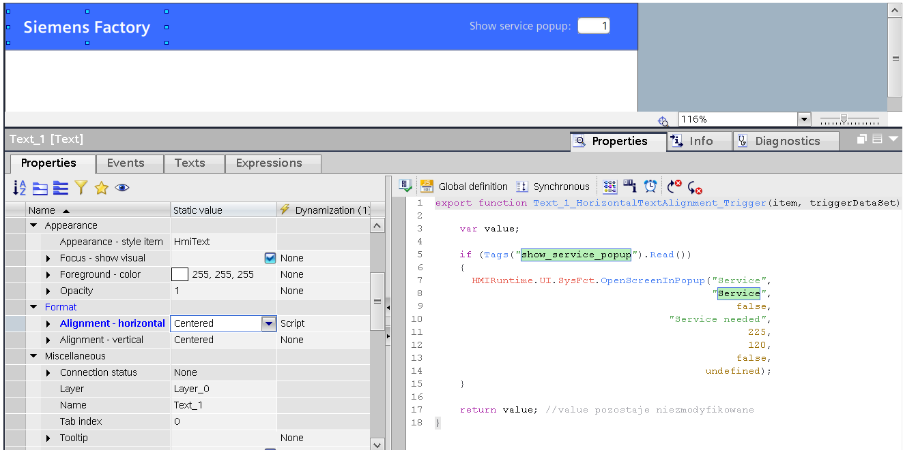

# Ekrany
## Ekrany – zmiana ekranu za pomocą zmiennej

`screen` `change` `ekran` `number` `numer` `tag`

Niektóre aplikacje wymagają, aby zmiana wartości określonej zmiennej (np. na drodze realizacji programu PLC) wiązała się z wyświetleniem pewnego ekranu (w screen window lub globalnie). W przypadku wizualizacji Comfort/Advanced tego typu funkcjonalność konfigurowana była w edytorze „HMI tags”, na event „Value change” konkretnej zmiennej. W Unified reakcję na zmianę wartości taga definiuje się w sekcji „Scheduled Tasks”. Pojawia się jednak pewne istotne ograniczenie – brak możliwości skorzystania z obiektu „HMIRuntime.UI” reprezentującego interfejs graficzny. Oznacza to, że z tego poziomu nie jest możliwe odwoływanie się do istniejących ekranów oraz zarządzanie ich zawartością.



Aby dało się zrealizować zagadnienie wizualizacja musi mieć jakiś obszar, który jest stale widoczny – np. nagłówek. Do dowolnej właściwości (najlepiej nieistotnej) dowolnego obiektu w ramach nagłówka (obiekt może być niewidoczny lub używany w innym celu) należy podpiąć skrypt reagujący na zmianę wartości zmiennej.

W zaprezentowanym poniżej przykładzie użyto dwóch zmiennych: „screen_number” do sterowania numerem ekranu wyświetlanego w screen window poniżej nagłówka oraz „show_service_screen”, której stan wysoki powoduje zmianę ekranu na serwisowy.



Skrypty realizujące powyższe założenia zakotwiczono pod właściwościami z grupy „Alignment” obiektu „Text_1” w nagłówku (napis „Siemens Factory”).



```javascript
//zmiana ekranu za pomocą "screen_number"
    var value;
    switch (Tags("screen_number").Read()) {
      case 1:
        HMIRuntime.UI.SysFct.ChangeScreen("Content_1", "Screen window_1");
      break;
      case 2:
        HMIRuntime.UI.SysFct.ChangeScreen("Content_2", "Screen window_1");
      break;
      default:
      break;
    }
    return value; //value pozostaje niezmodyfikowane
```

```javascript
//wyświetlenie ekranu serwisowego gdy "show_service_screen" jest w stanie "true"
   var value;
    if (Tags("show_service_screen").Read())
    {
      HMIRuntime.UI.SysFct.ChangeScreen("Service", "Screen window_1");
    }
    return value; //value pozostaje niezmodyfikowane
```

Sposób działania funkcjonalności przedstawiono na [filmie demonstracyjnym.](https://siemens.sharepoint.com/:f:/r/teams/RC-PLDIFAAPC/Shared%20Documents/Projekty/PROJEKTY/FY25/Unified%20FAQ/61?csf=1&web=1&e=8jlhOb) Jeżeli wizualizacja nie ma stałego fragmentu (stworzona jest z ekranów podmienianych „w całości”), konieczne będzie skonfigurowanie stosownych skryptów na każdym ekranie z osobna.

## Ekrany – zmiana rozmiaru faceplate

`fpt` `faceplate` `popup` `pop-up` `size` `rozmiar` `js` `script` `skrypt`

Stworzyłem faceplate w postaci prostokąta o wymiarach Height = 200 i Width = 400. Założyłem, że lewy obszar 200x200 to informacje ogólne, a prawy 200x200 to detale, które domyślnie mają być niewidoczne.

Z takim wywołaniem zachowuje się to w oczekiwany sposób:

Event na click:

```javascript
let data = {};
let po = UI.OpenFaceplateInPopup(“diagnostyka_V_0_0_1”, “diagnostyka”, data, undefined, false, “diagnostyka”, false);
po.WindowFlags = 0;
po.Height = 200;
po.Width = 200;
po.Left = 200;
po.Top = 150;
po.HorizontalScrollBarVisibility = 2;
po.VerticalScrollBarVisibility = 2;
po.Visible = true;
```

Mogła mi się wkraść literówka.

“false”, ostatni, odpowiada za możliwość dostosowywania rozmiaru okna. Wyłączyłem też scrollbary, ponieważ domyślnie pozwalają przewijać na niewidoczny obszar.

Proszę spróbować podpiąć coś takiego pod przycisk wewnątrz faceplate:

Na event “Click left mouse button”:

```javascript
Let ui = UI;
ui.PopupScreenWindows[0].Adaption = 0;
ui.PopupScreenWindows[0].Width = 400;
```

U mnie to zadziałało. Możliwe, że w docelowej wizualizacji trzeba będzie namierzyć indeks w nawiasie kwadratowym, a nie podać go z ręki.

## Ekrany – automatyczne skalowanie faceplate w oknie pop-up

`faceplate` `pft` `pop-up` `popup` `js` `script` `skrypt` `resize` `scale`

Przy tworzeniu faceplate’ów, wszystkie wymiary podawane są jako statyczne. We właściwościach faceplate’a nie znajdziemy opcji automatycznego skalowania obiektu do rozdzielczości ekranu zastosowanego urządzenia. Jeżeli faceplate’y wyświetlane są w ramach obiektu faceplate container, gdy ustawi się „Fit screen to window”, fpt jest automatycznie skalowany do rozmiaru kontenera. Problem pojawia się w przypadku wywołania fpt w oknie pop-up. Standardowe wywołanie funkcji OpenFaceplateInPopUp() zakłada, że fpt zostanie wyświetlony w oryginalnym rozmiarze. Aby wyświetlić faceplate w innym rozmiarze, najlepiej zmodyfikować wywołanie jak poniżej.



Efekt



1 to faceplate w oryginalnym rozmiarze. 2 to faceplate, który chcieliśmy wyświetlić w rozmiarze 300x300. Widać, że pojawiła się pusta przestrzeń. Rozmiar okna podajemy **razem z nagłówkiem_._** W związku z tym, gdy dla okna 2 podałem rozmiar 300x300, „część użyteczna” nie jest kwadratowa.Gdy w 3 zmniejszyłem odrobinę szerokość, „część użyteczna” jest kwadratowa i ma rozmiar 270x270.Trzeba by jeszcze to sprawdzić na HMI. Na symulacji nagłówek ma stale 30 px, niezależnie od rozdzielczości panelu.

## Ekrany – faceplate in faceplate, zmiana interfejsu

`faceplate` `fpt` `interface` `pop-up` `popup` `js` `script` `skrypt`

Wracając do tematu otwierania faceplate z poziomu facplate to jest czy szansa aby to zrobić i podpiąć inne zmienne pod otwierane okno ?

Standardowo w funkcjonalności „faceplate in faceplate”, faceplate potomny otwierany jest za pomocą składni „Faceplate.OpenFaceplateInPopup(..)” i dziedziczy interfejs po rodzicu. Można by zatem utworzyć zbiorczy UDT obejmujący dane dla rodzica i potomka. Coś takiego opisano tutaj: https://support.industry.siemens.com/cs/bo/en/view/109812366 (Rozdziały 2, 3.6.3)

Jeśli mielibyśmy wskazać inny interfejs – wątpię czy to się uda, bo z wewnątrz faceplate’a nie ma dostępu do tagów globalnych. Sprawdzę.

Próbowałem na różne sposoby, ale jest to skutecznie zablokowane. Sama funkcja OpenFaceplateInPopup wywoływana wewnątrz faceplate’a nie przyjmuje argumentu „interface”.

## Ekrany – okno pop-up otwierane za pomocą zmiennej

`popup` `pop-up` `screen` `ekran` `tag`

Częstym wymaganiem jest, aby zmiana wartości określonej zmiennej (np. na drodze realizacji programu PLC) wiązała się z wyświetleniem okna dialogowego (pop-up) z ostrzeżeniem, informacją lub działaniem do podjęcia. W przypadku wizualizacji Comfort/Advanced tego typu funkcjonalność konfigurowana była w edytorze „HMI tags”, na event „Value change” konkretnej zmiennej. W Unified reakcję na zmianę wartości taga definiuje się w sekcji „Scheduled Tasks”. Pojawia się jednak pewne istotne ograniczenie – brak możliwości skorzystania z obiektu „HMIRuntime.UI” reprezentującego interfejs graficzny. Oznacza to, że z tego poziomu nie jest możliwe odwoływanie się do istniejących ekranów oraz zarządzanie ich zawartością.



Aby dało się zrealizować zagadnienie wizualizacja musi mieć jakiś obszar, który jest stale widoczny – np. nagłówek. Do dowolnej właściwości (najlepiej nieistotnej) dowolnego obiektu w ramach nagłówka (obiekt może być niewidoczny lub używany w innym celu) należy podpiąć skrypt reagujący na zmianę wartości zmiennej.

W zaprezentowanym poniżej przykładzie użyto zmiennej „show_service_popup”, której stan wysoki powoduje wyświetlenie serwisowego okna dialogowego.



Skrypt realizujący tę funkcjonalność zakotwiczono pod właściwością „Alignment - horizontal” obiektu „Text_1” w nagłówku (napis „Siemens Factory”).

```javascript
//wyświetlenie okna pop-up gdy "show_service_popup" przyjmie wartość "true"
    var value;
    if (Tags("show_service_popup").Read())
    {
      HMIRuntime.UI.SysFct.OpenScreenInPopup("Service",
                                             "Service",
                                                 false,
                                      "Service needed",
                                                   225,
                                                   120,
                                                 false,
                                            undefined);
    }
    return value; //value pozostaje niezmodyfikowane
```



Sposób działania funkcjonalności przedstawiono na [filmie demonstracyjnym.](https://siemens.sharepoint.com/:f:/r/teams/RC-PLDIFAAPC/Shared%20Documents/Projekty/PROJEKTY/FY25/Unified%20FAQ/65?csf=1&web=1&e=dF3sfz) Jeżeli wizualizacja nie ma stałego fragmentu (stworzona jest z ekranów podmienianych „w całości”), konieczne będzie skonfigurowanie stosownych skryptów na każdym ekranie z osobna.

## Ekrany – zmiana właściwości obiektu wewnątrz pop-up w trakcie otwierania

`pop-up` `popup` `js` `script` `skrypt`

Miałem okazję zbadać sprawę GetSelectedAlarmAttributes. W zaproponowanym przeze mnie rozwiązaniu tekst nie wpisuje się do pola tekstowego przy pierwszym naciśnięciu przycisku. Dzieje się to dopiero po jego ponownym naciśnięciu.

W związku z tym należy podejrzewać, że przyczyną takiego zachowania jest fakt, że pop-up nie zdąży się do końca załadować, gdy podejmujemy próbę wpisania tekstu do jego wewnętrznego obiektu. Sprawę rozwiązuje wprowadzenie małej, 100 ms zwłoki w skrypcie (wiem, jest to nieeleganckie, ale troszkę wygodniejsze niż osobny przycisk).

Zmodyfikowany kod, który zamieszczamy w tym samym miejscu co poprzednio:

Przykładowy skrypt z GetSelectedAlarmAttributes nie zawiera funkcjonalności tworzenia okna pop up i przekazywania do niego danych na temat alarmu. Domyślnie dane lądują w postaci tekstowej w Trace, czyli w strumieniu wyjściowym narzędzia diagnostycznego RTILtraceViewer.exe w ścieżce C:\\Program Files\\Siemens\\Automation\\WinCCUnified\\bin\\

Najbardziej prymitywna modyfikacja:

1\. Dodać screena „Screen_2” z obiektem „Text box_1”, który będzie służył jako pop-up.

2\. Dodać dwie linijki kodu po HMIRuntime.Trace(traceText);

```javascript
HMIRuntime.UI.SysFct.OpenScreenInPopUp(„Alarm”, „Screen_2”, false, „Alarm attributes”, 0, 0, false, undefined);
let timer = HMIRuntime.Timers.SetTimeout(function() {
HMIRuntime.UI.SysFct.SetPropertyValue(„/Alarm/Text box_1”, „Text”, traceText);
}, 100);
```
