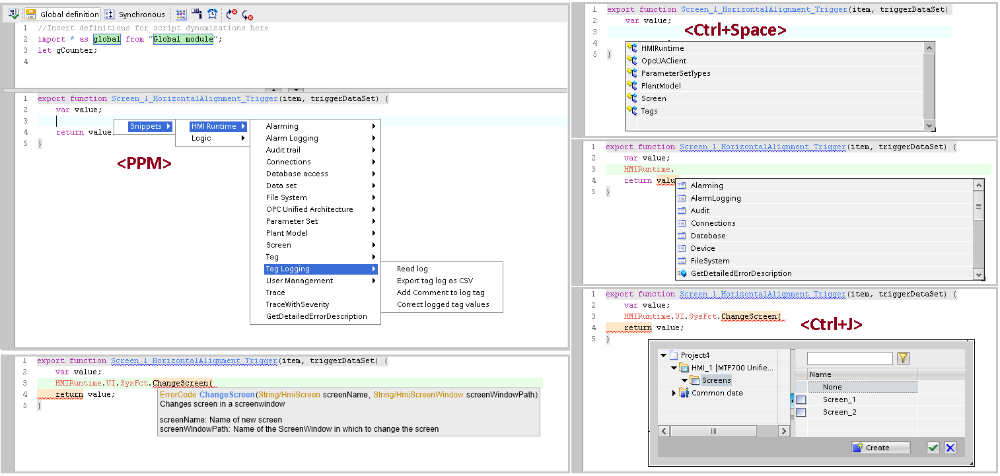
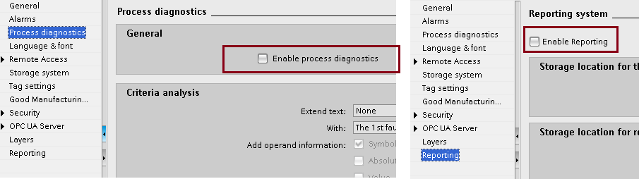
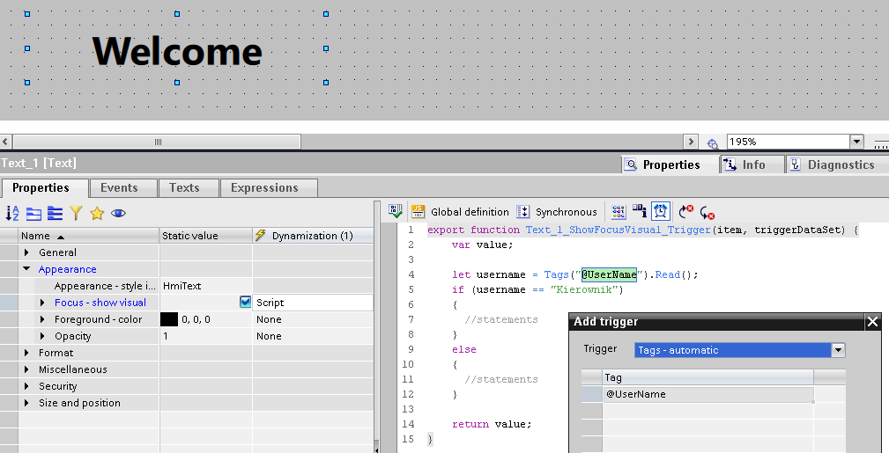

# Edytor skryptów

## Edytor skryptów
`js` `skrypt` `script` `vs` `debugger`

Edytor JavaScript zintegrowany z TIA Portal ma kilka przydatnych funkcjonalności:

- kolorowanie tekstu,
- podstawowe sprawdzanie poprawności składni,
- szablony (prawy przycisk myszy),
- obszar definicji zmiennych globalnych w zakresie dynamizacji i eventów,
- podręczną dokumentację w ramach tooltip (najechanie na odpowiedni fragment kodu),
- uzupełnianie kodu (skrót **&lt;Ctrl + Space&gt;**),
- wskazówki dla kodu (kropka po obiekcie),
- selektor obiektów (skrót **&lt;Ctrl + J&gt;** przy uzupełnianiu funkcji wymagającej obiektu).

Alternatywą dla wbudowanego edytora jest zastosowanie Visual Studio Code. [Dodatek JS Connector](https://support.industry.siemens.com/cs/pl/pl/view/109825899) pozwala na edytowanie modułów globalnych i skryptów bibliotecznych za pomocą VS Code. [Rozszerzenie RT Debugger](https://support.industry.siemens.com/cs/ww/en/view/109826630) umożliwia wprowadzanie i testowanie zmian w skryptach z poziomu VS Code, podczas działania aplikacji, bez potrzeby wgrywania projektu z TIA Portal.

## ES – aktywacja pakietów opcjonalnych w TIA

`prodiag` `reporting` `raporty` `audit` `gmp`

Czasami niektóre funkcjonalności nie działają jak należy, ponieważ nie zostaną aktywowane w `Runtime settings`. Zazwyczaj klienci zapominają o włączeniu ProDiag lub raportowania.

## ES – eventy dla zmiennych i alarmów

`events` `scheduled` `task` `@` `@username` `username`

W WinCC Comfort/Advanced, bezpośrednio przy tagach bądź alarmach możliwa była konfiguracja akcji w zakładce `Events`. W Unified akcje wywoływane na zmianę wartości zmiennej bądź zmianę stanu alarmu można skonfigurować w sekcji `Scheduled tasks`.

Istnieją pewien wyjątek – scheduler nie reaguje prawidłowo na zmianę wartości zmiennych systemowych **(np. „@Username”)**. Obejściem tego problemu jest podpięcie skryptu pod dowolną (nieużywaną) właściwość dowolnego (opcjonalnie niewidocznego) obiektu na ekranie, który jest stale widoczny (np. nagłówek, layout). Taki skrypt wywoływany jest każdorazowo po zmianie wartości wskazanej zmiennej systemowej i zakładając, że nie ingerujemy w argument `value`, nie modyfikuje on obiektu, do którego jest zakotwiczony.

