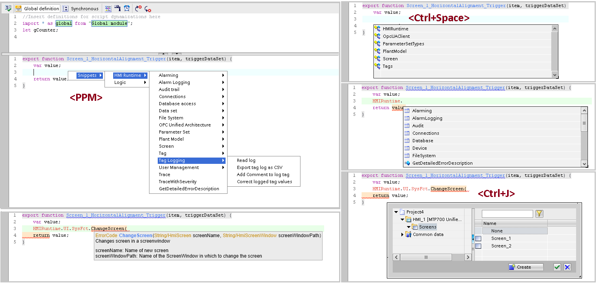
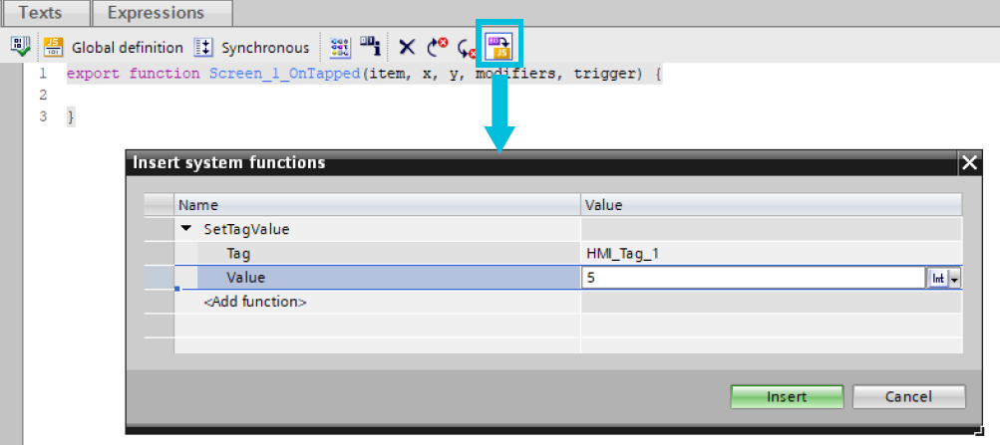

# Edytor skryptów

## Edytor skryptów
`js` `skrypt` `script` `vs` `debugger`

Edytor JavaScript zintegrowany z TIA Portal ma kilka przydatnych funkcjonalności:

- kolorowanie tekstu,
- podstawowe sprawdzanie poprawności składni,
- szablony (prawy przycisk myszy),
- obszar definicji zmiennych globalnych w zakresie dynamizacji i eventów,
- podręczną dokumentację w ramach tooltip (najechanie na odpowiedni fragment kodu),
- uzupełnianie kodu (skrót **&lt;Ctrl + Space&gt;**),
- wskazówki dla kodu (kropka po obiekcie),
- selektor obiektów (skrót **&lt;Ctrl + J&gt;** przy uzupełnianiu funkcji wymagającej obiektu),
- kreator wstawiania funkcji systemowych (od V21).

Alternatywą dla wbudowanego edytora jest zastosowanie Visual Studio Code. [Dodatek JS Connector](https://support.industry.siemens.com/cs/pl/pl/view/109825899) pozwala na edytowanie modułów globalnych i skryptów bibliotecznych za pomocą VS Code. [Rozszerzenie RT Debugger](https://support.industry.siemens.com/cs/ww/en/view/109826630) umożliwia wprowadzanie i testowanie zmian w skryptach z poziomu VS Code, podczas działania aplikacji, bez potrzeby wgrywania projektu z TIA Portal.

