# Komunikacja

## Komunikacja – REST API

`rest` `cw`c `control` `api`

Wiele systemów informatycznych udostępnia zasoby w ramach interfejsu REST API. Standardowo system Unified nie posiada mechanizmu wysyłania zapytań HTTP i przetwarzania odpowiedzi – w JS brak m.in. funkcji „XMLHttpRequest()” i metody „fetch()”. Nie mniej, w przypadku Unified PC RT lub panelu Unified Comfort tego typu komunikacja może być realizowana z zastosowaniem CWC (własnej kontrolki). Podstawą tworzenia własnej funkcjonalności może być [projekt przykładowy](https://siemens.sharepoint.com/:f:/r/teams/RC-PLDIFAAPC/Shared%20Documents/Projekty/PROJEKTY/FY25/Unified%20FAQ/20?csf=1&web=1&e=t7fMt5). Poniżej znajduje się widok głównego ekranu wraz z opisem najważniejszych elementów. Krótki [film](https://siemens.sharepoint.com/:f:/r/teams/RC-PLDIFAAPC/Shared%20Documents/Projekty/PROJEKTY/FY25/Unified%20FAQ/20?csf=1&web=1&e=t7fMt5) demonstruje sposób działania aplikacji.

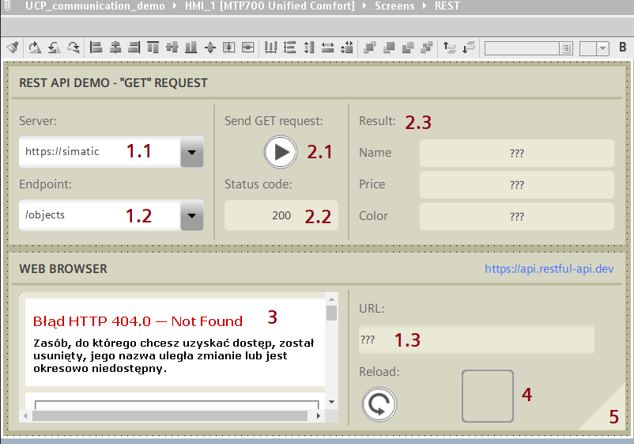

- Listy rozwijalne 1.1 i 1.2 służą do definicji adresu URL, na który będzie wysłane zapytanie HTTP.
- Adres jest zwracany przez pole 1.3.
- Do przycisku 2.1 podpięty jest skrypt wysyłający zapytanie z użyciem [metody](https://developer.mozilla.org/en-US/docs/Web/HTTP/Reference/Methods) GET.
- [Kod statusowy](https://developer.mozilla.org/en-US/docs/Web/HTTP/Reference/Status) informujący o stanie zapytania zwracany jest w polu 2.2.
- Odpowiedź serwera (po obróbce) trafia do obiektów w obszarze 2.3.
- Odpowiedź serwera w formie surowej widoczna jest w kontrolce przeglądarki 3.
- Obiekt 4 to CWC będące centrum aplikacji. W trakcie działania wizualizacji element jest niewidoczny, jednak jego obecność jest kluczowa, ponieważ z jego metod korzysta przycisk 2.1.
- Klikając w prawym dolnym rogu (5) można zmienić ekran na demonstrację połączenia z MS SQL.

## Komunikacja – połączenie z bazą MS SQL

`sql` `odbc` `driver` `connection` `ms` `db` `baza` `log`

Zarówno panele operatorskie Unified Comfort jak i Unified PC RT obsługują drivery ODBC, które służą do komunikacji z bazami danych MS SQL. Dostęp do zewnętrznej bazy danych realizowany jest w ramach skryptu JS. Połączenie nawiązywane jest za pomocą tzw. connection stringa, w który należy wypełnić parametrami klienta i serwera. Dwie rzeczy, na które należy zwrócić szczególną uwagę, to wersja drivera (jest ściśle powiązana z wersją systemu operacyjnego panelu lub programu Unified PC) oraz kwestie bezpieczeństwa połączenia (parametry „trusted_connection” i „TrustServerCertificate”). Zalecana jest analiza zagadnienia w oparciu o [dokumentację](https://docs.tia.siemens.cloud/r/en-us/v20/runtime-scripting-rt-unified/examples-rt-unified/connecting-unified-comfort-panel-with-sql-database-rt-unified) bądź wspomaganie się [przykładem aplikacyjnym](https://support.industry.siemens.com/cs/ww/en/view/109806573).

Punktem wyjścia przy tworzeniu własnej aplikacji może być [projekt przykładowy](https://docs.tia.siemens.cloud/r/en-us/v20/runtime-scripting-rt-unified/examples-rt-unified/connecting-unified-comfort-panel-with-sql-database-rt-unified) uzupełniony o [film demonstracyjny](https://docs.tia.siemens.cloud/r/en-us/v20/runtime-scripting-rt-unified/examples-rt-unified/connecting-unified-comfort-panel-with-sql-database-rt-unified). Poniżej znajduje się widok głównego ekranu wraz z opisem najważniejszych elementów.

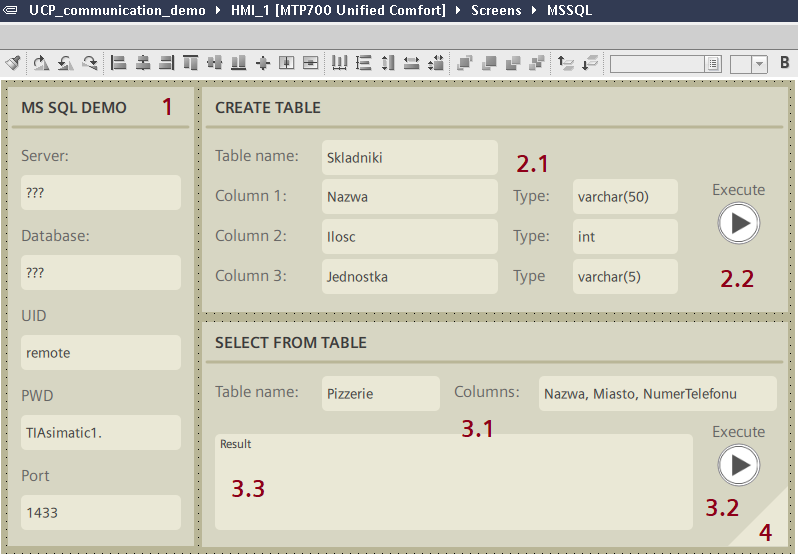

- Sekcję 1 należy wypełnić danymi serwera MS SQL. Parametry te zostaną wpisane w connection string.
- Przykład demonstruje zastosowanie dwóch kwerend. Pierwsza to tworzenie tabeli – w polach 2.1 należy wpisać nazwy kolumn oraz typy zmiennych. Skrypt realizujący zadanie podpięto pod przycisk 2.2.
- Druga kwerenda służy do wyświetlania danych z istniejącej tabeli. W polach 3.1 należy podać nazwę tabeli oraz interesujące nas kolumny. Po uruchomieniu zapytania (3.2) w polu 3.3 widnieje przetworzony rezultat zapytania.

## Komunikacja – zmiana parametrów połączenia z PLC

`connection` `ip` `address` `adres` `change`

Funkcja systemowa „ChangeConnection()” służy do modyfikacji parametrów połączenia z PLC SIMATIC S7 bez ingerencji w projekt HMI. Najczęściej zmiana dotyczy adresu IP sterownika, co pozwala na przełączanie między partnerami komunikacyjnymi.

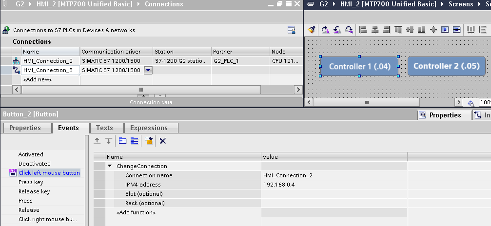

Połączenia zintegrowane (tworzone w edytorze "Devices & networks") korzystające z drivera "SIMATIC S7 1200/1500" są zabezpieczone certyfikatami cyfrowymi. Certyfikat takiego partnera komunikacyjnego zadeklarowanego w projekcie jest automatycznie uznawany za zaufany. Zmiana adresu IP w ustawieniach połączenia wiąże się z koniecznością ręcznego potwierdzenia certyfikatu nowego PLC bądź jego wcześniejszego importu.

Dla platformy Unified PC RT, po wywołaniu funkcji „ChangeConnection()”, certyfikat powinien być widoczny w SIMATIC Runtime Manager:

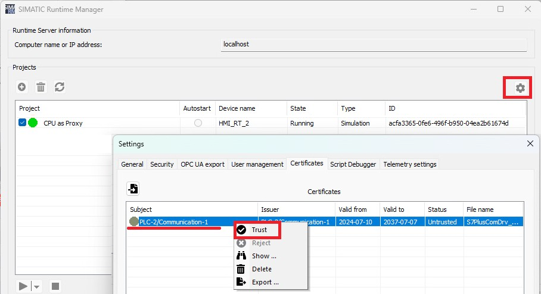

Certyfikaty partnerów niekonfigurowanych w projekcie można zaimportować do SIMATIC Runtime Manager z wyprzedzeniem, a następnie uznać za zaufane jeszcze przed zmianą parametrów połączenia:

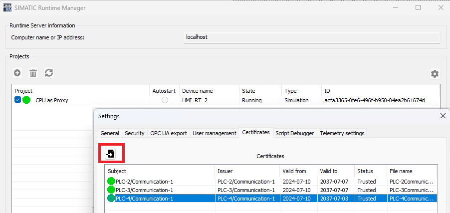

W przypadku panelu operatorskiego Unified, import certyfikatu nie jest możliwy (format nieakceptowany przez menedżer certyfikatów. Konieczne jest ręczne potwierdzenie:

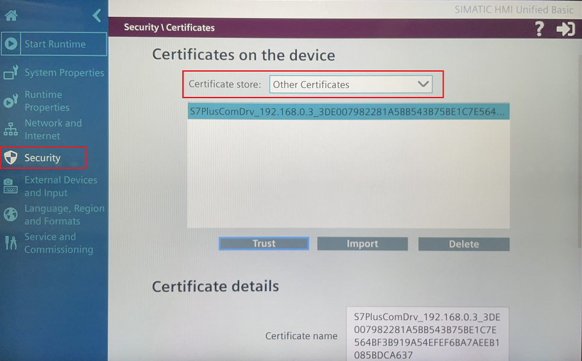

W obu przypadkach alternatywne podejście zakłada dezaktywowanie bezwarunkowego zabezpieczenia komunikacji po stronie PLC („Protection & security > Connection mechanisms > Only allow secure PG/PC and HMI communication”) i utworzenie połączenia niezintegrowanego (ręcznie, w edytorze „Connections” urządzenia HMI), do którego będzie się odwoływać funkcja „ChangeConnection()”.

## Komunikacja – dostępne drivery i tzw. CSP

`communication` `komunikacja` `driver` `channel` `csp`

Najbardziej przystępną informację na temat dostępnych driverów komunikacyjnych znajdziemy w sekcji „Connections”. Niektóre kanały dają możliwość wyboru typu/modelu CPU.

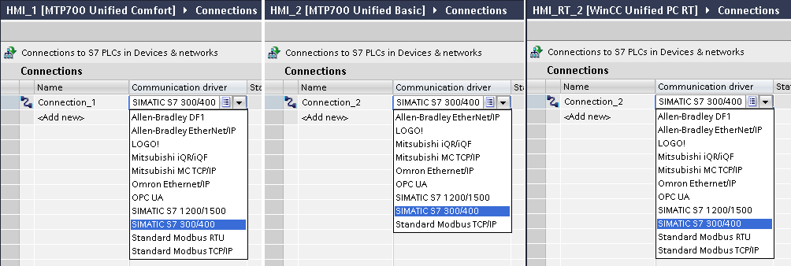

Ogólne informacje można znaleźć w [dokumentacji](https://docs.tia.siemens.cloud/r/en-us/v20/basics-rt-unified/basics-of-communication-rt-unified/networks-and-connections-rt-unified/connections-rt-unified/supported-plcs-and-communication-channels-rt-unified) WinCC Unified Engineering. Niestety szczegóły na temat driverów (np. wspierane linie PLC) znajdują się w osobnych poradnikach ([przykład dla A-B](https://support.industry.siemens.com/cs/ww/en/view/109976071)).

Wszystkie kanały komunikacyjne są dostępne dla standardowej instalacji WinCC Unified począwszy od wersji 17. Dla niektórych kanałów, w V16, konieczna była instalacja dodatkowych [Communication Support Packages (CSP)](https://support.industry.siemens.com/cs/ww/en/view/109779920).

## Komunikacja – cykl akwizycji danych

`acquisition` `cycle` `cykl`

Odświeżanie wartości zmiennych pochodzących z PLC po stronie HMI może zachodzić:

- cyklicznie (jeśli zmienna jest zastosowana na aktywnym ekranie bądź archiwizowana), gdy "Acquisition mode = Cyclic in operation", zgodnie z częstotliwością zdefiniowaną w polu "Acquisition cycle";
- na żądanie, gdy "Acquisition mode = On demand".

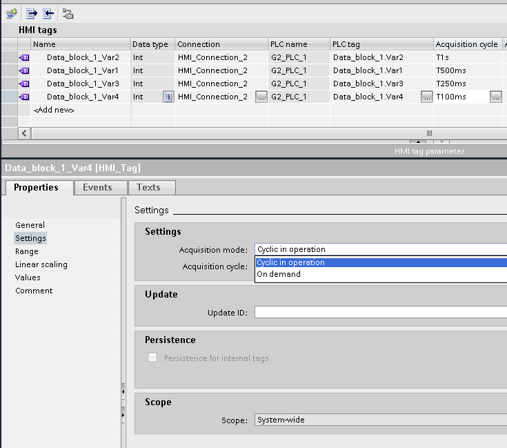

W przypadku wybrania „Acquisition mode = On demand", należy zdefiniować unikatowe ID zmiennej w polu „Update ID”. Aktualizacja wartości zmiennej zachodzi w wyniku wywołania funkcji systemowej „UpdateTag()”, gdzie jako argument należy podać wspomniane wcześniej ID zmiennej.

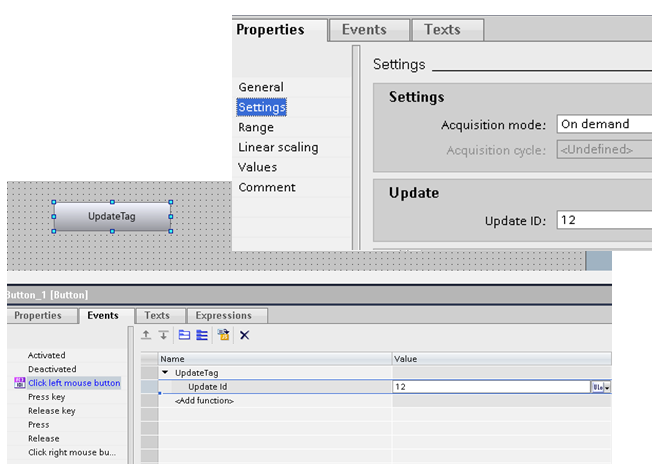

Przy aktualizacji cyklicznej domyślny interwał to 1 sekunda. Dla niektórych aplikacji (np. sterowanie napędami, procesy szybkozmienne, monitorowanie bitów zegarowych, detekcja heartbitu, zmienne czasowe) konieczne może być zwiększenie częstotliwości odczytu do 500 / 200 / 100 ms. Z drugiej strony, cykl można oczywiście wydłużyć.

## Komunikacja – dostęp do witryny bez zabezpieczeń (http)

`http` `https` `browser` `certificate` `certyfikat` `iis` `url`

Standardowo kontrolka przeglądarki internetowej w WinCC Unified służy do wyświetlania witryn zabezpieczonych, czyli korzystających z protokołu https. W przypadku paneli operatorskich, aby dostać się do witryny niezabezpieczonej (http), należy przekazać URL za pomocą zmiennej typu WString. Inaczej sprawa wygląda dla PC Runtime – tutaj taki zabieg nie jest możliwy – każdorazowo następuje modyfikacja URL do wersji z https. Aby osiągnąć cel, konieczne jest wprowadzenie pewnych modyfikacji w ustawieniach IIS. Przez procedurę poprowadzi [film instruktażowy](https://siemens.sharepoint.com/:f:/r/teams/RC-PLDIFAAPC/Shared%20Documents/Projekty/PROJEKTY/FY25/Unified%20FAQ/25?csf=1&web=1&e=dmMV8D).

Niestety, często zdarza się, że odpowiedź zwracana przez witrynę jest skompresowana, w wyniku czego wyświetlany jest błąd jak niżej:

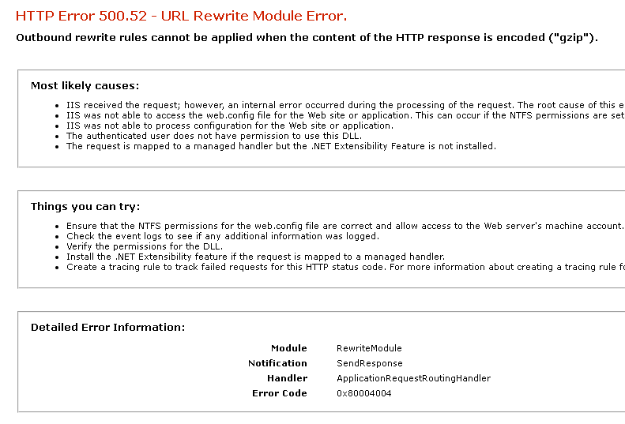

Jeżeli nie ma możliwości wyłączenia kompresji odpowiedzi serwera, konieczne jest dodanie po stronie klienta kolejnych reguł w module URL Rewrite (które informują, że klient nie akceptuje kompresji). Przykładów konfiguracji reguł można poszukiwać m.in. na stronie internetowej Microsoftu – w kilku przypadkach osiągnięto sukces dzięki podążaniu według tego [poradnika](https://siemens.sharepoint.com/:b:/r/teams/RC-PLDIFAAPC/Shared%20Documents/Projekty/PROJEKTY/FY25/Unified%20FAQ/25/IIS%20with%20URL%20Rewrite%20as%20a%20reverse%20proxy%20-%20part%202%20%E2%80%93%20dealing%20with%20500.52%20status%20codes%20_%20Microsoft%20Learn.pdf?csf=1&web=1&e=DgL9fv).

## Komunikacja – dostęp zdalny Sm@rtServer

`smart` `sm@rt` `server` `vnc` `remote` `zdaln`

Sm@rtServer to sposób zdalnego dostępu synchronicznego na zasadzie VNC (wspólna sesja), przez aplikację Sm@rtClient (na PC lub urządzenia mobilne Android/iOS). Brak kontrolki ekranowej (znanej ze starszych systemów), która pozwalałaby na wzajemne łączenie się między urządzeniami.

Pozwala na korzystanie z wizualizacji oraz panelu sterowania urządzenia HMI. Zależnie od uprawnień, możliwy jest tylko podgląd lub sterowanie. Nie jest wymagana licencja. Dostępny jedynie dla paneli Unified Comfort.

Sm@rtServer można aktywować bezpośrednio na urządzeniu lub skonfigurować w TIA Portal, w „Runtime settings > Remote Access > Smart Server”. Ustawienia wprowadzone na HMI, w „Network and Internet > Remote Connection” obowiązują natychmiast, bez potrzeby resetu urządzenia.

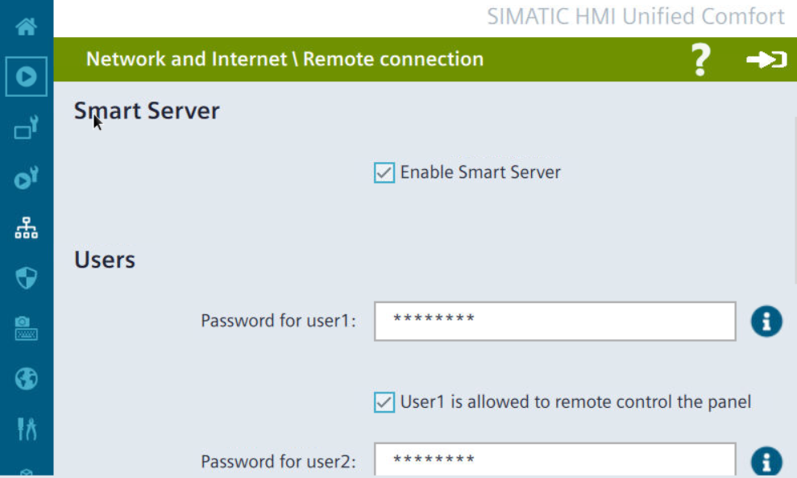

W przypadku modyfikacji ustawień w TIA Portal, konieczne jest oczywiście wgranie projektu do HMI.

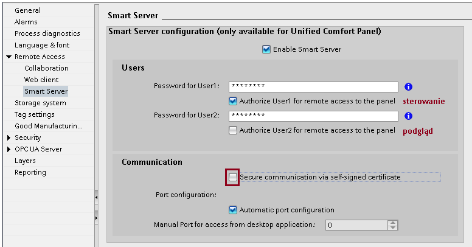

Aplikację kliencką dla PC można [pobrać z serwisu SiePortal](https://support.industry.siemens.com/cs/us/en/view/109482434) bądź uzyskać przy okazji instalacji innych pakietów związanych z WinCC.

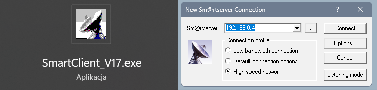

Aplikacje dla urządzeń mobilnych dystrybuowane są za pośrednictwem Google Play (Android) lub App Store (iOS). Poniżej przykład konfiguracji połączenia z panelem z aplikacji na systemie iOS:

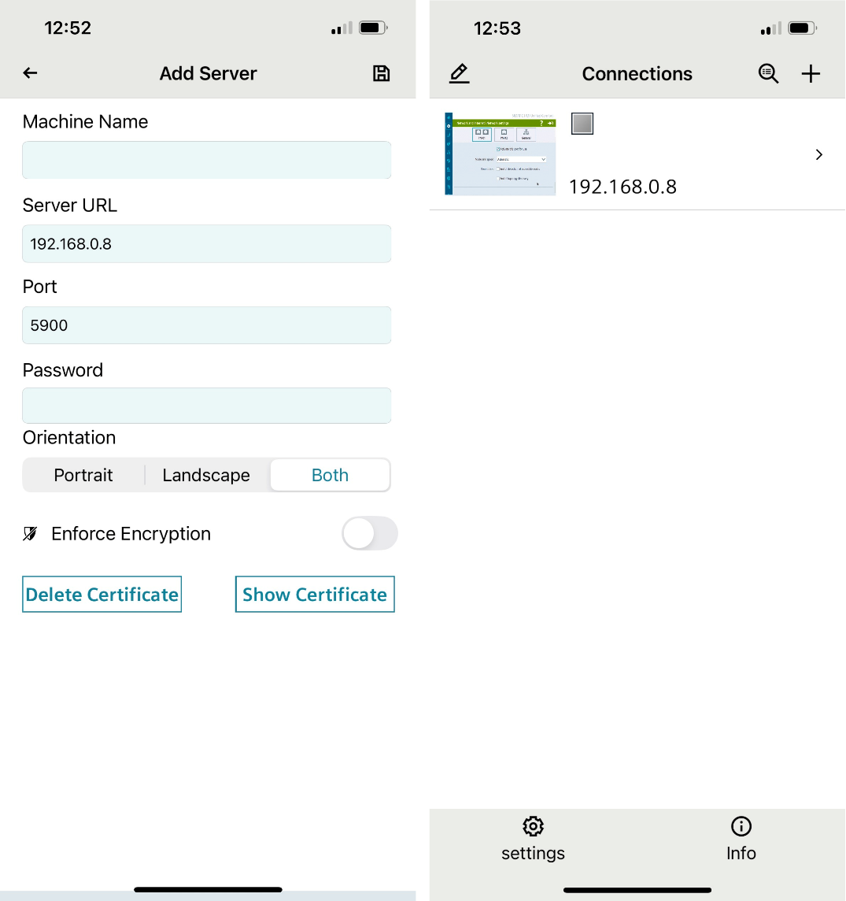

Rezultat jest następujący:

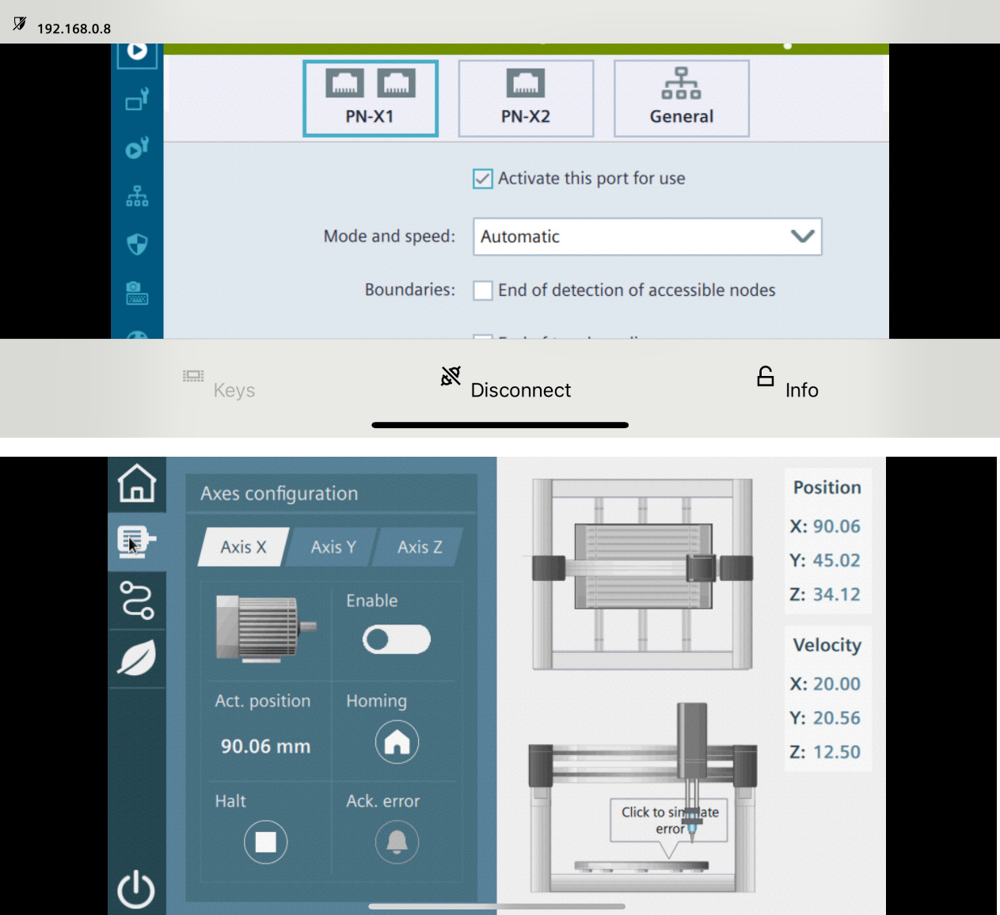

<!--
## Komunikacja – dostęp Sm@rtServer z UXP do HMI poprzedniej generacji

`smart` `sm@rt` `server` `vnc` `remote` `zdalny`

> [!WARNING]
> TODO

Potrzebny panel Comfort/Basic

-->

## Komunikacja – dostęp zdalny Web Client

`webclient` `web` `client` `remote` `zdalny` `operate` `monitor`

Web Client to sposób zdalnego dostępu asynchronicznego do Runtime Unified przez przeglądarkę internetową (odrębna sesja). Pozwala na niezależne korzystanie z wizualizacji, z prawem podglądu (Monitor) lub sterowania (Operate), zależnie od przyznanych użytkownikowi uprawnień.

Panele operatorskie z serii Unified Basic umożliwiają połączenie jednego klienta typu Operate, bez opcji rozszerzenia za pomocą dodatkowej licencji. Panele Unified Comfort oraz Unified PC RT dają w standardzie, bez dodatkowej licencji, możliwość dostępu dla jednego klienta typu Monitor i jednego klienta typu Operate. W przypadku UCP można rozszerzyć tę liczbę do maksymalnie 3 klientów (dowolnego typu), a dla PC RT – ograniczeniem jest w zasadzie tylko wydajność stacji, gdzie bezpiecznie przyjąć max. ok. 100 klientów (powyżej 5 sesji wymagany jest system operacyjny klasy Windows Server).

Dla klienta zdalnego można utworzyć odrębne ekrany o dopasowanej rozdzielczości i proporcjach, otwierane na podstawie rozpoznania zalogowanego użytkownika lub urządzenia – w oparciu o własne mechanizmy (np. skrypty) lub opcję [My WinCC Unified](https://support.industry.siemens.com/cs/ww/en/view/109827849) (tylko dla Unified PC RT).

Dostęp zdalny może być aktywowany w każdym przypadku w TIA Portal („Runtime settings > Remote Access > Web client”), a dla paneli również bezpośrednio na urządzeniu.

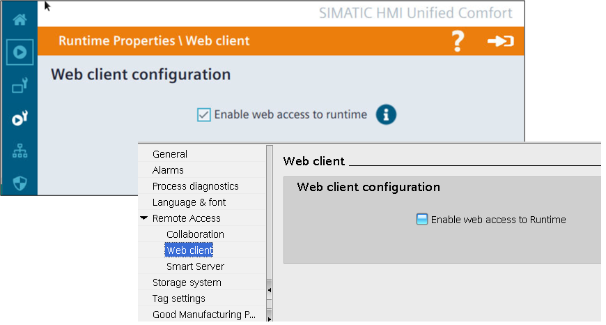

Aby dostać się do wizualizacji na serwerze, wystarczy otworzyć w przeglądarce internetowej (koniecznie HTML5) dowolnego urządzenia (w tej samej sieci) witrynę o adresie „https://&lt;adres_ip_serwera&gt;”. Jeżeli zadbaliśmy o [utworzenie odpowiednich certyfikatów](https://support.industry.siemens.com/cs/ww/en/view/109777591), komunikacja będzie zabezpieczona i wyświetli się menu pozwalające na dostęp (po zalogowaniu) do ekranów procesowych (kafelka „WinCC Unified RT”), administracji użytkownikami („User Management”) lub komponentem Industrial Edge („SIMATIC Edge Management”, tylko UCP). Jeśli natomiast klient zdalny nie uznaje certyfikatu serwera za zaufany, pojawi się stosowny komunikat, gdzie należy określić, czy akceptujemy ryzyko. Pobranie i instalacja certyfikatu („Certificate Authority”) zapobiegnie ponownemu wyświetlaniu komunikatu.

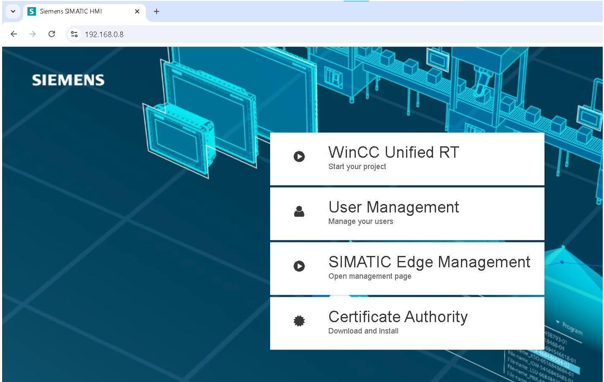

## Komunikacja – zmienne czasowe

`time` `ltime` `czas` `date`

Po stronie PLC mamy zmienną typu TIME, z rozdzielczością co do 1 ms, a po stronie HMI LTIME, z dokładnością do 1 ns.

Aby czas był wyświetlany w polu IO w formacie ss.mmm (np. 29.091, czyli 29 s 91 ms) z ograniczeniem 0 - 30 s, proponuję następujące ustawienia:

- Brak skalowania liniowego,

- Ustawienie limitu górnego w ns na 300 000 000,

- Ustawienie limitu dolnego w ns na 0,

- Format wyświetlania {P} – „duration” obsługuje s i ms

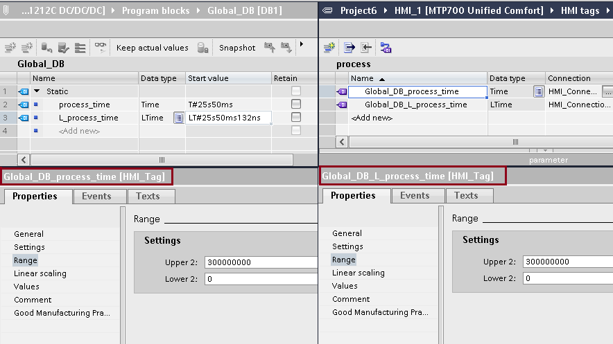
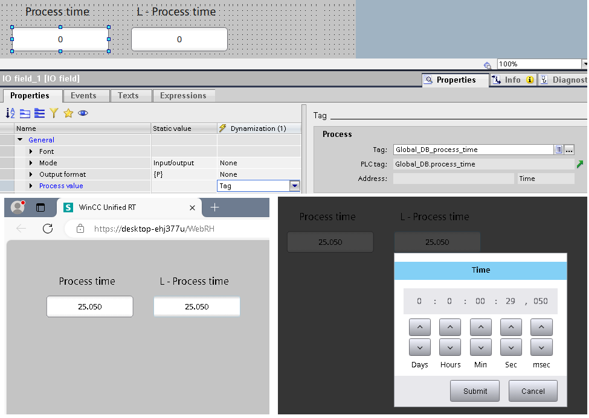

https://support.industry.siemens.com/forum/ww/en/posts/wincc-unified-simple-sample-working-with-plc-s-timers-read-and-write/251292/?page=0&pageSize=10

[Defining the output format - SIMATIC HMI WinCC Unified Engineering V18 - ID: 109813308 - Industry Support Siemens](https://support.industry.siemens.com/cs/mdm/109813308?c=156107769483&lc=en-WW)

Limity po stronie HMI dla zmiennych extrenal time i ltime wyrażać należy w każdym przypadku za pomocą ns.