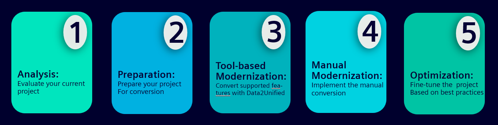
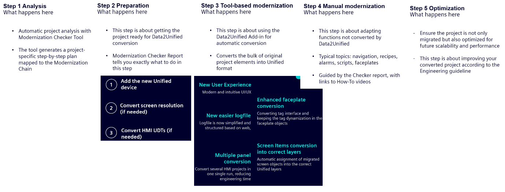
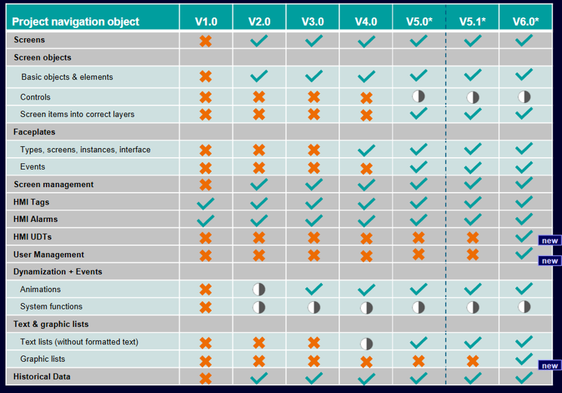

# Modernizacja do Unified
## Modernizacja do Unified

`d2u` `modernizacja` `konwersja` `migracja` `comfort` `data2unified` `modernization`

Ramowy przebieg modernizacji projektu pozostaje taki sam, niezależnie od wersji TIA Portal i Data2Unified (https://support.industry.siemens.com/cs/hn/en/view/109770510)

.

Różnice występują w zakresie kroków jakie należy podjąć przy przygotowaniu projektu i obiektach migrowanych przez D2U. Dla D2U V4.0.0.0 (TIA V19) przebieg konwersji opisano w trzyczęściowym artykule ([część 1](https://www.linkedin.com/pulse/modernizacja-wizualizacji-do-simatic-unified-cz1-jak-adam-czarzasty-udyac/?trackingId=zswplxh4SSCxfExRRRqH0Q%3D%3D), [część 2](https://www.linkedin.com/pulse/modernizacja-wizualizacji-do-simatic-unified-cz2-adam-czarzasty-dm5wf/), [część 3](https://www.linkedin.com/pulse/modernizacja-wizualizacji-do-simatic-unified-cz3-adam-czarzasty-ieubf/)). Przy wersji 5.1.0.0 (TIA V20) przygotowanie projektu ogranicza się do … Obsługiwane w tabelce.

