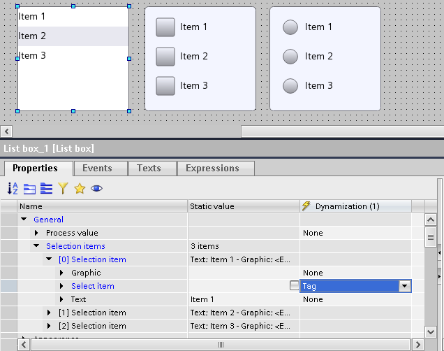
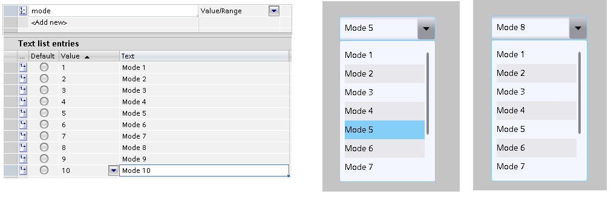
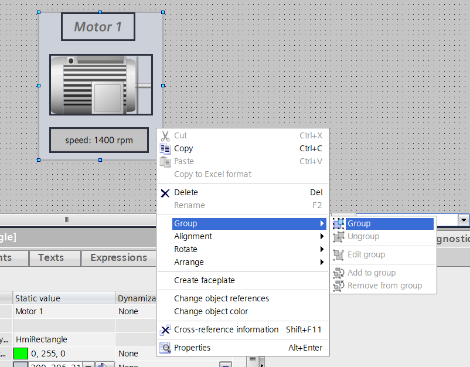
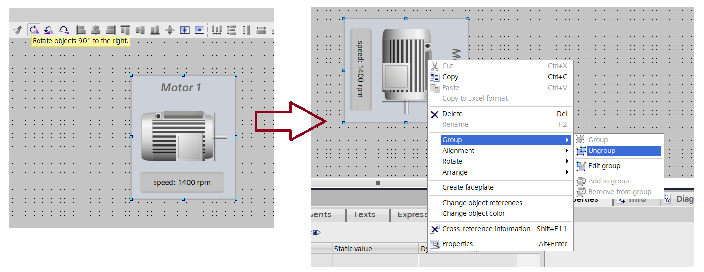
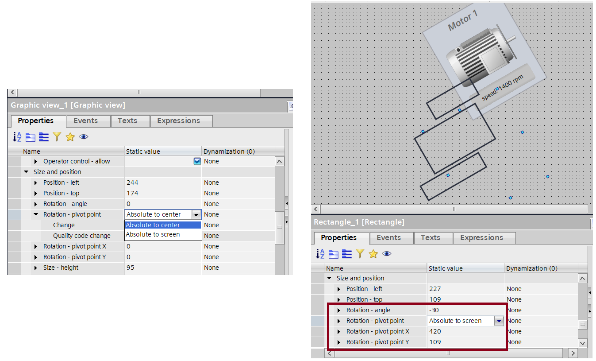
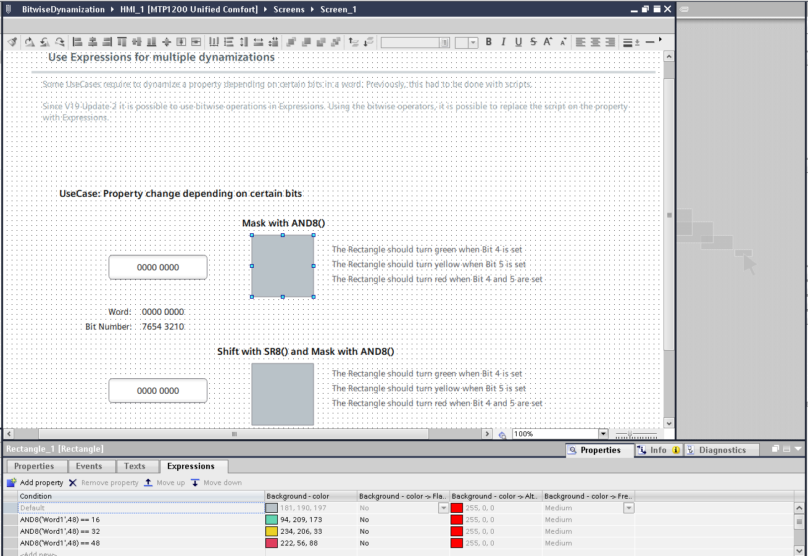
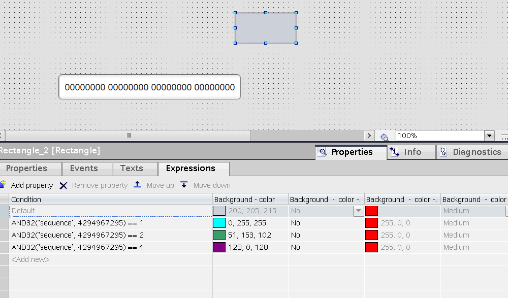

# Obiekty
## Obiekty – wyświetlanie zmiennej typu Int z przecinkiem


`io` `ioflied` `int` `float` `display`

https://support.industry.siemens.com/cs/ww/en/view/109816808

Shift decimal places V20.0.0.3

## Obiekty – dostęp do list tekstowych ze skryptu

#script #skrypt #js #lista #entry

https://support.industry.siemens.com/cs/ww/en/view/109811083

## Obiekty – aktywne pozycje w listach

#listbox #lista #krok #step #entry

Informację o tym, czy dany element listy jest aktywny / wybrany, niesie ze sobą właściwość „Select item”. Status pojedynczego elementu można przepisać do zmiennej typu Bool. Dla monitorowania stanu większej ich liczby, sprawdzi się tablica, której obsługę można oprogramować za pomocą skryptu, np.:

```javascript
for (let i = 0; i <= liczba_elementow_listy; i++)
{
            if (tablica_aktywnych<index> == 1)
                        { etap_procesu = index + 1;}
}
```



## Obiekty – liczba pozycji Symbolic IOField

`symbolic` `io` `lista` `step` `krok` `entry`

Dla list składających się z co najmniej siedmiu elementów, liczba widocznych pozycji w obiekcie Symbolic IOField jest stała i równa 7. Jak dotąd (V20.0.0.3) nie ma możliwości modyfikacji tej właściwości. Po rozwinięciu, lista ustawia się na pierwszych siedmiu pozycjach.



## Obiekty – funkcjonalność SetWhilePressed

`setwhilepressed` `press` `release` `button`

WinCC Unified doesn't support a system function to set a bit while a key is pressed. While it is possible to configure a similar behavior for software buttons using the "Press" and "Release" events, it is recommended using a SIMATIC Key Panel KP8 PN LX. This key panel enables the use of hard keys through Profinet communication.

Further information about the SIMATIC Key Panel KP8 PN LX can be found at the Siemens Industry Online Support (https://support.industry.siemens.com/cs/ww/en/view/109806367) (SIOS) website under Entry ID: 109806367

Using "Press" and "Release" Events?

There are several issues which arise if software buttons with "Press" and "Release" events are used.

\- Process values are not sent via real time communication.

\- If there is a screen change during the pressing process, WinCC Unified may not detect that the button has been released, resulting in the release event never happening.

\- If this button is pressed in runtime and, for example, a popup that covers the button opens or the position of the button changes due to zooming or scrolling, the function configured for the "Release" event is not executed.

\- If the time between "Press" and "Release" is shorter than the update time of the HMI tag the "false" value may not be recognized by the HMI Tag and will not be sent to the PLC.

IMPROVEMENT UPDATE 2:

• If a button is pressed and a screen change takes place at the same time, the event configured

for "Release" is now triggered.

WORKAROUND?

System functions for the jog mode of tags

The new JavaScript object "Tags.Inching" contains the functions:

• "Tags.Inching.SysFct.ReadAndDecreaseTag()"

• "Tags.Inching.SysFct.ReadAndIncreaseTag()"

• "Tags.Inching.SysFct.ReadAndInvertBitInTag()"

• "Tags.Inching.SysFct.ReadAndSetBitInTag()"

• "Tags.Inching.SysFct.ReadAndResetBitInTag()"

• "Tags.Inching.SysFct.ReadAndSetTagValue()"

The system functions "ReadAndDecreaseTag", "ReadAndIncreaseTag",

"ReadAndInvertBitInTag", "ReadAndSetBitInTag", "ReadAndResetBitInTag" and

"ReadAndSetTagValue" are available in the function list.

The functions differ from "DecreaseTag", "IncreaseTag", "InvertBitInTag", "SetBitInTag",

"ResetBitInTag", and "SetTagValue" in the following ways:

• The HMI device updates the value of the HMI tag with the value from the PLC before the write

operation occurs.

• After the write operation, the value of the HMI tag is updated immediately, e.g. in an IO field.

The new functions are slower due to the updating of the tag at the beginning and end of jog mode. It is recommended that you use the new features only when they need to performtime-critical tasks.

https://find.siemens.cloud/v/preview?profile=DI.Assist.Preview&uilanguage=en&cf.pc.region=PL&cf.pc.acceptedlangs=pl%2500en%2500ru%2500de%2500any%20other&cf.ce.docid=%2FTS.I.EntitiesYes%2FDI.CS.TSKB.EN%2F%7Cfcc9cf93-ec02-4c06-b13e-67a8de0575b6&text=unified%20set%20bit%20while%20pressed&cf.ce.assist-srq=1-7034002339

## Obiekty – obracanie grupy elementów

`group` `rotation` `grupa` `obrót` `pivot`

Obracanie kilku elementów jednocześnie najlepiej zrealizować grupując je. Osią obrotu jest środek geometryczny grupy. Należy pamiętać, że po rozgrupowaniu poszczególne elementy wracają do pozycji początkowej – po likwidacji grupy usuwany jest jej obrócony układ współrzędnych. Poszczególne obiekty wchodzące w skład grupy mają swoje własne, nieobrócone układy współrzędnych. Nie następuje przeliczanie pozycji układów współrzędnych.




Alternatywnym podejściem, bez wprowadzania dodatkowego obiektu w postaci grupy, jest ustawienie dla każdego obiektu „Rotation – pivot point = Absolute to screen” – pozwala to dowolnie pozycjonować oś obrotu za pomocą współrzędnych „Rotation – pivot point x/y”. Po zaznaczeniu wszystkich elementów i obróceniu ich naraz, utrudniona jest jednak modyfikacja położenia – „hitboxy” mogą być wyświetlane w innym miejscu, niż element znajduje się w rzeczywistości. Więcej informacji [w dokumentacji](https://docs.tia.siemens.cloud/r/en-us/v20/configuring-screens-rt-unified/using-groups-rt-unified/managing-groups-rt-unified/rotating-a-group-and-objects-in-the-group-rt-unified).



## Obiekty – bitwise dynamization

`expressions` `bitwise` `and` `and8` `bit`

Zwracam się z kolejnym pytaniem.

Wykorzystując "Expressions" dla danego obiektu chciałbym uzależnić jego widoczność od dwóch zmiennych. Pierwsza zmienna to zwykły bool, druga natomiast to konkretny bit z word\`a będącego zmienną array\`a :)

coś na wzór:

'Show_safety_switch' OR 'WDB_ASX{7}'

Czy jest szansa aby w takiej konstrukcji odwołać się do konkretnego bitu w WDB_ASX{7} ?

Do tematu należałoby podejść w sposób przedstawiony w przykładowym projekcie z załącznika.

Przy okazji, aby niekoniecznie otwierać projekt, przesyłam zrzut ekranu „esencji”.

Tak, zgadza się. Jest to nowość w 19.0.0.2.

Proszę spróbować alternatywy w postaci skryptu – nie próbowałem, ale może tropem jest tu operator bitowego and:

https://developer.mozilla.org/en-US/docs/Web/JavaScript/Reference/Operators/Bitwise_AND



Ogólnie rzecz biorąc:

Oba argumenty funkcji AND32 to ciągi bitów:

| AND32(Value1,Value2) | Bitwise AND of two bit sequences with a length of 32 bits |
| --- | --- |


W związku z tym, jako wartość _Value1_ proszę przyjąć zmienną, dla której jest wykrywana aktywacja bitów, a dla _Value2_ wpisać na stałe ciąg jedynek – w postaci dziesiętnej będzie to 4 294 967 295.

Po znaku równości wpisuje się wartość 2<sup>n</sup>, gdzie n to numer bitu, którego zmianę wykrywamy:
