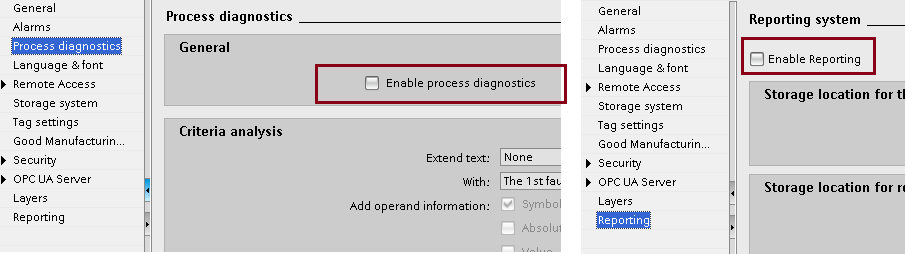
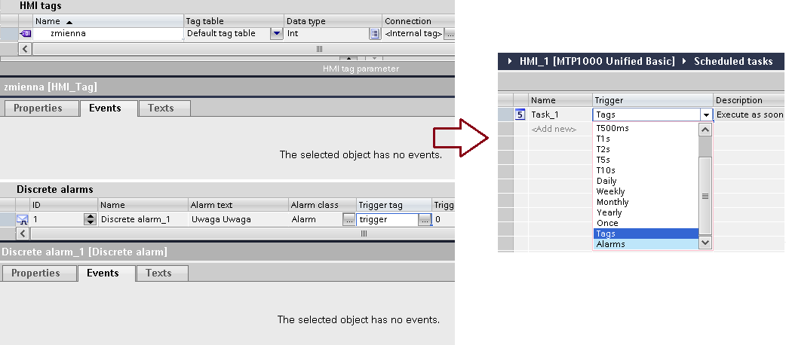
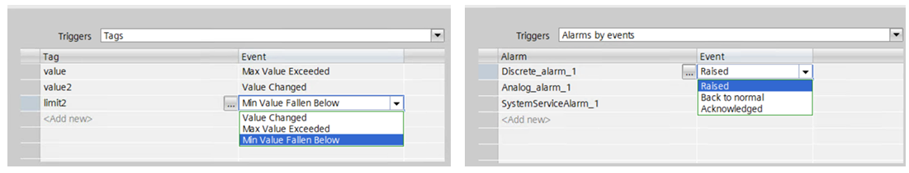

# Oprogramowanie inżynierskie

## ES – aktywacja pakietów opcjonalnych w TIA

`prodiag` `reporting` `raporty` `audit` `gmp`

Czasami niektóre funkcjonalności nie działają zgodnie z oczekiwaniami, ponieważ nie zostały aktywowane w `„Runtime settings”` (na przykład ProDiag, system raportowania). Informacja o niepełnej konfiguracji może nie być zauważona przez kompilator lub odnotowana w formie alarmu systemowego.

## ES – eventy dla zmiennych i alarmów

`events` `scheduled` `task` `@` `@username` `username`

W WinCC Comfort/Advanced, bezpośrednio przy tagach bądź alarmach możliwa była konfiguracja akcji w zakładce „Events”. W Unified akcje wywoływane na zmianę wartości zmiennej bądź zmianę stanu alarmu można skonfigurować w sekcji `„Scheduled tasks”`.

Od wersji 21 Update 1 możliwe jest zaprogramowanie reakcji na przekroczenie minimalnej i maksymalnej wartości zmiennej oraz przejście alarmu w konkretny stan:

Istnieją pewien wyjątek – scheduler nie reaguje prawidłowo na zmianę wartości zmiennych systemowych (np. „@Username”). Obejściem tego problemu jest podpięcie skryptu pod dowolną (nieużywaną) właściwość dowolnego (opcjonalnie niewidocznego) obiektu na ekranie, który jest stale widoczny (np. nagłówek, layout). Taki skrypt wywoływany jest każdorazowo po zmianie wartości wskazanej zmiennej systemowej i zakładając, że nie ingerujemy w argument `„value”`, nie modyfikuje on obiektu, do którego jest zakotwiczony.

