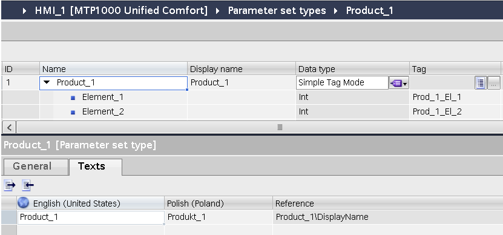
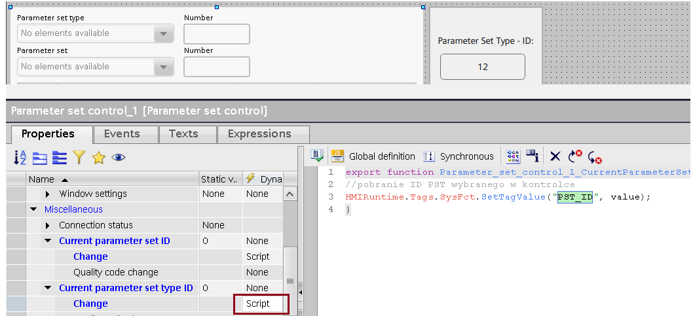
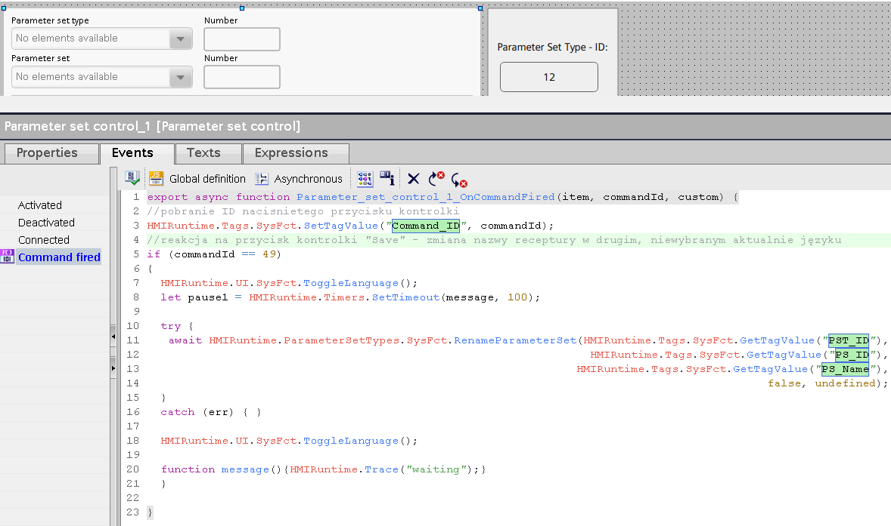
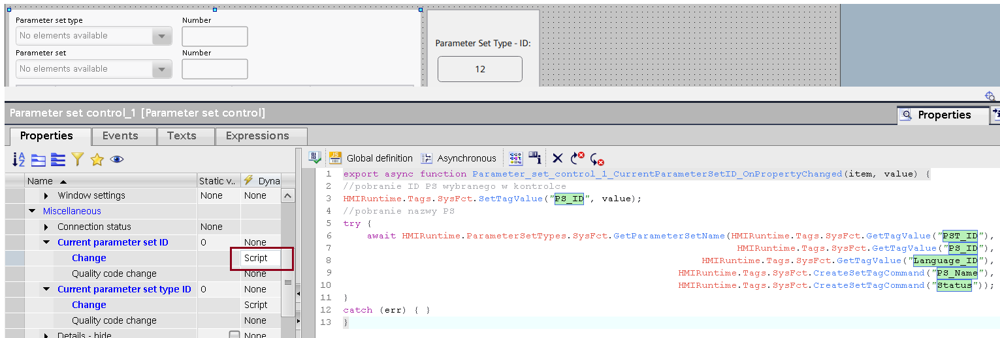
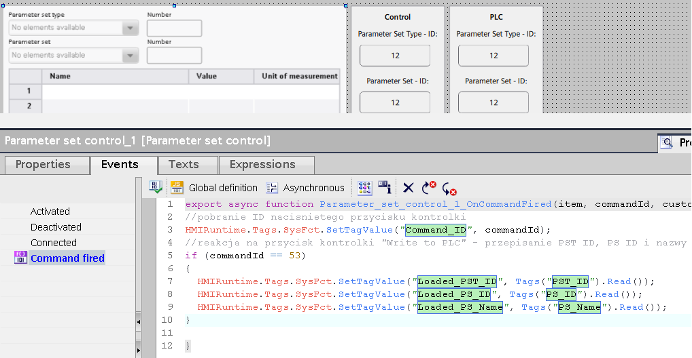

# PaCo
## PaCo – zmiana nazwy receptury we wszystkich językach

`recipe` `receptury` `parameter` `paco` `język` `language`

Nazwa typu receptury (Parameter set type) może być zdefiniowana jeszcze w środowisku inżynierskim. Po przełączeniu na zakładkę „Texts”, istnieje możliwość przetłumaczenia nazwy na inne języki wizualizacji.



W starszych wersjach TIA Portal, przy dodawaniu nowej instancji receptury (Parameter set) z poziomu kontrolki (Parameter set control) nazwa receptury, wpisywana w oknie dialogowym, zapisywana jest tylko w aktualnie wybranym języku wizualizacji. W pozostałych językach rekord przechowywany jest z domyślną nazwą systemową „ParameterSet…”. Zachowanie to zostało naprawione w V18 Update 4, V19 Update 3 i V20.

Nazwy receptur można przepisać ręcznie, zmieniając język wizualizacji i wybierając przycisk „Rename” z paska kontrolki. Proponowane, bardziej zautomatyzowane rozwiązanie zakłada skopiowanie nazwy wprowadzonej przez użytkownika na inne języki wizualizacji.

Należy utworzyć zmienne wewnętrzne, które będą potrzebne do pracy z funkcjami systemowymi odnoszącymi się do modułu receptur:

| **Nazwa** | **Typ danych** | **Opis** |
| --- | --- | --- |
| PST_ID | Int | ID typu receptury wybranego w kontrolce |
| PS_ID | Int | ID receptury wybranej w kontrolce |
| PS_Name | WString | Nazwa receptury wybranej w kontrolce |
| Language_ID | UInt | LCID języka wizualizacji, do obsługi nazw |
| Status | Int | Kod statusowy wykonania funkcji systemowych |
| Command_ID | Int | ID przycisku naciśniętego w kontrolce |

Pobieranie informacji o PS_ID oraz odczyt nazwy receptury najlepiej zrealizować za pomocą skryptu asynchronicznego przypiętego do właściwości „Miscellaneous > Current parameter set ID > Change”. Funkcja „GetParameterSetName()” dostępna jest począwszy od TIA V18 – w starszych wersjach pobranie nazwy realizuje się poprzez odczyt danych z pliku zawierającego informacje o recepturach zapisanych w pamięci panelu – [przykład](https://sieportal.siemens.com/en-do/support/forum/posts/wincc-unified-simple-sample-parameter-set-listing-parameter-contends-and-getting-parameter-name-from-the-parameter-id/254092).


```javascript
HMIRuntime.Tags.SysFct.SetTagValue("PS_ID", value);
try {
            await HMIRuntime.ParameterSetTypes.SysFct.GetParameterSetName(
            HMIRuntime.Tags.SysFct.GetTagValue("PST_ID"),
            HMIRuntime.Tags.SysFct.GetTagValue("PS_ID"),
            HMIRuntime.Tags.SysFct.GetTagValue("Language_ID"),
            HMIRuntime.Tags.SysFct.GetTagValue("PS_Name"),
            HMIRuntime.Tags.SysFct.GetTagValue("Status"));
}
catch (err) {}
```

Aby powyższa funkcjonalność działała prawidłowo, należy użyć drugiego skryptu, zakotwiczonego w „Miscellaneous > Current parameter set type ID > Change”.



```javascript
HMIRuntime.Tags.SysFct.SetTagValue("PST_ID", value);
```
Ostatni i najważniejszy fragment kodu (asynchroniczny) należy umieścić w odpowiedzi na event „Command fired” obiektu Parameter set control, który wywoływany jest każdorazowo po aktywacji dowolnego przycisku kontrolki. Za pomocą odpowiedniego warunku logicznego można zaprogramować reakcję na przycisk o konkretnym identyfikatorze (atrybut „commandId”), w tym przypadku „Save”, służący do zapisania instancji receptury w pamięci HMI i wyjścia z trybu edycji. Poniżej przykład zastosowania funkcji „RenameParameterSet()” dla wizualizacji z aktywnymi dwoma językami. Pomiędzy przełączaniem języków zaleca się wprowadzenie drobnego opóźnienia (ok. 100 ms, linijki kodu nr 8 oraz 20).



```javascript
HMIRuntime.Tags.SysFct.SetTagValue("Command_ID", commandId);
if (commandId == 49)
{
    HMIRuntime.UI.SysFct.ToggleLanguage();
    let pause1 = HMIRuntime.Timers.SetTimeout(message, 100);
    try {
            await HMIRuntime.ParameterSetTypes.SysFct.RenameParameterSet(
       HMIRuntime.Tags.SysFct.GetTagValue("PST_ID"),
       HMIRuntime.Tags.SysFct.GetTagValue("PS_ID"),
       HMIRuntime.Tags.SysFct.GetTagValue("PS_Name"),
       false,
       undefined);
    }
    catch (err) {}
    HMIRuntime.UI.SysFct.ToggleLanguage();  
    function message() {HMIRuntime.Trace("waiting");}
}
```

<!--
## PaCo – obsługa receptur bez kontrolki (recipe screen)

#receptury #recipe #parameter #paco

W modernizacji
-->
## PaCo – ID receptury załadowanej do PLC

`recipe` `receptury` `parameter` `paco` `id` `loaded`

W wielu rozwiązaniach systemu receptur konieczne jest monitorowanie ID receptury (Parameter set) wybranej w kontrolce (Parameter set control) oraz załadowanej do PLC.

Proponowane rozwiązanie zakłada utworzenie dedykowanych tagów, które będą nośnikiem tych informacji:

| **Nazwa** | **Typ danych** | **Opis** |
| --- | --- | --- |
| PST_ID | Int | ID typu receptury wybranego w kontrolce |
| PS_ID | Int | ID receptury wybranej w kontrolce |
| PS_Name | WString | Nazwa receptury wybranej w kontrolce |
| Loaded_PST_ID | Int | ID typu receptury załadowanego do PLC |
| Loaded_PS_ID | Int | ID receptury załadowanej do PLC |
| Loaded_PS_Name | WString | Nazwa receptury załadowanej do PLC |
| Language_ID | UInt | LCID języka wizualizacji, do obsługi nazw |
| Status | Int | Kod statusowy wykonania funkcji systemowych |
| Command_ID | Int | ID przycisku naciśniętego w kontrolce |

Sposób działania mechanizmów przedstawiam na [filmie demonstracyjnym](https://siemens.sharepoint.com/:f:/r/teams/RC-PLDIFAAPC/Shared%20Documents/Projekty/PROJEKTY/FY25/Unified%20FAQ/40?csf=1&web=1&e=nAj152).

Pobieranie informacji o PS_ID oraz odczyt nazwy receptury najlepiej zrealizować za pomocą skryptu asynchronicznego przypiętego do właściwości „Miscellaneous > Current parameter set ID > Change”. Funkcja „GetParameterSetName()” dostępna jest począwszy od TIA V18 – w starszych wersjach pobranie nazwy realizuje się poprzez odczyt danych z pliku zawierającego informacje o recepturach zapisanych w pamięci panelu – [przykład](https://sieportal.siemens.com/en-do/support/forum/posts/wincc-unified-simple-sample-parameter-set-listing-parameter-contends-and-getting-parameter-name-from-the-parameter-id/254092).



```javascript
HMIRuntime.Tags.SysFct.SetTagValue("PS_ID", value);
try {
            await HMIRuntime.ParameterSetTypes.SysFct.GetParameterSetName(
            HMIRuntime.Tags.SysFct.GetTagValue("PST_ID"),
            HMIRuntime.Tags.SysFct.GetTagValue("PS_ID"),
            HMIRuntime.Tags.SysFct.GetTagValue("Language_ID"),
            HMIRuntime.Tags.SysFct.GetTagValue("PS_Name"),
            HMIRuntime.Tags.SysFct.GetTagValue("Status"));
}
catch (err) {}
```

Aby powyższa funkcjonalność działała prawidłowo, należy użyć drugiego skryptu, zakotwiczonego w „Miscellaneous > Current parameter set type ID > Change”.


```javascript
HMIRuntime.Tags.SysFct.SetTagValue("PST_ID", value);
```

Dane na temat receptury wgranej do PLC naturalnie najwygodniej odczytywać podczas naciśnięcia przycisku kontrolki odpowiedzialnego za transfer danych do sterownika („Write to PLC”). Idealnie nadaje się do tego event „Command fired”, który wywoływany jest każdorazowo po aktywacji dowolnego przycisku kontrolki. Za pomocą odpowiedniego warunku logicznego można zaprogramować reakcję na przycisk o konkretnym identyfikatorze (atrybut „commandId”). Skrypt powinien być wykonywany asynchronicznie.



```javascript
HMIRuntime.Tags.SysFct.SetTagValue("Command_ID", commandId);
if (commandId == 53)
{
    HMIRuntime.Tags.SysFct.SetTagValue("Loaded_PST_ID", Tags("PST_ID").Read());
    HMIRuntime.Tags.SysFct.SetTagValue("Loaded_PS_ID", Tags("PS_ID").Read());
    HMIRuntime.Tags.SysFct.SetTagValue("Loaded_PS_Name", Tags("PS_Name").Read());
}
```
