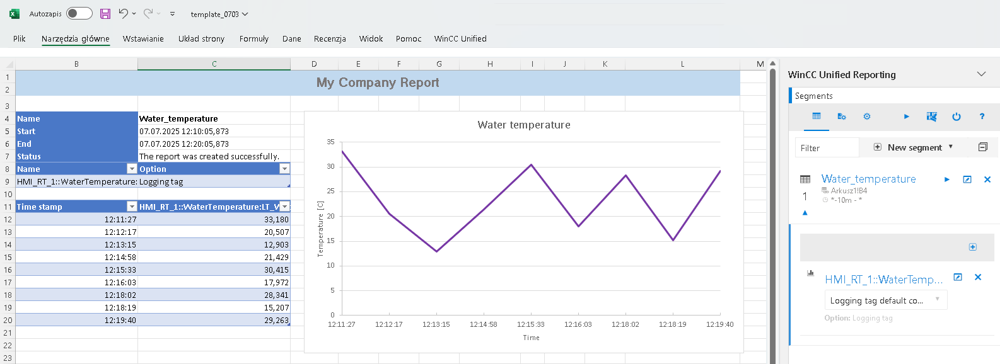

# Raporty
## Raporty – prezentacja danych w formie wykresów

`reporting` `raporty` `excel` `wykresy` `dane`

Systemowe mechanizmy wspomagające tworzenie raportów dostępne są dla urządzeń Unified Comfort Panel oraz Unified PC Runtime. Raporty drukowane są w oparciu o szablon wykonany w programie Microsoft Excel, za pomocą specjalnego narzędzia [WinCC Unified Reporting](https://support.industry.siemens.com/cs/pl/en/view/109821887).

Począwszy od wersji V17.0.0.5 (środowisko inżynierskie i firmware paneli/wersja RT) w szablonach, do prezentacji danych, można używać wykresów programu Excel.

