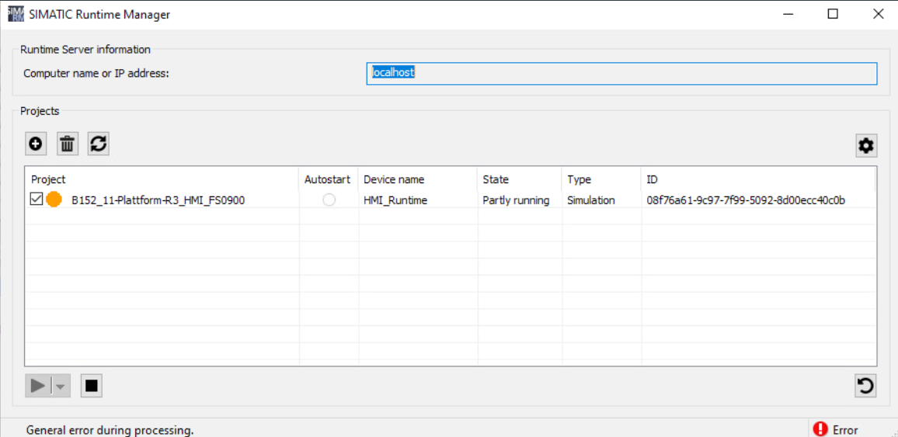
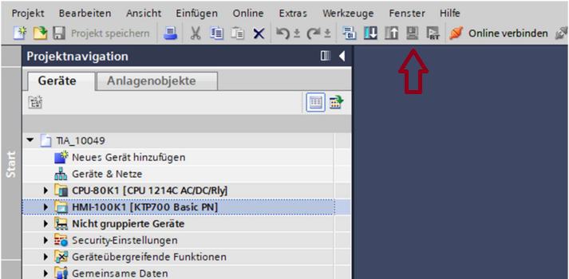

# Runtime PC
## Runtime PC – status „Partly running”

`configurator` `iis` `user` `grup` `runtime`

Jeżeli wizualizacja / symulacja nie uruchamia się bądź nie jest w pełni funkcjonalna,  
a w SIMATIC Runtime Manager jej status to „Partly running”, rekomenduje się podjęcie następujących działań:

- weryfikacja [poprawności nazwy komputera](https://docs.microsoft.com/en-us/troubleshoot/windows-server/identity/naming-conventions-for-computer-domain-site-ou);
- sprawdzenie przynależności użytkownika do odpowiednich grup systemu Windows (PlcSimUsers, RTIL Tracing Users, Siemens TIA Engineer, SIMATIC HMI, SIMATIC HMI VIEWER);
- przebudowa projektu przez wywołanie na HMI funkcji „Compile > Software (rebuild all)”;
- usunięcie plików tymczasowych składowanych w podfolderze projektu „IM” przy wyłączonym TIA Portal;
- wystawienie odpowiednich certyfikatów, jeżeli uruchomiono usługi Collaboration lub OPC UA Server.

Szerszy opis problemu oraz dalsze zalecenia można znaleźć we [wpisie](https://support.industry.siemens.com/cs/no/no/view/109974916/en) w serwisie wsparcia technicznego.

## Runtime PC – wizualizacja wielomonitorowa

`runtime` `monitor` `browser`

System wizualizacji WinCC Unified PC RT nie przewiduje systemowych mechanizmów służących konfiguracji aplikacji wielomonitorowych. Znane są następujące podejścia, pozwalające na warunkowe wdrożenie takiej funkcjonalności:

- Stworzenie ekranów o podwójnej szerokości. Problemem jest konieczność rozciągnięcia przeglądarki internetowej na dwa monitory. Nie jest możliwe przejście do trybu pełnoekranowego ani zastosowanie trybu kiosk. Niektóre okna dialogowe wyświetlane są na środku, co może utrudniać ich obsługę.
- Wyświetlenie dwóch niezależnych ekranów w osobnych instancjach przeglądarki, gdzie każda z nich przyporządkowana jest do jednego monitora. Możliwość przejścia do trybu pełnoekranowego. Problemy: oba okna są niezależne; konieczność zalogowania się dwa razy; zużywana jest dodatkowa licencja klienta webowego.
- Skorzystanie z funkcjonalności karty graficznej – połączenie dwóch monitorów w ten sposób, że PC traktuje je jako jeden obszar. Tryb pełnoekranowy przeglądarki obejmuje oba monitory. W przypadku kart graficznych Intel (na wyposażeniu większości SIMATIC IPC) funkcja nosi nazwę [„Collage mode”](https://www.intel.com/content/dam/support/us/en/documents/graphics/sb/Intel_Collage_Display_Feature_Rev1.pdf), a dla NVIDIA – „[Set Up Merged Display](https://www.nvidia.com/content/Control-Panel-Help/vLatest/en-us/mergedProjects/Display/To_merge_several_displays_into_one_display.htm)”.

## Runtime PC – „General error during processing”

`domena` `runtime` `domain` `service` `usługi`

Jeżeli po uruchomieniu SIMATIC Runtime Manager w lewym dolnym rogu wyświetlany jest status „General error during processing” oraz nie jest możliwe uruchomienie symulacji bądź projektu, zwykle oznacza to problem z działaniem ważnych usług (np. „WCCILScsService” lub „UmclService”.

Nad uruchamianiem potrzebnych usług czuwa wirtualny użytkownik serwisowy systemu Windows o nazwie „UmclService” (członek grup SIMATIC HMI, NT SERVICE, UM Service Accounts), który podczas instalacji powinien uzyskać stosowne prawa do lokalizacji „C:\\ProgramData\\SCADAProjects". Zdarza się, że prawa te są ograniczone w wyniku instalacji w środowisku domenowym bądź w rezultacie działania programu antywirusowego. Jeśli problem występuje przy instalacji lokalnej, warto zweryfikować czy stan rzeczy ma się jak w rozdziale 3 [wpisu w serwisie SiePortal](https://support.industry.siemens.com/cs/ww/en/view/109805541), ewentualnie wykluczyć wyżej wymieniony folder ze skanowania przez program antywirusowy. Przy instalacji w domenie administrator powinien dostosować polityki grup.

## Runtime PC – błędy w narzędziu WinCC Unified Configuration

`freeze` `error` `configurator` `web` `reporting` `raporty` `iis` `partly`

Program WinCC Unified Configuration służy do tworzenia witryny „WinCC Unified SCADA” w ramach webservera IIS. W niektórych przypadkach konfiguracji nie udaje się doprowadzić do końca – najczęściej przejawia się to zatrzymaniem pracy narzędzia w stanie „In work” bądź zwróceniem błędu (status „Error”). Taki stan rzeczy może wynikać z niedostatecznego przygotowania systemu Windows lub niewłaściwego wypełnienia okna konfiguratora.

W pierwszej kolejności zaleca się zweryfikować podstawowe kwestie takie jak:

- [poprawność nazwy komputera](https://docs.microsoft.com/en-us/troubleshoot/windows-server/identity/naming-conventions-for-computer-domain-site-ou);
- instalacja wszystkich [funkcji systemu Windows wymaganych przez Unified](https://support.industry.siemens.com/cs/ww/en/view/109773589);
- przynależność użytkownika do odpowiednich grup systemu Windows (PlcSimUsers, RTIL Tracing Users, Siemens TIA Engineer, SIMATIC HMI, SIMATIC HMI VIEWER);

Przyczyny błędów związane z wprowadzaniem ustawień w WinCC Unified Configuration to m.in.:

- pominięcie konfiguracji certyfikatu;
- błędnie podana ścieżka do zapisu archiwów;
- deklaracja zastosowania systemu raportowania, podczas gdy nie jest zainstalowany MS Excel / Libre Office.

Jeżeli problem pojawił się po pewnym czasie, tzn. wcześniej możliwe było bezproblemowe tworzenie witryny „WinCC Unified SCADA”, najczęściej przyczyny upatruje się w aktualizacji systemu Windows. W tym przypadku należy przeprowadzić ponowną instalację kilku komponentów z dysku DVD1 Unified PC RT (lokalizacja „\\InstData\\Prerequisites”) :

- UrlRewrite2,
- ExternalDiskCache,
- RequestRouter,
- IISNode.

## Runtime PC – nieaktywny przycisk symulacji

`simulation` `symulacja` `button` `greyed-out`

Jeżeli w WinCC Unified V18-V20 przycisk symulacji urządzenia HMI jest nieaktywny (wyszarzony), to najprawdopodobniej nie zainstalowano komponentu WinCC Unified PC RT. Począwszy od wersji 18, symulator został wydzielony ze środowiska inżynierskiego. Do jego obsługi nie jest potrzebna żadna licencja. Przy instalacji należy zwrócić uwagę na jednolitość wersji i aktualizacji TIA Portal oraz WinCC Unified PC RT.

