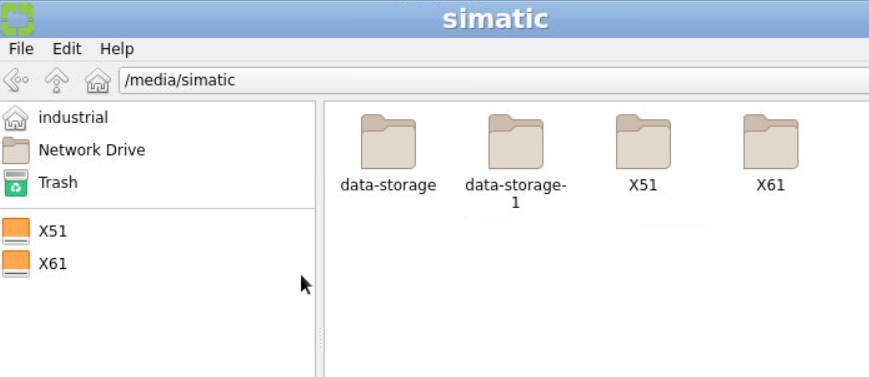
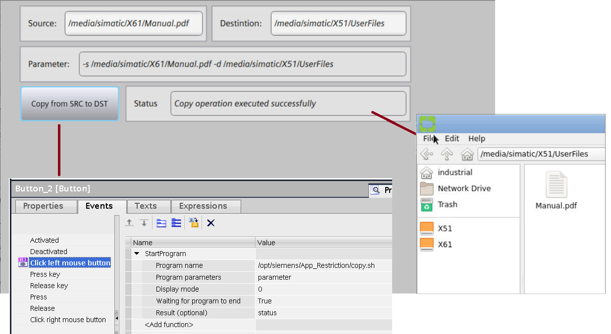
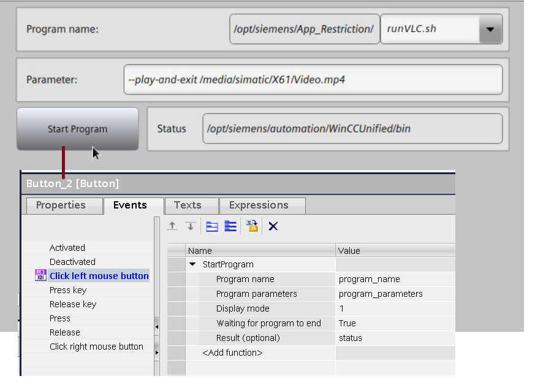
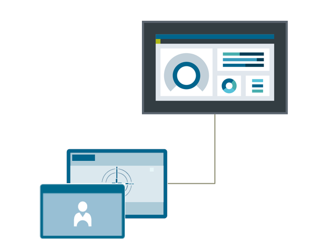

# UCP
## UCP – aktualizacja bootloader’a

`bootloader` `performance` `update` `os` `ucp`

Jednym z usprawnień wprowadzonych wraz z TIA V18 była aktualizacja bootloader’a paneli Unified Comfort, tzn. programu, który służy uruchomienia systemu operacyjnego urządzenia zaraz po jego włączeniu. Nowsza wersja programu przyczynia się do zwiększenia wydajności paneli, wzrostu poziomu bezpieczeństwa oraz zawiera poprawki znanych błędów. Na urządzeniach, które zostały zakupione przed aktualizacją, bootloader można zaktualizować korzystając z [plików i instrukcji](https://support.industry.siemens.com/cs/ww/en/view/109973587) udostępnionych za pośrednictwem serwisu wsparcia technicznego.

## UCP – karty pamięci

`SMC` `memory` `card` `karta` `SD` `system` `data`

Panele Unified Comfort (w tym PRO i Hygienic) umożliwiają podłączenie dwóch kart pamięci. Poniżej podsumowanie informacji z rozdziału 4.7 [manuala](https://support.industry.siemens.com/cs/ww/en/view/109977041).

Data memory card (umieszczana w slocie X51-DATA) służy do przechowywania danych użytkownika takich jak:

- archiwa zmiennych procesowych i alarmów,
- kopie zapasowe (do wykonywania backup-restore),
- informacje na temat administracji użytkownikami,
- receptury (zależnie od konfiguracji w TIA Portal),
- dane do obsługi raportów,
- pliki systemu operacyjnego (do aktualizacji za pomocą karty SD),
- projekt (do transferu za pomocą karty SD).

W tym celu można zastosować dowolną kartę typu SD(IO/HC/XC), jednak celem zapewnienia spójności danych zalecana jest karta SIMATIC SD >= 32 GB. Obsługiwane formaty danych to FAT32 lub NTFS. Uwaga – dla starszych wersji systemu operacyjnego HMI (V16-17) w niektórych przypadkach, zwłaszcza dla kart o rozmiarze < 32GB, panel może mieć trudności z wykrywaniem nośnika.

System memory card (slot X50-SYSTEM) przeznaczona jest do wykonywania automatycznej kopii zapasowej danych („Service and Commisioning > Automatic Backup”). Obsługiwane są wyłącznie karty SIMATIC SD >= 32 GB.

## UCP – kopiowanie plików między nośnikami pamięci

`usb` `sd` `copy` `kopiowanie` `file` `plik`

https://support.industry.siemens.com/cs/mdm/109810947?c=174019846155&lc=en-WW

Domyślną lokalizacją zapisu pewnych plików generowanych przez użytkownika – np. w wyniku eksportu danych z kontrolek – jest obszar pamięci wewnętrznej panelu. Z poziomu menedżera plików, folder ten widoczny jest pod nazwą „industrial”.

Najczęściej konieczny jest transfer tych plików celem dalszej analizy. Takie przenoszenie realizowane jest za pośrednictwem zewnętrznych nośników pamięci (USB, SD) lub przy pomocy dysku sieciowego. Skopiowanie zawartości z pamięci wewnętrznej do innej lokalizacji umożliwia skrypt powłoki „copy.sh”.

Skrypt uruchamia się używając funkcji systemowej „StartProgram()”. Poprzez parametr „Program name” należy podać jego ścieżkę, z kolei w „Program parameters” wpisuje się lokalizację pliku do skopiowania i folder docelowy. Przy wdrażaniu tej funkcjonalności we własnym projekcie, można posiłkować się [projektem demonstracyjnym](https://siemens.sharepoint.com/:f:/r/teams/RC-PLDIFAAPC/Shared%20Documents/Projekty/PROJEKTY/FY25/Unified%20FAQ/50?csf=1&web=1&e=Pm7Yvr).

## UCP – uruchamianie zainstalowanych aplikacji z poziomu RT

`runtime` `program` `start` `vlc` `libre` `run`

Na urządzeniach z rodziny Unified Comfort preinstalowanych jest kilka podstawowych programów – najłatwiej uruchomić je z panelu sterowania, przechodząc do zakładki „SIMATIC Apps”. Niektóre zastosowania wymagają integracji tychże aplikacji z wizualizacją. W tym przypadku za ich otwieranie odpowiada funkcja systemowa „StartProgram()”.

Lokalizację i nazwy skryptów służących do uruchamiania aplikacji (parametr „Program name”) odnotowano w [podręczniku paneli Unified Comfort](https://support.industry.siemens.com/cs/ww/en/view/109977041) – dokument należy przeszukać pod kątem frazy „Starting pre-installed apps from the project”. Uwaga – mogą występować różnice między wersjami systemu operacyjnego HMI. Treść przekazywana poprzez argument „Program parameters” różni się zależnie od aplikacji – należy w tym zakresie posiłkować się dokumentacją konkretnego programu. Najczęściej jest to ścieżka pliku do otwarcia lub parametry okna (np. rozmiar, pełny ekran, brak GUI).

Najprostsze przypadki współpracy aplikacji z wizualizacją można prześledzić oglądając [nagranie](https://siemens.sharepoint.com/:f:/r/teams/RC-PLDIFAAPC/Shared%20Documents/Projekty/PROJEKTY/FY25/Unified%20FAQ/51?csf=1&web=1&e=81TFOU) z działania [przykładowego projektu](https://siemens.sharepoint.com/:f:/r/teams/RC-PLDIFAAPC/Shared%20Documents/Projekty/PROJEKTY/FY25/Unified%20FAQ/51?csf=1&web=1&e=81TFOU).

## UCP – czytniki RFID

`rfid` `users` `administration` `login` `logon` `pmlogon` `pm-logon`

Czytnik kart RFID podłączony do panelu Unified Comfort może mieć zastosowanie zarówno do obsługi lokalnej bazy użytkowników (UMC-L), jak i w przypadku integracji panelu w systemie scentralizowanej administracji użytkownikami (UMC-S). Kompatybilne z HMI są czytniki SIMATIC z interfejsem USB, mianowicie RF1040R, RF1060R oraz RF1070R.

Do działania z UMC-L nie jest wymagana żadna dodatkowa licencja. Oprogramowanie służące do obsługi czytnika (PM-LOGON) jest częścią firmware’u rządzenia. Konfigurację omówiono w [dokumentacji](https://support.industry.siemens.com/cs/pl/en/view/109977041) paneli operatorskich (rozdział „Security”).

Integracja panelu operatorskiego z infrastrukturą UMC-S sprowadza się do nawiązania połączenia sieciowego z serwerem UMC. Więcej informacji na temat tego typu systemów dostarczają [przykłady aplikacyjne](https://support.industry.siemens.com/cs/pl/pl/view/109963327).

<!--
## UCP – webserver

`webserver` `web` `zdalny` `remote`

Brak!

-->