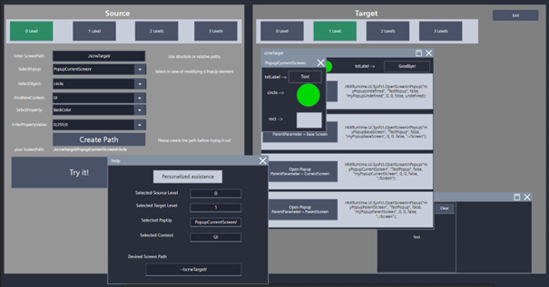

# UI/UX

## Hotkey
**Tagi:** `hotkey` `skrót` `klawisz`

Naciśnięcie kombinacji klawiszy podpiętej pod właściwość „Miscellaneous > Hotkey” zawsze wywołuje akcję przypisaną do eventu „Click left mouse button”.

## Ścieżki ekranów i obiektów
**Tagi:** `path` `ekran` `screen`

W niektórych przypadkach odwołanie do ekranów bądź obiektu jest możliwe jedynie za pomocą ścieżki. Pomocna w budowaniu ścieżek może być oczywiście [dokumentacja](https://support.industry.siemens.com/cs/mdm/109896132?c=152244066571&lc=en-WW). Przy testowaniu różnych scenariuszy pracę ułatwi [projekt przykładowy](https://siemens.sharepoint.com/:f:/r/teams/RC-PLDIFAAPC/Shared%20Documents/Projekty/PROJEKTY/FY25/Unified%20FAQ/02?csf=1&web=1&e=wHd3dA).

1. First item
2. Second item
3. Third item
