# UI/UX

## Hotkey
`hotkey` `skrót` `klawisz`

Naciśnięcie kombinacji klawiszy podpiętej pod właściwość `Miscellaneous > Hotkey` zawsze wywołuje akcję przypisaną do eventu `Click left mouse button`.

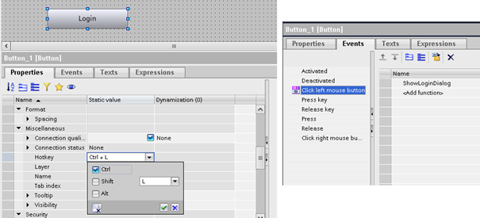

## Ścieżki ekranów i obiektów
`path` `ekran` `screen` `./` `../` `/` `~`

W niektórych przypadkach odwołanie do ekranów bądź obiektu jest możliwe jedynie za pomocą ścieżki. Pomocna w budowaniu ścieżek może być oczywiście [dokumentacja]( https://support.industry.siemens.com/cs/mdm/109896132?c=152244066571&lc=en-WW ). Przy testowaniu różnych scenariuszy pracę ułatwi [projekt przykładowy]( https://siemens.sharepoint.com/:f:/r/teams/RC-PLDIFAAPC/Shared%20Documents/Projekty/PROJEKTY/FY25/Unified%20FAQ/02?csf=1&web=1&e=wHd3dA ).

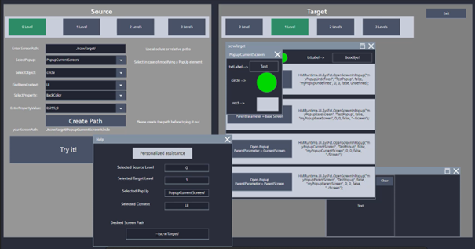

## Własne klawiatury (z limitami)
`klawiatura` `keyboard` `limit` `min` `max`

Jeżeli nie jest wskazane korzystanie z klawiatury systemowej, można zastosować własne klawiatury w formie faceplate wyświetlanych jako okienka pop‑up. [Przykładowy projekt]( https://siemens.sharepoint.com/:f:/r/teams/RC-PLDIFAAPC/Shared%20Documents/Projekty/PROJEKTY/FY25/Unified%20FAQ/03?csf=1&web=1&e=F2ncFl ) zawiera trzy warianty klawiatur: dwie numeryczne (dla liczb typu `Int` oraz `Real`) oraz klawiaturę tekstową. Są to zmodyfikowane klawiatury z biblioteki [WinCC Unified Toolbox]( https://support.industry.siemens.com/cs/us/en/view/109770480 ). Jako obiekty faceplate, ich wygląd i układ można dowolnie modyfikować.

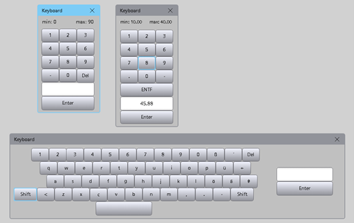

Aby zastosować funkcjonalność w swoim projekcie, najlepiej skopiować obiekt IOField odpowiedniego rodzaju i przepiąć tag w `Properties > General > Process value` oraz w skrypcie przypiętym pod `Events > Click left mouse button`, w linijce 3. Jeżeli tag ma mieć ustawione limity i mają być one widoczne na klawiaturze, limity powinny być skonfigurowane jako zmienne. Zmienne odpowiedzialne za ograniczenie zakresu tagu trzeba wskazać w wyżej wspomnianym skrypcie, linijki 4-5. 

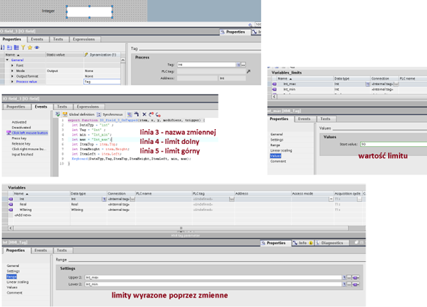

> [!TIP]
> **Konsekwentnie nazywaj zmienne limitów** (np. `MyTag_Min`, `MyTag_Max`) i trzymaj je w jednej grupie, aby łatwo je odszukiwać w edytorze.

## Zoom
`zoom` `zoom-allow` `gesty`

Domyślnie dla wizualizacji aktywna jest opcja przybliżania i oddalania głównego screen window. Na panelach operatorskich może być to problematyczne – wizualizację można oddalić, a po ponownym przybliżeniu zwykle na stałe widoczne będą scrollbary. 
Zoom można wyłączyć na dwa sposoby. **Rekomendowane** podejście to wypełnienie sekcji `Screen management > Main screen windows` zgodnie z poniższym zrzutem ekranu:

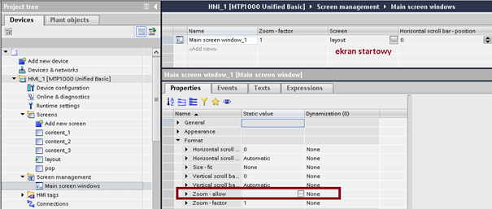

**Alternatywne** rozwiązanie to przypięcie krótkiego skryptu w `Event > Loaded` ekranu startowego (było to jedyne działające podejście dla paneli ze starszym oprogramowaniem; zalecana aktualizacja OS do V20.0.0.x):

```javascript
UI.RootWindow.InteractiveZooming = false;
```

> [!NOTE]
> Zoom nadal pozostaje aktywny dla innych obiektów typu `Screen window`.

## Różne czcionki dla różnych języków
`text` `font` `język` `language`

Konfiguracja różnych czcionek dla języków jest możliwa po **odznaczeniu** opcji `Use same font for all languages` w `Options > Settings > Visualization`. Język edycji projektu zmienia się w zakładce `Tasks` po prawej stronie.

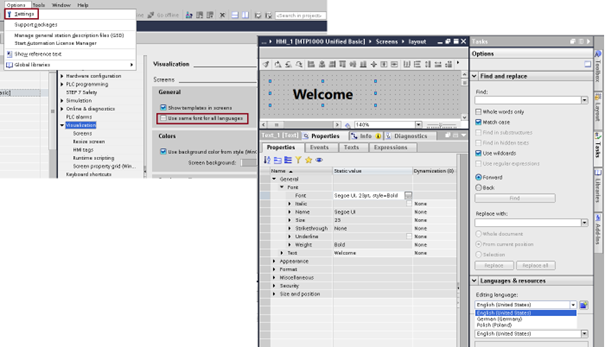

Niezależnie od ustawienia, domyślny font dla każdego języka to **Siemens Sans** (bez możliwości zmiany; `Fallback font` w `Runtime settings > Language & font`).

## Style i palety kolorów
`style` `kolor` `color` `palette` `paleta` `corporate`

Własny styl wizualizacji dostępny jest od wersji **V19**. Do tworzenia stylów służy darmowy [WinCC Unified Corporate Designer]( https://support.industry.siemens.com/cs/ww/en/view/109824234 ). Plik stylu umieść w projekcie i wybierz w `Runtime settings > General > Screen`.

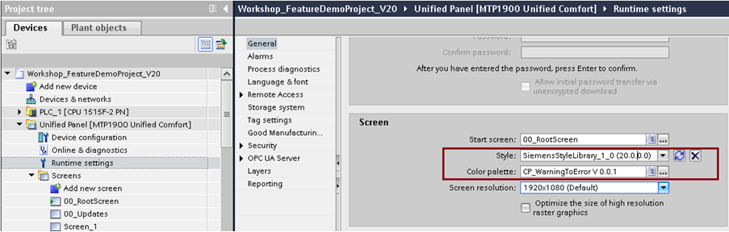

Styl wizualizacji można przełączać w trakcie działania aplikacji – przykładowo, wystarczy podpiąć pod przycisk w `Event > Click left mouse button` jedną z linijek skryptu jak poniżej. W ten sposób można skonfigurować np. tryb nocny/ciemny wizualizacji.

```javascript
HMIRuntime.UI.Style = "SiemensStyleLibrary_1_0";

// Style systemowe:
// HMIRuntime.UI.Style = "ExtendedStyle";
// HMIRuntime.UI.Style = "FlatStyle_Dark";
// HMIRuntime.UI.Style = "FlatStyle_Bright";
```

Style pozwalają na utworzenie kilku wariantów obiektu. Przykładowo, można utworzyć różne rodzaje przycisków.

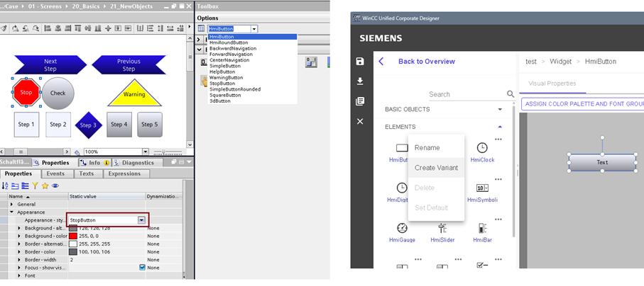

Własne palety kolorów to funkcjonalność wprowadzona w **V20**. Konfiguracja zachodzi w bibliotece TIA Portal. Póki co (V20, 02.2025) **nie jest możliwe przełączanie palety w trakcie działania aplikacji**. Jest to właściwość jedynie do odczytu.

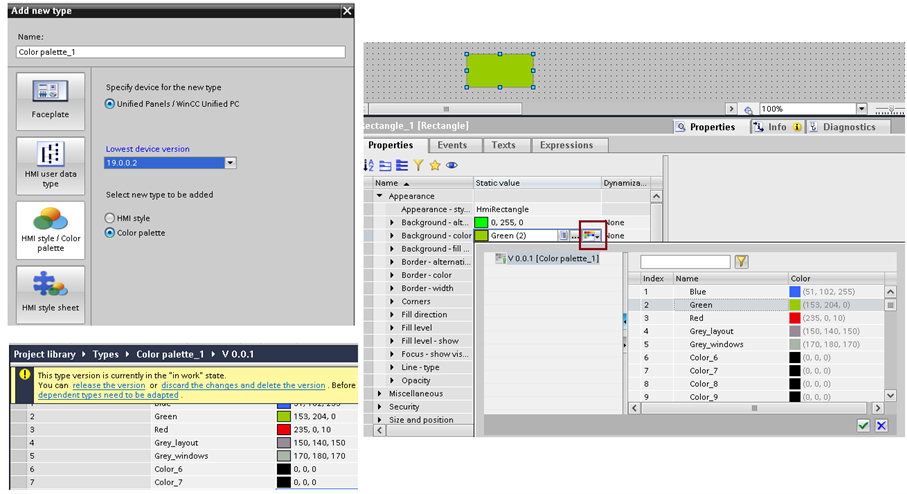

## Kontrolka 3D
`cwc` `3d` `custom` `control` `kontrolki`

Jak dotąd w WinCC Unified brak kontrolki systemowej pozwalającej wyświetlać i wchodzić w interakcję z trójwymiarowymi modelami obiektów (stan dla V21). Nie mniej, funkcjonalność można wprowadzić do wizualizacji poprzez stworzenie własnej kontrolki **(Custom Web Control)** lub skorzystanie z gotowych rozwiązań znalezionych w Internecie ([przykład 1](https://hmix.tech/products/digital-twin-&-3d-viewer-wincc-unified), [przykład 2](https://svghmi.pro/shop/wincc-unified-3d-control?srsltid=AfmBOoqppNeDF0-URHj0piYOJU63CtSyNTImeYZGDpfVHCQCvVf8SMja)).


## Własne (dynamiczne) grafiki SVG
`custom` `svg` `inkscape` `graphics` `grafiki` `vector` `wektorowe`

W Toolboxie WinCC Unified dostępny jest bogaty zbiór grafik wektorowych. W sekcji `Graphics` znajdują się te statyczne (nieruchome). Grafiki z dynamicznymi atrybutami (ruchome, parametryzowalne) można znaleźć w sekcji `Dynamic widgets`.
Korzystając z odpowiedniego programu (np. [Inkscape]( https://inkscape.org/release/inkscape-1.4/)) można tworzyć własne grafiki – od podstaw lub poprzez modyfikację dostępnych zasobów. Poniżej widoczne są ścieżki, pod którymi można odszukać SVG z Toolboxa.


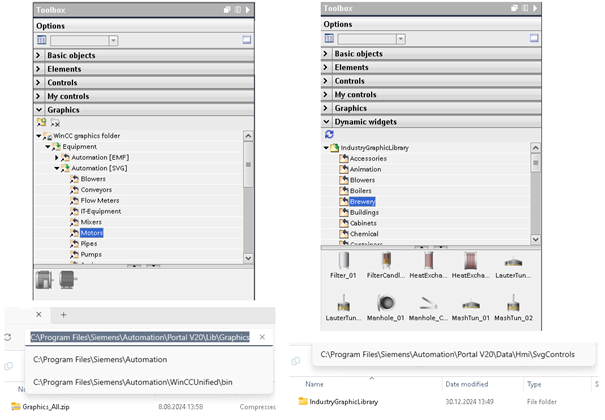

`Programowanie` dynamicznych grafik **SVG** to zagadnienie zaawansowane wymagające biegłości w języku XML. Dla zainteresowanych dostępna jest nieoficjalna (i niekoniecznie zawsze poprawna) [dokumentacja](https://siemens.sharepoint.com/:f:/r/teams/RC-PLDIFAAPC/Shared%20Documents/Projekty/PROJEKTY/FY25/Unified%20FAQ/08?csf=1&web=1&e=yUL1FO). Poza tym na YouTube jest kilka rzeczowych filmików, a nawet ktoś zrobił [konwerter](https://svghmi.pro/?srsltid=AfmBOorTTk1SpwjD-pOSWtnN4i3m_rgAQQZQP5y-ziQth42bMPdbjMGG) i najwyraźniej na tym zarabia.

## Kontrolka PLC Trace
`cwc` `custom` `control` `kontrolki` `trace`

Podgląd wykresów **Trace** generowanych przez PLC można zrealizować dzięki **własnej kontrolce**. Przykład zaprezentowano na webinarze **APC Expert Live Meeting: Injection Molding Application**. Kontrolka nie jest publiczna – po projekt **IMM Example Application** można zgłosić wysyłając wiadomość na: [plastics.imm.automation.industry@siemens.com]( mailto:plastics.imm.automation.industry@siemens.com ).


Funkcjonalność podglądu wykresów **Trace** generowanych przez PLC można wdrożyć w WinCC Unified dzięki **własnej kontrolce**. Przykład został zaprezentowany na webinarze `APC Expert Live Meeting: Injection Molding Application`. Kontrolka nie jest dostępna publicznie, ale w razie potrzeby można się zgłosić po projekt `IMM Example Application` na adres plastics.imm.automation.industry@siemens.com 


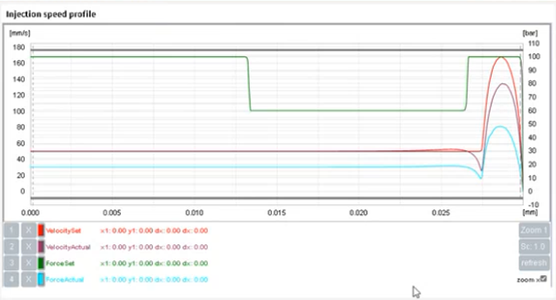

## Wyświetlanie plików PDF
`browser` `pdf` `file`

Wyświetlanie plików .pdf zapisanych lokalnie na urządzeniu umożliwia standardowa kontrolka przeglądarki (Web control). Zagadnienie omówiono w [dokumentacji]( https://support.industry.siemens.com/cs/mdm/109828368?c=173066342027&lc=en-WW ). Uwaga na wersję OS panelu – w starszych odsłonach (< V18) mogło to nie działać.

## Wyświetlanie grafik z dysku
`browser` `png` `jpg` `graphic` `grafika` `photo` `file`

Grafikę zapisz w formacie **PDF** i postępuj jak w sekcji [Wyświetlanie plików PDF]( #wyświetlanie-plików-pdf ).

## Uruchamianie panelu z językiem, który był wybrany jako ostatni
`text` `font` `język` `language`

Dla **Unified Basic Panel** funkcjonalność nie jest dostępna w standardzie. Domyślnie panel za każdym razem uruchamia się z językiem, który ma przypisany najwyższy priorytet w `Runtime settings > Language & font`. Aby **ostatnio wybrany język** był podtrzymywany przy wyłączeniu panelu, należy zapisywać jego ID do pliku w pamięci wewnętrznej panelu. Jest na tę okoliczność [przykład aplikacyjny](https://support.industry.siemens.com/cs/pl/en/view/109809644), ale w skrypcie wkradło się kilka błędów, stąd poniżej prawidłowe rozwiązanie. 
Przyciski zmiany języka, w sekcji `Events > Click left mouse button`, powinny mieć podpięty krótki skrypt realizujący zmianę języka oraz zapis LCID języka do pliku. Za zapis odpowiada funkcja `SaveNewLanguage()`, której składnia zadeklarowana jest w `Global definitions` (przycisk ponad edytorem JS). 


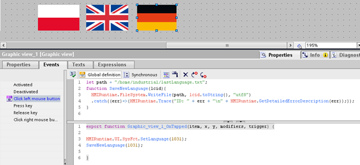

Za odczyt ostatnio aktywnego języka po uruchomieniu panelu odpowiada skrypt podpięty pod `Event > Loaded` ekranu startowego wizualizacji. Skrypt wykonywany jest jednokrotnie, tylko po starcie HMI, z małą zwłoką o 50 ms.

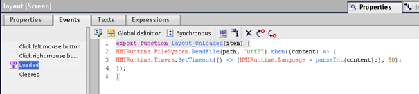

Zestawienie skryptów:

```javascript
//Global definition

let path = "/home/industrial/lastLanguage.txt";
function SaveNewLanguage(lcid){
  HMIRuntime.FileSystem.WriteFile(path, lcid.toString(), "utf8")
  .catch((err)=>{HMIRuntime.Trace("ID: " + err + "\n" + HMIRuntime.GetDetailedErrorDescription(err));});
}

//Click left mouse button przycisku zmiany języka

HMIRuntime.UI.SysFct.SetLanguage(1031);
SaveNewLanguage(1031);

//Loaded ekranu startowego

HMIRuntime.FileSystem.ReadFile(path, "utf8").then((content) => {
HMIRuntime.Timers.SetTimeout(() => {HMIRuntime.Language = parseInt(content);}, 50);
});
```

## Wywołanie własnej funkcji na przycisk kontrolki
`command` `fire` `control` `button`

W przypadku kilku kontrolek (alarmy, trendy, przeglądarka, receptury, diagnostyka) dostępny jest specjalny event `Command fired`, który wywoływany jest każdorazowo po naciśnięciu dowolnego przycisku z paska funkcyjnego kontrolki. 

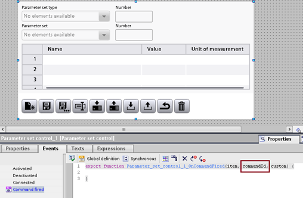

Jednym z argumentów prototypu funkcji jest `commandId`, czyli zmienna, która niesie informację o ID (numerze) naciśniętego przycisku. Lista ID jest słabo udokumentowana, zatem najlepiej zrobić krótki test, który pozwala poznać numer przypisany do konkretnego przycisku – wywołać w `Events > Command fired` krótki skrypt:

```javascript
HMIRuntime.Tags.SysFct.SetTagValue("CommandID", commandId); 
//CommandID - zmienna typu Int
```

Zmienną wyjściową `CommandID` można wyświetlić w `IOField`. Naciskaniu przycisków kontrolki będzie towarzyszyć zmiana jej wartości.

> [!NOTE]
> Na przykład przycisk **eksport receptur** ma `ID = 37`.

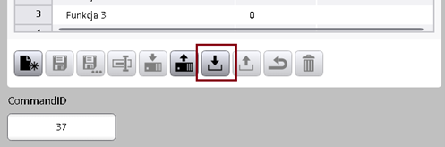

Gdy już znamy ID przycisku, do którego chcemy dodać jakąś funkcjonalność, wystarczy zastąpić skrypt w `Events > Command fired` przez **warunek logiczny**.

```javascript
if (commandId == 37) //lub inne ID
{
	//własna funkcja
}
```

## Data i godzina z uwzględnieniem strefy czasowej
`time` `czas` `date` `timezone` `strefa`

Do właściwości `General > Process value` obiektu IOField, który ma służyć do wyświetlania daty i czasu, należy podpiąć poniższy skrypt z wywołaniem co sekundę. Proponowany `Output format` to `{D, @dd.MM.yyyy HH:mm}`.

```javascript
let myDate = new Date();
let myLocal = myDate.setTime(myDate.getTime() - myDate.getTimezoneOffset()*60*1000);
return myLocal;
```
