# UI/UX

## Hotkey
`hotkey` `skrót` `klawisz`

Naciśnięcie kombinacji klawiszy podpiętej pod właściwość `Miscellaneous > Hotkey` zawsze wywołuje akcję przypisaną do eventu `Click left mouse button`.

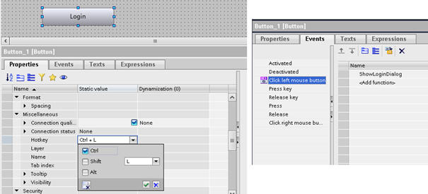

## Ścieżki ekranów i obiektów
`path` `ekran` `screen` `./` `../` `/` `~`

W niektórych przypadkach odwołanie do ekranów bądź obiektu jest możliwe jedynie za pomocą ścieżki. Pomocna w budowaniu ścieżek może być oczywiście [dokumentacja]( https://support.industry.siemens.com/cs/mdm/109896132?c=152244066571&lc=en-WW ). Przy testowaniu różnych scenariuszy pracę ułatwi [projekt przykładowy]( https://siemens.sharepoint.com/:f:/r/teams/RC-PLDIFAAPC/Shared%20Documents/Projekty/PROJEKTY/FY25/Unified%20FAQ/02?csf=1&web=1&e=wHd3dA ).


## Własne klawiatury (z limitami)
`klawiatura` `keyboard` `limit` `min` `max`

Jeżeli nie jest wskazane korzystanie z klawiatury systemowej, można zastosować własne klawiatury w formie faceplate wyświetlanych jako okienka pop‑up. [Przykładowy projekt]( https://siemens.sharepoint.com/:f:/r/teams/RC-PLDIFAAPC/Shared%20Documents/Projekty/PROJEKTY/FY25/Unified%20FAQ/03?csf=1&web=1&e=F2ncFl ) zawiera trzy warianty klawiatur: dwie numeryczne (dla liczb typu `Int` oraz `Real`) oraz klawiaturę tekstową. Są to zmodyfikowane klawiatury z biblioteki [WinCC Unified Toolbox]( https://support.industry.siemens.com/cs/us/en/view/109770480 ). Jako obiekty faceplate, ich wygląd i układ można dowolnie modyfikować.

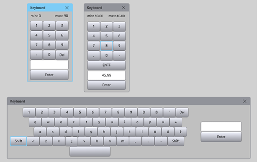

Aby użyć funkcjonalności w swoim projekcie:
- **Skopiuj** odpowiedni obiekt `IOField` i **przepnij tag** w `Properties > General > Process value`.
- W skrypcie pod `Events > Click left mouse button` **zaktualizuj linijkę 3**.
- Jeśli tag ma mieć **limity widoczne na klawiaturze**, skonfiguruj je jako **zmienne** i wskaż w skrypcie (linijki **4–5**).

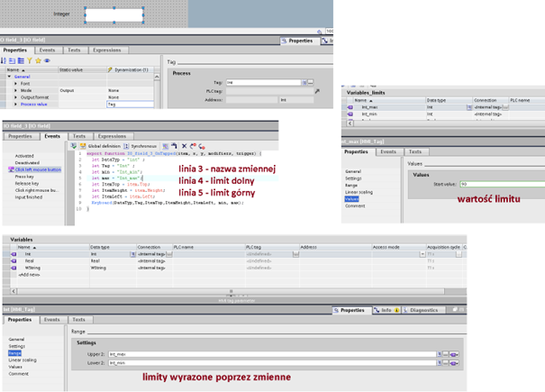

> [!TIP]
> **Konsekwentnie nazywaj zmienne limitów** (np. `MyTag_Min`, `MyTag_Max`) i trzymaj je w jednej grupie, aby łatwo je odszukiwać w edytorze.

## Zoom
`zoom` `zoom-allow` `gesty`

Domyślnie wizualizacja ma aktywne przybliżanie i oddalanie głównego `Screen window`. Na panelach operatorskich może to być problematyczne (po ponownym przybliżeniu często pozostają na stałe widoczne **scrollbary**).

Wyłączenie zoomu:
- **Rekomendowane:** wypełnij sekcję `Screen management > Main screen windows` zgodnie ze zrzutem ekranu (projektowe ustawienie dla nowszych OS).

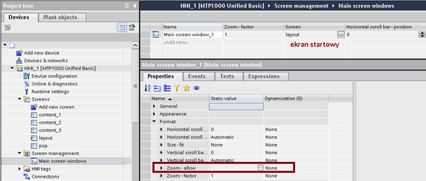

- **Alternatywne:** przypnij krótki skrypt w `Event > Loaded` ekranu startowego (jedyna opcja działająca dla starszych paneli; zalecana aktualizacja OS do `V20.0.0.x`).

```javascript
UI.RootWindow.InteractiveZooming = false;
```

> [!NOTE]
> Zoom nadal pozostaje aktywny dla innych obiektów typu `Screen window`.

## Różne czcionki dla różnych języków
`text` `font` `język` `language`

Konfiguracja różnych czcionek dla języków jest możliwa po **odznaczeniu** opcji `Use same font for all languages` w `Options > Settings > Visualization`. Język edycji projektu zmienia się w zakładce `Tasks` po prawej stronie.

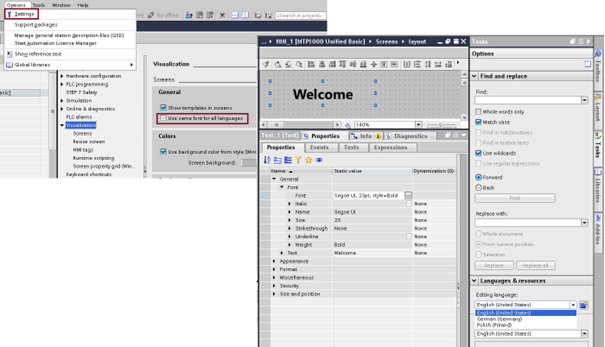

Niezależnie od ustawienia, domyślny font dla każdego języka to **Siemens Sans** (bez możliwości zmiany; `Fallback font` w `Runtime settings > Language & font`).

## Style i palety kolorów
`style` `kolor` `color` `palette` `paleta` `corporate`

Własny styl wizualizacji dostępny jest od wersji **V19**. Do tworzenia stylów służy darmowy [WinCC Unified Corporate Designer]( https://support.industry.siemens.com/cs/ww/en/view/109824234 ). Plik stylu umieść w projekcie i wybierz w `Runtime settings > General > Screen`.

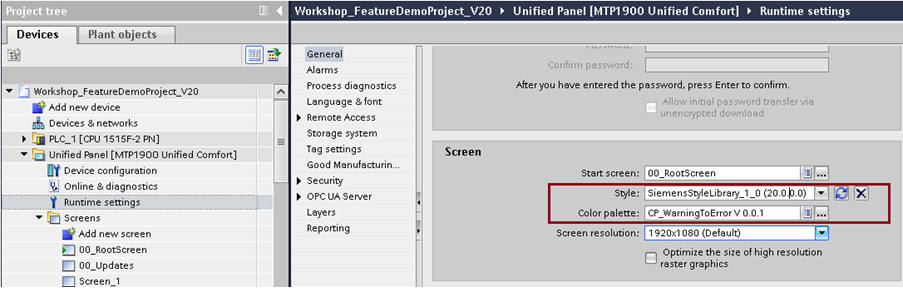

Styl można **przełączać w runtime** (np. tryb nocny/ciemny) – podłącz pod przycisk w `Event > Click left mouse button` jedną z linijek skryptu przełączającego styl.

```javascript
HMIRuntime.UI.Style = "SiemensStyleLibrary_1_0";

// Style systemowe:
// HMIRuntime.UI.Style = "ExtendedStyle";
// HMIRuntime.UI.Style = "FlatStyle_Dark";
// HMIRuntime.UI.Style = "FlatStyle_Bright";
```

Style pozwalają tworzyć **warianty obiektów** (np. różne typy przycisków).

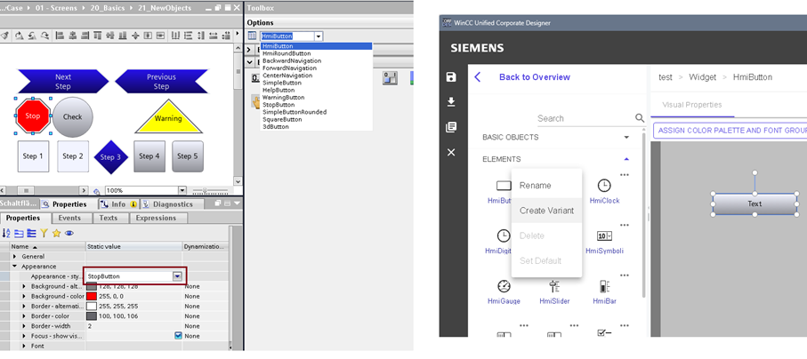

Palety kolorów wprowadzono w **V20**. Konfiguracja odbywa się w bibliotece TIA Portal. Obecnie (V20, 02.2025) **nie można przełączać palety w runtime** – to właściwość tylko do odczytu.

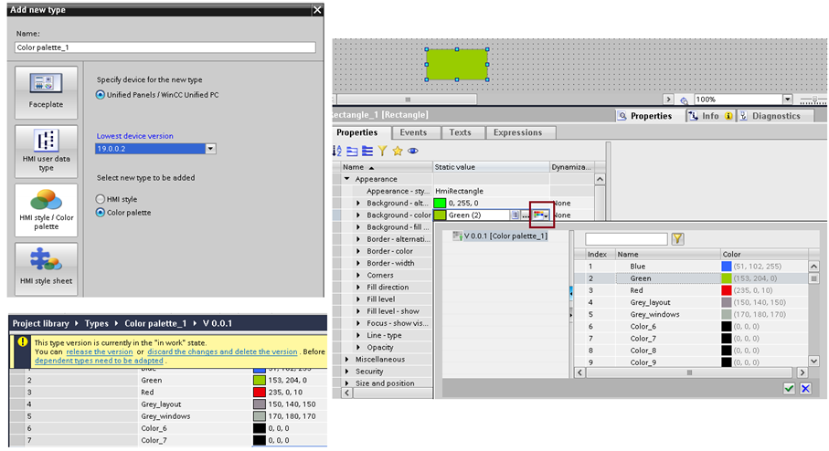

## Kontrolka 3D
`cwc` `3d` `custom` `control` `kontrolki`

> [!WARNING]
> TODO.

## Własne (dynamiczne) grafiki SVG
`custom` `svg` `inkscape` `graphics` `grafiki` `vector` `wektorowe`

W Toolboxie WinCC Unified znajdziesz bogaty zbiór grafik wektorowych:
- `Graphics` – grafiki statyczne.
- `Dynamic widgets` – grafiki z dynamicznymi atrybutami (ruch, parametry).

Twórz własne grafiki (np. w [Inkscape]( https://inkscape.org/release/inkscape-1.4/) ) od podstaw lub modyfikuj dostępne zasoby. Ścieżki do plików SVG z Toolboxa ułatwią ich lokalizację i ponowne wykorzystanie.


Tworzenie dynamicznych SVG wymaga biegłości w **XML**. Dostępna jest nieoficjalna (i nie zawsze w pełni poprawna) dokumentacja, kilka rzeczowych filmów na YouTube, a nawet konwerter komercyjny.

## Kontrolka PLC Trace
`cwc` `custom` `control` `kontrolki` `trace`

Podgląd wykresów **Trace** generowanych przez PLC można zrealizować dzięki **własnej kontrolce**. Przykład zaprezentowano na webinarze **APC Expert Live Meeting: Injection Molding Application**. Kontrolka nie jest publiczna – po projekt **IMM Example Application** można zgłosić wysyłając wiadomość na: [plastics.imm.automation.industry@siemens.com]( mailto:plastics.imm.automation.industry@siemens.com ).

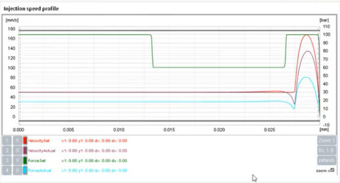

## Wyświetlanie plików PDF
`browser` `pdf` `file`

Wyświetlanie lokalnych plików `.pdf` umożliwia standardowa kontrolka przeglądarki (**Web control**). Zagadnienie opisano w [dokumentacji]( https://support.industry.siemens.com/cs/mdm/109828368?c=173066342027&lc=en-WW ). Uwaga na wersję OS panelu – w starszych (< V18) mogło to nie działać.

## Wyświetlanie grafik z dysku
`browser` `png` `jpg` `graphic` `grafika` `photo` `file`

Grafikę zapisz w formacie **PDF** i postępuj jak w sekcji [Wyświetlanie plików PDF]( #wyświetlanie-plików-pdf ).

## Uruchamianie panelu z ostatnio wybranym językiem
`text` `font` `język` `language`

Na **Unified Basic Panel** funkcjonalność nie jest dostępna w standardzie. Domyślnie panel uruchamia się z językiem o najwyższym priorytecie (`Runtime settings > Language & font`). Aby **podtrzymać ostatnio wybrany język** po wyłączeniu panelu, zapisz jego **ID** do pliku w pamięci wewnętrznej - (przykład aplikacyjny)[ https://support.industry.siemens.com/cs/pl/en/view/109809644 ].

Przyciski zmiany języka (`Events > Click left mouse button`) powinny mieć skrypt zmieniający język i zapisujący [LCID]( https://learn.microsoft.com/en-us/openspecs/office_standards/ms-oe376/6c085406-a698-4e12-9d4d-c3b0ee3dbc4a ) do pliku. Za zapis odpowiada funkcja `SaveNewLanguage()` zadeklarowana w `Global definitions`.

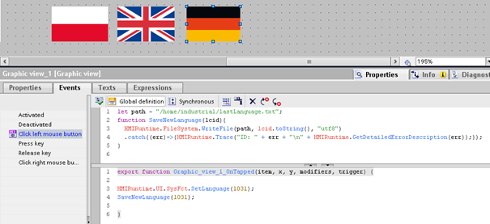

Odczyt ostatnio aktywnego języka po starcie HMI wykonaj w skrypcie `Event > Loaded` ekranu startowego (jednorazowo, ze zwłoką ~50 ms).

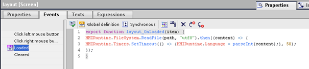

Zestawienie skryptów:

```javascript
//Global definition

let path = "/home/industrial/lastLanguage.txt";
function SaveNewLanguage(lcid){
  HMIRuntime.FileSystem.WriteFile(path, lcid.toString(), "utf8")
  .catch((err)=>{HMIRuntime.Trace("ID: " + err + "\n" + HMIRuntime.GetDetailedErrorDescription(err));});
}

//Click left mouse button przycisku zmiany języka

HMIRuntime.UI.SysFct.SetLanguage(1031);
SaveNewLanguage(1031);

//Loaded ekranu startowego

HMIRuntime.FileSystem.ReadFile(path, "utf8").then((content) => {
HMIRuntime.Timers.SetTimeout(() => {HMIRuntime.Language = parseInt(content);}, 50);
});
```

## Wywołanie własnej funkcji na przycisk kontrolki
`command` `fire` `control` `button`

Dla niektórych kontrolek (alarmy, trendy, przeglądarka, receptury, diagnostyka) dostępny jest **event** `Command fired`, wywoływany po naciśnięciu przycisku z paska funkcyjnego.

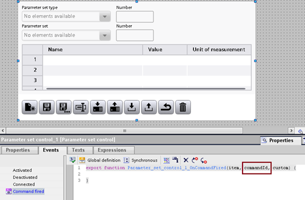

Jednym z argumentów jest `commandId` – identyfikator przycisku. Lista ID jest słabo udokumentowana, więc najlepiej wykonać krótki test w `Events > Command fired` 

```javascript
HMIRuntime.Tags.SysFct.SetTagValue("CommandID", commandId); 
//CommandID - zmienna typu Int
```

Zmienną wyjściową `CommandID` można wyświetlić w `IOField`.

> [!NOTE]
> Na przykład przycisk **eksport receptur** ma `ID = 37`.

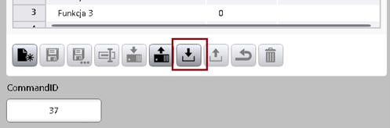

Znając ID, w `Events > Command fired` zastosuj **warunek logiczny** uruchamiający żądaną funkcję.

```javascript
if (commandId == 37) //lub inne ID
{
	//własna funkcja
}
```

## Data i godzina ze strefą czasową
`time` `czas` `date` `timezone` `strefa`

Do właściwości `General > Process value` obiektu `IOField` przeznaczonego do wyświetlania daty i czasu podepnij skrypt **wywoływany co sekundę**. Proponowany `Output format`: `{D, @dd.MM.yyyy HH:mm}`.

```javascript
let myDate = new Date();
let myLocal = myDate.setTime(myDate.getTime() - myDate.getTimezoneOffset()*60*1000);
return myLocal;
```