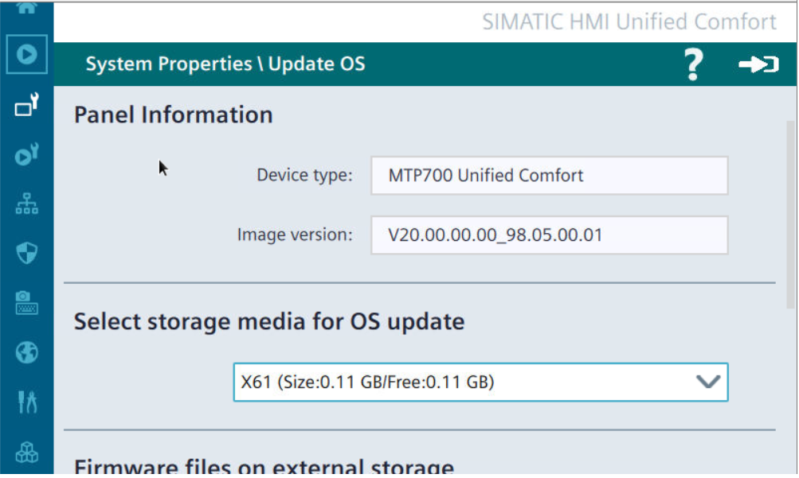
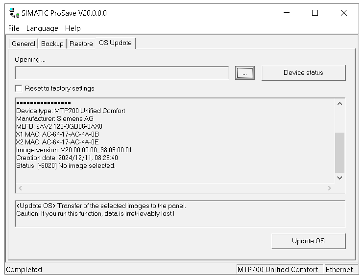

# UXP
## UXP – aktualizacja firmware’u

`reset` `upgrade` `update` `aktualizacja` `prosave` `factory` `firmware`

W przypadku paneli Unified, zaleca się aktualizowanie firmware’u do najnowszej dostępnej wersji. Poprawki wprowadzają nowe funkcje, przyczyniają się do zwiększenia wydajności urządzenia oraz służą korekcie zgłaszanych błędów systemu operacyjnego. Nie ma przeciwwskazań, aby wersja firmware’u na fizycznym HMI była nowsza, niż ta skonfigurowana w projekcie TIA Portal.

Aktualizację można przeprowadzić lokalnie, z poziomu panelu sterowania urządzenia HMI. W tym celu wystarczy podłączyć nośnik USB z plikiem firmware’u i uruchomić instalację z menu „System Properties > Update OS”:

Drugi sposób aktualizacji pozwala na zdalne przeprowadzenie procedury. Wymagane jest nawiązanie połączenia sieciowego z panelem oraz zastosowanie programu ProSave (dostarczany automatycznie z TIA Portal). Instrukcję przeprowadzenia aktualizacji można znaleźć w [dokumentacji](https://docs.tia.siemens.cloud/r/en-us/v20/compiling-and-loading-rt-unified/unified-panel-rt-unified/maintenance-of-the-hmi-device-rt-unified/updating-the-operating-system-rt-unified) lub skorzystać z poradnika w formie [filmu instruktażowego](https://support.industry.siemens.com/cs/ww/en/view/109821812).

## UXP – adres IP 0.0.0.0 w Maintenance Mode

`reset` `upgrade` `update` `aktualizacja` `0.0.0.0` `IP` `prosave` `factory` `firmware`

Przy aktualizacji systemu operacyjnego panelu wraz z resetem do ustawień fabrycznych w jednym z kroków HMI przechodzi w tzw. tryb Maintenance Mode – jest to czas, w którym panel oczekuje na transfer plików OS inicjowany przez program ProSave na PC. Sporadycznie, zwłaszcza przy uprzedniej nieudanej bądź przerwanej aktualizacji, pojawia się błąd związany z wyzerowaniem adresów IP. W takim przypadku standardową procedurę należy nieco zmodyfikować, o czym traktuje [rozdział 3 wpisu](https://support.industry.siemens.com/cs/ww/en/view/109821880) na stronie internetowej wsparcia technicznego.

