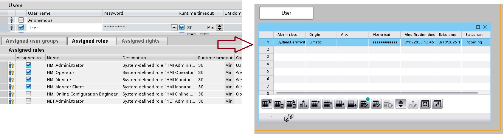

# Użytkownicy

## Użytkownicy – role systemowe

`role` `security` `użytkownicy` `administracja` `rbac`

Przypisując użytkownikom role systemowe z grupy HMI, najlepiej ograniczyć się do wyboru tylko jednej z nich. W starszych wersjach WinCC Unified użytkownik, któremu przypisano kilka ról z grupy HMI, otrzymywał jedynie prawa odpowiadające roli o najniższych uprawnieniach. Obecnie **(V20)** jest to trochę mniej problematyczne, ale jeżeli mamy jakieś kłopoty z uprawnieniami, warto zwrócić na to uwagę.

Poniżej przykład – użytkownik `User` mimo przypisania wszystkich ról tak naprawdę identyfikuje się jako `HMI Monitor Client`. Świadczy o tym wyświetlanie wizualizacji w pomarańczowej ramce oraz brak dostępu do niektórych funkcji (tu – brak możliwości potwierdzenia alarmu).

## Użytkownicy – UMC

`security` `użytkownicy` `administracja` `umc` `centralized` `grupy` `groups` `ad`

Stan bieżący

https://support.industry.siemens.com/cs/ww/en/view/109780337

Base document

https://www.linkedin.com/pulse/globalne-zarz%C4%85dzanie-u%C5%BCytkownikami-w-systemach-wincc-adam-czarzasty?originalSubdomain=pl